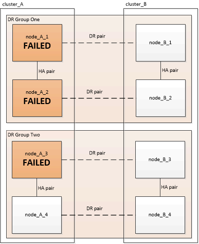

= Elección del procedimiento de recuperación correcto
:allow-uri-read: 
:icons: font
:imagesdir: ../media/

[role="lead"]
Después de un fallo en una configuración MetroCluster, debe seleccionar el procedimiento de recuperación correcto. Utilice la siguiente tabla y los ejemplos para seleccionar el procedimiento de recuperación adecuado.

En esta información de esta tabla se asume que la instalación o la transición se ha completado, lo que significa que `metrocluster configure` comando ejecutado correctamente.

|===

| Ámbito de los fallos en el sitio de recuperación ante desastres | Procedimiento 

 a| 
* Sin fallo de hardware

 a| 
link:task_recover_from_a_non_controller_failure_mcc_dr.html["Recuperación de un fallo que no sea de controladora"]

 a| 
* Fallo del módulo de controlador
* Ha fallado otro hardware

 a| 
link:task_recover_from_a_non_controller_failure_mcc_dr.html["Recuperación de un fallo que no sea de controladora"]

 a| 
* Fallo o fallo de un módulo de controladora individual de los componentes de FRU dentro del módulo de controladora
* No se generaron errores en las unidades

 a| 
Si un fallo está limitado a un módulo de controladora único, debe utilizar el procedimiento de sustitución de FRU del módulo de la controladora para el modelo de plataforma. En una configuración MetroCluster de cuatro u ocho nodos, dicho fallo se aísla al par de alta disponibilidad local.

*Nota:* el procedimiento de sustitución de la FRU del módulo del controlador se puede utilizar en una configuración MetroCluster de dos nodos si no hay ningún fallo de la unidad ni de ningún otro hardware.

https://docs.netapp.com/platstor/index.jsp["Centro de documentación de AFF y FAS"]

 a| 
* Fallo o fallo de un módulo de controladora individual de los componentes de FRU dentro del módulo de controladora
* Las unidades generaron errores

 a| 
link:task_recover_from_a_multi_controller_and_or_storage_failure.html["Recuperación tras un error del almacenamiento o de varias controladoras"]

 a| 
* Fallo o fallo de un módulo de controladora individual de los componentes de FRU dentro del módulo de controladora
* No se generaron errores en las unidades
* Se ha producido un error en el hardware adicional fuera del módulo de la controladora

 a| 
link:task_recover_from_a_multi_controller_and_or_storage_failure.html["Recuperación tras un error del almacenamiento o de varias controladoras"]

Se deben omitir todos los pasos para la asignación de unidades.

 a| 
* Fallo del módulo de varios controladores (con o sin fallos adicionales) en un grupo de recuperación ante desastres

 a| 
link:task_recover_from_a_multi_controller_and_or_storage_failure.html["Recuperación tras un error del almacenamiento o de varias controladoras"]

|===

== Escenarios de fallos del módulo de la controladora durante la instalación de MetroCluster

Responder al fallo de un módulo de controladora durante el procedimiento de configuración de MetroCluster depende de si el se produce `metrocluster configure` el comando se ha completado correctamente.

* Si la `metrocluster configure` El comando aún no se ha ejecutado, o se ha producido un error, debe reiniciar el procedimiento de configuración del software MetroCluster desde el principio con un módulo de controlador de repuesto.
+

NOTE: Debe asegurarse de realizar los pasos de link:https://docs.netapp.com/us-en/ontap-metrocluster/install-ip/task_sw_config_restore_defaults.html["Restaurando los valores predeterminados del sistema en un módulo de controlador"] en cada controladora (incluida la controladora de sustitución) para verificar que se ha eliminado la configuración anterior.

* Si la `metrocluster configure` el comando se ha completado correctamente y, a continuación, se ha producido un error en el módulo del controlador; utilice la tabla anterior para determinar el procedimiento de recuperación correcto.

== Escenarios de fallos del módulo de controlador durante la transición de MetroCluster FC a IP

El procedimiento de recuperación se puede utilizar si se produce un fallo del sitio durante la transición. Sin embargo, solo puede utilizarse si la configuración es una configuración mixta estable, con el grupo de recuperación ante desastres FC y el grupo de recuperación ante desastres IP totalmente configurados. El resultado del `metrocluster node show` El comando debe mostrar ambos grupos de recuperación ante desastres con los ocho nodos.

IMPORTANT: Si el error se produjo durante la transición cuando los nodos están en proceso de añadir o quitar, debe ponerse en contacto con el soporte técnico.

== Se escenarios de fallos del módulo de la controladora en configuraciones MetroCluster de ocho nodos

Situaciones de fallo:

* <<Fallos del módulo de controladora individual en un único grupo de recuperación ante desastres>>
* <<Fallos de dos módulos de controladora en un único grupo de recuperación ante desastres>>
* <<Fallos de módulos de controladora individual en grupos de recuperación ante desastres independientes>>
* <<Tres fallos de módulos de controladora distribuidos por los grupos de recuperación ante desastres>>

=== Fallos del módulo de controladora individual en un único grupo de recuperación ante desastres

En este caso, el fallo se limita a un par de alta disponibilidad.

* Si no necesita sustituir ningún almacenamiento, puede utilizar el procedimiento de sustitución de FRU del módulo de las controladoras para el modelo de plataforma.
+
https://docs.netapp.com/platstor/index.jsp["Centro de documentación de AFF y FAS"^]

* Si es necesario sustituir el almacenamiento, puede utilizar el procedimiento de recuperación del módulo multicontrolador.
+
link:task_recover_from_a_multi_controller_and_or_storage_failure.html["Recuperación tras un error del almacenamiento o de varias controladoras"]

+
Este escenario también se aplica a configuraciones MetroCluster de cuatro nodos.

+
image::../media/mcc_dr_groups_8_node_with_a_single_controller_failure.gif[mcc dr agrupa a 8 nodos con fallo de controladora única]

=== Fallos de dos módulos de controladora en un único grupo de recuperación ante desastres

En este caso, el fallo requiere una conmutación. Puede utilizar el procedimiento de recuperación ante fallos del módulo de varios controladores.

link:task_recover_from_a_multi_controller_and_or_storage_failure.html["Recuperación tras un error del almacenamiento o de varias controladoras"]

Este escenario también se aplica a configuraciones MetroCluster de cuatro nodos.

image::../media/mcc_dr_groups_8_node_with_a_multi_controller_failure.gif[mcc dr agrupa a 8 nodos con fallo de varias controladoras]

=== Fallos de módulos de controladora individual en grupos de recuperación ante desastres independientes

En este caso, el fallo se limita a parejas de alta disponibilidad independientes.

* Si no necesita sustituir ningún almacenamiento, puede utilizar el procedimiento de sustitución de FRU del módulo de las controladoras para el modelo de plataforma.
+
El procedimiento de sustitución de FRU se lleva a cabo dos veces, una vez para cada módulo de controladora que ha fallado.

+
https://docs.netapp.com/platstor/index.jsp["Centro de documentación de AFF y FAS"^]

* Si es necesario sustituir el almacenamiento, puede utilizar el procedimiento de recuperación del módulo multicontrolador.
+
link:task_recover_from_a_multi_controller_and_or_storage_failure.html["Recuperación tras un error del almacenamiento o de varias controladoras"]

image::../media/mcc_dr_groups_8_node_with_two_single_controller_failures.gif[mcc dr agrupa a 8 nodos con dos fallos de controladora individual]

=== Tres fallos de módulos de controladora distribuidos por los grupos de recuperación ante desastres

En este caso, el fallo requiere una conmutación. Puede utilizar el procedimiento de recuperación ante fallos del módulo multicontrolador para el grupo DR uno.

link:task_recover_from_a_multi_controller_and_or_storage_failure.html["Recuperación tras un error del almacenamiento o de varias controladoras"]

Puede utilizar el procedimiento de reemplazo de FRU de módulo de controladora específico de la plataforma para el grupo de recuperación ante desastres dos.

https://docs.netapp.com/platstor/index.jsp["Centro de documentación de AFF y FAS"^]

== En los escenarios de fallo del módulo de la controladora en configuraciones de MetroCluster de dos nodos

El procedimiento que utilice dependerá de la magnitud del fallo.

* Si no necesita sustituir ningún almacenamiento, puede utilizar el procedimiento de sustitución de FRU del módulo de las controladoras para el modelo de plataforma.
+
https://docs.netapp.com/platstor/index.jsp["Centro de documentación de AFF y FAS"^]

* Si es necesario sustituir el almacenamiento, puede utilizar el procedimiento de recuperación del módulo multicontrolador.
+
link:task_recover_from_a_multi_controller_and_or_storage_failure.html["Recuperación tras un error del almacenamiento o de varias controladoras"]

image::../media/mcc_dr_groups_2_node_with_a_single_controller_failure.gif[mcc dr agrupa a 2 nodos con fallo de controladora única]
