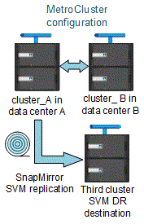

= Consideraciones que tener en cuenta al utilizar ONTAP en una configuración de MetroCluster
:allow-uri-read: 
:icons: font
:imagesdir: ../media/

[role="lead"]
Al utilizar ONTAP en una configuración de MetroCluster, debe tener en cuenta ciertas consideraciones para la licencia, la paridad con clústeres fuera de la configuración de MetroCluster, la realización de operaciones de volumen, las operaciones NVFAIL y otras operaciones de ONTAP.

.Consideraciones sobre las licencias
* Ambos sitios deben tener licencia para las mismas funciones con licencia en el sitio.
* Todos los nodos deben tener licencia para las mismas funciones de bloqueo de nodo.

.Consideración de SnapMirror
* La recuperación ante desastres de SVM de SnapMirror solo es compatible con las configuraciones de MetroCluster que ejecutan versiones de ONTAP 9.5 o posteriores.

== Compatibilidad de FlexCache en una configuración de MetroCluster

A partir de ONTAP 9.7, los volúmenes FlexCache son compatibles con las configuraciones MetroCluster. Debe estar al tanto de los requisitos para la revocación manual después de las operaciones de conmutación de sitios o conmutación de estado.

=== SVM deroga tras una conmutación cuando el origen y la caché de FlexCache están en el mismo sitio de MetroCluster

Tras una conmutación negociada o no planificada, cualquier relación de paridad FlexCache de SVM dentro del clúster se debe configurar manualmente.

Por ejemplo, las SVM "vs1" (caché) y "vs2" (origen) se encuentran en el sitio_A. Estas SVM tienen una relación entre iguales.

Después de la conmutación, las SVM "vs1-mc" y "vs2-mc" se activan en el sitio del partner (site_B). Deben derogarse manualmente para que FlexCache funcione con el `vserver peer repeer` comando.

=== SVM deroga después de una conmutación de sitios o conmutación de estado cuando un destino de FlexCache se encuentra en un tercer clúster y en modo desconectado

En el caso de las relaciones de FlexCache con un clúster fuera de la configuración de MetroCluster, los relaciones entre iguales siempre deben volver a configurarse manualmente después de realizar una conmutación de sitios si los clústeres implicados se encuentran en modo desconectado durante la conmutación de sitios.

Por ejemplo:

* Un extremo de FlexCache (cache_1 en vs1) reside en MetroCluster site_A.
* El otro extremo de FlexCache (Origin_1 en vs2) reside en site_C (no en la configuración de MetroCluster).

Cuando se activa la conmutación, y si Site_A y site_C no están conectados, debe anular de forma manual las SVM en site_B (clúster de conmutación) y site_C mediante el `vserver peer repeer` comando tras el cambio.

Una vez realizada la conmutación de estado, debe volver a derogar las SVM en site_A (el clúster original) y site_C.

.Información relacionada
link:https://docs.netapp.com/us-en/ontap/flexcache/index.html["Gestión de volúmenes de FlexCache con interfaz de línea de comandos"^]

== Compatibilidad con FabricPool en configuraciones MetroCluster

A partir de ONTAP 9.7, las configuraciones de MetroCluster admiten niveles de almacenamiento de FabricPool.

Para obtener información general sobre el uso de FabricPool, consulte link:https://docs.netapp.com/us-en/ontap/disks-aggregates/index.html["Gestión de discos y niveles (agregados)"^].

=== Consideraciones que tener en cuenta al usar FabricPool

* Los clústeres deben tener licencias FabricPool con los límites de capacidad correspondientes.
* Los clústeres deben tener espacios IP con nombres coincidentes.
+
Este puede ser el espacio IP predeterminado, o un espacio IP que haya creado una administración. Este espacio IP se usará para las configuraciones de configuración del almacén de objetos FabricPool.

* Para el espacio IP seleccionado, cada clúster debe tener una LIF de interconexión de clústeres definida que pueda llegar al almacén de objetos externo.
* La migración de SVM no se admite con FabricPool cuando el origen o el destino son un clúster de MetroCluster.
+
link:https://docs.netapp.com/us-en/ontap/svm-migrate/index.html["Obtenga más información sobre la movilidad de datos de las máquinas virtuales de almacenamiento"^].

=== Configuración de un agregado para su uso en una FabricPool duplicada

NOTE: Antes de configurar el agregado, debe configurar almacenes de objetos como se describe en link:https://docs.netapp.com/us-en/ontap/fabricpool/setup-object-stores-mcc-task.html["Configure almacenes de objetos para FabricPool en una configuración de MetroCluster"^].

.Pasos
Para configurar un agregado para su uso en FabricPool:

. Cree el agregado o seleccione uno existente.
. Refleje el agregado como un agregado reflejado típico en la configuración de MetroCluster.
. Cree el reflejo de FabricPool con el agregado, tal como se describe en https://docs.netapp.com/ontap-9/topic/com.netapp.doc.dot-cm-psmg/home.html["Gestión de discos y agregados"]
+
.. Asocie un almacén de objetos primario.
+
Este almacén de objetos está físicamente más cerca del clúster.

.. Agregar un almacén de objetos de réplica.
+
Este almacén de objetos está físicamente más lejos del clúster que el almacén de objetos principal.

NOTE: Se recomienda mantener al menos un 20% de espacio libre para agregados reflejados para lograr un rendimiento y una disponibilidad de almacenamiento óptimos. Aunque la recomendación es del 10% para agregados no duplicados, el sistema de archivos puede utilizar el 10% adicional del espacio para absorber cambios incrementales. Los cambios incrementales aumentan el aprovechamiento del espacio para agregados reflejados gracias a la arquitectura basada en Snapshot de copia en escritura de ONTAP. Si no se siguen estas mejores prácticas, puede tener un impacto negativo en el rendimiento.

== Compatibilidad con FlexGroup en configuraciones MetroCluster

A partir de la versión 9.6 de ONTAP, las configuraciones de MetroCluster admiten volúmenes FlexGroup.

== Compatibilidad de grupos de consistencia en las configuraciones de MetroCluster

A partir de ONTAP 9.11.1, link:https://docs.netapp.com/us-en/ontap/consistency-groups/index.html["grupos de consistencia"^] Son compatibles con las configuraciones de MetroCluster.

== Programaciones de trabajos en una configuración de MetroCluster

En ONTAP 9.3 y versiones posteriores, las programaciones de trabajos creadas por el usuario se replican automáticamente entre los clústeres de una configuración de MetroCluster. Si crea, modifica o elimina una programación de trabajo en un clúster, la misma programación se crea automáticamente en el clúster asociado mediante el Servicio de replicación de configuración (CRS).

NOTE: Las programaciones creadas por el sistema no se replican y debe realizar la misma operación manualmente en el clúster asociado para que las programaciones de trabajos en ambos clústeres sean idénticas.

== Conexión de clústeres entre iguales del sitio MetroCluster a un tercer clúster

Dado que la configuración de paridad no se replica, si establece la paridad entre uno de los clústeres de la configuración de MetroCluster y un tercer clúster fuera de esa configuración, también debe configurar la paridad en el clúster de MetroCluster del partner. Esto es así que se puede mantener la relación de paridad si se produce una conmutación.

El clúster que no es de MetroCluster debe ejecutar ONTAP 8.3 o una versión posterior. De lo contrario, los datos se pierden si se produce una conmutación de sitios incluso si se ha configurado la agrupación en los dos partners de MetroCluster.

== Replicación de configuración de cliente LDAP en una configuración MetroCluster

Una configuración de cliente LDAP creada en una máquina virtual de almacenamiento (SVM) en un clúster local se replica en su SVM de datos asociada en el clúster remoto. Por ejemplo, si la configuración del cliente LDAP se crea en la SVM de administrador en el clúster local, se replica en todas las SVM de datos de administrador en el clúster remoto. Esta función MetroCluster es intencionada para que la configuración del cliente LDAP esté activa en todas las SVM asociadas del clúster remoto.

== Directrices para la creación de redes y LIF para las configuraciones de MetroCluster

Debe saber cómo se crean y se replican los LIF en una configuración de MetroCluster. También debe conocer el requisito de coherencia para poder tomar las decisiones adecuadas al configurar la red.

.Información relacionada
* link:https://docs.netapp.com/us-en/ontap/network-management/index.html["Gestión de redes y LIF"^]
* Debe tener en cuenta los requisitos para replicar los objetos IPspace en el clúster de partner y para configurar subredes e IPv6 en una configuración de MetroCluster.
+
<<ipspace_obj_rep,Requisitos de configuración de subred y replicación de objetos IP>>

* Debe tener en cuenta los requisitos para crear las LIF al configurar la red en una configuración de MetroCluster.
+
<<reqs_lif_create,Requisitos para la creación de LIF en una configuración de MetroCluster>>

* Debe conocer los requisitos de replicación de LIF en una configuración de MetroCluster. También debería saber cómo se coloca un LIF replicado en un clúster de partners y debería tener en cuenta los problemas que tienen lugar cuando se produce un error en la replicación de LIF o en la ubicación de LIF.
+
<<lif_rep_place,Requisitos y problemas de colocación y replicación de LIF>>

=== Requisitos de configuración de subred y replicación de objetos IP

Debe tener en cuenta los requisitos para replicar los objetos IPspace en el clúster de partner y para configurar subredes e IPv6 en una configuración de MetroCluster.

==== Replicación espacio IP

Debe tener en cuenta las siguientes directrices al replicar los objetos IPspace en el clúster de partners:

* Los nombres del espacio IP de los dos sitios deben coincidir.
* Los objetos IPspace se deben replicar manualmente en el clúster asociado.
+
Las máquinas virtuales de almacenamiento (SVM) que se crean y se asignan a un espacio IP antes de que se replique el espacio IP no se replicarán en el clúster de partners.

==== Configuración de subred

Debe tener en cuenta las siguientes directrices al configurar subredes en una configuración de MetroCluster:

* Los dos clústeres de la configuración de MetroCluster deben tener una subred en el mismo espacio IP con el mismo nombre de subred, subred, dominio de retransmisión y pasarela.
* Los rangos de IP de los dos clústeres deben ser diferentes.
+
En el ejemplo siguiente, los intervalos IP son diferentes:

+
[listing]
----
cluster_A::> network subnet show

IPspace: Default
Subnet                     Broadcast                   Avail/
Name      Subnet           Domain    Gateway           Total    Ranges
--------- ---------------- --------- ------------      -------  ---------------
subnet1   192.168.2.0/24   Default   192.168.2.1       10/10    192.168.2.11-192.168.2.20

cluster_B::> network subnet show
 IPspace: Default
Subnet                     Broadcast                   Avail/
Name      Subnet           Domain    Gateway           Total    Ranges
--------- ---------------- --------- ------------     --------  ---------------
subnet1   192.168.2.0/24   Default   192.168.2.1       10/10    192.168.2.21-192.168.2.30
----

==== Configuración IPv6

Si IPv6 está configurado en un sitio, IPv6 también debe configurarse en el otro sitio.

.Información relacionada
* Debe tener en cuenta los requisitos para crear las LIF al configurar la red en una configuración de MetroCluster.
+
<<reqs_lif_create,Requisitos para la creación de LIF en una configuración de MetroCluster>>

* Debe conocer los requisitos de replicación de LIF en una configuración de MetroCluster. También debería saber cómo se coloca un LIF replicado en un clúster de partners y debería tener en cuenta los problemas que tienen lugar cuando se produce un error en la replicación de LIF o en la ubicación de LIF.
+
<<lif_rep_place,Requisitos y problemas de colocación y replicación de LIF>>

=== Requisitos para la creación de LIF en una configuración de MetroCluster

Debe tener en cuenta los requisitos para crear las LIF al configurar la red en una configuración de MetroCluster.

Al crear las LIF, debe tener en cuenta las siguientes directrices:

* Fibre Channel: Debe utilizar VSAN o estructuras extendidas
* IP/iSCSI: Debe usar red extendida de capa 2
* ARP difusiones: Debe habilitar las difusiones ARP entre los dos clústeres
* LIF duplicadas: No debe crear varias LIF en la misma dirección IP (LIF duplicadas) en un espacio IP
* Configuraciones de NFS Y SAN: Debe utilizar diferentes máquinas virtuales de almacenamiento (SVM) para los agregados no reflejados y reflejados
* Debe crear un objeto de subred antes de crear una LIF. Un objeto de subred permite a ONTAP determinar los destinos de conmutación por error en el clúster de destino porque tiene un dominio de retransmisión asociado.

==== Compruebe la creación de la LIF

Puede confirmar que la creación correcta de un LIF en una configuración MetroCluster ejecutando el `metrocluster check lif show` comando. Si tiene algún problema al crear la LIF, puede utilizar la `metrocluster check lif repair-placement` comando para solucionar los problemas.

.Información relacionada
* Debe tener en cuenta los requisitos para replicar los objetos IPspace en el clúster de partner y para configurar subredes e IPv6 en una configuración de MetroCluster.
+
<<ipspace_obj_rep,Requisitos de configuración de subred y replicación de objetos IP>>

* Debe conocer los requisitos de replicación de LIF en una configuración de MetroCluster. También debería saber cómo se coloca un LIF replicado en un clúster de partners y debería tener en cuenta los problemas que tienen lugar cuando se produce un error en la replicación de LIF o en la ubicación de LIF.
+
<<lif_rep_place,Requisitos y problemas de colocación y replicación de LIF>>

=== Requisitos y problemas de colocación y replicación de LIF

Debe conocer los requisitos de replicación de LIF en una configuración de MetroCluster. También debería saber cómo se coloca un LIF replicado en un clúster de partners y debería tener en cuenta los problemas que tienen lugar cuando se produce un error en la replicación de LIF o en la ubicación de LIF.

==== Replicación de LIF al clúster de partners

Cuando crea un LIF en un clúster en una configuración MetroCluster, el LIF se replica en el clúster de partners. Las LIF no se colocan por nombres individuales. Para obtener la disponibilidad de los LIF después de una operación de conmutación, el proceso de colocación de LIF verifica que los puertos pueden alojar la LIF en función de la habilidad y las comprobaciones de atributos de puerto.

El sistema debe cumplir las siguientes condiciones para colocar las LIF replicadas en el clúster de socios:

|===

| Condición | Tipo de LIF: FC | Tipo de LIF: IP/iSCSI 

 a| 
Identificación de nodos
 a| 
ONTAP intenta colocar la LIF replicada en el partner de recuperación ante desastres del nodo en el que se creó. Si el partner de recuperación ante desastres no está disponible, el partner auxiliar de recuperación ante desastres se utiliza para colocar.
 a| 
ONTAP intenta colocar la LIF replicada en el partner de recuperación ante desastres del nodo en el que se creó. Si el partner de recuperación ante desastres no está disponible, el partner auxiliar de recuperación ante desastres se utiliza para colocar.

 a| 
Identificación del puerto
 a| 
ONTAP identifica los puertos de destino FC conectados en el clúster de recuperación ante desastres.
 a| 
Los puertos del clúster de recuperación ante desastres que se encuentran en el mismo espacio IP que la LIF de origen se seleccionan para una comprobación de la accesibilidad.

Si no hay puertos en el clúster de recuperación ante desastres en el mismo espacio IP, no se puede colocar la LIF.

Todos los puertos del clúster de recuperación ante desastres que ya alojan una LIF en el mismo espacio IP y subred se marcan automáticamente como accesibles; y se pueden usar para su ubicación. Estos puertos no están incluidos en la comprobación de accesibilidad.

 a| 
Comprobación de accesibilidad
 a| 
La accesibilidad se determina comprobando la conectividad del WWN de la estructura de origen en los puertos del clúster de recuperación ante desastres.

Si no hay una misma estructura en el sitio de recuperación ante desastres, LIF se coloca en un puerto aleatorio en el partner de recuperación ante desastres.
 a| 
La accesibilidad está determinada por la respuesta a una retransmisión de protocolo de resolución de direcciones (ARP) desde cada puerto identificado previamente en el clúster de DR a la dirección IP de origen de la LIF que se va a colocar.

Para que las comprobaciones de accesibilidad se lleven a cabo correctamente, deben permitírseles difusiones ARP entre los dos clústeres.

Cada puerto que recibe una respuesta de la LIF de origen se marcará como posible para su ubicación.

 a| 
Selección de puertos
 a| 
ONTAP categoriza los puertos en función de atributos como el tipo y la velocidad de adaptador, y luego selecciona los puertos con atributos de coincidencia.

Si no se encuentran puertos con atributos coincidentes, la LIF se coloca en un puerto conectado al azar del partner de recuperación ante desastres.
 a| 
Desde los puertos marcados como accesibles durante la comprobación de accesibilidad, ONTAP prefiere los puertos que están en el dominio de retransmisión asociados a la subred de la LIF.

Si no hay puertos de red disponibles en el clúster de recuperación ante desastres que se encuentran en el dominio de retransmisión asociado a la subred de LIF, ONTAP selecciona los puertos que tienen acceso a la LIF de origen.

Si no hay puertos con posibilidad de acceso a la LIF de origen, se selecciona un puerto del dominio de retransmisión asociado a la subred de la LIF de origen y, si no existe dicho dominio de retransmisión, se selecciona un puerto aleatorio.

ONTAP categoriza los puertos en función de atributos como el tipo de adaptador, el tipo de interfaz y la velocidad, y luego selecciona los puertos con atributos de coincidencia.

 a| 
Ubicación de LIF
 a| 
Desde los puertos accesibles, ONTAP selecciona el puerto con menor carga para su ubicación.
 a| 
Desde los puertos seleccionados, ONTAP selecciona el puerto con menor carga para su ubicación.

|===

==== Ubicación de LIF replicadas cuando el nodo del partner de recuperación ante desastres está inactivo

Cuando se crea un LIF iSCSI o FC en un nodo cuyo compañero de recuperación ante desastres se ha tomado, el LIF replicado se coloca en el nodo del partner auxiliar de recuperación ante desastres. Tras una operación de devolución posterior, las LIF no se mueven automáticamente al partner de recuperación ante desastres. Esto puede hacer que los LIF se concentren en un único nodo del clúster de partners. Durante una operación de conmutación de sitios de MetroCluster, se produce un error en los intentos posteriores de asignar los LUN que pertenecen a la máquina virtual de almacenamiento (SVM).

Debe ejecutar el `metrocluster check lif show` Comando tras una operación de toma de control o devolución para verificar que la ubicación de la LIF es correcta. Si existen errores, puede ejecutar el `metrocluster check lif repair-placement` comando para resolver los problemas.

==== Errores de ubicación de LIF

Errores de colocación de LIF que muestra el `metrocluster check lif show` el comando se conserva tras una operación de conmutación de sitios. Si la `network interface modify`, `network interface rename`, o. `network interface delete` Se emite el comando para una LIF con un error de ubicación, se quita el error y no aparece en el resultado del `metrocluster check lif show` comando.

==== Error de replicación de LIF

También puede comprobar si la replicación de LIF se ha realizado correctamente mediante el `metrocluster check lif show` comando. Se muestra un mensaje de EMS si la replicación de LIF falla.

Puede corregir un error de replicación ejecutando el `metrocluster check lif repair-placement` Comando para cualquier LIF que no encuentre un puerto correcto. Debería resolver cualquier error en la replicación de LIF con Lo antes posible. para verificar la disponibilidad de LIF durante una operación de conmutación de sitios de MetroCluster.

NOTE: Aunque la SVM de origen esté inactiva, la ubicación de la LIF podría continuar normalmente si hay una LIF que pertenece a una SVM diferente en un puerto con el mismo espacio IP y una red en la SVM de destino.

==== No se puede acceder a los LIF después de un cambio

Si se realiza algún cambio en la estructura del switch de FC a la que están conectados los puertos de destino FC de los nodos de origen y recuperación ante desastres, es posible que los LIF de FC colocados en el partner de recuperación ante desastres no puedan acceder a los hosts tras una operación de conmutación.

Debe ejecutar el `metrocluster check lif repair-placement` Comando en el origen y en los nodos de recuperación ante desastres tras realizar un cambio en la estructura del switch de FC para verificar la conectividad de host de las LIF. Los cambios en la estructura del switch pueden dar como resultado que los LIF se coloquen en distintos puertos FC de destino en el nodo del partner de recuperación ante desastres.

.Información relacionada
* Debe tener en cuenta los requisitos para replicar los objetos IPspace en el clúster de partner y para configurar subredes e IPv6 en una configuración de MetroCluster.
+
<<ipspace_obj_rep,Requisitos de configuración de subred y replicación de objetos IP>>

* Debe tener en cuenta los requisitos para crear las LIF al configurar la red en una configuración de MetroCluster.
+
<<reqs_lif_create,Requisitos para la creación de LIF en una configuración de MetroCluster>>

=== Creación del volumen en un agregado raíz

El sistema no permite la creación de nuevos volúmenes en el agregado raíz (un agregado con una normativa de alta disponibilidad del director financiero) de un nodo en una configuración de MetroCluster.

Debido a esta restricción, no se pueden añadir agregados raíz a una SVM mediante el `vserver add-aggregates` comando.

== Recuperación ante desastres de SVM en una configuración de MetroCluster

A partir de ONTAP 9.5, las máquinas virtuales de almacenamiento activas (SVM) en una configuración de MetroCluster se pueden usar como orígenes con la función de recuperación ante desastres de SVM de SnapMirror. La SVM de destino debe estar en el tercer clúster fuera de la configuración de MetroCluster.

A partir de ONTAP 9.11.1, ambos sitios dentro de una configuración MetroCluster pueden ser el origen de una relación de recuperación ante desastres de SVM con un clúster de destino de FAS o AFF, como se muestra en la siguiente imagen.

image:../media/svmdr_new_topology-2.png["Nueva topología de recuperación ante desastres de SVM"]

Debe tener en cuenta los requisitos y limitaciones siguientes del uso de SVM con la recuperación ante desastres de SnapMirror:

* Solo una SVM activa en una configuración de MetroCluster puede ser el origen de una relación de recuperación ante desastres de SVM.
+
Un origen puede ser una SVM sincronizada en origen antes de realizar una conmutación de sitios o una SVM sincronizada en destino después de efectuar una conmutación de sitios.

* Cuando una configuración de MetroCluster presenta un estado estable, la SVM sincronizada en destino de MetroCluster no puede ser el origen de una relación de recuperación ante desastres de SVM, ya que los volúmenes no están en línea.
+
La siguiente imagen muestra el comportamiento de recuperación ante desastres de SVM en un estado estable:

+

* Cuando la SVM sincronizada en origen es el origen de una relación de recuperación ante desastres de SVM, la información de las relaciones de recuperación ante desastres de la SVM de origen se replica en el partner de MetroCluster.
+
Esto permite que las actualizaciones de recuperación ante desastres de SVM continúen después de una conmutación, como se muestra en la siguiente imagen:

+
image::../media/svm_dr_image_2.gif[imagen de dr de svm 2]

* Durante los procesos de conmutación de sitios y conmutación de estado, la replicación al destino de recuperación ante desastres de SVM puede fallar.
+
No obstante, una vez que finalice el proceso de conmutación de sitios o conmutación de estado, las próximas actualizaciones programadas para la recuperación ante desastres de SVM serán las mejores.

Consulte la sección «"replicar la configuración de SVM" en la link:http://docs.netapp.com/ontap-9/topic/com.netapp.doc.pow-dap/home.html["Protección de datos con la interfaz de línea de comandos"] Para obtener detalles sobre la configuración de una relación de recuperación ante desastres de SVM.

=== Resincronización de SVM en un sitio de recuperación ante desastres

Durante la resincronización, el origen de recuperación ante desastres de las máquinas virtuales de almacenamiento (SVM) en la configuración de MetroCluster se restaura a partir de la SVM de destino en el sitio que no es de MetroCluster.

Durante la resincronización, la SVM de origen (cluster_A) actúa temporalmente como una SVM de destino, como se muestra en la siguiente imagen:

image::../media/svm_dr_resynchronization.gif[resincronización de recuperación ante desastres de svm]

==== Si se produce una conmutación sin planificar durante la resincronización

Los conmutaciones no planificadas durante la resincronización detendrán la transferencia de resincronización. Si se produce una conmutación sin planificar, se deben cumplir las siguientes condiciones:

* La SVM de destino en el sitio de MetroCluster (que era una SVM de origen antes de la resincronización) sigue siendo una SVM de destino. La SVM del clúster de partners seguirá conservando su subtipo y seguirá inactiva.
* La relación de SnapMirror debe volver a crearse manualmente con la SVM sincronizada en destino como destino.
* La relación de SnapMirror no aparece en el resultado de SnapMirror show después de una conmutación por cierre en el sitio superviviente a menos que se ejecute una operación de SnapMirror create.

==== Realizar regresar después de una conmutación de sitios no planificada durante la resincronización

Para llevar a cabo correctamente el proceso de conmutación de estado, la relación de resincronización debe romperse y eliminarse. No se permite la conmutación de estado si hay SVM de destino de recuperación ante desastres de SnapMirror en la configuración de MetroCluster o si el clúster tiene un SVM del subtipo «dpp-destino».

== El resultado del comando "Storage Aggregate plex show" es indefinido después de una conmutación de MetroCluster

Cuando ejecute el `storage aggregate plex show` Comando después de una conmutación MetroCluster, el estado de plex0 del agregado raíz conmutado es Indeterminate y se muestra como "con errores". Durante este tiempo, la raíz conmutada no se actualiza. El estado real de este complejo sólo se puede determinar después de la fase de curación del MetroCluster.

== Modificar volúmenes para configurar la Marca NVFAIL en caso de cambio

Puede modificar un volumen de modo que la Marca NVFAIL se configure en el volumen en caso de cambio de MetroCluster. La Marca NVFAIL hace que el volumen se valle de cualquier modificación. Esto es necesario para los volúmenes que deben gestionarse como si las escrituras comprometidas en el volumen se perdieran después del cambio.

.Acerca de esta tarea
--
[NOTE]
====
En las versiones de ONTAP anteriores a 9.0, se utiliza la Marca NVFAIL para cada conmutación de sitios. En ONTAP 9.0 y versiones posteriores, se utiliza la conmutación sin planificar (USO).

====
--
.Paso
. Habilite la configuración de MetroCluster para que active la opción NVFAIL durante la conmutación `vol -dr-force-nvfail` parámetro a "on":
+
`*vol modify -vserver _vserver-name_ -volume _volume-name_ -dr-force-nvfail on*`

