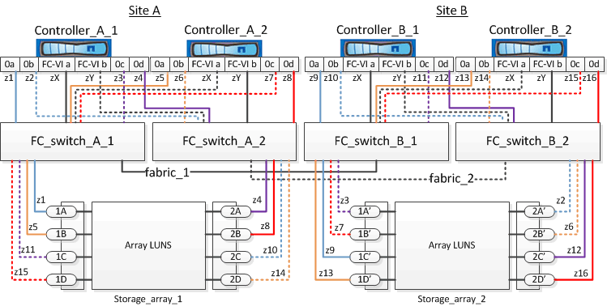

= Ejemplo de división en zonas de switches en una configuración de MetroCluster de cuatro nodos con LUN de cabina
:allow-uri-read: 
:icons: font
:imagesdir: ../media/

[role="lead"]
La división en zonas de switches define las rutas entre los nodos conectados. La configuración de la división en zonas permite definir los LUN de cabina que pueden ver los sistemas ONTAP específicos.

Puede usar el siguiente ejemplo como referencia cuando determine la división en zonas para una configuración MetroCluster de cuatro nodos con LUN de cabina. El ejemplo muestra la división en zonas de un solo iniciador a un único destino para una configuración de MetroCluster. Las líneas del ejemplo siguiente representan zonas en lugar de conexiones; cada línea está etiquetada con su número de zona:

En la ilustración, se asignan LUN de cabina en cada cabina de almacenamiento para la configuración de MetroCluster. Las LUN de igual tamaño se aprovisionan en las cabinas de almacenamiento en ambos sitios, un requisito de SyncMirror. Cada sistema ONTAP tiene dos rutas a los LUN de cabina. Los puertos en la cabina de almacenamiento son redundantes.

En la ilustración, los pares de puertos de cabina redundantes para ambos sitios son los siguientes:

* Cabina de almacenamiento en el sitio A:
+
** Puertos 1A y 2A
** Puertos 1B y 2B
** Puertos 1C y 2C
** Puertos 1D y 2D

* Cabina de almacenamiento en el sitio B:
+
** Puertos 1A' y 2A'
** Puertos 1B' y 2B'
** Puertos 1C' y 2C'
** Puertos 1D' y 2D'

Las parejas de puertos redundantes de cada cabina de almacenamiento forman rutas alternativas. Por lo tanto, ambos puertos de las parejas de puertos pueden acceder a las LUN en sus respectivas cabinas de almacenamiento.

En las siguientes tablas se muestran las zonas de este ejemplo:

== Zonas para FC_switch_A_1

|===

| Zona | Controladora ONTAP y puerto del iniciador | Puerto de la cabina de almacenamiento 

 a| 
z1
 a| 
Controladora_a_1: Puerto 0a
 a| 
Puerto 1A

 a| 
z3
 a| 
Controladora_a_1: Puerto 0c
 a| 
Puerto 1A'

 a| 
z5
 a| 
Controladora_a_2: Puerto 0a
 a| 
Puerto 1B

 a| 
z7
 a| 
Controladora_a_2: Puerto 0c
 a| 
Puerto 1B'

|===

== Zonas para FC_switch_A_2

|===

| Zona | Controladora ONTAP y puerto del iniciador | Puerto de la cabina de almacenamiento 

 a| 
z2
 a| 
Controller_A_1: Puerto 0b
 a| 
Puerto 2A'

 a| 
z4
 a| 
Controladora_a_1: Puerto 0d
 a| 
Puerto 2A

 a| 
z6
 a| 
Controller_A_2: Puerto 0b
 a| 
Puerto 2B'

 a| 
z8
 a| 
Controladora_a_2: Puerto 0d
 a| 
Puerto 2B

|===

== Zonas para FC_switch_B_1

|===

| Zona | Controladora ONTAP y puerto del iniciador | Puerto de la cabina de almacenamiento 

 a| 
z9
 a| 
Controladora_B_1: Puerto 0a
 a| 
Puerto 1C'

 a| 
z11
 a| 
Controladora_B_1: Puerto 0c
 a| 
Puerto 1C

 a| 
z13
 a| 
Controladora_B_2: Puerto 0a
 a| 
Puerto 1D'

 a| 
z15
 a| 
Controladora_B_2: Puerto 0c
 a| 
Puerto 1D

|===

== Zonas para FC_switch_B_2

|===

| Zona | Controladora ONTAP y puerto del iniciador | Puerto de la cabina de almacenamiento 

 a| 
z10
 a| 
Controller_B_1: Puerto 0b
 a| 
Puerto 2C

 a| 
z12
 a| 
Controladora_B_1: Puerto 0d
 a| 
Puerto 2C'

 a| 
z14
 a| 
Controller_B_2: Puerto 0b
 a| 
Puerto 2D

 a| 
z16
 a| 
Controladora_B_2: Puerto 0d
 a| 
Puerto 2D'

|===

== Zonas para las conexiones FC-VI del Sitio A

|===

| Zona | Controladora ONTAP y puerto iniciador FC | Conmutador 

 a| 
ZX
 a| 
Controller_A_1: Puerto FC-VI a
 a| 
FC_switch_A_1

 a| 
ZY
 a| 
Controladora_a_1: Puerto FC-VI b
 a| 
FC_switch_A_2

 a| 
ZX
 a| 
Controller_A_2: Puerto FC-VI a
 a| 
FC_switch_A_1

 a| 
ZY
 a| 
Controladora_a_2: Puerto FC-VI b
 a| 
FC_switch_A_2

|===

== Zonas para las conexiones FC-VI del Sitio B

|===

| Zona | Controladora ONTAP y puerto iniciador FC | Conmutador 

 a| 
ZX
 a| 
Controller_B_1: Puerto FC-VI a
 a| 
FC_switch_B_1

 a| 
ZY
 a| 
Controller_B_1: Puerto FC-VI b
 a| 
FC_switch_B_2

 a| 
ZX
 a| 
Controller_B_2: Puerto FC-VI a
 a| 
FC_switch_B_1

 a| 
ZY
 a| 
Controladora_B_2: Puerto FC-VI b
 a| 
FC_switch_B_2

|===
.Información relacionada
* La división en zonas de switches define las rutas entre los nodos conectados. La configuración de la división en zonas permite definir los LUN de cabina que pueden ver los sistemas ONTAP específicos.
+
link:concept_example_of_switch_zoning_in_a_two_node_mcc_configuration_with_array_luns.html["Ejemplo de división en zonas de switches en una configuración MetroCluster de dos nodos con LUN de cabina"]

+
link:concept_example_of_switch_zoning_in_an_eight_node_mcc_configuration_with_array_luns.html["Ejemplo de división en zonas de switches en una configuración MetroCluster de ocho nodos con LUN de cabina"]

* Al utilizar la división en zonas de switches en una configuración de MetroCluster con LUN de cabina, debe asegurarse de que se cumplan ciertos requisitos básicos.
+
link:reference_requirements_for_switch_zoning_in_a_mcc_configuration_with_array_luns.html["Requisitos para la división en zonas de switches en una configuración de MetroCluster con LUN de cabina"]

