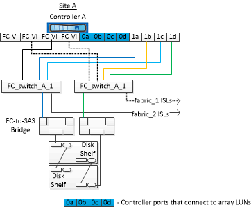

= Ejemplo de una configuración MetroCluster de dos nodos con conexión a la estructura con discos y LUN de cabina
:allow-uri-read: 
:icons: font
:imagesdir: ../media/

[role="lead"]
Para configurar una configuración MetroCluster con estructura de dos nodos con discos nativos y LUN de cabina, debe utilizar puentes FC a SAS para conectar los sistemas ONTAP con las bandejas de discos a través de los switches FC. Puede conectar los LUN de la cabina mediante los switches FC a los sistemas ONTAP.

Las siguientes ilustraciones representan ejemplos de una configuración MetroCluster de dos nodos conectada a la estructura con discos y LUN de cabina. Ambos representan la misma configuración MetroCluster; las representaciones de discos y LUN de cabina solo se separan para simplificar.

En la siguiente ilustración se muestra la conectividad entre los sistemas y discos ONTAP, los puertos HBA 1a a 1d se utilizan para la conectividad con discos a través de los puentes FC a SAS:

En la siguiente ilustración, que muestra la conectividad entre los sistemas ONTAP y los LUN de cabina, los puertos HBA 0a a 0d se utilizan para la conectividad con LUN de cabina debido a que los puertos 1a a 1d se utilizan para la conectividad con discos:

image::../media/two_node_mcc_combined_fabric_arrayluns.gif[dos nodos mcc de array combinado]
