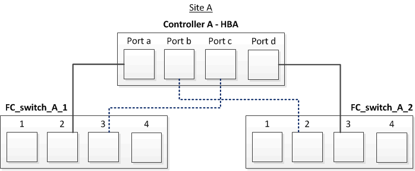

= Cableado de los puertos FC-VI y HBA en una configuración MetroCluster estructural de dos nodos con LUN de cabina
:allow-uri-read: 
:icons: font
:imagesdir: ../media/

[role="lead"]
Si va a configurar una configuración MetroCluster estructural de dos nodos con LUN de cabina, debe cablear los puertos FC-VI y los puertos HBA a los puertos del switch.

.Acerca de esta tarea
* Debe repetir esta tarea para cada controladora en ambos sitios de MetroCluster.
* Si planea utilizar discos además de los LUN de cabina en la configuración de MetroCluster, debe usar los puertos HBA y los puertos del switch especificados para la configuración con discos.
+
** link:concept_port_assignments_for_fc_switches_when_using_ontap_9_1_and_later.html["Asignaciones de puertos para los switches FC cuando se utiliza ONTAP 9.1 y versiones posteriores"]

.Pasos
. Conecte mediante cable los puertos FC-VI de la controladora a los puertos del switch alternativos.
. Ejecute el cableado de controladora a switch en ambos sitios MetroCluster.
+
Debe garantizar la redundancia en las conexiones de la controladora a los switches. Por lo tanto, para cada controladora de un sitio, debe asegurarse de que ambos puertos HBA del mismo par de puertos estén conectados a switches FC alternativos.

+
En el siguiente ejemplo, se muestran las conexiones entre los puertos HBA en la controladora A y los puertos en FC_switch_A_1 y FC_switch_A_2:

+

+
En la siguiente tabla, se enumeran las conexiones entre los puertos HBA y los puertos del switch de FC en la ilustración:

+
|===

| Puertos HBA | Puertos del switch 

2+| *Par de puertos* 

 a| 
Puerto a
 a| 
FC_switch_A_1, puerto 2

 a| 
Puerto d
 a| 
FC_switch_A_2, puerto 3

2+| *Par de puertos* 

 a| 
Puerto b
 a| 
FC_switch_A_2, puerto 2

 a| 
Puerto c
 a| 
FC_switch_A_1, puerto 3

|===

.Después de terminar
Debe cablear los ISL entre los switches FC entre los sitios MetroCluster.
