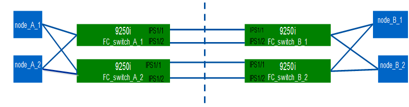

= Configurar manualmente los switches Cisco FC
:allow-uri-read: 
:icons: font
:imagesdir: ../media/

[role="lead"]
Cada switch de Cisco en la configuración de MetroCluster debe estar configurado correctamente para el ISL y las conexiones de almacenamiento.

.Antes de empezar
Los siguientes requisitos se aplican a los switches FC de Cisco:

* Debe utilizar cuatro switches Cisco admitidos del mismo modelo con la misma versión y licencia de NX-OS.
* La configuración de MetroCluster requiere cuatro switches.
+
Los cuatro switches deben estar conectados en dos estructuras de dos switches cada uno, con cada estructura que abarque ambos sitios.

* El switch debe admitir la conectividad con el modelo ATTO FiberBridge.
* No se pueden utilizar el cifrado o la compresión en la estructura de almacenamiento de Cisco FC. No es compatible con la configuración de MetroCluster.

En la https://["Herramienta de matriz de interoperabilidad de NetApp (IMT)"], Puede utilizar el campo solución de almacenamiento para seleccionar la solución MetroCluster. Utilice el *Explorador de componentes* para seleccionar los componentes y la versión ONTAP para refinar la búsqueda. Puede hacer clic en *Mostrar resultados* para mostrar la lista de configuraciones compatibles que coinciden con los criterios.

.Acerca de esta tarea
El siguiente requisito se aplica a las conexiones de enlace entre switches (ISL):

* Todos los ISL deben tener la misma longitud y la misma velocidad en una misma estructura.
+
Se pueden utilizar diferentes longitudes de ISL en los diferentes tejidos. Se debe utilizar la misma velocidad en todas las telas.

El siguiente requisito se aplica a las conexiones de almacenamiento:

* Cada controladora de almacenamiento debe tener cuatro puertos de iniciador disponibles para conectarse a las estructuras de switches.
+
Deben conectarse dos puertos de iniciador desde cada controladora de almacenamiento a cada estructura.

+
[NOTE]
====
Puede configurar sistemas FAS8020, AFF8020, FAS8200 y AFF A300 con dos puertos iniciadores por controladora (un solo puerto de iniciador para cada estructura) si se cumplen todos los siguientes criterios:

** Hay menos de cuatro puertos iniciadores FC disponibles para conectar el almacenamiento en disco y no se pueden configurar puertos adicionales como iniciadores de FC.
** Todas las ranuras están en uso y no se puede añadir ninguna tarjeta iniciador FC.

====

.Información relacionada
https://["Herramienta de matriz de interoperabilidad de NetApp"]

== Requisitos para la licencia de switch de Cisco

Ciertas licencias basadas en funciones pueden ser necesarias para los switches de Cisco en una configuración de MetroCluster estructural. Estas licencias le permiten utilizar funciones como QoS o créditos de modo a larga distancia en los switches. Debe instalar las licencias basadas en funciones necesarias en los cuatro switches de una configuración de MetroCluster.

En una configuración de MetroCluster, se pueden necesitar las siguientes licencias basadas en funciones:

* EMPRESA_PKG
+
Esta licencia le permite usar la función QoS en switches Cisco.

* PORT_ACTIVATION_PKG
+
Puede usar esta licencia para switches Cisco 9148. Esta licencia le permite activar o desactivar puertos en los switches siempre que sólo estén activos 16 puertos en un momento dado. De manera predeterminada, 16 puertos están habilitados en los switches Cisco MDS 9148.

* FM_SERVER_PKG
+
Esta licencia le permite gestionar las estructuras de forma simultánea y gestionar switches a través de un navegador web.

+
La licencia FM_SERVER_PKG también habilita funciones de gestión del rendimiento como umbrales de rendimiento y supervisión de umbrales. Para obtener más información sobre esta licencia, consulte el paquete de servidor de Cisco Fabric Manager.

Puede verificar que las licencias se hayan instalado mediante el comando show license use. Si no tiene estas licencias, póngase en contacto con su representante de ventas antes de continuar con la instalación.

NOTE: Los switches Cisco MDS 9250i tienen dos puertos fijos de servicios de almacenamiento IP de 1/10 GbE. No se necesitan licencias adicionales para estos puertos. El paquete de aplicaciones de extensión SAN a través de IP de Cisco es una licencia estándar de estos switches que permite funciones como FCIP y compresión.

== Configurar el switch Cisco FC a los valores predeterminados de fábrica

Para garantizar una configuración correcta, debe ajustar el conmutador a sus valores predeterminados de fábrica. Esto garantiza que el interruptor se inicie desde una configuración limpia.

.Acerca de esta tarea
Esta tarea se debe realizar en todos los switches de la configuración de MetroCluster.

.Pasos
. Establezca una conexión de consola e inicie sesión en ambos switches de la misma estructura.
. Vuelva a ajustar la configuración predeterminada del conmutador:
+
`write erase`

+
Puede responder «'y'» cuando se le solicite que confirme el comando. De esta forma se borra toda la información de las licencias y de configuración del conmutador.

. Reinicie el switch:
+
`reload`

+
Puede responder «'y'» cuando se le solicite que confirme el comando.

. Repita el `write erase` y.. `reload` comandos en el otro interruptor.
+
Después de emitir el `reload` comando, el switch se reinicia y, a continuación, se pregunta con las preguntas de configuración. En ese momento, proceda a la siguiente sección.

.Ejemplo
En el siguiente ejemplo, se muestra el proceso en una estructura que consta de FC_switch_A_1 y FC_switch_B_1.

[listing]
----
FC_Switch_A_1# write erase
    Warning: This command will erase the startup-configuration.
    Do you wish to proceed anyway? (y/n)  [n] y
    FC_Switch_A_1# reload
    This command will reboot the system. (y/n)?  [n] y

FC_Switch_B_1# write erase
    Warning: This command will erase the startup-configuration.
    Do you wish to proceed anyway? (y/n)  [n] y
    FC_Switch_B_1# reload
    This command will reboot the system. (y/n)?  [n] y
----

== Configure los ajustes básicos y la cadena de comunidad del switch Cisco FC

Debe especificar la configuración básica con el `setup` o después de emitir el `reload` comando.

.Pasos
. Si el conmutador no muestra las preguntas de configuración, configure los ajustes básicos del conmutador:
+
`setup`

. Acepte las respuestas predeterminadas a las preguntas de configuración hasta que se le pida una cadena de comunidad SNMP.
. Establezca la cadena de comunidad en "'public'" (todas minúsculas) para permitir el acceso desde los monitores de estado de ONTAP.
+
Puede establecer la cadena de comunidad en un valor distinto de "'public'", pero debe configurar los monitores de estado de ONTAP mediante la cadena de comunidad que especifique.

+
En el ejemplo siguiente se muestran los comandos en FC_switch_A_1:

+
[listing]
----
FC_switch_A_1# setup
    Configure read-only SNMP community string (yes/no) [n]: y
    SNMP community string : public
    Note:  Please set the SNMP community string to "Public" or another value of your choosing.
    Configure default switchport interface state (shut/noshut) [shut]: noshut
    Configure default switchport port mode F (yes/no) [n]: n
    Configure default zone policy (permit/deny) [deny]: deny
    Enable full zoneset distribution? (yes/no) [n]: yes
----
+
En el ejemplo siguiente se muestran los comandos en FC_switch_B_1:

+
[listing]
----
FC_switch_B_1# setup
    Configure read-only SNMP community string (yes/no) [n]: y
    SNMP community string : public
    Note:  Please set the SNMP community string to "Public" or another value of your choosing.
    Configure default switchport interface state (shut/noshut) [shut]: noshut
    Configure default switchport port mode F (yes/no) [n]: n
    Configure default zone policy (permit/deny) [deny]: deny
    Enable full zoneset distribution? (yes/no) [n]: yes
----

== Adquirir licencias para puertos

No es necesario utilizar las licencias de switch de Cisco en un rango continuo de puertos; en su lugar, puede adquirir licencias para puertos específicos que se usan y quitar licencias de puertos no utilizados.

.Antes de empezar
Debe verificar el número de puertos con licencia en la configuración del switch y, si es necesario, mover las licencias de un puerto a otro según sea necesario.

.Pasos
. Muestre el uso de la licencia de una estructura de switches:
+
`show port-resources module 1`

+
Determinar qué puertos requieren licencias. Si algunos de esos puertos no tienen licencia, determine si tiene puertos adicionales con licencia y considere la posibilidad de eliminar las licencias de ellos.

. Entrar al modo de configuración:
+
`config t`

. Elimine la licencia del puerto seleccionado:
+
.. Seleccione el puerto para no tener licencia:
+
`interface _interface-name_`

.. Elimine la licencia del puerto:
+
`no port-license acquire`

.. Salga de la interfaz de configuración del puerto:
+
`exit`

. Adquiera la licencia del puerto seleccionado:
+
.. Seleccione el puerto para no tener licencia:
+
`interface _interface-name_`

.. Haga que el puerto sea apto para adquirir una licencia:
+
`port-license`

.. Adquiera la licencia en el puerto:
+
`port-license acquire`

.. Salga de la interfaz de configuración del puerto:
+
`exit`

. Repita esto para todos los puertos adicionales.
. Salir del modo de configuración:
+
`exit`

=== Quitar y adquirir una licencia en un puerto

En este ejemplo, se muestra una licencia que se está quitando del puerto fc1/2, el puerto fc1/1 que es elegible para adquirir una licencia y la licencia que se adquiere en el puerto fc1/1:

[listing]
----
Switch_A_1# conf t
    Switch_A_1(config)# interface fc1/2
    Switch_A_1(config)# shut
    Switch_A_1(config-if)# no port-license acquire
    Switch_A_1(config-if)# exit
    Switch_A_1(config)# interface fc1/1
    Switch_A_1(config-if)# port-license
    Switch_A_1(config-if)# port-license acquire
    Switch_A_1(config-if)# no shut
    Switch_A_1(config-if)# end
    Switch_A_1# copy running-config startup-config

    Switch_B_1# conf t
    Switch_B_1(config)# interface fc1/2
    Switch_B_1(config)# shut
    Switch_B_1(config-if)# no port-license acquire
    Switch_B_1(config-if)# exit
    Switch_B_1(config)# interface fc1/1
    Switch_B_1(config-if)# port-license
    Switch_B_1(config-if)# port-license acquire
    Switch_B_1(config-if)# no shut
    Switch_B_1(config-if)# end
    Switch_B_1# copy running-config startup-config
----
En el ejemplo siguiente se muestra cómo se verifica el uso de licencias de puertos:

[listing]
----
Switch_A_1# show port-resources module 1
    Switch_B_1# show port-resources module 1
----

== Activación de puertos en un conmutador Cisco MDS 9148 o 9148S

En los switches Cisco MDS 9148 o 9148S, debe habilitar manualmente los puertos necesarios en una configuración MetroCluster.

.Acerca de esta tarea
* Puede habilitar manualmente 16 puertos en un conmutador Cisco MDS 9148 o 9148S.
* Los switches Cisco permiten aplicar la licencia POD en puertos aleatorios, en lugar de aplicarlas en orden.
* Los switches Cisco requieren que utilice un puerto de cada grupo de puertos, a menos que necesite más de 12 puertos.

.Pasos
. Vea los grupos de puertos disponibles en un switch Cisco:
+
`show port-resources module _blade_number_`

. Y adquirir el puerto necesario en un grupo de puertos:
+
`config t`

+
`interface _port_number_`

+
`shut`

+
`port-license acquire`

+
`no shut`

+
Por ejemplo, el siguiente comando ejecuta licencias y adquiere el puerto fc 1/45:

+
[listing]
----
switch# config t
switch(config)#
switch(config)# interface fc 1/45
switch(config-if)#
switch(config-if)# shut
switch(config-if)# port-license acquire
switch(config-if)# no shut
switch(config-if)# end
----
. Guarde la configuración:
+
`copy running-config startup-config`

== Configurar los puertos F en un switch Cisco FC

Debe configurar los puertos F en el switch FC.

.Acerca de esta tarea
En una configuración MetroCluster, los puertos F son los puertos que conectan el switch a los iniciadores de HBA, las interconexiones FC-VI y los puentes FC a SAS.

Cada puerto debe configurarse por separado.

Consulte las siguientes secciones para identificar los puertos F (switch a nodo) de su configuración:

* link:concept_port_assignments_for_fc_switches_when_using_ontap_9_1_and_later.html["Asignaciones de puertos para los switches FC cuando se utiliza ONTAP 9.1 y versiones posteriores"]
* link:concept_port_assignments_for_fc_switches_when_using_ontap_9_0.html["Asignación de puertos para los switches FC cuando se utiliza ONTAP 9.0"]

Esta tarea debe realizarse en cada switch de la configuración de MetroCluster.

.Pasos
. Entrar al modo de configuración:
+
`config t`

. Entre en el modo de configuración de interfaz para el puerto:
+
`interface _port-ID_`

. Apague el puerto:
+
`shutdown`

. Establezca los puertos en el modo F:
+
`switchport mode F`

. Configure los puertos en velocidad fija:
+
`switchport speed _speed-value_`

+
`_speed-value_` es cualquiera de los dos `8000` o. `16000`

. Establezca el modo de velocidad del puerto del switch en dedicado:
+
`switchport rate-mode dedicated`

. Reinicie el puerto:
+
`no shutdown`

. Salir del modo de configuración:
+
`end`

.Ejemplo
En el siguiente ejemplo se muestran los comandos de los dos switches:

[listing]
----
Switch_A_1# config  t
FC_switch_A_1(config)# interface fc 1/1
FC_switch_A_1(config-if)# shutdown
FC_switch_A_1(config-if)# switchport mode F
FC_switch_A_1(config-if)# switchport speed 8000
FC_switch_A_1(config-if)# switchport rate-mode dedicated
FC_switch_A_1(config-if)# no shutdown
FC_switch_A_1(config-if)# end
FC_switch_A_1# copy running-config startup-config

FC_switch_B_1# config  t
FC_switch_B_1(config)# interface fc 1/1
FC_switch_B_1(config-if)# switchport mode F
FC_switch_B_1(config-if)# switchport speed 8000
FC_switch_B_1(config-if)# switchport rate-mode dedicated
FC_switch_B_1(config-if)# no shutdown
FC_switch_B_1(config-if)# end
FC_switch_B_1# copy running-config startup-config
----

== Asignación de créditos de búfer a búfer a puertos F en el mismo grupo de puertos que el ISL

Debe asignar los créditos de búfer a búfer a los puertos F si están en el mismo grupo de puertos que el ISL. Si los puertos no tienen los créditos de búfer a búfer requeridos, el ISL podría no estar operativo.

.Acerca de esta tarea
Esta tarea no es necesaria si los puertos F no están en el mismo grupo de puertos que el puerto ISL.

Si los puertos F se encuentran en un grupo de puertos que contiene el ISL, esta tarea se debe realizar en cada switch FC de la configuración de MetroCluster.

.Pasos
. Entrar al modo de configuración:
+
`config t`

. Establezca el modo de configuración de la interfaz para el puerto:
+
`interface _port-ID_`

. Desactive el puerto:
+
`shut`

. Si el puerto no está en el modo F, ajuste el puerto en modo F:
+
`switchport mode F`

. Establezca el crédito de búfer a búfer de los puertos que no son E en 1:
+
`switchport fcrxbbcredit 1`

. Vuelva a habilitar el puerto:
+
`no shut`

. Salir del modo de configuración:
+
`exit`

. Copie la configuración actualizada en la configuración de inicio:
+
`copy running-config startup-config`

. Verifique el crédito de búfer a búfer asignado a un puerto:
+
`show port-resources module 1`

. Salir del modo de configuración:
+
`exit`

. Repita estos pasos en el otro switch de la estructura.
. Compruebe la configuración:
+
`show port-resource module 1`

.Ejemplo
En este ejemplo, el puerto fc1/40 es el ISL. Los puertos fc1/37, fc1/38 y fc1/39 están en el mismo grupo de puertos y deben configurarse.

Los siguientes comandos muestran el rango de puertos que se está configurando para fc1/37 a fc1/39:

[listing]
----
FC_switch_A_1# conf t
FC_switch_A_1(config)# interface fc1/37-39
FC_switch_A_1(config-if)# shut
FC_switch_A_1(config-if)# switchport mode F
FC_switch_A_1(config-if)# switchport fcrxbbcredit 1
FC_switch_A_1(config-if)# no shut
FC_switch_A_1(config-if)# exit
FC_switch_A_1# copy running-config startup-config

FC_switch_B_1# conf t
FC_switch_B_1(config)# interface fc1/37-39
FC_switch_B_1(config-if)# shut
FC_switch_B_1(config-if)# switchport mode F
FC_switch_B_1(config-if)# switchport fcrxbbcredit 1
FC_switch_A_1(config-if)# no shut
FC_switch_A_1(config-if)# exit
FC_switch_B_1# copy running-config startup-config
----
Los siguientes comandos y resultados del sistema muestran que las opciones se aplican correctamente:

[listing]
----
FC_switch_A_1# show port-resource module 1
...
Port-Group 11
 Available dedicated buffers are 93

--------------------------------------------------------------------
Interfaces in the Port-Group       B2B Credit  Bandwidth  Rate Mode
                                      Buffers     (Gbps)

--------------------------------------------------------------------
fc1/37                                     32        8.0  dedicated
fc1/38                                      1        8.0  dedicated
fc1/39                                      1        8.0  dedicated
...

FC_switch_B_1# port-resource module
...
Port-Group 11
 Available dedicated buffers are 93

--------------------------------------------------------------------
Interfaces in the Port-Group       B2B Credit  Bandwidth  Rate Mode
                                     Buffers     (Gbps)

--------------------------------------------------------------------
fc1/37                                     32        8.0  dedicated
fc1/38                                      1        8.0  dedicated
fc1/39                                      1        8.0 dedicated
...
----

== Creación y configuración de VSan en switches FC de Cisco

Debe crear un VSAN para los puertos FC-VI y una VSAN para los puertos de almacenamiento de cada switch de FC en la configuración de MetroCluster.

.Acerca de esta tarea
Las VSANs deben tener un número y un nombre únicos. Debe realizar una configuración adicional si usa dos ISL con entrega de tramas en orden.

Los ejemplos de esta tarea utilizan las siguientes convenciones de nomenclatura:

[cols="1,2,1"]
|===

| Estructura de switches | Nombre de VSAN | Número de ID 

 a| 
1
 a| 
FCVI_1_10
 a| 
10

 a| 
STOR_1_20
 a| 
20

 a| 
2
 a| 
FCVI_2_30
 a| 
30

 a| 
STOR_2_20
 a| 
40

|===
Esta tarea debe realizarse en cada estructura de switch FC.

.Pasos
. Configure el VSAN de FC-VI:
+
.. Entre en el modo de configuración si aún no lo ha hecho:
+
`config t`

.. Edite la base de datos VSAN:
+
`vsan database`

.. Establezca el ID de VSAN:
+
`vsan _vsan-ID_`

.. Establezca el nombre de VSAN:
+
`vsan _vsan-ID_ name _vsan_name_`

. Añada puertos al VSAN FC-VI:
+
.. Añada las interfaces para cada puerto en VSAN:
+
`vsan _vsan-ID_ interface _interface_name_`

+
Para el VSAN FC-VI, se añadirán los puertos que conectan los puertos FC-VI locales.

.. Salir del modo de configuración:
+
`end`

.. Copie el running-config en el startup-config:
+
`copy running-config startup-config`

+
En el ejemplo siguiente, los puertos son fc1/1 y fc1/13:

+
[listing]
----
FC_switch_A_1# conf t
FC_switch_A_1(config)# vsan database
FC_switch_A_1(config)# vsan 10 interface fc1/1
FC_switch_A_1(config)# vsan 10 interface fc1/13
FC_switch_A_1(config)# end
FC_switch_A_1# copy running-config startup-config
FC_switch_B_1# conf t
FC_switch_B_1(config)# vsan database
FC_switch_B_1(config)# vsan 10 interface fc1/1
FC_switch_B_1(config)# vsan 10 interface fc1/13
FC_switch_B_1(config)# end
FC_switch_B_1# copy running-config startup-config
----

. Verifique la pertenencia del puerto de VSAN:
+
`show vsan member`

+
[listing]
----
FC_switch_A_1# show vsan member
FC_switch_B_1# show vsan member
----
. Configure la VSAN para garantizar la entrega en orden de tramas o la entrega fuera de servicio de marcos:
+

NOTE: Se recomienda la configuración de IOD estándar. Sólo debe configurar OOD si es necesario.

+
link:concept_prepare_for_the_mcc_installation.html["Consideraciones sobre el uso de equipos TDM/WDM con configuraciones MetroCluster conectadas a la estructura"]

+
** Se deben realizar los siguientes pasos para configurar la entrega en orden de marcos:
+
... Entrar al modo de configuración:
+
`conf t`

... Active la garantía de intercambio para la VSAN:
+
`in-order-guarantee vsan _vsan-ID_`

+

IMPORTANT: Para los VSan FC-VI (FCVI_1_10 y FCVI_2_30), debe habilitar la garantía de bastidores e intercambios sólo en VSAN 10.

... Habilite el equilibrio de carga para VSAN:
+
`vsan _vsan-ID_ loadbalancing src-dst-id`

... Salir del modo de configuración:
+
`end`

... Copie el running-config en el startup-config:
+
`copy running-config startup-config`

+
Los comandos para configurar la entrega en orden de tramas en FC_switch_A_1:

+
[listing]
----
FC_switch_A_1# config t
FC_switch_A_1(config)# in-order-guarantee vsan 10
FC_switch_A_1(config)# vsan database
FC_switch_A_1(config-vsan-db)# vsan 10 loadbalancing src-dst-id
FC_switch_A_1(config-vsan-db)# end
FC_switch_A_1# copy running-config startup-config
----
+
Los comandos para configurar la entrega en orden de tramas en FC_switch_B_1:

+
[listing]
----
FC_switch_B_1# config t
FC_switch_B_1(config)# in-order-guarantee vsan 10
FC_switch_B_1(config)# vsan database
FC_switch_B_1(config-vsan-db)# vsan 10 loadbalancing src-dst-id
FC_switch_B_1(config-vsan-db)# end
FC_switch_B_1# copy running-config startup-config
----

** Deben realizarse los siguientes pasos para configurar la entrega fuera de servicio de marcos:
+
... Entrar al modo de configuración:
+
`conf t`

... Desactive la garantía de intercambio para la VSAN:
+
`no in-order-guarantee vsan _vsan-ID_`

... Habilite el equilibrio de carga para VSAN:
+
`vsan _vsan-ID_ loadbalancing src-dst-id`

... Salir del modo de configuración:
+
`end`

... Copie el running-config en el startup-config:
+
`copy running-config startup-config`

+
Los comandos para configurar la entrega fuera de servicio de tramas en FC_switch_A_1:

+
[listing]
----
FC_switch_A_1# config t
FC_switch_A_1(config)# no in-order-guarantee vsan 10
FC_switch_A_1(config)# vsan database
FC_switch_A_1(config-vsan-db)# vsan 10 loadbalancing src-dst-id
FC_switch_A_1(config-vsan-db)# end
FC_switch_A_1# copy running-config startup-config
----
+
Los comandos para configurar la entrega fuera de servicio de tramas en FC_switch_B_1:

+
[listing]
----
FC_switch_B_1# config t
FC_switch_B_1(config)# no in-order-guarantee vsan 10
FC_switch_B_1(config)# vsan database
FC_switch_B_1(config-vsan-db)# vsan 10 loadbalancing src-dst-id
FC_switch_B_1(config-vsan-db)# end
FC_switch_B_1# copy running-config startup-config
----
+

NOTE: Al configurar ONTAP en los módulos de controlador, OOD debe configurarse explícitamente en cada módulo de controlador de la configuración de MetroCluster.

+
link:concept_configure_the_mcc_software_in_ontap.html#configuring-in-order-delivery-or-out-of-order-delivery-of-frames-on-ontap-software["Configurar la entrega bajo pedido o la entrega fuera de servicio de tramas en el software ONTAP"]

. Establezca políticas de calidad de servicio para la VSAN FC-VI:
+
--
.. Entrar al modo de configuración:
+
`conf t`

.. Active la QoS y cree un mapa de clase introduciendo los siguientes comandos en secuencia:
+
`qos enable`

+
`qos class-map _class_name_ match-any`

.. Agregue el mapa de clase creado en un paso anterior al mapa de directivas:
+
`class _class_name_`

.. Establezca la prioridad:
+
`priority high`

.. Añada la VSAN al mapa de políticas que se creó anteriormente en este procedimiento:
+
`qos service policy _policy_name_ vsan _vsan-id_`

.. Copie la configuración actualizada en la configuración de inicio:
+
`copy running-config startup-config`

--
+
Los comandos para establecer las políticas de calidad de servicio en FC_switch_A_1:

+
[listing]
----
FC_switch_A_1# conf t
FC_switch_A_1(config)# qos enable
FC_switch_A_1(config)# qos class-map FCVI_1_10_Class match-any
FC_switch_A_1(config)# qos policy-map FCVI_1_10_Policy
FC_switch_A_1(config-pmap)# class FCVI_1_10_Class
FC_switch_A_1(config-pmap-c)# priority high
FC_switch_A_1(config-pmap-c)# exit
FC_switch_A_1(config)# exit
FC_switch_A_1(config)# qos service policy FCVI_1_10_Policy vsan 10
FC_switch_A_1(config)# end
FC_switch_A_1# copy running-config startup-config
----
+
Los comandos para establecer las políticas de calidad de servicio en FC_switch_B_1:

+
[listing]
----
FC_switch_B_1# conf t
FC_switch_B_1(config)# qos enable
FC_switch_B_1(config)# qos class-map FCVI_1_10_Class match-any
FC_switch_B_1(config)# qos policy-map FCVI_1_10_Policy
FC_switch_B_1(config-pmap)# class FCVI_1_10_Class
FC_switch_B_1(config-pmap-c)# priority high
FC_switch_B_1(config-pmap-c)# exit
FC_switch_B_1(config)# exit
FC_switch_B_1(config)# qos service policy FCVI_1_10_Policy vsan 10
FC_switch_B_1(config)# end
FC_switch_B_1# copy running-config startup-config
----
. Configure la VSAN de almacenamiento:
+
--
.. Establezca el ID de VSAN:
+
`vsan _vsan-ID_`

.. Establezca el nombre de VSAN:
+
`vsan _vsan-ID_ name _vsan_name_`

--
+
Los comandos para configurar la VSAN de almacenamiento en FC_switch_A_1:

+
[listing]
----
FC_switch_A_1# conf t
FC_switch_A_1(config)# vsan database
FC_switch_A_1(config-vsan-db)# vsan 20
FC_switch_A_1(config-vsan-db)# vsan 20 name STOR_1_20
FC_switch_A_1(config-vsan-db)# end
FC_switch_A_1# copy running-config startup-config
----
+
Los comandos para configurar la VSAN de almacenamiento en FC_switch_B_1:

+
[listing]
----
FC_switch_B_1# conf t
FC_switch_B_1(config)# vsan database
FC_switch_B_1(config-vsan-db)# vsan 20
FC_switch_B_1(config-vsan-db)# vsan 20 name STOR_1_20
FC_switch_B_1(config-vsan-db)# end
FC_switch_B_1# copy running-config startup-config
----
. Añada puertos al VSAN de almacenamiento.
+
En el caso de la VSAN de almacenamiento, se deben añadir todos los puertos que conectan los puentes HBA o FC a SAS. En este ejemplo fc1/5, fc1/9, fc1/17, fc1/21. se están añadiendo fc1/25, fc1/29, fc1/33 y fc1/37.

+
Los comandos para añadir puertos al VSAN de almacenamiento en FC_switch_A_1:

+
[listing]
----
FC_switch_A_1# conf t
FC_switch_A_1(config)# vsan database
FC_switch_A_1(config)# vsan 20 interface fc1/5
FC_switch_A_1(config)# vsan 20 interface fc1/9
FC_switch_A_1(config)# vsan 20 interface fc1/17
FC_switch_A_1(config)# vsan 20 interface fc1/21
FC_switch_A_1(config)# vsan 20 interface fc1/25
FC_switch_A_1(config)# vsan 20 interface fc1/29
FC_switch_A_1(config)# vsan 20 interface fc1/33
FC_switch_A_1(config)# vsan 20 interface fc1/37
FC_switch_A_1(config)# end
FC_switch_A_1# copy running-config startup-config
----
+
Los comandos para añadir puertos al VSAN de almacenamiento en FC_switch_B_1:

+
[listing]
----
FC_switch_B_1# conf t
FC_switch_B_1(config)# vsan database
FC_switch_B_1(config)# vsan 20 interface fc1/5
FC_switch_B_1(config)# vsan 20 interface fc1/9
FC_switch_B_1(config)# vsan 20 interface fc1/17
FC_switch_B_1(config)# vsan 20 interface fc1/21
FC_switch_B_1(config)# vsan 20 interface fc1/25
FC_switch_B_1(config)# vsan 20 interface fc1/29
FC_switch_B_1(config)# vsan 20 interface fc1/33
FC_switch_B_1(config)# vsan 20 interface fc1/37
FC_switch_B_1(config)# end
FC_switch_B_1# copy running-config startup-config
----

== Configuración de puertos E-ports

Debe configurar los puertos del switch que conectan el ISL (estos son los puertos E).

.Acerca de esta tarea
El procedimiento que utilice dependerá del interruptor que esté utilizando:

* <<config-e-ports-cisco-fc,Configurar los puertos E-Ports en el switch Cisco FC>>
* <<config-fcip-ports-single-isl-cisco-9250i,Configurar puertos FCIP para un único ISL en switches FC Cisco 9250i>>
* <<config-fcip-ports-dual-isl-cisco-9250i,Configurar puertos FCIP para un ISL doble en switches FC Cisco 9250i>>

=== Configurar los puertos E-Ports en el switch Cisco FC

Debe configurar los puertos del switch FC que conectan el enlace entre switches (ISL).

.Acerca de esta tarea
Estos son los puertos E-Port y es necesario configurar cada puerto. Para ello, debe calcular el número correcto de créditos de búfer a búfer (BBC).

Todos los ISL de la estructura deben configurarse con la misma configuración de velocidad y distancia.

Esta tarea se debe realizar en cada puerto ISL.

.Pasos
. Utilice la tabla siguiente para determinar los valores de BBC necesarios ajustados por kilómetro para las posibles velocidades de puerto.
+
Para determinar el número correcto de BBC, se multiplican los BBC ajustados requeridos (determinados de la tabla siguiente) por la distancia en kilómetros entre los interruptores. Se requiere un factor de ajuste de 1.5 para tener en cuenta el comportamiento de la estructura FC-VI.

+
|===

| Velocidad en Gbps | BBCS requerido por kilómetro | Se requieren glóbulos rojos ajustados (BBCS por km x 1.5) 

 a| 
1
 a| 
0.5
 a| 
0.75

 a| 
2
 a| 
1
 a| 
1.5

 a| 
4
 a| 
2
 a| 
3

 a| 
8
 a| 
4
 a| 
6

 a| 
16
 a| 
8
 a| 
12

|===

Por ejemplo, para calcular el número de créditos necesario para una distancia de 30 km en un vínculo de 4 Gbps, realice el siguiente cálculo:

* `Speed in Gbps` tiene 4
* `Adjusted BBCs required` tiene 3
* `Distance in kilometers between switches` es de 30 km
* 3 x 30 = 90
+
.. Entrar al modo de configuración:
+
`config t`

.. Especifique el puerto que está configurando:
+
`interface _port-name_`

.. Apague el puerto:
+
`shutdown`

.. Establezca el modo de velocidad del puerto en "dedicado":
+
`switchport rate-mode dedicated`

.. Configure la velocidad del puerto:
+
`switchport speed _speed-value_`

.. Establezca los créditos de búfer a búfer para el puerto:
+
`switchport fcrxbbcredit _number_of_buffers_`

.. Establezca el puerto en el modo E:
+
`switchport mode E`

.. Habilite el modo de tronco para el puerto:
+
`switchport trunk mode on`

.. Añada las redes de área de almacenamiento virtual (VSan) ISL al tronco:
+
`switchport trunk allowed vsan 10`

+
`switchport trunk allowed vsan add 20`

.. Agregue el puerto al canal 1 del puerto:
+
`channel-group 1`

.. Repita los pasos anteriores para el puerto ISL correspondiente en el switch partner de la estructura.
+
En el ejemplo siguiente se muestra el puerto fc1/41 configurado para una distancia de 30 km y 8 Gbps:

+
[listing]
----
FC_switch_A_1# conf t
FC_switch_A_1# shutdown
FC_switch_A_1# switchport rate-mode dedicated
FC_switch_A_1# switchport speed 8000
FC_switch_A_1# switchport fcrxbbcredit 60
FC_switch_A_1# switchport mode E
FC_switch_A_1# switchport trunk mode on
FC_switch_A_1# switchport trunk allowed vsan 10
FC_switch_A_1# switchport trunk allowed vsan add 20
FC_switch_A_1# channel-group 1
fc1/36 added to port-channel 1 and disabled

FC_switch_B_1# conf t
FC_switch_B_1# shutdown
FC_switch_B_1# switchport rate-mode dedicated
FC_switch_B_1# switchport speed 8000
FC_switch_B_1# switchport fcrxbbcredit 60
FC_switch_B_1# switchport mode E
FC_switch_B_1# switchport trunk mode on
FC_switch_B_1# switchport trunk allowed vsan 10
FC_switch_B_1# switchport trunk allowed vsan add 20
FC_switch_B_1# channel-group 1
fc1/36 added to port-channel 1 and disabled
----
.. Ejecute el siguiente comando en ambos switches para reiniciar los puertos:
+
`no shutdown`

.. Repita los pasos anteriores para los demás puertos ISL de la estructura.
.. Añada la VSAN nativa a la interfaz de canal de puertos de ambos switches de la misma estructura:
+
`interface port-channel _number_`

+
`switchport trunk allowed vsan add _native_san_id_`

.. Verifique la configuración del canal de puertos:
+
`show interface port-channel _number_`

+
El canal de puerto debe tener los siguientes atributos:

* El puerto-canal es "troncal".
* El modo de puerto de administrador es E, el modo troncal está activado.
* La velocidad muestra el valor acumulativo de todas las velocidades de enlace ISL.
+
Por ejemplo, dos puertos ISL que funcionen a 4 Gbps deben mostrar una velocidad de 8 Gbps.

* `Trunk vsans (admin allowed and active)` Muestra todos los VSan permitidos.
* `Trunk vsans (up)` Muestra todos los VSan permitidos.
* La lista de miembros muestra todos los puertos ISL que se añadieron al puerto-canal.
* El número de VSAN del puerto debe ser el mismo que el de VSAN que contiene ISL (por lo general, vsan 1 nativa).
+
[listing]
----
FC_switch_A_1(config-if)# show int port-channel 1
port-channel 1 is trunking
    Hardware is Fibre Channel
    Port WWN is 24:01:54:7f:ee:e2:8d:a0
    Admin port mode is E, trunk mode is on
    snmp link state traps are enabled
    Port mode is TE
    Port vsan is 1
    Speed is 8 Gbps
    Trunk vsans (admin allowed and active) (1,10,20)
    Trunk vsans (up)                       (1,10,20)
    Trunk vsans (isolated)                 ()
    Trunk vsans (initializing)             ()
    5 minutes input rate 1154832 bits/sec,144354 bytes/sec, 170 frames/sec
    5 minutes output rate 1299152 bits/sec,162394 bytes/sec, 183 frames/sec
      535724861 frames input,1069616011292 bytes
        0 discards,0 errors
        0 invalid CRC/FCS,0 unknown class
        0 too long,0 too short
      572290295 frames output,1144869385204 bytes
        0 discards,0 errors
      5 input OLS,11  LRR,2 NOS,0 loop inits
      14 output OLS,5 LRR, 0 NOS, 0 loop inits
    Member[1] : fc1/36
    Member[2] : fc1/40
    Interface last changed at Thu Oct 16 11:48:00 2014
----
+
.. Salga de la configuración de la interfaz en ambos switches:
+
`end`

.. Copie la configuración actualizada en la configuración de inicio en ambas estructuras:
+
`copy running-config startup-config`

+
[listing]
----
FC_switch_A_1(config-if)# end
FC_switch_A_1# copy running-config startup-config

FC_switch_B_1(config-if)# end
FC_switch_B_1# copy running-config startup-config
----
.. Repita los pasos anteriores en la segunda estructura del switch.

.Información relacionada
Debe verificar que está utilizando las asignaciones de puertos especificadas al conectar los switches FC cuando utiliza ONTAP 9.1 y versiones posteriores. Consulte link:concept_port_assignments_for_fc_switches_when_using_ontap_9_1_and_later.html["Asignaciones de puertos para los switches FC cuando se utiliza ONTAP 9.1 y versiones posteriores"]

=== Configurar puertos FCIP para un único ISL en switches FC Cisco 9250i

Es necesario configurar los puertos del switch FCIP que conectan el ISL (E-puertos) mediante la creación de perfiles e interfaces FCIP y la asignación a la interfaz IPStorage1/1 GbE.

.Acerca de esta tarea
Esta tarea solo se realiza en configuraciones que utilizan un único ISL por estructura de switch, mediante la interfaz IPStorage1/1 en cada switch.

Esta tarea se debe realizar en cada switch FC.

Se crean dos perfiles FCIP en cada switch:

* Tela 1
+
** FC_switch_A_1 está configurado con los perfiles FCIP 11 y 111.
** FC_switch_B_1 está configurado con los perfiles FCIP 12 y 121.

* Tela 2
+
** FC_switch_A_2 está configurado con los perfiles FCIP 13 y 131.
** FC_switch_B_2 está configurado con los perfiles FCIP 14 y 141.

.Pasos
. Entrar al modo de configuración:
+
`config t`

. Habilitar FCIP:
+
`feature fcip`

. Configure la interfaz IPStorage1/1 GbE:
+
--
.. Entrar al modo de configuración:
+
`conf t`

.. Especifique la interfaz IPStorage1/1:
+
`interface IPStorage1/1`

.. Especifique la dirección IP y la máscara de subred:
+
`interface _ip-address_ _subnet-mask_`

.. Especifique el tamaño de MTU de 2500:
+
`switchport mtu 2500`

.. Habilite el puerto:
+
`no shutdown`

.. Salir del modo de configuración:
+
`exit`

--
+
En el siguiente ejemplo, se muestra la configuración de un puerto IPStorage1/1:

+
[listing]
----
conf t
interface IPStorage1/1
  ip address 192.168.1.201 255.255.255.0
  switchport mtu 2500
  no shutdown
exit
----
. Configure el perfil FCIP para el tráfico FC-VI:
+
--
.. Configure un perfil FCIP e introduzca el modo de configuración del perfil FCIP:
+
`fcip profile _FCIP-profile-name_`

+
El nombre del perfil depende del conmutador que se esté configurando.

.. Asigne la dirección IP de la interfaz IPStorage1/1 al perfil FCIP:
+
`ip address _ip-address_`

.. Asigne el perfil FCIP al puerto TCP 3227:
+
`port 3227`

.. Establezca los ajustes de TCP:
+
`tcp keepalive-timeout 1`

+
`tcp max-retransmissions 3`

+
`max-bandwidth-mbps 5000 min-available-bandwidth-mbps 4500 round-trip-time-ms 3`

+
`tcp min-retransmit-time 200`

+
`tcp keepalive-timeout 1`

+
`tcp pmtu-enable reset-timeout 3600`

+
`tcp sack-enable``no tcp cwm`

--
+
En el ejemplo siguiente se muestra la configuración del perfil FCIP:

+
[listing]
----
conf t
fcip profile 11
  ip address 192.168.1.333
  port 3227
  tcp keepalive-timeout 1
tcp max-retransmissions 3
max-bandwidth-mbps 5000 min-available-bandwidth-mbps 4500 round-trip-time-ms 3
  tcp min-retransmit-time 200
  tcp keepalive-timeout 1
  tcp pmtu-enable reset-timeout 3600
  tcp sack-enable
  no tcp cwm
----
. Configure el perfil FCIP para el tráfico de almacenamiento:
+
--
.. Configure un perfil FCIP con el nombre 111 e introduzca el modo de configuración del perfil FCIP:
+
`fcip profile 111`

.. Asigne la dirección IP de la interfaz IPStorage1/1 al perfil FCIP:
+
`ip address _ip-address_`

.. Asigne el perfil FCIP al puerto TCP 3229:
+
`port 3229`

.. Establezca los ajustes de TCP:
+
`tcp keepalive-timeout 1`

+
`tcp max-retransmissions 3`

+
`max-bandwidth-mbps 5000 min-available-bandwidth-mbps 4500 round-trip-time-ms 3`

+
`tcp min-retransmit-time 200`

+
`tcp keepalive-timeout 1`

+
`tcp pmtu-enable reset-timeout 3600`

+
`tcp sack-enable``no tcp cwm`

--
+
En el ejemplo siguiente se muestra la configuración del perfil FCIP:

+
[listing]
----
conf t
fcip profile 111
  ip address 192.168.1.334
  port 3229
  tcp keepalive-timeout 1
tcp max-retransmissions 3
max-bandwidth-mbps 5000 min-available-bandwidth-mbps 4500 round-trip-time-ms 3
  tcp min-retransmit-time 200
  tcp keepalive-timeout 1
  tcp pmtu-enable reset-timeout 3600
  tcp sack-enable
  no tcp cwm
----
. Cree la primera de las dos interfaces FCIP:
+
`interface fcip 1`

+
Esta interfaz se utiliza para el tráfico FC-IV.

+
--
.. Seleccione el perfil 11 creado anteriormente:
+
`use-profile 11`

.. Establezca la dirección IP y el puerto del puerto IPStorage1/1 en el conmutador asociado:
+
`peer-info ipaddr _partner-switch-port-ip_ port 3227`

.. Seleccione la conexión TCP 2:
+
`tcp-connection 2`

.. Desactivar la compresión:
+
`no ip-compression`

.. Habilite la interfaz:
+
`no shutdown`

.. Configure la conexión TCP de control a 48 y la conexión de datos a 26 para marcar todos los paquetes en ese valor de punto de código de servicios diferenciados (DSCP):
+
`qos control 48 data 26`

.. Salga del modo de configuración de la interfaz:
+
`exit`

--
+
En el ejemplo siguiente se muestra la configuración de la interfaz FCIP:

+
[listing]
----
interface fcip  1
  use-profile 11
# the port # listed in this command is the port that the remote switch is listening on
 peer-info ipaddr 192.168.32.334   port 3227
  tcp-connection 2
  no ip-compression
  no shutdown
  qos control 48 data 26
exit
----
. Cree la segunda de las dos interfaces FCIP:
+
`interface fcip 2`

+
Esta interfaz se utiliza para el tráfico de almacenamiento.

+
--
.. Seleccione el perfil 111 creado anteriormente:
+
`use-profile 111`

.. Establezca la dirección IP y el puerto del puerto IPStorage1/1 en el conmutador asociado:
+
`peer-info ipaddr _partner-switch-port-ip_ port 3229`

.. Seleccione la conexión TCP 2:
+
`tcp-connection 5`

.. Desactivar la compresión:
+
`no ip-compression`

.. Habilite la interfaz:
+
`no shutdown`

.. Configure la conexión TCP de control a 48 y la conexión de datos a 26 para marcar todos los paquetes en ese valor de punto de código de servicios diferenciados (DSCP):
+
`qos control 48 data 26`

.. Salga del modo de configuración de la interfaz:
+
`exit`

--
+
En el ejemplo siguiente se muestra la configuración de la interfaz FCIP:

+
[listing]
----
interface fcip  2
  use-profile 11
# the port # listed in this command is the port that the remote switch is listening on
 peer-info ipaddr 192.168.32.33e  port 3229
  tcp-connection 5
  no ip-compression
  no shutdown
  qos control 48 data 26
exit
----
. Configure los ajustes del puerto de switch en la interfaz fcip 1:
+
.. Entrar al modo de configuración:
+
`config t`

.. Especifique el puerto que está configurando:
+
`interface fcip 1`

.. Apague el puerto:
+
`shutdown`

.. Establezca el puerto en el modo E:
+
`switchport mode E`

.. Habilite el modo de tronco para el puerto:
+
`switchport trunk mode on`

.. Establezca la vsan permitida en 10:
+
`switchport trunk allowed vsan 10`

.. Configure la velocidad del puerto:
+
`switchport speed _speed-value_`

. Configure los ajustes del puerto de switch en la interfaz fcip 2:
+
.. Entrar al modo de configuración:
+
`config t`

.. Especifique el puerto que está configurando:
+
`interface fcip 2`

.. Apague el puerto:
+
`shutdown`

.. Establezca el puerto en el modo E:
+
`switchport mode E`

.. Habilite el modo de tronco para el puerto:
+
`switchport trunk mode on`

.. Establezca la vsan permitida en 20:
+
`switchport trunk allowed vsan 20`

.. Configure la velocidad del puerto:
+
`switchport speed _speed-value_`

. Repita los pasos anteriores en el segundo interruptor.
+
Las únicas diferencias son las direcciones IP adecuadas y los nombres de perfiles FCIP únicos.

+
** Al configurar la primera estructura del switch, FC_switch_B_1 se configura con los perfiles FCIP 12 y 121.
** Al configurar la primera estructura del switch, FC_switch_A_2 se configura con los perfiles FCIP 13 y 131 y FC_switch_B_2 se configura con los perfiles FCIP 14 y 141.

. Reinicie los puertos en ambos switches:
+
`no shutdown`

. Salga de la configuración de la interfaz en ambos switches:
+
`end`

. Copie la configuración actualizada en la configuración de inicio en ambos switches:
+
`copy running-config startup-config`

+
[listing]
----
FC_switch_A_1(config-if)# end
FC_switch_A_1# copy running-config startup-config

FC_switch_B_1(config-if)# end
FC_switch_B_1# copy running-config startup-config
----
. Repita los pasos anteriores en la segunda estructura del switch.

=== Configurar puertos FCIP para un ISL doble en switches FC Cisco 9250i

Es necesario configurar los puertos del switch FCIP que conectan el ISL (E-puertos) mediante la creación de perfiles e interfaces FCIP y la asignación a las interfaces IPStorage1/1 e IPStorage1/2 GbE.

.Acerca de esta tarea
Esta tarea solo se realiza en configuraciones que utilizan un ISL doble por estructura de switch, mediante las interfaces IPStorage1/1 e IPStorage1/2 GbE de cada switch.

Esta tarea se debe realizar en cada switch FC.

La tarea y los ejemplos utilizan las siguientes tablas de configuración de perfiles:

* <<fabric1_table>>
* <<fabric2_table>>

*Tabla de configuración de perfiles de Fabric 1*

|===

| Estructura de switches | Interfaz IPStorage | Dirección IP | Tipo de puerto | Interfaz FCIP | Perfil FCIP | Puerto | Puerto IP/IP del mismo nivel | ID DE VSAN 

 a| 
FC_switch_A_1
 a| 
IPStorage1/1
 a| 
a.a.a
 a| 
FC-VI
 a| 
fcip 1
 a| 
15
 a| 
3220
 a| 
c.c. ca/3230
 a| 
10

 a| 
Reducida
 a| 
fcip 2
 a| 
20
 a| 
3221
 a| 
c.c. ca/3231
 a| 
20

 a| 
IPStorage1/2
 a| 
b.b.b.b
 a| 
FC-VI
 a| 
fcip 3
 a| 
25
 a| 
3222
 a| 
d.d. dd/3232
 a| 
10

 a| 
Reducida
 a| 
fcip 4
 a| 
30
 a| 
3223
 a| 
d.d. dd/3233
 a| 
20

 a| 
FC_switch_B_1
 a| 
IPStorage1/1
 a| 
c.c.c.c.
 a| 
FC-VI
 a| 
fcip 1
 a| 
15
 a| 
3230
 a| 
a.a./3220
 a| 
10

 a| 
Reducida
 a| 
fcip 2
 a| 
20
 a| 
3231
 a| 
a.a./3221
 a| 
20

 a| 
IPStorage1/2
 a| 
d.d.d.d
 a| 
FC-VI
 a| 
fcip 3
 a| 
25
 a| 
3232
 a| 
b.b.b.b.b. b. b/3222
 a| 
10

 a| 
Reducida
 a| 
fcip 4
 a| 
30
 a| 
3233
 a| 
b.b.b.b.b. b. b/3223
 a| 
20

|===
*Tabla de configuración de perfiles de Fabric 2*

|===

| Estructura de switches | Interfaz IPStorage | Dirección IP | Tipo de puerto | Interfaz FCIP | Perfil FCIP | Puerto | Puerto IP/IP del mismo nivel | ID DE VSAN 

 a| 
FC_switch_A_2
 a| 
IPStorage1/1
 a| 
por ejemplo
 a| 
FC-VI
 a| 
fcip 1
 a| 
15
 a| 
3220
 a| 
g. g. g. g. g. g. g. g/3230
 a| 
10

 a| 
Reducida
 a| 
fcip 2
 a| 
20
 a| 
3221
 a| 
g. g. g. g. g. g. g. g/3231
 a| 
20

 a| 
IPStorage1/2
 a| 
f.f.f
 a| 
FC-VI
 a| 
fcip 3
 a| 
25
 a| 
3222
 a| 
h. hech./3232
 a| 
10

 a| 
Reducida
 a| 
fcip 4
 a| 
30
 a| 
3223
 a| 
h. hech./3233
 a| 
20

 a| 
FC_switch_B_2
 a| 
IPStorage1/1
 a| 
g.g.g
 a| 
FC-VI
 a| 
fcip 1
 a| 
15
 a| 
3230
 a| 
es decir, es decir, .e/3220
 a| 
10

 a| 
Reducida
 a| 
fcip 2
 a| 
20
 a| 
3231
 a| 
es decir, es decir, .e/3221
 a| 
20

 a| 
IPStorage1/2
 a| 
h.h.h.h
 a| 
FC-VI
 a| 
fcip 3
 a| 
25
 a| 
3232
 a| 
f.f.f.f. ldf .f/3222
 a| 
10

 a| 
Reducida
 a| 
fcip 4
 a| 
30
 a| 
3233
 a| 
f.f.f.f. ldf .f/3223
 a| 
20

|===
.Pasos
. Entrar al modo de configuración:
+
`config t`

. Habilitar FCIP:
+
`feature fcip`

. En cada switch, configurar las dos interfaces IPStorage ("IPStorage1/1" y "'IPStorage1/2'"):
+
.. [[substep_a,subpaso «'a'»]]Introduzca el modo de configuración:
+
`conf t`

.. Especifique la interfaz IPStorage que desea crear:
+
`interface _ipstorage_`

+
La `_ipstorage_` El valor del parámetro es "'IPStorage1/1'" o "'IPStorage1/2'".

.. Especifique la dirección IP y la máscara de subred de la interfaz de IPStorage especificada anteriormente:
+
`interface _ip-address_ _subnet-mask_`

+

NOTE: En cada switch, las interfaces IPStorage «"IPStorage1/1" y «"IPStorage1/2" deben tener direcciones IP diferentes.

.. Especifique el tamaño de MTU como 2500:
+
`switchport mtu 2500`

.. Habilite el puerto:
+
`no shutdown`

.. [[substep_f,substep «'f'»]] modo de configuración de salida:
+
`exit`

.. Repetición <<substep_a>> por <<substep_f>> Para configurar la interfaz IPStorage1/2 GbE con una dirección IP diferente.

. Configure los perfiles FCIP para el tráfico FC-VI y de almacenamiento con los nombres de perfil indicados en la tabla de configuración de perfiles:
+
.. Entrar al modo de configuración:
+
`conf t`

.. Configure los perfiles FCIP con los siguientes nombres de perfiles:
+
`fcip profile _FCIP-profile-name_`

+
En la siguiente lista se proporcionan los valores para `_FCIP-profile-name_` parámetro:

+
*** 15 para FC-VI en IPStorage1/1
*** 20 para almacenamiento en IPStorage1/1
*** 25 para FC-VI en IPStorage1/2
*** 30 para almacenamiento en IPStorage1/2

.. Asigne los puertos de perfil FCIP según la tabla de configuración de perfiles:
+
`port _port_number_`

.. Establezca los ajustes de TCP:
+
`tcp keepalive-timeout 1`

+
`tcp max-retransmissions 3`

+
`max-bandwidth-mbps 5000 min-available-bandwidth-mbps 4500 round-trip-time-ms 3`

+
`tcp min-retransmit-time 200`

+
`tcp keepalive-timeout 1`

+
`tcp pmtu-enable reset-timeout 3600`

+
`tcp sack-enable`

+
`no tcp cwm`

. Crear interfaces FCIP:
+
`interface fcip _FCIP_interface_`

+
La `_FCIP_interface_` el valor del parámetro es «'1'», «'2'», «'3'» o «'4», tal como se muestra en la tabla de configuración de perfiles.

+
.. Asignar interfaces a los perfiles creados previamente:
+
`use-profile _profile_`

.. Establezca la dirección IP del mismo nivel y el número de puerto del perfil del mismo nivel:
+
`peer-info _peer_ IPstorage _ipaddr_ port _peer_profile_port_number_`

.. Seleccione las conexiones TCP:
+
`tcp-connection _connection-#_`

+
La `_connection-#_` El valor del parámetro es «'2'» para los perfiles de FC-VI y «'5'» para los perfiles de almacenamiento.

.. Desactivar la compresión:
+
`no ip-compression`

.. Habilite la interfaz:
+
`no shutdown`

.. Configurar la conexión TCP de control a "'48'" y la conexión de datos a "'26'" para marcar todos los paquetes que tienen un valor de punto de código de servicios diferenciado (DSCP):
+
`qos control 48 data 26`

.. Salir del modo de configuración:
+
`exit`

. Configure los ajustes del puerto de switch en cada interfaz FCIP:
+
.. Entrar al modo de configuración:
+
`config t`

.. Especifique el puerto que está configurando:
+
`interface fcip 1`

.. Apague el puerto:
+
`shutdown`

.. Establezca el puerto en el modo E:
+
`switchport mode E`

.. Habilite el modo de tronco para el puerto:
+
`switchport trunk mode on`

.. Especifique la conexión troncal permitida en una VSAN específica:
+
`switchport trunk allowed vsan _vsan_id_`

+
El valor del parámetro _vsan_id_ es «'VSAN 10'» para perfiles de FC-VI y «'VSAN 20'» para perfiles de almacenamiento.

.. Configure la velocidad del puerto:
+
`switchport speed _speed-value_`

.. Salir del modo de configuración:
+
`exit`

. Copie la configuración actualizada en la configuración de inicio en ambos switches:
+
`copy running-config startup-config`

En los siguientes ejemplos se muestra la configuración de puertos FCIP para un ISL doble en la estructura 1 los switches FC_switch_A_1 y FC_switch_B_1.

*Para FC_switch_A_1*:

[listing]
----
FC_switch_A_1# config t
FC_switch_A_1(config)# no in-order-guarantee vsan 10
FC_switch_A_1(config-vsan-db)# end
FC_switch_A_1# copy running-config startup-config

# fcip settings

feature  fcip

conf t
interface IPStorage1/1
#  IP address:  a.a.a.a
#  Mask:  y.y.y.y
  ip address <a.a.a.a   y.y.y.y>
  switchport mtu 2500
  no shutdown
exit
conf t
fcip profile 15
  ip address <a.a.a.a>
  port 3220
  tcp keepalive-timeout 1
tcp max-retransmissions 3
max-bandwidth-mbps 5000 min-available-bandwidth-mbps 4500 round-trip-time-ms 3
  tcp min-retransmit-time 200
  tcp keepalive-timeout 1
  tcp pmtu-enable reset-timeout 3600
  tcp sack-enable
  no tcp cwm

conf t
fcip profile 20
  ip address <a.a.a.a>
  port 3221
  tcp keepalive-timeout 1
tcp max-retransmissions 3
max-bandwidth-mbps 5000 min-available-bandwidth-mbps 4500 round-trip-time-ms 3
  tcp min-retransmit-time 200
  tcp keepalive-timeout 1
  tcp pmtu-enable reset-timeout 3600
  tcp sack-enable
  no tcp cwm

conf t
interface IPStorage1/2
#  IP address:  b.b.b.b
#  Mask:  y.y.y.y
  ip address <b.b.b.b   y.y.y.y>
  switchport mtu 2500
  no shutdown
exit

conf t
fcip profile 25
  ip address <b.b.b.b>
  port 3222
tcp keepalive-timeout 1
tcp max-retransmissions 3
max-bandwidth-mbps 5000 min-available-bandwidth-mbps 4500 round-trip-time-ms 3
  tcp min-retransmit-time 200
  tcp keepalive-timeout 1
  tcp pmtu-enable reset-timeout 3600
  tcp sack-enable
  no tcp cwm

conf t
fcip profile 30
  ip address <b.b.b.b>
  port 3223
tcp keepalive-timeout 1
tcp max-retransmissions 3
max-bandwidth-mbps 5000 min-available-bandwidth-mbps 4500 round-trip-time-ms 3
  tcp min-retransmit-time 200
  tcp keepalive-timeout 1
  tcp pmtu-enable reset-timeout 3600
  tcp sack-enable
  no tcp cwm
interface fcip  1
  use-profile 15
# the port # listed in this command is the port that the remote switch is listening on
 peer-info ipaddr <c.c.c.c>  port 3230
  tcp-connection 2
  no ip-compression
  no shutdown
  qos control 48 data 26
exit

interface fcip  2
  use-profile 20
# the port # listed in this command is the port that the remote switch is listening on
 peer-info ipaddr <c.c.c.c>  port 3231
  tcp-connection 5
  no ip-compression
  no shutdown
  qos control 48 data 26
exit

interface fcip  3
  use-profile 25
# the port # listed in this command is the port that the remote switch is listening on
 peer-info ipaddr < d.d.d.d >  port 3232
  tcp-connection 2
  no ip-compression
  no shutdown
  qos control 48 data 26
exit

interface fcip  4
  use-profile 30
# the port # listed in this command is the port that the remote switch is listening on
 peer-info ipaddr < d.d.d.d >  port 3233
  tcp-connection 5
  no ip-compression
  no shutdown
  qos control 48 data 26
exit

conf t
interface fcip  1
shutdown
switchport mode E
switchport trunk mode on
switchport trunk allowed vsan 10
no shutdown
exit

conf t
interface fcip  2
shutdown
switchport mode E
switchport trunk mode on
switchport trunk allowed vsan 20
no shutdown
exit

conf t
interface fcip  3
shutdown
switchport mode E
switchport trunk mode on
switchport trunk allowed vsan 10
no shutdown
exit

conf t
interface fcip  4
shutdown
switchport mode E
switchport trunk mode on
switchport trunk allowed vsan 20
no shutdown
exit
----
*Para FC_switch_B_1*:

[listing]
----

FC_switch_A_1# config t
FC_switch_A_1(config)# in-order-guarantee vsan 10
FC_switch_A_1(config-vsan-db)# end
FC_switch_A_1# copy running-config startup-config

# fcip settings

feature  fcip

conf t
interface IPStorage1/1
#  IP address:  c.c.c.c
#  Mask:  y.y.y.y
  ip address <c.c.c.c   y.y.y.y>
  switchport mtu 2500
  no shutdown
exit

conf t
fcip profile 15
  ip address <c.c.c.c>
  port 3230
  tcp keepalive-timeout 1
tcp max-retransmissions 3
max-bandwidth-mbps 5000 min-available-bandwidth-mbps 4500 round-trip-time-ms 3
  tcp min-retransmit-time 200
  tcp keepalive-timeout 1
  tcp pmtu-enable reset-timeout 3600
  tcp sack-enable
  no tcp cwm

conf t
fcip profile 20
  ip address <c.c.c.c>
  port 3231
  tcp keepalive-timeout 1
tcp max-retransmissions 3
max-bandwidth-mbps 5000 min-available-bandwidth-mbps 4500 round-trip-time-ms 3
  tcp min-retransmit-time 200
  tcp keepalive-timeout 1
  tcp pmtu-enable reset-timeout 3600
  tcp sack-enable
  no tcp cwm

conf t
interface IPStorage1/2
#  IP address:  d.d.d.d
#  Mask:  y.y.y.y
  ip address <b.b.b.b   y.y.y.y>
  switchport mtu 2500
  no shutdown
exit

conf t
fcip profile 25
  ip address <d.d.d.d>
  port 3232
tcp keepalive-timeout 1
tcp max-retransmissions 3
max-bandwidth-mbps 5000 min-available-bandwidth-mbps 4500 round-trip-time-ms 3
  tcp min-retransmit-time 200
  tcp keepalive-timeout 1
  tcp pmtu-enable reset-timeout 3600
  tcp sack-enable
  no tcp cwm

conf t
fcip profile 30
  ip address <d.d.d.d>
  port 3233
tcp keepalive-timeout 1
tcp max-retransmissions 3
max-bandwidth-mbps 5000 min-available-bandwidth-mbps 4500 round-trip-time-ms 3
  tcp min-retransmit-time 200
  tcp keepalive-timeout 1
  tcp pmtu-enable reset-timeout 3600
  tcp sack-enable
  no tcp cwm

interface fcip  1
  use-profile 15
# the port # listed in this command is the port that the remote switch is listening on
 peer-info ipaddr <a.a.a.a>  port 3220
  tcp-connection 2
  no ip-compression
  no shutdown
  qos control 48 data 26
exit

interface fcip  2
  use-profile 20
# the port # listed in this command is the port that the remote switch is listening on
 peer-info ipaddr <a.a.a.a>  port 3221
  tcp-connection 5
  no ip-compression
  no shutdown
  qos control 48 data 26
exit

interface fcip  3
  use-profile 25
# the port # listed in this command is the port that the remote switch is listening on
 peer-info ipaddr < b.b.b.b >  port 3222
  tcp-connection 2
  no ip-compression
  no shutdown
  qos control 48 data 26
exit

interface fcip  4
  use-profile 30
# the port # listed in this command is the port that the remote switch is listening on
 peer-info ipaddr < b.b.b.b >  port 3223
  tcp-connection 5
  no ip-compression
  no shutdown
  qos control 48 data 26
exit

conf t
interface fcip  1
shutdown
switchport mode E
switchport trunk mode on
switchport trunk allowed vsan 10
no shutdown
exit

conf t
interface fcip  2
shutdown
switchport mode E
switchport trunk mode on
switchport trunk allowed vsan 20
no shutdown
exit

conf t
interface fcip  3
shutdown
switchport mode E
switchport trunk mode on
switchport trunk allowed vsan 10
no shutdown
exit

conf t
interface fcip  4
shutdown
switchport mode E
switchport trunk mode on
switchport trunk allowed vsan 20
no shutdown
exit
----

== Configurar la división en zonas en un switch Cisco FC

Debe asignar los puertos del switch a zonas separadas para aislar el tráfico de almacenamiento (HBA) y de la controladora (FC-VI).

.Acerca de esta tarea
Estos pasos deben realizarse en las dos estructuras del switch de FC.

Los siguientes pasos usan la división en zonas descrita en la sección Zoning para FibreBridge 7500N en una configuración MetroCluster de cuatro nodos. Consulte link:task_fcsw_cisco_configure_a_cisco_switch_supertask.html#configuring-fcip-ports-for-a-dual-isl-on-cisco-9250i-fc-switches["División en zonas para los puertos FC-VI"].

.Pasos
. Borrar las zonas y zonas existentes, si están presentes.
+
.. Determine qué zonas y conjuntos de zonas están activos:
+
`show zoneset active`

+
[listing]
----
FC_switch_A_1# show zoneset active

FC_switch_B_1# show zoneset active
----
.. Desactive los conjuntos de zonas activas identificados en el paso anterior:
+
`no zoneset activate name _zoneset_name_ vsan _vsan_id_`

+
En el ejemplo siguiente se muestran dos conjuntos de zonas desactivados:

+
*** ZoneSet_A en FC_switch_A_1 en VSAN 10
*** ZoneSet_B en FC_switch_B_1 en VSAN 20

+
[listing]
----
FC_switch_A_1# no zoneset activate name ZoneSet_A vsan 10

FC_switch_B_1# no zoneset activate name ZoneSet_B vsan 20
----
.. Después de desactivar todos los conjuntos de zonas, borre la base de datos de zonas:
+
`clear zone database _zone-name_`

+
[listing]
----
FC_switch_A_1# clear zone database 10
FC_switch_A_1# copy running-config startup-config

FC_switch_B_1# clear zone database 20
FC_switch_B_1# copy running-config startup-config
----

. Obtenga el nombre WWN del switch a nivel mundial:
+
`show wwn switch`

. Configure los ajustes básicos de la zona:
+
--
.. Establezca la política de zonificación predeterminada en "'permit'":
+
`no system default zone default-zone permit`

.. Activar la distribución de zona completa:
+
`system default zone distribute full`

.. Establezca la política de división en zonas predeterminada para cada VSAN:
+
`no zone default-zone permit _vsanid_`

.. Establezca la distribución de zona completa predeterminada para cada VSAN:
+
`zoneset distribute full _vsanid_`

--
+
[listing]
----
FC_switch_A_1# conf t
FC_switch_A_1(config)# no system default zone default-zone permit
FC_switch_A_1(config)# system default zone distribute full
FC_switch_A_1(config)# no zone default-zone permit 10
FC_switch_A_1(config)# no zone default-zone permit 20
FC_switch_A_1(config)# zoneset distribute full vsan 10
FC_switch_A_1(config)# zoneset distribute full vsan 20
FC_switch_A_1(config)# end
FC_switch_A_1# copy running-config startup-config

FC_switch_B_1# conf t
FC_switch_B_1(config)# no system default zone default-zone permit
FC_switch_B_1(config)# system default zone distribute full
FC_switch_B_1(config)# no zone default-zone permit 10
FC_switch_B_1(config)# no zone default-zone permit 20
FC_switch_B_1(config)# zoneset distribute full vsan 10
FC_switch_B_1(config)# zoneset distribute full vsan 20
FC_switch_B_1(config)# end
FC_switch_B_1# copy running-config startup-config
----
. Cree zonas de almacenamiento y añada los puertos de almacenamiento a ellos.
+

NOTE: Lleve a cabo estos pasos en un solo switch de cada estructura.

+
La división en zonas depende del puente de FC a SAS modelo que utilice. Para obtener más información, consulte la sección correspondiente al puente de modelos. Los ejemplos muestran los puertos del switch Brocade, por lo que ajuste los puertos según corresponda.

+
--
** link:task_fcsw_brocade_configure_the_brocade_fc_switches_supertask.html["División en zonas para puentes FibreBridge 6500N, o puentes FibreBridge 7500N o 7600N que utilicen un puerto FC"]
** link:task_fcsw_brocade_configure_the_brocade_fc_switches_supertask.html["División en zonas para puentes FibreBridge 7500N con ambos puertos FC"]

--
+
Cada zona de almacenamiento contiene los puertos de iniciadores de HBA de todas las controladoras y un puerto único que conecta un puente de FC a SAS.

+
.. Cree las zonas de almacenamiento:
+
`zone name _STOR-zone-name_ vsan _vsanid_`

.. Añada puertos de almacenamiento a la zona:
+
`member portswitch WWN`

.. Active el conjunto de zonas:
+
`zoneset activate name _STOR-zone-name-setname_ vsan  _vsan-id_`

+
[listing]
----
FC_switch_A_1# conf t
FC_switch_A_1(config)# zone name STOR_Zone_1_20_25 vsan 20
FC_switch_A_1(config-zone)# member interface fc1/5 swwn 20:00:00:05:9b:24:cb:78
FC_switch_A_1(config-zone)# member interface fc1/9 swwn 20:00:00:05:9b:24:cb:78
FC_switch_A_1(config-zone)# member interface fc1/17 swwn 20:00:00:05:9b:24:cb:78
FC_switch_A_1(config-zone)# member interface fc1/21 swwn 20:00:00:05:9b:24:cb:78
FC_switch_A_1(config-zone)# member interface fc1/5 swwn 20:00:00:05:9b:24:12:99
FC_switch_A_1(config-zone)# member interface fc1/9 swwn 20:00:00:05:9b:24:12:99
FC_switch_A_1(config-zone)# member interface fc1/17 swwn 20:00:00:05:9b:24:12:99
FC_switch_A_1(config-zone)# member interface fc1/21 swwn 20:00:00:05:9b:24:12:99
FC_switch_A_1(config-zone)# member interface fc1/25 swwn 20:00:00:05:9b:24:cb:78
FC_switch_A_1(config-zone)# end
FC_switch_A_1# copy running-config startup-config
----
. Cree un conjunto de zonas de almacenamiento y agregue las zonas de almacenamiento al nuevo conjunto.
+

NOTE: Lleve a cabo estos pasos en un solo switch de la estructura.

+
.. Cree el conjunto de zonas de almacenamiento:
+
`zoneset name _STOR-zone-set-name_ vsan _vsan-id_`

.. Agregue zonas de almacenamiento al conjunto de zonas:
+
`member _STOR-zone-name_`

.. Active el conjunto de zonas:
+
`zoneset activate name _STOR-zone-set-name_ vsan _vsanid_`

+
[listing]
----
FC_switch_A_1# conf t
FC_switch_A_1(config)# zoneset name STORI_Zoneset_1_20 vsan 20
FC_switch_A_1(config-zoneset)# member STOR_Zone_1_20_25
...
FC_switch_A_1(config-zoneset)# exit
FC_switch_A_1(config)# zoneset activate name STOR_ZoneSet_1_20 vsan 20
FC_switch_A_1(config)# exit
FC_switch_A_1# copy running-config startup-config
----

. Cree zonas FCVI y añada los puertos FCVI.
+
Cada zona FCVI contiene los puertos FCVI de todos los controladores de un grupo DR.

+

NOTE: Lleve a cabo estos pasos en un solo switch de la estructura.

+
La división en zonas depende del puente de FC a SAS modelo que utilice. Para obtener más información, consulte la sección correspondiente al puente de modelos. Los ejemplos muestran los puertos del switch Brocade, por lo que ajuste los puertos según corresponda.

+
--
** link:task_fcsw_brocade_configure_the_brocade_fc_switches_supertask.html["División en zonas para puentes FibreBridge 6500N, o puentes FibreBridge 7500N o 7600N que utilicen un puerto FC"]
** link:task_fcsw_brocade_configure_the_brocade_fc_switches_supertask.html["División en zonas para puentes FibreBridge 7500N con ambos puertos FC"]

--
+
Cada zona de almacenamiento contiene los puertos de iniciadores de HBA de todas las controladoras y un puerto único que conecta un puente de FC a SAS.

+
.. Cree las zonas FCVI:
+
`zone name _FCVI-zone-name_ vsan _vsanid_`

.. Agregue puertos FCVI a la zona:
+
`member _FCVI-zone-name_`

.. Active el conjunto de zonas:
+
`zoneset activate name _FCVI-zone-name-set-name_ vsan _vsanid_`

+
[listing]
----
FC_switch_A_1# conf t
FC_switch_A_1(config)# zone name FCVI_Zone_1_10_25 vsan 10
FC_switch_A_1(config-zone)# member interface fc1/1 swwn20:00:00:05:9b:24:cb:78
FC_switch_A_1(config-zone)# member interface fc1/2 swwn20:00:00:05:9b:24:cb:78
FC_switch_A_1(config-zone)# member interface fc1/1 swwn20:00:00:05:9b:24:12:99
FC_switch_A_1(config-zone)# member interface fc1/2 swwn20:00:00:05:9b:24:12:99
FC_switch_A_1(config-zone)# end
FC_switch_A_1# copy running-config startup-config
----
. Cree un grupo de zonas FCVI y agréguese las zonas FCVI:
+

NOTE: Lleve a cabo estos pasos en un solo switch de la estructura.

+
.. Cree el juego de zonas FCVI:
+
`zoneset name _FCVI_zone_set_name_ vsan _vsan-id_`

.. Agregue zonas FCVI al conjunto de zonas:
+
`member _FCVI_zonename_`

.. Active el conjunto de zonas:
+
`zoneset activate name _FCVI_zone_set_name_ vsan _vsan-id_`

+
[listing]
----
FC_switch_A_1# conf t
FC_switch_A_1(config)# zoneset name FCVI_Zoneset_1_10 vsan 10
FC_switch_A_1(config-zoneset)# member FCVI_Zone_1_10_25
FC_switch_A_1(config-zoneset)# member FCVI_Zone_1_10_29
    ...
FC_switch_A_1(config-zoneset)# exit
FC_switch_A_1(config)# zoneset activate name FCVI_ZoneSet_1_10 vsan 10
FC_switch_A_1(config)# exit
FC_switch_A_1# copy running-config startup-config
----
. Compruebe la división en zonas:
+
`show zone`

. Repita los pasos anteriores en la segunda estructura de switch FC.

== Asegurarse de guardar la configuración de switch FC

Debe asegurarse de que la configuración del switch FC se guarde en la configuración de inicio de todos los switches.

.Paso
Emita el siguiente comando en las dos estructuras del switch de FC:

`copy running-config startup-config`

[listing]
----
FC_switch_A_1# copy running-config startup-config

FC_switch_B_1# copy running-config startup-config
----