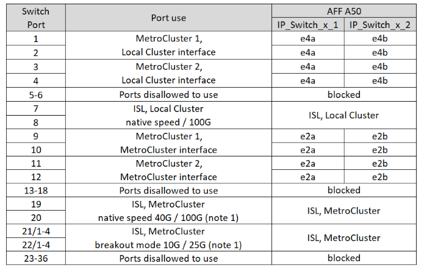
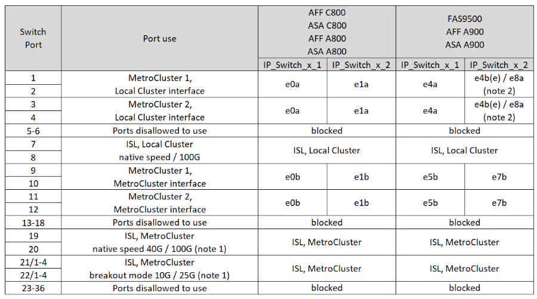

= Asignaciones de puertos de plataforma para conmutadores Cisco 9336C-FX2 de 12 puertos en una configuración IP de MetroCluster
:allow-uri-read: 
:icons: font
:imagesdir: ../media/

[role="lead"]
El uso del puerto en una configuración IP de MetroCluster depende del modelo del switch y el tipo de plataforma.

Revise las siguientes consideraciones antes de utilizar las tablas de configuración:

* Las tablas de esta sección son para conmutadores Cisco 9336C-FX2 de 12 puertos.
+
Si tiene un conmutador Cisco 9336C-FX2 de 36 puertos que no se conecta a los estantes NS224, utilice las tablas en link:port_usage_3232c_9336c.html["Asignaciones de puertos de plataforma para conmutadores Cisco 3232C o Cisco 9336C-FX2 de 36 puertos"] .

+
Si tiene un conmutador Cisco 9336C-FX2 de 36 puertos y al menos una configuración de MetroCluster o un grupo de DR está conectando estantes NS224 al conmutador MetroCluster, utilice las tablas en link:port_usage_9336c_shared.html["Asignaciones de puertos de plataforma para un conmutador Cisco 9336C-FX2 de 36 puertos que conecta el almacenamiento NS224"] .

NOTE: El conmutador Cisco 9336C-FX2 de 12 puertos no admite la conexión de estantes NS224 al conmutador MetroCluster.

* Las siguientes tablas muestran el uso del puerto para el sitio A. El mismo cableado se utiliza para el centro B.
* No se pueden configurar los conmutadores con puertos de diferentes velocidades (por ejemplo, una combinación de puertos de 100 Gbps y puertos de 40 Gbps).
* Si está configurando un único MetroCluster con los conmutadores, utilice el grupo de puertos *MetroCluster 1*.
+
Realice un seguimiento del grupo de puertos de MetroCluster (MetroCluster 1, MetroCluster 2). Lo necesitará al usar la herramienta RcfFileGenerator, como se describe más adelante en este procedimiento de configuración.

* El RcfFileGenerator para MetroCluster IP también proporciona una descripción general del cableado por puerto para cada switch.

== Elija la tabla de cableado correcta para su configuración

Utilice la siguiente tabla para determinar qué tabla de cableado debe seguir.

[cols="25,75"]
|===
| Si el sistema es... | Utilice esta tabla de cableado... 

| AFF A150, ASA A150 FAS500f AFF C250, ASA C250 AFF A250, ASA A250 | <<table_1_cisco_12port_9336c,Asignaciones de puertos de la plataforma Cisco 9336C-FX2 de 12 puertos (grupo 1)>> 

| AFF A20 | <<table_2_cisco_12port_9336c,Asignaciones de puertos de la plataforma Cisco 9336C-FX2 de 12 puertos (grupo 2)>> 

| AFF A30, AFF C30 FAS50 AFF C60  a| 
La tabla que siga depende de si está utilizando una tarjeta Ethernet 25G (grupo 3a) o 100g (grupo 3b).

* <<table_3a_cisco_12port_9336c,Asignaciones de puertos de la plataforma Cisco 9336C-FX2 de 12 puertos (grupo 3a - 25G)>>
* <<table_3b_cisco_12port_9336c,Asignaciones de puertos de la plataforma Cisco 9336C-FX2 de 12 puertos (grupo 3b - 100G)>>

| FAS8300, AFF C400, ASA C400, FAS8700 AFF A400, ASA A400 | <<table_4_cisco_12port_9336c,Asignaciones de puertos de la plataforma Cisco 9336C-FX2 de 12 puertos (grupo 4)>> 

| AFF A50 | <<table_5_cisco_12port_9336c,Asignaciones de puertos de la plataforma Cisco 9336C-FX2 de 12 puertos (grupo 5)>> 

| AFF C800, ASA C800, AFF A800, ASA A800 FAS9500, AFF A900, ASA A900 | <<table_6_cisco_12port_9336c,Asignaciones de puertos de la plataforma Cisco 9336C-FX2 de 12 puertos (grupo 6)>> 

| FAS70, AFF A70 AFF C80 FAS90, AFF A90 AFF A1K | <<table_7_cisco_12port_9336c,Asignaciones de puertos de la plataforma Cisco 9336C-FX2 de 12 puertos (grupo 7)>> 
|===
.Asignaciones de puertos de la plataforma Cisco 9336C-FX2 de 12 puertos (grupo 1)
Revise las asignaciones de puertos de la plataforma para cablear un sistema AFF A150, ASA A150, FAS500f, AFF C250, ASA C250, AFF A250 o ASA A250 a un conmutador Cisco 9336C-FX2 de 12 puertos:

image:../media/mccip-cabling-9336c-12-port-a150-fas500f-a250-c250.png["Muestra las asignaciones de puertos de la plataforma Cisco 9336C-FX2 de 12 puertos"]

Nota 1: Solo se pueden configurar los puertos 19 y 20 o 21 y 22. Si se usan primero los puertos 19 y 20, se bloquearán los puertos 21 y 22.

.Asignaciones de puertos de la plataforma Cisco 9336C-FX2 de 12 puertos (grupo 2)
Revise las asignaciones de puertos de la plataforma para cablear un sistema AFF A20 a un conmutador Cisco 9336C-FX2 de 12 puertos:

image:../media/mccip-cabling-9336c-12-port-a20.png["Muestra las asignaciones de puertos de la plataforma Cisco 9336C-FX2 de 12 puertos"]

Nota 1: Solo se pueden configurar los puertos 19 y 20 o 21 y 22. Si se usan primero los puertos 19 y 20, se bloquearán los puertos 21 y 22.

.Asignaciones de puertos de la plataforma Cisco 9336C-FX2 de 12 puertos (grupo 3a)
Revise las asignaciones de puertos de la plataforma para cablear un sistema AFF A30, AFF C30, AFF C60 o FAS50 a un conmutador Cisco 9336C-FX2 de 12 puertos usando una tarjeta Ethernet 25G de cuatro puertos.

NOTE: Esta configuración requiere una tarjeta Ethernet 25G de cuatro puertos en la ranura 4 para conectar el clúster local y las interfaces de alta disponibilidad.

image:../media/mccip-cabling-9336c-12-port-a30-c30-fas50-c60-25g.png["Muestra las asignaciones de puertos de la plataforma Cisco 9336C-FX2 de 12 puertos"]

Nota 1: Solo se pueden configurar los puertos 19 y 20 o 21 y 22. Si se usan primero los puertos 19 y 20, se bloquearán los puertos 21 y 22.

.Asignaciones de puertos de la plataforma Cisco 9336C-FX2 de 12 puertos (grupo 3b)
Revise las asignaciones de puertos de la plataforma para cablear un sistema AFF A30, AFF C30, AFF C60 o FAS50 a un conmutador Cisco 9336C-FX2 de 12 puertos usando una tarjeta Ethernet 100G de dos puertos.

NOTE: Esta configuración requiere una tarjeta Ethernet 100g de dos puertos en la ranura 4 para conectar el clúster local y las interfaces de alta disponibilidad.

image:../media/mccip-cabling-9336c-12-port-a30-c30-fas50-c60-100g.png["Muestra las asignaciones de puertos de la plataforma Cisco 9336C-FX2 de 12 puertos"]

Nota 1: Solo se pueden configurar los puertos 19 y 20 o 21 y 22. Si se usan primero los puertos 19 y 20, se bloquearán los puertos 21 y 22.

.Asignaciones de puertos de la plataforma Cisco 9336C-FX2 de 12 puertos (grupo 4)
Revise las asignaciones de puertos de la plataforma para cablear un sistema FAS8300, AFF C400, ASA C400, FAS8700, AFF A400 o ASA A400 a un conmutador Cisco 9336C-FX2 de 12 puertos:

image::../media/mccip-cabling-9336c-12-port-a400-c400-fas8300-fas8700.png[Muestra las asignaciones de puertos de la plataforma Cisco 9336C-FX2 de 12 puertos]

Nota 1: Solo se pueden configurar los puertos 19 y 20 o 21 y 22. Si se usan primero los puertos 19 y 20, se bloquearán los puertos 21 y 22.

.Asignaciones de puertos de la plataforma Cisco 9336C-FX2 de 12 puertos (grupo 5)
Revise las asignaciones de puertos de la plataforma para cablear un sistema AFF A50 a un conmutador Cisco 9336C-FX2 de 12 puertos:

Nota 1: Solo se pueden configurar los puertos 19 y 20 o 21 y 22. Si se usan primero los puertos 19 y 20, se bloquearán los puertos 21 y 22.

.Asignaciones de puertos de la plataforma Cisco 9336C-FX2 de 12 puertos (grupo 6)
Revise las asignaciones de puertos de la plataforma para cablear un sistema AFF C800, ASA C800, AFF A800, ASA A800, FAS9500, AFF A900 o ASA A900 a un conmutador Cisco 9336C-FX2 de 12 puertos:

Nota 1: Solo se pueden configurar los puertos 19 y 20 o 21 y 22. Si se usan primero los puertos 19 y 20, se bloquearán los puertos 21 y 22.

*Nota 2:* Utilice los puertos e4a y e4e o e4a y e8a si está usando un adaptador X91440A (40 Gbps). Use los puertos E4A y e4b o E4A y E8a si usa un adaptador de X91153A GbE (100Gbps).

.Asignaciones de puertos de la plataforma Cisco 9336C-FX2 de 12 puertos (grupo 7)
Revise las asignaciones de puertos de la plataforma para cablear un sistema AFF A70, FAS70, AFF C80, FAS90, AFF A90 o AFF A1K a un conmutador Cisco 9336C-FX2 de 12 puertos:

image:../media/mccip-cabling-9336c-12-port-fas70-a70-c80-fas90-a90-a1k.png["Muestra las asignaciones de puertos de la plataforma Cisco 9336C-FX2 de 12 puertos"]

Nota 1: Solo se pueden configurar los puertos 19 y 20 o 21 y 22. Si se usan primero los puertos 19 y 20, se bloquearán los puertos 21 y 22.
