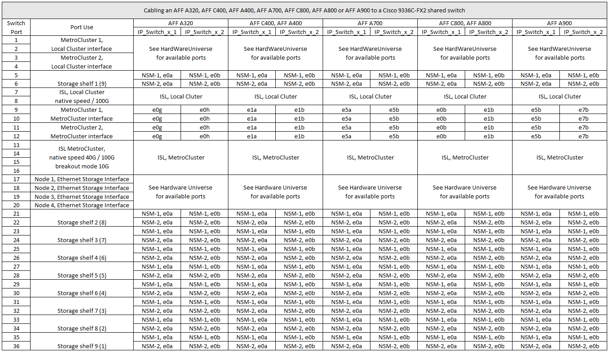

= Asignaciones de puertos de la plataforma para los switches Cisco 3232C o Cisco 9336C
:allow-uri-read: 
:icons: font
:imagesdir: ../media/

[role="lead"]
El uso del puerto en una configuración IP de MetroCluster depende del modelo del switch y el tipo de plataforma.

Revise estas consideraciones antes de utilizar las tablas:

* Las siguientes tablas muestran el uso del puerto para el sitio A. El mismo cableado se utiliza para el centro B.
* Los switches no pueden configurarse con puertos de diferentes velocidades (por ejemplo, una combinación de puertos de 100 Gbps y puertos de 40 Gbps).
* Si está configurando un único MetroCluster con los conmutadores, utilice el grupo de puertos *MetroCluster 1*.
+
Realizar un seguimiento del grupo de puertos de MetroCluster (MetroCluster 1, MetroCluster 2 o MetroCluster 3). Lo necesitará cuando utilice la herramienta RcfFileGenerator como se describe más adelante en este procedimiento de configuración.

* El RcfFileGenerator para MetroCluster IP también proporciona una descripción general del cableado por puerto para cada switch.
+
Utilice esta información general sobre el cableado para verificar el cableado.

== Cableado de dos configuraciones de MetroCluster a los switches

Al cablear más de una configuración MetroCluster a un switch Cisco 3132Q-V, debe cablear cada MetroCluster según la tabla correspondiente. Por ejemplo, si se realiza el cableado de un sistema FAS2750 y un A700 de AFF al mismo switch Cisco 3132Q-V. A continuación, cablee FAS2750 como "MetroCluster 1" en la Tabla 1, y el AFF A700 según "MetroCluster 2" o "MetroCluster 3" en la Tabla 2. No puede conectar físicamente el sistema FAS2750 y el AFF A700 como "MetroCluster 1".

== Cableado de un switch AFF A150, FAS2750, AFF A220, FAS500f, AFF C250 o AFF A250 a un Cisco 3232C o 9336-FX2C de Cisco

image::../media/mcc_ip_cabling_a150_a220_a250_to_a_cisco_3232c_or_cisco_9336c_switch.png[cableado ip de mcc a150 a220 a250 a un switch cisco 3232c o cisco 9336c]

== Cableado de un FAS8200 o un AFF A300 a un switch Cisco 3232C o Cisco 9336C

image::../media/mcc_ip_cabling_a_aff_a300_or_fas8200_to_a_cisco_3232c_or_cisco_9336c_switch.png[cableado ip de mcc un switch AFF a300 o fas8200 a cisco 3232c o cisco 9336c]

== Cableado de un AFF A320, FAS8300, AFF C400, AFF A400, FAS8700, FAS9000, AFF A700, AFF C800, AFF A800, FAS9500 o AFF A900

image::../media/mcc_ip_cabling_a320_a400_a700_a800_a900 _cisco_3232C or_9336c_switch.png[Cableado ip del mcc a320 a400 a700 a800 a900 Cisco 3232C o switch 9336c]

== Cableado de un dispositivo AFF A320, AFF C400, AFF A400, AFF A700, AFF C800 O A800 de AFF a un switch compartido de Cisco 9336C-FX2

