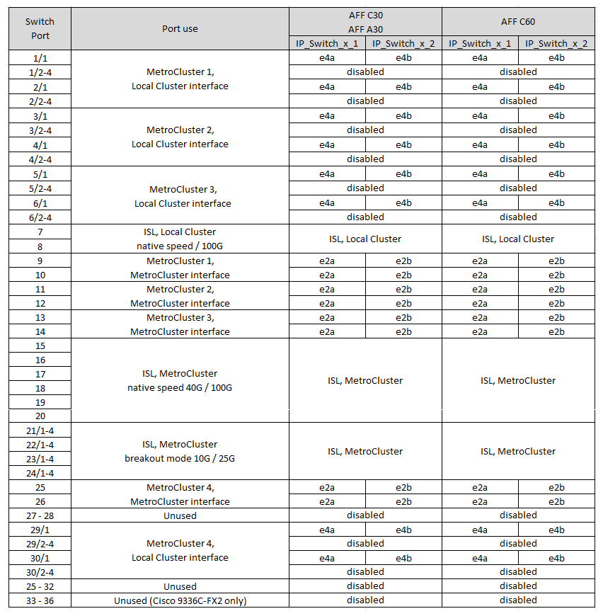
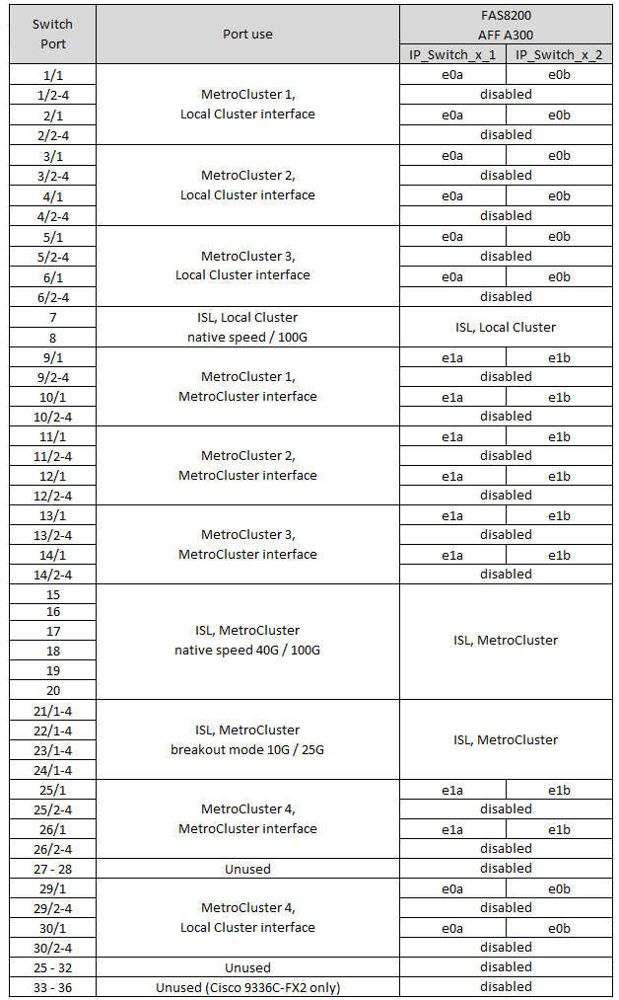

= Asignaciones de puertos de la plataforma para los switches Cisco 3232C o Cisco 9336C
:allow-uri-read: 
:icons: font
:imagesdir: ../media/

[role="lead"]
El uso del puerto en una configuración IP de MetroCluster depende del modelo del switch y el tipo de plataforma.

Revise las siguientes consideraciones antes de utilizar las tablas de configuración:

* Las siguientes tablas muestran el uso del puerto para el sitio A. El mismo cableado se utiliza para el centro B.
* Los switches no pueden configurarse con puertos de diferentes velocidades (por ejemplo, una combinación de puertos de 100 Gbps y puertos de 40 Gbps).
* Si está configurando un único MetroCluster con los conmutadores, utilice el grupo de puertos *MetroCluster 1*.
+
Realice un seguimiento del grupo de puertos MetroCluster (MetroCluster 1, MetroCluster 2, MetroCluster 3 o MetroCluster 4). Lo necesitará cuando utilice la herramienta RcfFileGenerator como se describe más adelante en este procedimiento de configuración.

* El RcfFileGenerator para MetroCluster IP también proporciona una descripción general del cableado por puerto para cada switch.
+
Utilice esta información general sobre el cableado para verificar el cableado.

* Se necesita la versión v2,10 o posterior del archivo RCF para el modo de desglose 25G para los ISL de MetroCluster.
* Se necesitan ONTAP 9.13.1 o posterior y la versión 2,00 del archivo RCF para utilizar una plataforma distinta de FAS8200 o AFF A300 en el grupo «MetroCluster 4».

NOTE: La versión del archivo RCF es diferente a la versión de la herramienta RCFfilegenerator utilizada para generar el archivo. Por ejemplo, puede generar un archivo RCF versión 2,00 utilizando RCFfilegenerator v1,6c.

== Cableado de dos configuraciones de MetroCluster a los switches

Al cablear más de una configuración MetroCluster a un switch Cisco 3132Q-V, debe cablear cada MetroCluster según la tabla correspondiente. Por ejemplo, si se realiza el cableado de un sistema FAS2750 y un A700 de AFF al mismo switch Cisco 3132Q-V. A continuación, cablee FAS2750 como "MetroCluster 1" en la Tabla 1, y el AFF A700 según "MetroCluster 2" o "MetroCluster 3" en la Tabla 2. No puede conectar físicamente el sistema FAS2750 y el AFF A700 como "MetroCluster 1".

== Elija la tabla de cableado correcta para su configuración

Utilice la siguiente tabla para determinar qué tabla de cableado debe seguir.

[cols="2*"]
|===
| Si el sistema es... | Utilice esta tabla de cableado... 

| AFF A150, ASA A150, FAS2750, AFF A220 FAS500f, AFF C250, ASA C250, AFF A250, ASA A250 | <<table_1_cisco_3232c_9336c,Asignaciones de puertos de la plataforma Cisco 3232C o Cisco 9336C (grupo 1)>> 

| AFF A20 | <<table_2_cisco_3232c_9336c,Asignaciones de puertos de la plataforma Cisco 3232C o Cisco 9336C (grupo 2)>> 

| AFF A30, AFF C30 AFF C60 | <<table_3_cisco_3232c_9336c,Asignaciones de puertos de la plataforma Cisco 3232C o Cisco 9336C (grupo 3)>> 

| FAS8200, AFF A300 | <<table_4_cisco_3232c_9336c,Asignaciones de puertos de la plataforma Cisco 3232C o Cisco 9336C (grupo 4)>> 

| AFF A320 FAS8300, AFF C400, ASA C400, FAS8700 AFF A400, ASA A400 | <<table_5_cisco_3232c_9336c,Asignaciones de puertos de la plataforma Cisco 3232C o Cisco 9336C (grupo 5)>> 

| AFF A50 | <<table_6_cisco_3232c_9336c,Asignaciones de puertos de la plataforma Cisco 3232C o Cisco 9336C (grupo 6)>> 

| FAS9000, AFF A700 AFF C800, ASA C800, AFF A800, ASA A800 FAS9500, AFF A900, ASA A900 | <<table_7_cisco_3232c_9336c,Asignaciones de puertos de la plataforma Cisco 3232C o Cisco 9336C (grupo 7)>> 

| FAS70, AFF A70 AFF C80 FAS90, AFF A90 AFF A1K | <<table_8_cisco_3232c_9336c,Asignaciones de puertos de la plataforma Cisco 3232C o Cisco 9336C (grupo 8)>> 
|===
.Asignaciones de puertos de la plataforma Cisco 3232C o Cisco 9336C (grupo 1)
Revise las asignaciones de puertos de plataforma para cablear un AFF A150, ASA A150, FAS2750, AFF A220, FAS500f, sistema AFF C250, ASA C250, AFF A250 o ASA A250 a un switch Cisco 3232C o 9336C:

image:../media/mcc-ip-cabling-a150-a220-a250-to-a-cisco-3232c-or-cisco-9336c-switch-9161.png["Muestra asignaciones de puertos de la plataforma Cisco 3232C o Cisco 9336C"]

.Asignaciones de puertos de la plataforma Cisco 3232C o Cisco 9336C (grupo 2)
Revise las asignaciones de puertos de plataforma para cablear un sistema AFF A20 a un switch Cisco 3232C o 9336C: image:../media/mcc-ip-cabling-aff-a20-9161.png["Muestra asignaciones de puertos de la plataforma Cisco 3232C o Cisco 9336C"]

.Asignaciones de puertos de la plataforma Cisco 3232C o Cisco 9336C (grupo 3)
Revise las asignaciones de puertos de plataforma para cablear un sistema AFF A30, AFF C30 o AFF C60 a un switch Cisco 3232C o 9336C:

.Asignaciones de puertos de la plataforma Cisco 3232C o Cisco 9336C (grupo 4)
Revise las asignaciones de puertos de plataforma para cablear un sistema FAS8200 o AFF A300 a un switch Cisco 3232C o 9336C:

Si va a realizar una actualización desde archivos RCF anteriores, es posible que la configuración de cableado esté utilizando puertos del grupo «MetroCluster 4» (puertos 25/26 y 29/30).

.Asignaciones de puertos de la plataforma Cisco 3232C o Cisco 9336C (grupo 5)
Revise las asignaciones de puertos de plataforma para cablear un AFF A320, FAS8300, AFF C400, ASA C400, FAS8700, sistema AFF A400 o ASA A400 a un switch Cisco 3232C o 9336C:

image::../media/mcc_ip_cabling_a320_a400_cisco_3232C_or_9336c_switch.png[Muestra asignaciones de puertos de la plataforma Cisco 3232C o Cisco 9336C]

NOTE: El uso de puertos en el grupo «MetroCluster 4» requiere ONTAP 9.13.1 o posterior.

.Asignaciones de puertos de la plataforma Cisco 3232C o Cisco 9336C (grupo 6)
Revise las asignaciones de puertos de plataforma para cablear un sistema AFF A50 a un switch Cisco 3232C o 9336C:

image::../media/mcc-ip-cabling-aff-a50-cisco-3232c-9336c-9161.png[Muestra asignaciones de puertos de la plataforma Cisco 3232C o Cisco 9336C]

.Asignaciones de puertos de la plataforma Cisco 3232C o Cisco 9336C (grupo 7)
Revise las asignaciones de puertos de plataforma al cable A FAS9000, AFF A700, AFF C800, ASA C800, AFF A800, sistema ASA A800, FAS9500, AFF A900 o ASA A900 a un switch Cisco 3232C o 9336C:

image::../media/mcc_ip_cabling_fas9000_a700_fas9500_a800_a900_cisco_3232C_or_9336c_switch.png[Muestra asignaciones de puertos de la plataforma Cisco 3232C o Cisco 9336C]

*Nota 1*: Utilice los puertos E4A y E4E o E4A y E8a si utiliza un adaptador X91440A (40Gbps). Use los puertos E4A y e4b o E4A y E8a si usa un adaptador de X91153A GbE (100Gbps).

NOTE: El uso de puertos en el grupo «MetroCluster 4» requiere ONTAP 9.13.1 o posterior.

.Asignaciones de puertos de la plataforma Cisco 3232C o Cisco 9336C (grupo 8)
Revise las asignaciones de puertos de plataforma para cablear un sistema AFF A70, FAS70, AFF C80, FAS90, AFF A90 o AFF A1K a un switch Cisco 3232C o 9336C:

image:../media/mcc-ip-cabling-a90-fas90-c80-fas70-a70-a1k-cisco-3232C-or-9336c-switch.png["Muestra asignaciones de puertos de la plataforma Cisco 3232C o Cisco 9336C"]
