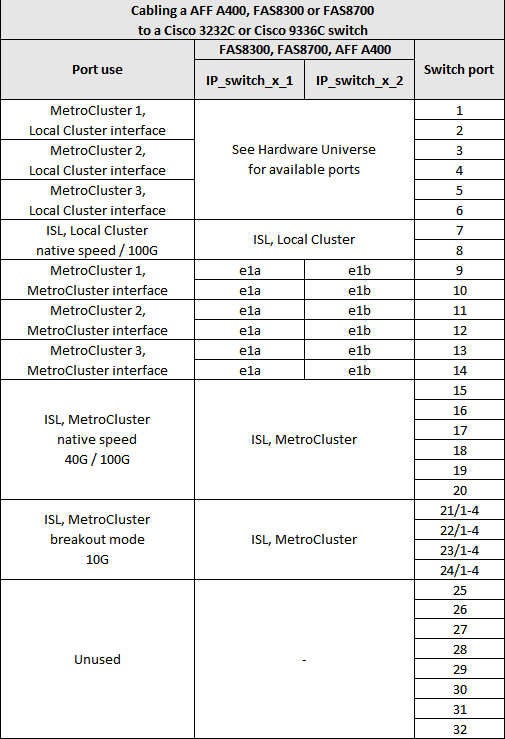

= Asignaciones de puertos de la plataforma para los switches Cisco 3232C o Cisco 9336C
:allow-uri-read: 
:icons: font
:imagesdir: ../media/

[role="lead"]
El uso del puerto en una configuración IP de MetroCluster depende del modelo del switch y el tipo de plataforma.

Revise estas consideraciones antes de utilizar las tablas:

* Las siguientes tablas muestran el uso del puerto para el sitio A. El mismo cableado se utiliza para el centro B.
* Los switches no pueden configurarse con puertos de diferentes velocidades (por ejemplo, una combinación de puertos de 100 Gbps y puertos de 40 Gbps).
* Si está configurando un único MetroCluster con los conmutadores, utilice el grupo de puertos *MetroCluster 1*.
+
Realizar un seguimiento del grupo de puertos de MetroCluster (MetroCluster 1, MetroCluster 2 o MetroCluster 3). Lo necesitará cuando utilice la herramienta RcfFileGenerator como se describe más adelante en este procedimiento de configuración.

* El RcfFileGenerator para MetroCluster IP también proporciona una descripción general del cableado por puerto para cada switch.
+
Utilice esta información general sobre el cableado para verificar el cableado.

== Cableado de dos configuraciones de MetroCluster a los switches

Al cablear más de una configuración MetroCluster a un switch Cisco 3132Q-V, conecte cada MetroCluster según la tabla correspondiente. Por ejemplo, si se conecta un FAS2750 y un A700 al mismo switch Cisco 3132Q-V. A continuación, cablee FAS2750 como "MetroCluster 1" en la Tabla 1 y el A700 como "MetroCluster 2" o "MetroCluster 3" en la Tabla 2. No puede conectar físicamente el sistema FAS2750 y A700 como "MetroCluster 1".

== Cableado de un sistema FAS2750 o AFF A220 a un switch Cisco 3232C o Cisco 9336C

image::../media/mcc_ip_cabling_an_aff_a220_or_fas2750_to_a_cisco_3232c_or_cisco_9336c_switch.png[mcc: cableado ip de un AFF a220 o fas2750 a un switch cisco 3232c o cisco 9336c]

== Cableado de un AFF A300 o FAS8200 a un switch Cisco 3232C o Cisco 9336C

image::../media/mcc_ip_cabling_a_aff_a300_or_fas8200_to_a_cisco_3232c_or_cisco_9336c_switch.png[cableado ip de mcc un switch AFF a300 o fas8200 a cisco 3232c o cisco 9336c]

== Cableado de un switch AFF A250 o FAS500f a un Cisco 3232C o Cisco 9336C

image::../media/mcc_ip_cabling_an_aff_a250_or_fas500f_to_a_cisco_3232c_or_cisco_9336c_switch.png[mcc: cableado ip de un AFF a250 o fas500f a un switch cisco 3232c o cisco 9336c]

== Cableado de un dispositivo AFF A320 a un switch Cisco 3232C o Cisco 9336C

image::../media/cabling_a_aff_a320_to_a_cisco_3232c_or_cisco_9336c_switch.png[cableado de un dispositivo AFF a320 a un switch cisco 3232c o cisco 9336c]

== Cableado de un switch AFF A400, FAS8300 o FAS8700 a un switch Cisco 3232C o Cisco 9336C

== Cableado de un A700 o FAS9000 de AFF a un switch Cisco 3232C o Cisco 9336C

image::../media/mcc_ip_cabling_a_aff_a700_or_fas9000_to_a_cisco_3232c_or_cisco_9336c_switch.png[cableado ip de mcc un AFF a700 o fas9000 a un switch cisco 3232c o cisco 9336c]

== Cableado de un A800 de AFF a un switch Cisco 3232C o Cisco 9336C

== Cableado de un switch AFF A900 o FAS9500 a un Cisco 3232C o Cisco 9336C

NOTE: Tiene la opción de usar los puertos e5a y e7a como LIF de interconexión de clústeres en una configuración IP de MetroCluster.

image:../media/cabling_an_aff_a900_or_FAS9500_to_a_cisco_3232c_or_cisco_9336c_switch.png[""]

== Cableado de un switch compartido AFF A320, AFF A400, AFF A700 o AFF A800 a un switch compartido Cisco 9336C-FX2

image::../media/mcc_ip_cabling_aff_a320_a400_a700_a800_to_cisco_9336c_shared_switch.png[cableado ip de mcc AFF a320 a400 a700 a800 al switch compartido de cisco 9336c]

image::../media/mcc_interfaces_per_platform_9336-shared.png[interfaces mcc por plataforma 9336 compartida]
