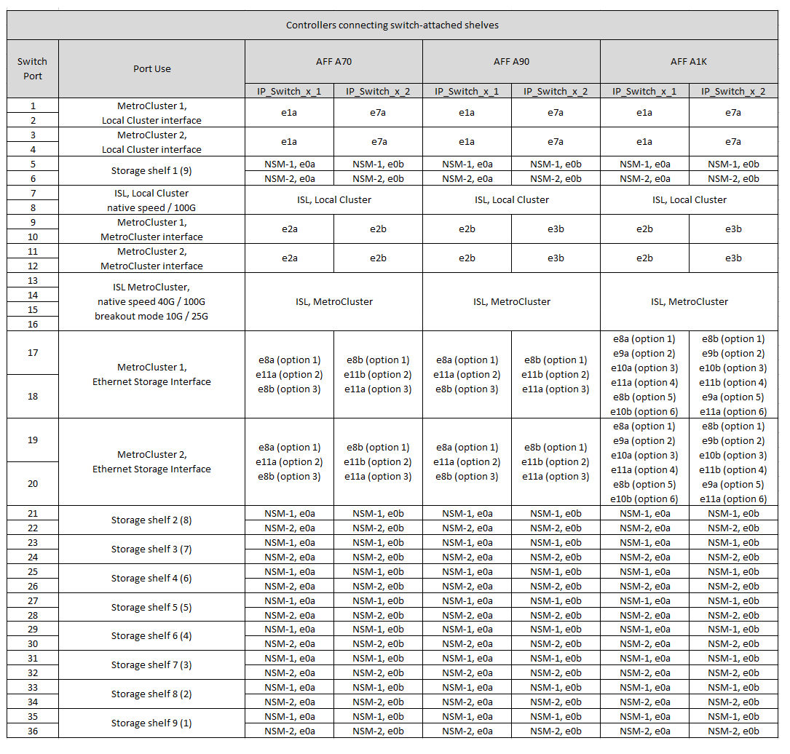

= Asignaciones de puertos de plataforma para un switch compartido Cisco 9336C-FX2
:allow-uri-read: 
:icons: font
:imagesdir: ../media/

[role="lead"]
El uso del puerto en una configuración IP de MetroCluster depende del modelo del switch y el tipo de plataforma.

Revise estas consideraciones antes de utilizar las tablas:

* Al menos un grupo de recuperación de desastres o configuración MetroCluster debe admitir las bandejas NS224 conectadas a switches.
* Las plataformas que no admiten bandejas NS224 conectadas a switches solo pueden conectarse como segunda configuración de MetroCluster o como segundo grupo de recuperación ante desastres.
* RcfFileGenerator solo muestra plataformas elegibles cuando se selecciona la primera plataforma.
* Para conectar una configuración MetroCluster de ocho o dos nodos se requiere ONTAP 9.14.1 o una versión posterior.

== Elija la tabla de cableado correcta para su configuración

Revise la tabla de asignaciones de puertos correcta para la configuración. Hay dos conjuntos de tablas de cableado en esta sección:

* <<tables_connecting_ns224,Tablas de cableado para las controladoras que se conectan a bandejas NS224 conectadas a switches>>
* <<tables_not_connecting_ns224,Las tablas de cableado para las controladoras no se conectan a las bandejas NS224 conectadas al switch>>

=== Controladoras conectadas a bandejas NS224 conectadas a switches

Determine qué tabla de asignación de puertos se debe seguir para la conexión de controladoras a bandejas NS224 conectadas a switches.

[cols="2*"]
|===
| Plataforma | Utilice esta tabla de cableado... 

| AFF A320 AFF C400, ASA C400 AFF A400, ASA A400 | <<table_1_cisco_9336c_fx2,Asignaciones de puertos de plataforma de switch compartido Cisco 9336C-FX2 (grupo 1)>> 

| AFF A700 AFF C800, ASA C800, AFF A800 AFF A900, ASA A900 | <<table_2_cisco_9336c_fx2,Asignaciones de puertos de plataforma de switch compartido Cisco 9336C-FX2 (grupo 2)>> 

| AFF A90 AFF A70 AFF A1K *Nota:* Estos sistemas requieren ONTAP 9.15.1 o posterior. | <<table_3_cisco_9336c_fx2,Asignaciones de puertos de plataforma de switch compartido Cisco 9336C-FX2 (grupo 3)>> 
|===
.Asignaciones de puertos de plataforma de switch compartido Cisco 9336C-FX2 (grupo 1)
Revise las asignaciones de puertos de plataforma para conectar el cable de un sistema AFF A320, AFF C400, ASA C400, AFF A400 o ASA A400 que está conectando bandejas NSS24 conectadas a switches a un switch compartido Cisco 9336C-FX2:

image::../media/mcc_ip_cabling_a320_c400_a400_to_cisco_9336c_shared_switch.png[Muestra las asignaciones de puertos de la plataforma de switches compartidos Cisco 9336C-FX2]

*Nota 1*: Si utiliza un adaptador X91440A (40Gbps), utilice los puertos E4A y E4E o E4A y E8a. Si usa un adaptador de X91153A (100Gbps), utilice los puertos E4A y e4b o E4A y E8a.

.Asignaciones de puertos de plataforma de switch compartido Cisco 9336C-FX2 (grupo 2)
Revise las asignaciones de puertos de plataforma para cablear un AFF A700, AFF C800, ASA C800, AFF A800, AFF A900, o sistema ASA A900 que conecta bandejas NSS24 conectadas a switches a un switch compartido Cisco 9336C-FX2:

image::../media/mcc_ip_cabling_a700_c800_a800_a900_to_cisco_9336c_shared_switch.png[Muestra las asignaciones de puertos de la plataforma de switches compartidos Cisco 9336C-FX2]

*Nota 1*: Si utiliza un adaptador X91440A (40Gbps), utilice los puertos E4A y E4E o E4A y E8a. Si usa un adaptador de X91153A (100Gbps), utilice los puertos E4A y e4b o E4A y E8a.

.Asignaciones de puertos de plataforma de switch compartido Cisco 9336C-FX2 (grupo 3)
Revise las asignaciones de puertos de plataforma para conectar el cable de un sistema AFF A90, AFF A70 o AFF A1K que está conectando bandejas NSS24 conectadas a switches a un switch compartido Cisco 9336C-FX2:

NOTE: Los sistemas de esta tabla requieren ONTAP 9.15.1 o posterior.

Para un clúster conectado a switches, los puertos de clúster idénticos en los nodos AFF A90 o AFF A70 deben estar en el mismo switch. Por ejemplo, e1a en node1 y e1a en node2 deben conectarse a un switch de clúster. De igual forma, el segundo puerto de clúster de ambos nodos debe conectarse al segundo switch de clúster. La conexión cruzada de los puertos HA de cluster compartido, donde e1a de node1 está conectado a IP_Switch_x_1 y e1a de node2 está conectado a IP_Switch_x_2, evita el fallo de comunicación de alta disponibilidad.

=== Las controladoras no se conectan a las bandejas NS224 conectadas a switches

Determine qué tabla de asignación de puertos se debe seguir para controladoras que no se conectan a bandejas NS224 conectadas a switches.

[cols="2*"]
|===
| Plataforma | Utilice esta tabla de cableado... 

| AFF A150, ASA A150 FAS2750, AFF A220 | <<table_4_cisco_9336c_fx2,Asignaciones de puertos de plataforma de switch compartido Cisco 9336C-FX2 (grupo 4)>> 

| FAS500f AFF C250, ASA C250 AFF A250, ASA A250 | <<table_5_cisco_9336c_fx2,Asignaciones de puertos de plataforma de switch compartido Cisco 9336C-FX2 (grupo 5)>> 

| FAS8200, AFF A300 | <<table_6_cisco_9336c_fx2,Asignaciones de puertos de plataforma de switch compartido Cisco 9336C-FX2 (grupo 6)>> 

| AFF A320 FAS8300, AFF C400, ASA C400, FAS8700 AFF A400, ASA A400 | <<table_7_cisco_9336c_fx2,Asignaciones de puertos de plataforma de switch compartido Cisco 9336C-FX2 (grupo 7)>> 

| FAS9000, AFF A700 AFF C800, ASA C800, AFF A800, ASA A800 FAS9500, AFF A900, ASA A900 | <<table_8_cisco_9336c_fx2,Asignaciones de puertos de plataforma de switch compartido Cisco 9336C-FX2 (grupo 8)>> 

| AFF A70 AFF A90 AFF A1K *Nota:* Estos sistemas requieren ONTAP 9.15.1 o posterior. | <<table_9_cisco_9336c_fx2,Asignaciones de puertos de plataforma de switch compartido Cisco 9336C-FX2 (grupo 9)>> 
|===
.Asignaciones de puertos de plataforma de switch compartido Cisco 9336C-FX2 (grupo 4)
Revise las asignaciones de puertos de plataforma para cablear un sistema AFF A150, ASA A150, FAS2750 o AFF A220 que no esté conectando bandejas NSS24 conectadas a switches a un switch compartido Cisco 9336C-FX2:

image::../media/mcc-ip-cabling-a-aff-a150-asa-a150-fas2750-aff-a220-to-a-cisco-9336c-shared-switch.png[Muestra las asignaciones de puertos de la plataforma de switches compartidos Cisco 9336C-FX2]

.Asignaciones de puertos de plataforma de switch compartido Cisco 9336C-FX2 (grupo 5)
Revise las asignaciones de puertos de plataforma al cable un sistema FAS500f, AFF C250, ASA C250, AFF A250 o ASA A250 que no conecta bandejas NSS24 conectadas a switches a un switch compartido Cisco 9336C-FX2:

image::../media/mcc-ip-cabling-c250-asa-c250-a250-asa-a250-to-cisco-9336c-shared-switch.png[Muestra las asignaciones de puertos de la plataforma de switches compartidos Cisco 9336C-FX2]

.Asignaciones de puertos de plataforma de switch compartido Cisco 9336C-FX2 (grupo 6)
Revise las asignaciones de puertos de plataforma para cablear un sistema FAS8200 o AFF A300 que no esté conectando bandejas NSS24 conectadas a switches a un switch compartido Cisco 9336C-FX2:

image::../media/mcc-ip-cabling-fas8200-affa300-to-cisco-9336c-shared-switch.png[Muestra las asignaciones de puertos de la plataforma de switches compartidos Cisco 9336C-FX2]

.Asignaciones de puertos de plataforma de switch compartido Cisco 9336C-FX2 (grupo 7)
Revise las asignaciones de puertos de plataforma para cablear un AFF A320, FAS8300, AFF C400, ASA C400, FAS8700, sistema AFF A400 o ASA A400 que no conecta bandejas NSS24 conectadas a switches a un switch compartido Cisco 9336C-FX2:

image::../media/mcc_ip_cabling_a320_fas8300_a400_fas8700_to_a_cisco_9336c_shared_switch.png[Muestra las asignaciones de puertos de la plataforma de switches compartidos Cisco 9336C-FX2]

*Nota 1*: Si utiliza un adaptador X91440A (40Gbps), utilice los puertos E4A y E4E o E4A y E8a. Si usa un adaptador de X91153A (100Gbps), utilice los puertos E4A y e4b o E4A y E8a.

.Asignaciones de puertos de plataforma de switch compartido Cisco 9336C-FX2 (grupo 8)
Revise las asignaciones de puertos de plataforma al cable A FAS9000, AFF A700, AFF C800, ASA C800, AFF A800, sistema ASA A800, FAS9500, AFF A900 o ASA A900 que no está conectando bandejas NSS24 conectadas a switches a un switch compartido Cisco 9336C-FX2:

image::../media/mcc_ip_cabling_a700_a800_fas9000_fas9500_to_cisco_9336c_shared_switch.png[Muestra las asignaciones de puertos de la plataforma de switches compartidos Cisco 9336C-FX2]

*Nota 1*: Si utiliza un adaptador X91440A (40Gbps), utilice los puertos E4A y E4E o E4A y E8a. Si usa un adaptador de X91153A (100Gbps), utilice los puertos E4A y e4b o E4A y E8a.

.Asignaciones de puertos de plataforma de switch compartido Cisco 9336C-FX2 (grupo 9)
Revise las asignaciones de puertos de plataforma para cablear un sistema AFF A70, AFF A90 o AFF A1K que no conecte bandejas NSS24 conectadas a switches a un switch compartido Cisco 9336C-FX2:

NOTE: Los sistemas de esta tabla requieren ONTAP 9.15.1 o posterior.

image::../media/mcc_ip_cabling_a70_a90_a1k_to_no_shelves_cisco_9336c_shared_switch.png[Muestra las asignaciones de puertos de la plataforma de switches compartidos Cisco 9336C-FX2]
