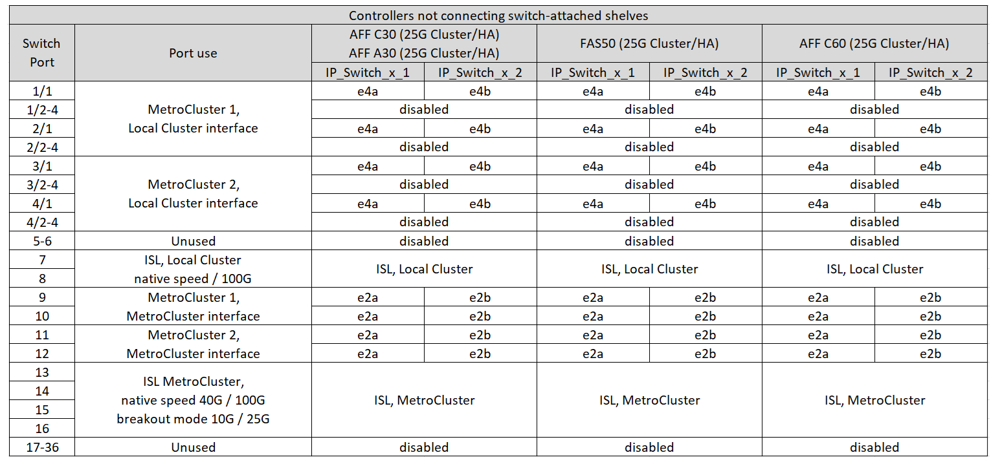
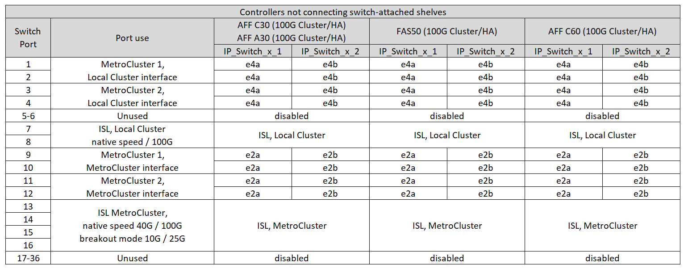
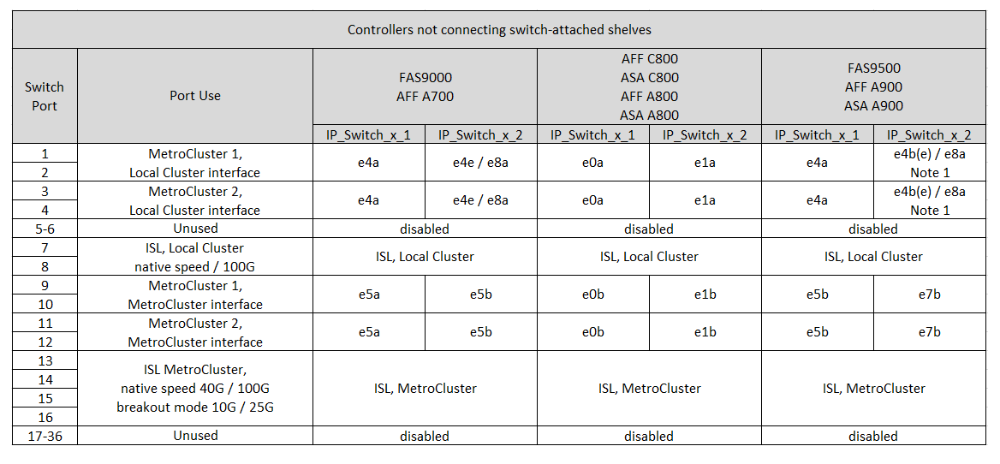

= Asignaciones de puertos de plataforma para un conmutador Cisco 9336C-FX2 de 36 puertos que conecta el almacenamiento NS224 en una configuración IP de MetroCluster
:allow-uri-read: 
:icons: font
:imagesdir: ../media/

[role="lead"]
El uso del puerto en una configuración IP de MetroCluster depende del modelo del switch y el tipo de plataforma.

Revise las siguientes consideraciones antes de utilizar las tablas de configuración:

* Las tablas de esta sección son para conmutadores Cisco 9336C-FX2 de 36 puertos cuando al menos una configuración de MetroCluster o un grupo DR conecta estantes NS224 al conmutador MetroCluster.
+
Si tiene un conmutador Cisco 9336C-FX2 de 36 puertos que no se conecta al almacenamiento NS224, utilice las tablas en link:port_usage_3232c_9336c.html["Asignaciones de puertos de plataforma para conmutadores Cisco 3232C o Cisco 9336C-FX2 de 36 puertos"] .

+
Si tiene un conmutador Cisco 9336C-FX2 de 12 puertos, utilice las tablas en link:port-usage-9336c-fx-2-12-port.html["Asignaciones de puertos de plataforma para conmutadores Cisco 9336C-FX2 de 12 puertos"] .

+

NOTE: El conmutador Cisco 9336C-FX2 de 12 puertos no admite la conexión de estantes NS224 al conmutador MetroCluster.

* Al cablear un switch Cisco 9336C-FX2 que conecta un almacenamiento NS224, solo se pueden tener dos configuraciones de MetroCluster o grupos de recuperación ante desastres (DR). Al menos una configuración de MetroCluster o un grupo de DR debe conectar estanterías NS224 al switch MetroCluster. Solo se pueden conectar plataformas que no conecten estanterías NS224 conectadas al switch como una segunda configuración de MetroCluster o como un segundo grupo de DR.
+
Si su segundo MetroCluster o grupo DR no conecta los estantes NS224 al conmutador MetroCluster, siga las instrucciones <<tables_not_connecting_ns224,Tablas de cableado para controladores que no se conectan a los estantes NS224 conectados al interruptor>> .

* RcfFileGenerator solo muestra plataformas elegibles cuando se selecciona la primera plataforma.
* Para conectar una configuración MetroCluster de ocho o dos nodos se requiere ONTAP 9.14.1 o una versión posterior.

== Elija la tabla de cableado correcta para su configuración

Revise la tabla de asignaciones de puertos correcta para la configuración. Hay dos conjuntos de tablas de cableado en esta sección:

* <<tables_connecting_ns224,Tablas de cableado para controladoras que conectan bandejas NS224 conectadas a switches>>
* <<tables_not_connecting_ns224,Las tablas de cableado para las controladoras no conectan las bandejas NS224 conectadas al switch>>

=== Controladoras conectando bandejas NS224 conectadas a switches

Determine qué tabla de asignación de puertos se debe seguir para las controladoras que conectan bandejas NS224 conectadas a switches.

[cols="25,75"]
|===
| Plataforma | Utilice esta tabla de cableado... 

| AFF C30, AFF A30 AFF C60  a| 
La tabla que siga depende de si está utilizando una tarjeta Ethernet 25G (grupo 1a) o 100g (grupo 1b).

* <<table_1a_cisco_9336c_fx2,Switch Cisco 9336C-FX2 que conecta asignaciones de puertos de plataforma de almacenamiento de NS224 GbE (grupo 1a - 25G)>>
* <<table_1b_cisco_9336c_fx2,Switch Cisco 9336C-FX2 que conecta asignaciones de puertos de plataforma de almacenamiento de NS224 GbE (grupo 1b - 100g)>>

| AFF A320 AFF C400, ASA C400 AFF A400, ASA A400 | <<table_2_cisco_9336c_fx2,Switch Cisco 9336C-FX2 que conecta asignaciones de puertos de plataforma de almacenamiento de NS224 (grupo 2)>> 

| AFF A50 | <<table_3_cisco_9336c_fx2,Switch Cisco 9336C-FX2 que conecta asignaciones de puertos de plataforma de almacenamiento de NS224 (grupo 3)>> 

| AFF A700 AFF C800, ASA C800, AFF A800 AFF A900, ASA A900 | <<table_4_cisco_9336c_fx2,Switch Cisco 9336C-FX2 que conecta asignaciones de puertos de plataforma de almacenamiento de NS224 (grupo 4)>> 

| AFF A70 AFF C80 AFF A90 AFF A1K | <<table_5_cisco_9336c_fx2,Switch Cisco 9336C-FX2 que conecta asignaciones de puertos de plataforma de almacenamiento de NS224 (grupo 5)>> 
|===
.Switch Cisco 9336C-FX2 que conecta asignaciones de puertos de plataforma de almacenamiento de NS224 (grupo 1a)
Revise las asignaciones de puertos de plataforma para conectar el cable de un sistema AFF A30, AFF C30 o AFF C60 que está conectando bandejas NSS24 conectadas al switch a un switch Cisco 9336C-FX2 mediante una tarjeta Ethernet 25G de cuatro puertos.

NOTE: Esta configuración requiere una tarjeta Ethernet 25G de cuatro puertos en la ranura 4 para conectar el clúster local y las interfaces de alta disponibilidad.

image:../media/mccip-cabling-greeley-connecting-a30-c30-fas50-c60-25G.png["La muestra el switch Cisco 9336C-FX2 que conecta asignaciones de puertos de plataforma de almacenamiento de NS224 GbE"]

.Switch Cisco 9336C-FX2 que conecta asignaciones de puertos de plataforma de almacenamiento de NS224 (grupo 1b)
Revise las asignaciones de puertos de plataforma para conectar el cable de un sistema AFF A30, AFF C30 o AFF C60 que está conectando bandejas NSS24 conectadas al switch a un switch Cisco 9336C-FX2 mediante una tarjeta Ethernet 100g DE dos puertos.

NOTE: Esta configuración requiere una tarjeta Ethernet 100g de dos puertos en la ranura 4 para conectar el clúster local y las interfaces de alta disponibilidad.

image:../media/mccip-cabling-greeley-connecting-a30-c30-fas50-c60-100G.png["La muestra el switch Cisco 9336C-FX2 que conecta asignaciones de puertos de plataforma de almacenamiento de NS224 GbE"]

.Switch Cisco 9336C-FX2 que conecta asignaciones de puertos de plataforma de almacenamiento de NS224 (grupo 2)
Revise las asignaciones de puertos de plataforma para conectar el cableado de un sistema AFF A320, AFF C400, ASA C400, AFF A400 o ASA A400 que esté conectando bandejas NSS24 conectadas a switches a un switch Cisco 9336C-FX2:

image::../media/mcc_ip_cabling_a320_c400_a400_to_cisco_9336c_shared_switch.png[La muestra el switch Cisco 9336C-FX2 que conecta asignaciones de puertos de plataforma de almacenamiento de NS224 GbE]

.Switch Cisco 9336C-FX2 que conecta asignaciones de puertos de plataforma de almacenamiento de NS224 (grupo 3)
Revise las asignaciones de puertos de plataforma para conectar el cableado de un sistema AFF A50 que está conectando bandejas NSS24 conectadas a switches a un switch Cisco 9336C-FX2:

image:../media/mccip-cabling-greeley-connecting-a50-updated.png["La muestra el switch Cisco 9336C-FX2 que conecta asignaciones de puertos de plataforma de almacenamiento de NS224 GbE"]

.Switch Cisco 9336C-FX2 que conecta asignaciones de puertos de plataforma de almacenamiento de NS224 (grupo 4)
Revise las asignaciones de puertos de plataforma para conectar los cables de un sistema AFF A700, AFF C800, ASA C800, AFF A800, AFF A900 o ASA A900 que esté conectando bandejas NSS24 conectadas a switches a un switch Cisco 9336C-FX2:

image:../media/mcc_ip_cabling_a700_c800_a800_a900_to_cisco_9336c_shared_switch.png["La muestra el switch Cisco 9336C-FX2 que conecta asignaciones de puertos de plataforma de almacenamiento de NS224 GbE"]

*Nota 1*: Utilice los puertos E4A y E4E o E4A y E8a si utiliza un adaptador X91440A (40Gbps). Use los puertos E4A y e4b o E4A y E8a si usa un adaptador de X91153A GbE (100Gbps).

.Switch Cisco 9336C-FX2 que conecta asignaciones de puertos de plataforma de almacenamiento de NS224 (grupo 5)
Revise las asignaciones de puertos de plataforma para conectar el cableado de un sistema AFF A70, AFF C80, AFF A90 o AFF A1K que conecta bandejas NSS24 conectadas al switch a un switch Cisco 9336C-FX2:

image::../media/mccip-cabling-greeley-connecting-a70-c80-a-90-fas90-a1k.png[La muestra el switch Cisco 9336C-FX2 que conecta asignaciones de puertos de plataforma de almacenamiento de NS224 GbE]

=== Las controladoras no conectan las bandejas NS224 conectadas a switches

Determine qué tabla de asignación de puertos se debe seguir para controladoras que no conectan bandejas NS224 conectadas a switches.

[cols="25,75"]
|===
| Plataforma | Utilice esta tabla de cableado... 

| AFF A150, ASA A150 FAS2750, AFF A220 | <<table_6_cisco_9336c_fx2,El switch Cisco 9336C-FX2 no conecta las asignaciones de puertos de plataforma de almacenamiento de NS224 (grupo 6)>> 

| AFF A20 | <<table_7_cisco_9336c_fx2,El switch Cisco 9336C-FX2 no conecta las asignaciones de puertos de plataforma de almacenamiento de NS224 (grupo 7)>> 

| FAS500f AFF C250, ASA C250 AFF A250, ASA A250 | <<table_8_cisco_9336c_fx2,El switch Cisco 9336C-FX2 no conecta las asignaciones de puertos de plataforma de almacenamiento de NS224 (grupo 8)>> 

| AFF C30, AFF A30 FAS50 AFF C60  a| 
La tabla que siga depende de si está utilizando una tarjeta Ethernet 25G (grupo 9a) o 100g (grupo 9b).

* <<table_9a_cisco_9336c_fx2,El switch Cisco 9336C-FX2 no conecta las asignaciones de puertos de plataforma de almacenamiento de NS224 (grupo 9a)>>
* <<table_9b_cisco_9336c_fx2,El switch Cisco 9336C-FX2 no conecta las asignaciones de puertos de plataforma de almacenamiento de NS224 (grupo 9b)>>

| FAS8200, AFF A300 | <<table_10_cisco_9336c_fx2,El switch Cisco 9336C-FX2 no conecta las asignaciones de puertos de plataforma de almacenamiento de NS224 (grupo 10)>> 

| AFF A320 FAS8300, AFF C400, ASA C400, FAS8700 AFF A400, ASA A400 | <<table_11_cisco_9336c_fx2,El switch Cisco 9336C-FX2 no conecta las asignaciones de puertos de plataforma de almacenamiento de NS224 (grupo 11)>> 

| AFF A50 | <<table_12_cisco_9336c_fx2,El switch Cisco 9336C-FX2 no conecta las asignaciones de puertos de plataforma de almacenamiento de NS224 (grupo 12)>> 

| FAS9000, AFF A700 AFF C800, ASA C800, AFF A800, ASA A800 FAS9500, AFF A900, ASA A900 | <<table_13_cisco_9336c_fx2,El switch Cisco 9336C-FX2 no conecta las asignaciones de puertos de plataforma de almacenamiento de NS224 (grupo 13)>> 

| FAS70, AFF A70 AFF C80 FAS90, AFF A90 AFF A1K | <<table_14_cisco_9336c_fx2,El switch Cisco 9336C-FX2 no conecta las asignaciones de puertos de plataforma de almacenamiento de NS224 (grupo 14)>> 
|===
.El switch Cisco 9336C-FX2 no conecta las asignaciones de puertos de plataforma de almacenamiento de NS224 (grupo 6)
Revise las asignaciones de puertos de plataforma para conectar el cableado de un sistema AFF A150, ASA A150, FAS2750 o AFF A220 que no conecte bandejas NSS24 conectadas a switches a un switch Cisco 9336C-FX2:

image::../media/mcc-ip-cabling-a-aff-a150-asa-a150-fas2750-aff-a220-to-a-cisco-9336c-shared-switch.png[La muestra que el switch Cisco 9336C-FX2 no conecta las asignaciones de puertos de plataforma de almacenamiento NS224]

.El switch Cisco 9336C-FX2 no conecta las asignaciones de puertos de plataforma de almacenamiento de NS224 (grupo 7)
Revise las asignaciones de puertos de plataforma para conectar el cable de un sistema AFF A20 que no esté conectando bandejas NSS24 conectadas a switches a un switch Cisco 9336C-FX2:

image:../media/mcc-ip-aff-a20-to-a-cisco-9336c-shared-switch-not-connecting.png["La muestra que el switch Cisco 9336C-FX2 no conecta las asignaciones de puertos de plataforma de almacenamiento NS224"]

.El switch Cisco 9336C-FX2 no conecta las asignaciones de puertos de plataforma de almacenamiento de NS224 (grupo 8)
Revise las asignaciones de puertos de plataforma al cableado de un sistema FAS500f, AFF C250, ASA C250, AFF A250 o ASA A250 que no conecte bandejas NSS24 conectadas a switches a un switch Cisco 9336C-FX2:

image::../media/mcc-ip-cabling-c250-asa-c250-a250-asa-a250-to-cisco-9336c-shared-switch.png[La muestra que el switch Cisco 9336C-FX2 no conecta las asignaciones de puertos de plataforma de almacenamiento NS224]

.El switch Cisco 9336C-FX2 no conecta las asignaciones de puertos de plataforma de almacenamiento de NS224 (grupo 9a)
Revise las asignaciones de puertos de plataforma al cableado de un sistema AFF A30, AFF C30, AFF C60 o FAS50 que no conecta bandejas NSS24 conectadas por switches a un switch Cisco 9336C-FX2 mediante una tarjeta Ethernet 25G de cuatro puertos:

NOTE: Esta configuración requiere una tarjeta Ethernet 25G de cuatro puertos en la ranura 4 para conectar el clúster local y las interfaces de alta disponibilidad.

.El switch Cisco 9336C-FX2 no conecta las asignaciones de puertos de plataforma de almacenamiento de NS224 (grupo 9b)
Revise las asignaciones de puertos de plataforma para conectar el cableado de un sistema AFF A30, AFF C30, AFF C60 o FAS50 que no esté conectando bandejas NSS24 conectadas por switches a un switch Cisco 9336C-FX2 mediante una tarjeta Ethernet 100g DE dos puertos:

NOTE: Esta configuración requiere una tarjeta Ethernet 100g de dos puertos en la ranura 4 para conectar el clúster local y las interfaces de alta disponibilidad.

.El switch Cisco 9336C-FX2 no conecta las asignaciones de puertos de plataforma de almacenamiento de NS224 (grupo 10)
Revise las asignaciones de puertos de plataforma para cablear un sistema FAS8200 o AFF A300 que no esté conectando bandejas NSS24 conectadas a switches a un switch Cisco 9336C-FX2:

image::../media/mcc-ip-cabling-fas8200-affa300-to-cisco-9336c-shared-switch.png[La muestra el switch Cisco 9336C-FX2 que conecta asignaciones de puertos de plataforma de almacenamiento de NS224 GbE]

.El switch Cisco 9336C-FX2 no conecta las asignaciones de puertos de plataforma de almacenamiento de NS224 (grupo 11)
Revise las asignaciones de puertos de plataforma para conectar los cables de un sistema AFF A320, FAS8300, AFF C400, ASA C400, FAS8700, AFF A400 o ASA A400 que no conecte bandejas NSS24 conectadas al switch a un switch Cisco 9336C-FX2:

image::../media/mcc_ip_cabling_a320_fas8300_a400_fas8700_to_a_cisco_9336c_shared_switch.png[La muestra que el switch Cisco 9336C-FX2 no conecta las asignaciones de puertos de plataforma de almacenamiento NS224]

.El switch Cisco 9336C-FX2 no conecta las asignaciones de puertos de plataforma de almacenamiento de NS224 (grupo 12)
Revise las asignaciones de puertos de plataforma para conectar el cable de un sistema AFF A50 que no esté conectando bandejas NSS24 conectadas a switches a un switch Cisco 9336C-FX2:

image::../media/mcc-ip-cabling-aff-a50-cisco-9336c-shared-switch-not-connecting.png[La muestra que el switch Cisco 9336C-FX2 no conecta las asignaciones de puertos de plataforma de almacenamiento NS224]

.El switch Cisco 9336C-FX2 no conecta las asignaciones de puertos de plataforma de almacenamiento de NS224 (grupo 13)
Revise las asignaciones de puertos de plataforma al cableado de un sistema FAS9000, AFF A700, AFF C800, ASA C800, AFF A800, ASA A800, FAS9500, AFF A900 o ASA A900 que no conecte las bandejas NSS24 conectadas a switches a un switch Cisco 9336C-FX2:

*Nota 1*: Utilice los puertos E4A y E4E o E4A y E8a si utiliza un adaptador X91440A (40Gbps). Use los puertos E4A y e4b o E4A y E8a si usa un adaptador de X91153A GbE (100Gbps).

.El switch Cisco 9336C-FX2 no conecta las asignaciones de puertos de plataforma de almacenamiento de NS224 (grupo 14)
Revise las asignaciones de puertos de plataforma para conectar los cables de un sistema AFF A70, FAS70, AFF C80, FAS90, AFF A90 o AFF A1K que no conecte bandejas NSS24 conectadas al switch a un switch Cisco 9336C-FX2:

image::../media/mccip-cabling-greeley-not-connecting-a70-c80-a-90-fas90-a1k.png[La muestra que el switch Cisco 9336C-FX2 no conecta las asignaciones de puertos de plataforma de almacenamiento NS224]
