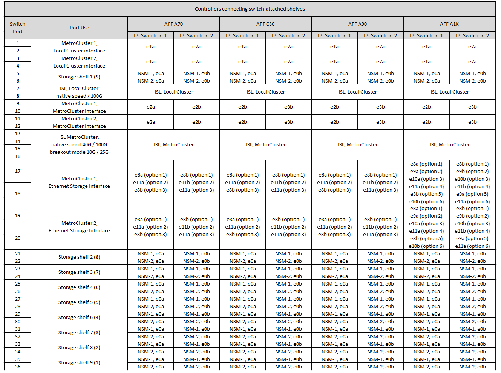
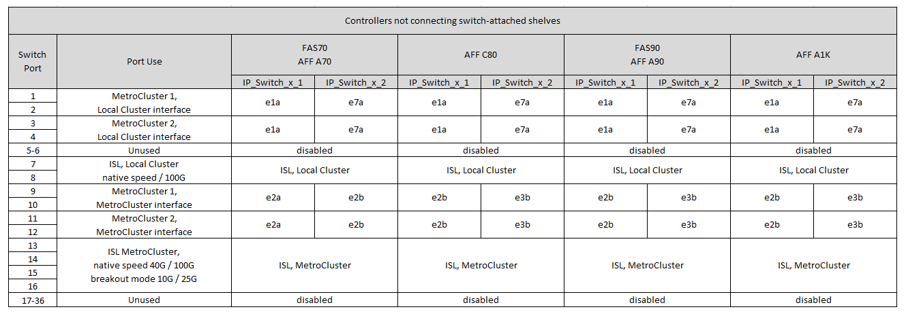

= Asignaciones de puertos de plataforma para un switch compartido Cisco 9336C-FX2
:allow-uri-read: 
:icons: font
:imagesdir: ../media/

[role="lead"]
El uso del puerto en una configuración IP de MetroCluster depende del modelo del switch y el tipo de plataforma.

Revise las siguientes consideraciones antes de utilizar las tablas de configuración:

* Al menos un grupo de recuperación de desastres o configuración MetroCluster debe admitir las bandejas NS224 conectadas a switches.
* Las plataformas que no admiten bandejas NS224 conectadas a switches solo pueden conectarse como segunda configuración de MetroCluster o como segundo grupo de recuperación ante desastres.
* RcfFileGenerator solo muestra plataformas elegibles cuando se selecciona la primera plataforma.
* Para conectar una configuración MetroCluster de ocho o dos nodos se requiere ONTAP 9.14.1 o una versión posterior.

== Elija la tabla de cableado correcta para su configuración

Revise la tabla de asignaciones de puertos correcta para la configuración. Hay dos conjuntos de tablas de cableado en esta sección:

* <<tables_connecting_ns224,Tablas de cableado para las controladoras que se conectan a bandejas NS224 conectadas a switches>>
* <<tables_not_connecting_ns224,Las tablas de cableado para las controladoras no se conectan a las bandejas NS224 conectadas al switch>>

=== Controladoras conectadas a bandejas NS224 conectadas a switches

Determine qué tabla de asignación de puertos se debe seguir para la conexión de controladoras a bandejas NS224 conectadas a switches.

[cols="2*"]
|===
| Plataforma | Utilice esta tabla de cableado... 

| AFF C30, AFF A30 AFF C60 | <<table_1_cisco_9336c_fx2,Asignaciones de puertos de plataforma de switch compartido Cisco 9336C-FX2 (grupo 1)>> 

| AFF A320 AFF C400, ASA C400 AFF A400, ASA A400 | <<table_2_cisco_9336c_fx2,Asignaciones de puertos de plataforma de switch compartido Cisco 9336C-FX2 (grupo 2)>> 

| AFF A50 | <<table_3_cisco_9336c_fx2,Asignaciones de puertos de plataforma de switch compartido Cisco 9336C-FX2 (grupo 3)>> 

| AFF A700 AFF C800, ASA C800, AFF A800 AFF A900, ASA A900 | <<table_4_cisco_9336c_fx2,Asignaciones de puertos de plataforma de switch compartido Cisco 9336C-FX2 (grupo 4)>> 

| AFF A70 AFF C80 AFF A90 AFF A1K | <<table_5_cisco_9336c_fx2,Asignaciones de puertos de plataforma de switch compartido Cisco 9336C-FX2 (grupo 5)>> 
|===
.Asignaciones de puertos de plataforma de switch compartido Cisco 9336C-FX2 (grupo 1)
Revise las asignaciones de puertos de plataforma para conectar el cable de un sistema AFF C30, AFF A30 o AFF C60 que está conectando bandejas NSS24 conectadas a switches a un switch compartido Cisco 9336C-FX2:

image::../media/mcc-ip-affa30-c30-c60-cisco-9336fx2-switch-attached.png[Muestra las asignaciones de puertos de la plataforma de switches compartidos Cisco 9336C-FX2]

.Asignaciones de puertos de plataforma de switch compartido Cisco 9336C-FX2 (grupo 2)
Revise las asignaciones de puertos de plataforma para conectar el cable de un sistema AFF A320, AFF C400, ASA C400, AFF A400 o ASA A400 que está conectando bandejas NSS24 conectadas a switches a un switch compartido Cisco 9336C-FX2:

image::../media/mcc_ip_cabling_a320_c400_a400_to_cisco_9336c_shared_switch.png[Muestra las asignaciones de puertos de la plataforma de switches compartidos Cisco 9336C-FX2]

.Asignaciones de puertos de plataforma de switch compartido Cisco 9336C-FX2 (grupo 3)
Revise las asignaciones de puertos de plataforma para conectar el cableado de un sistema AFF A50 que está conectando bandejas NSS24 conectadas a switches a un switch compartido Cisco 9336C-FX2:

image:../media/mcc-ip-cabling-aff-a50-cisco-9336fx2-switch-attached.png["Muestra las asignaciones de puertos de la plataforma de switches compartidos Cisco 9336C-FX2"]

.Asignaciones de puertos de plataforma de switch compartido Cisco 9336C-FX2 (grupo 4)
Revise las asignaciones de puertos de plataforma para cablear un AFF A700, AFF C800, ASA C800, AFF A800, AFF A900, o sistema ASA A900 que conecta bandejas NSS24 conectadas a switches a un switch compartido Cisco 9336C-FX2:

image:../media/mcc_ip_cabling_a700_c800_a800_a900_to_cisco_9336c_shared_switch.png["Muestra las asignaciones de puertos de la plataforma de switches compartidos Cisco 9336C-FX2"]

*Nota 1*: Utilice los puertos E4A y E4E o E4A y E8a si utiliza un adaptador X91440A (40Gbps). Use los puertos E4A y e4b o E4A y E8a si usa un adaptador de X91153A GbE (100Gbps).

.Asignaciones de puertos de plataforma de switch compartido Cisco 9336C-FX2 (grupo 5)
Revise las asignaciones de puertos de plataforma para conectar el cableado de un sistema AFF A70, AFF C80, AFF A90 o AFF A1K que está conectando bandejas NSS24 conectadas a switches a un switch compartido Cisco 9336C-FX2:

=== Las controladoras no se conectan a las bandejas NS224 conectadas a switches

Determine qué tabla de asignación de puertos se debe seguir para controladoras que no se conectan a bandejas NS224 conectadas a switches.

[cols="2*"]
|===
| Plataforma | Utilice esta tabla de cableado... 

| AFF A150, ASA A150 FAS2750, AFF A220 | <<table_6_cisco_9336c_fx2,Asignaciones de puertos de plataforma de switch compartido Cisco 9336C-FX2 (grupo 6)>> 

| AFF A20 | <<table_7_cisco_9336c_fx2,Asignaciones de puertos de plataforma de switch compartido Cisco 9336C-FX2 (grupo 7)>> 

| FAS500f AFF C250, ASA C250 AFF A250, ASA A250 | <<table_8_cisco_9336c_fx2,Asignaciones de puertos de plataforma de switch compartido Cisco 9336C-FX2 (grupo 8)>> 

| AFF C30, AFF A30 AFF C60 | <<table_9_cisco_9336c_fx2,Asignaciones de puertos de plataforma de switch compartido Cisco 9336C-FX2 (grupo 9)>> 

| FAS8200, AFF A300 | <<table_10_cisco_9336c_fx2,Asignaciones de puertos de plataforma de switch compartido Cisco 9336C-FX2 (grupo 10)>> 

| AFF A320 FAS8300, AFF C400, ASA C400, FAS8700 AFF A400, ASA A400 | <<table_11_cisco_9336c_fx2,Asignaciones de puertos de plataforma de switch compartido Cisco 9336C-FX2 (grupo 11)>> 

| AFF A50 | <<table_12_cisco_9336c_fx2,Asignaciones de puertos de plataforma de switch compartido Cisco 9336C-FX2 (grupo 12)>> 

| FAS9000, AFF A700 AFF C800, ASA C800, AFF A800, ASA A800 FAS9500, AFF A900, ASA A900 | <<table_13_cisco_9336c_fx2,Asignaciones de puertos de plataforma de switch compartido Cisco 9336C-FX2 (grupo 13)>> 

| FAS70, AFF A70 AFF C80 FAS90, AFF A90 AFF A1K | <<table_14_cisco_9336c_fx2,Asignaciones de puertos de plataforma de switch compartido Cisco 9336C-FX2 (grupo 14)>> 
|===
.Asignaciones de puertos de plataforma de switch compartido Cisco 9336C-FX2 (grupo 6)
Revise las asignaciones de puertos de plataforma para cablear un sistema AFF A150, ASA A150, FAS2750 o AFF A220 que no esté conectando bandejas NSS24 conectadas a switches a un switch compartido Cisco 9336C-FX2:

image::../media/mcc-ip-cabling-a-aff-a150-asa-a150-fas2750-aff-a220-to-a-cisco-9336c-shared-switch.png[Muestra las asignaciones de puertos de la plataforma de switches compartidos Cisco 9336C-FX2]

.Asignaciones de puertos de plataforma de switch compartido Cisco 9336C-FX2 (grupo 7)
Revise las asignaciones de puertos de plataforma para cablear un sistema AFF A20 que no esté conectando bandejas NSS24 conectadas a switches a un switch compartido Cisco 9336C-FX2:

image:../media/mcc-ip-aff-a20-to-a-cisco-9336c-shared-switch-not-connecting.png["Muestra las asignaciones de puertos de la plataforma de switches compartidos Cisco 9336C-FX2"]

.Asignaciones de puertos de plataforma de switch compartido Cisco 9336C-FX2 (grupo 8)
Revise las asignaciones de puertos de plataforma al cable un sistema FAS500f, AFF C250, ASA C250, AFF A250 o ASA A250 que no conecta bandejas NSS24 conectadas a switches a un switch compartido Cisco 9336C-FX2:

image::../media/mcc-ip-cabling-c250-asa-c250-a250-asa-a250-to-cisco-9336c-shared-switch.png[Muestra las asignaciones de puertos de la plataforma de switches compartidos Cisco 9336C-FX2]

.Asignaciones de puertos de plataforma de switch compartido Cisco 9336C-FX2 (grupo 9)
Revise las asignaciones de puertos de plataforma para cablear un sistema AFF A30, AFF C30 o AFF C60 que no conecte bandejas NSS24 conectadas a switches a un switch compartido Cisco 9336C-FX2:

image:../media/mcc-ip-cabling-affa30-c30-c60a-cisco-9336c-shared-switch-not-connecting.png["Muestra las asignaciones de puertos de la plataforma de switches compartidos Cisco 9336C-FX2"]

.Asignaciones de puertos de plataforma de switch compartido Cisco 9336C-FX2 (grupo 10)
Revise las asignaciones de puertos de plataforma para cablear un sistema FAS8200 o AFF A300 que no esté conectando bandejas NSS24 conectadas a switches a un switch compartido Cisco 9336C-FX2:

image::../media/mcc-ip-cabling-fas8200-affa300-to-cisco-9336c-shared-switch.png[Muestra las asignaciones de puertos de la plataforma de switches compartidos Cisco 9336C-FX2]

.Asignaciones de puertos de plataforma de switch compartido Cisco 9336C-FX2 (grupo 11)
Revise las asignaciones de puertos de plataforma para cablear un AFF A320, FAS8300, AFF C400, ASA C400, FAS8700, sistema AFF A400 o ASA A400 que no conecta bandejas NSS24 conectadas a switches a un switch compartido Cisco 9336C-FX2:

image::../media/mcc_ip_cabling_a320_fas8300_a400_fas8700_to_a_cisco_9336c_shared_switch.png[Muestra las asignaciones de puertos de la plataforma de switches compartidos Cisco 9336C-FX2]

.Asignaciones de puertos de plataforma de switch compartido Cisco 9336C-FX2 (grupo 12)
Revise las asignaciones de puertos de plataforma para cablear un sistema AFF A50 que no esté conectando bandejas NSS24 conectadas a switches a un switch compartido Cisco 9336C-FX2:

image::../media/mcc-ip-cabling-aff-a50-cisco-9336c-shared-switch-not-connecting.png[Muestra las asignaciones de puertos de la plataforma de switches compartidos Cisco 9336C-FX2]

.Asignaciones de puertos de plataforma de switch compartido Cisco 9336C-FX2 (grupo 13)
Revise las asignaciones de puertos de plataforma al cable A FAS9000, AFF A700, AFF C800, ASA C800, AFF A800, sistema ASA A800, FAS9500, AFF A900 o ASA A900 que no está conectando bandejas NSS24 conectadas a switches a un switch compartido Cisco 9336C-FX2:

image::../media/mcc_ip_cabling_a700_a800_fas9000_fas9500_to_cisco_9336c_shared_switch.png[Muestra las asignaciones de puertos de la plataforma de switches compartidos Cisco 9336C-FX2]

*Nota 1*: Utilice los puertos E4A y E4E o E4A y E8a si utiliza un adaptador X91440A (40Gbps). Use los puertos E4A y e4b o E4A y E8a si usa un adaptador de X91153A GbE (100Gbps).

.Asignaciones de puertos de plataforma de switch compartido Cisco 9336C-FX2 (grupo 14)
Revise las asignaciones de puertos de plataforma para conectar los cables de un sistema AFF A70, FAS70, AFF C80, FAS90, AFF A90 o AFF A1K que no conecta bandejas NSS24 conectadas al switch a un switch compartido Cisco 9336C-FX2:

