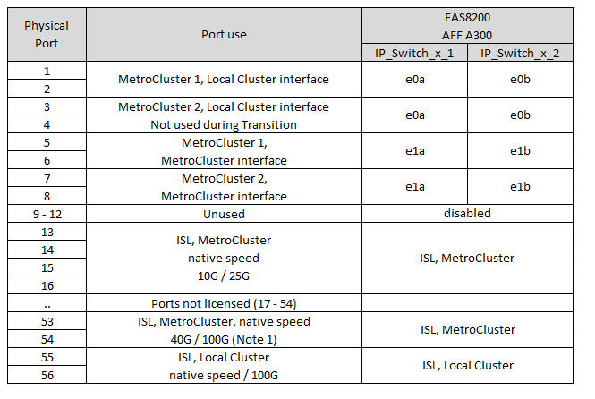

= Asignaciones de puertos de plataforma para switches IP BES-53248 compatibles con Broadcom
:allow-uri-read: 
:icons: font
:imagesdir: ../media/

[role="lead"]
El uso del puerto en una configuración IP de MetroCluster depende del modelo del switch y el tipo de plataforma.

Los switches no se pueden utilizar con puertos ISL remotos de diferentes velocidades (por ejemplo, un puerto de 25 Gbps conectado a un puerto ISL de 10 Gbps).

.Revise esta información antes de utilizar las tablas:
* Si se configura la transición del switch para MetroCluster FC a IP, se usan los siguientes puertos en función de la plataforma objetivo que se elija:
+
[cols="75,25"]
|===
| Plataforma objetivo | Puerto 

| FAS500f, AFF C250, ASA C250, AFF A250, ASA A250, FAS8300, AFF C400, ASA C400, AFF A400, ASA A400, o FAS8700 plataformas | Puertos 1 - 6, 10Gbps 

| Plataformas FAS8200 o AFF A300 | Puertos 3 - 4 y 9 - 12, 10Gbps 
|===
* Es posible que los sistemas AFF A320 configurados con switches Broadcom BES-53248 no admitan todas las funciones.
+
No se admite ninguna configuración o función que requiera que las conexiones de clúster local estén conectadas a un switch. Por ejemplo, no se admiten las siguientes configuraciones ni procedimientos:

+
** Configuraciones MetroCluster de ocho nodos
** Transición de las configuraciones FC de MetroCluster a IP de MetroCluster
** Actualizar una configuración IP de MetroCluster de cuatro nodos (ONTAP 9.8 y versiones posteriores)

.Notas a las que se hace referencia en las tablas:
* *Nota 1*: El uso de estos puertos requiere una licencia adicional.
* *Nota 2*: Solo se puede conectar al switch una sola MetroCluster de cuatro nodos utilizando sistemas AFF A320.
+
Esta configuración no admite las funciones que requieren un clúster con switches, incluidos los procedimientos de transición de FC a IP de MetroCluster y actualización tecnológica.

* *Nota 3*: El conmutador BES-53248 requiere que todos los puertos de un grupo de cuatro puertos funcionen a la misma velocidad. Para conectar una combinación de plataformas AFF 150, ASA A150, FAS2750, AFF A220 y FAS500f, AFF C250, ASA C250, AFF A250 y ASA A250, se deben usar puertos de switch ubicados en grupos de cuatro puertos separados. Si necesita este tipo de configuración, se aplica lo siguiente:
+
** En la https://mysupport.netapp.com/site/tools/tool-eula/rcffilegenerator["RcfFileGenerator para MetroCluster IP"], Los campos desplegables de «MetroCluster 1» y «MetroCluster 2» solo se rellenan después de seleccionar una plataforma para MetroCluster 3 o «MetroCluster 4».  Consulte link:../install-ip/using_rcf_generator.html["Utilizar las tablas de puertos con la herramienta RcfFileGenerator o varias configuraciones de MetroCluster"] para obtener más información sobre cómo utilizar las tablas de puertos.
** Si ambas configuraciones de MetroCluster utilizan la misma plataforma, NetApp recomienda que seleccione el grupo «MetroCluster 3» para una configuración y el grupo «MetroCluster 4» para la otra. Si las plataformas son diferentes, debe seleccionar «MetroCluster 3» o «MetroCluster 4» para la primera configuración y seleccionar «MetroCluster 1» o «MetroCluster 2» para la segunda configuración.

== Cableado de un AFF A150, ASA A150, FAS2750, AFF A220, FAS500f, AFF C250, ASA C250, AFF A250 o ASA A250 a un switch Broadcom BES-53248

image::../media/mcc_ip_cabling_a_aff_asa_a150_a220_c250_a250_fas2750_to_a_broadcom_bes_53248_switch.png[cableado ip mcc un conmutador AFF ASA a150 a220 c250 a250 fas2750 a un conmutador broadcom bes 53248]

== Cableado de un sistema FAS8200, AFF A300 o AFF A320 a un switch Broadcom BES-53248

image::../media/mcc_ip_cabling_a_aff_a320_to_a_broadcom_bes_53248_switch.png[cableado ip de mcc un AFF a320 a un switch broadcom bes 53248]

== Cableado de un sistema FAS8300, AFF C400, ASA C400, AFF A400, ASA A400 o FAS8700 a un switch Broadcom BES-53248

image::../media/mcc_ip_cabling_a_fas8300_a400_c400_or_fas8700_to_a_broadcom_bes_53248_switch.png[cableado ip mcc a fas8300 a400 c400 o fas8700 a un conmutador broadcom bes 53248]
