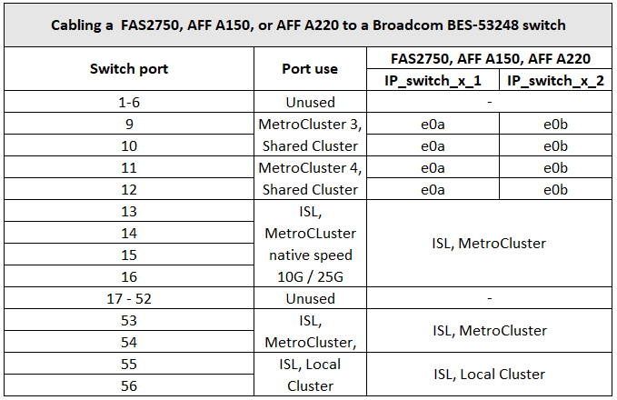

= Asignaciones de puertos de plataforma para switches IP BES-53248 compatibles con Broadcom
:allow-uri-read: 
:icons: font
:imagesdir: ../media/

[role="lead"]
El uso del puerto en una configuración IP de MetroCluster depende del modelo del switch y el tipo de plataforma.

Los switches no se pueden utilizar con puertos ISL remotos de diferentes velocidades (por ejemplo, un puerto de 25 Gbps conectado a un puerto ISL de 10 Gbps).

.Notas para las tablas siguientes:
. En algunas plataformas, puede usar los puertos 49 - 54 para los ISL de MetroCluster o las conexiones de interfaz MetroCluster.
+
Estos puertos requieren una licencia adicional.

. Solo se puede conectar al switch un único MetroCluster de cuatro nodos con sistemas AFF A320.
+
Estas funciones que requieren un clúster conmutado no son compatibles con esta configuración, incluidos los procedimientos de transición MetroCluster FC a IP y de actualización tecnológica.

. Es posible que los sistemas AFF A320 configurados con switches Broadcom BES-53248 no admitan todas las funciones.
+
No se admite ninguna configuración o función que requiera que las conexiones de clúster local estén conectadas a un switch. Por ejemplo, no se admiten las siguientes configuraciones ni procedimientos:

+
** Configuraciones MetroCluster de ocho nodos
** Transición de las configuraciones FC de MetroCluster a IP de MetroCluster
** Actualizar una configuración IP de MetroCluster de cuatro nodos (ONTAP 9.8 y versiones posteriores)

. Si conecta dos configuraciones de MetroCluster y ambos utilizan el mismo tipo de controladora, debe usar los grupos de puertos MetroCluster 3 y 4. Si las controladoras son diferentes, debe usar los grupos de puertos MetroCluster 3 y 4 para un tipo y los grupos de puertos MetroCluster 1 y 2 para el otro.
+
** Por ejemplo, si se conecta:
+
*** Dos configuraciones de MetroCluster que constan únicamente de FAS2750/AFF A220 o FAS500f/AFF A250 son, debe seleccionar los grupos de puertos MetroCluster 3 y 4.
*** Dos configuraciones de MetroCluster donde un MetroCluster sea de tipo FAS2750/AFF A220 y el otro sea FAS500f/AFF A250, debe seleccionar los grupos de puertos 3 y 4 para uno, y los grupos de puertos 1 y 2 para el otro. En la https://mysupport.netapp.com/site/tools/tool-eula/rcffilegenerator["RcfFileGenerator para MetroCluster IP"], los campos de lista desplegable 1 y 2 sólo se rellenan con la plataforma admitida después de seleccionar plataformas en los campos de lista desplegable 3 y 4. Consulte link:../install-ip/using_rcf_generator.html["Utilizar las tablas de puertos con la herramienta RcfFileGenerator o varias configuraciones de MetroCluster"] para obtener más información sobre cómo utilizar las tablas de puertos.

== Uso de puertos de switch para sistemas FAS2750, AFF 150 o AFF A220

== Uso de puertos de switch para sistemas FAS500f, AFF C250 o AFF A250

image::../media/mcc_ip_cabling_a_aff_c250_a250_or_fas500f_to_a_broadcom_bes_53248_switch.png[cableado ip de mcc un AFF c250 a250 o fas500f a un switch broadcom bes 53248]

== Uso de puertos de switch para el uso combinado de un AFF A150, FAS2750 o AFF A220 y FAS500f o AFF C250, O sistemas AFF A250

image::../media/mcc_ip_cabling_aff_a250_and_ a220_to_a_broadcom_bes_53248_switch.png[cableado ip de mcc AFF a250 y a220 a un switch broadcom bes 53248]

== Uso de puertos de switch para sistemas FAS8200 o AFF A300

image::../media/mcc_ip_cabling_a_aff_a300_or_fas8200_to_a_broadcom_bes_53248_switch.png[cableado ip de mcc un AFF a300 o fas8200 a un switch broadcom bes 53248]

image::../media/mcc_ip_cabling_a_aff_a320_to_a_broadcom_bes_53248_switch.png[cableado ip de mcc un AFF a320 a un switch broadcom bes 53248]

== Uso de puertos de switch para sistemas FAS8300, AFF C400, AFF A400 o FAS8700

image::../media/mcc_ip_cabling_a_fas8300_a400_or_fas8700_to_a_broadcom_bes_53248_switch.png[cableado ip de mcc un fas8300 a400 o fas8700 a un switch broadcom bes 53248]
