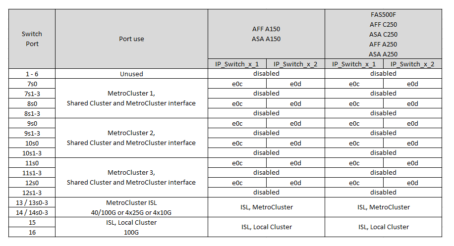
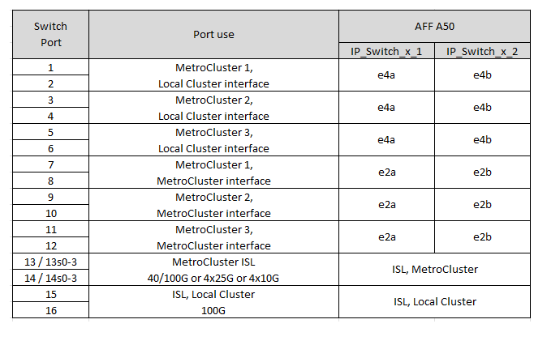

= Asignaciones de puertos de plataforma para conmutadores IP SN2100 compatibles con NVIDIA en una configuración IP de MetroCluster
:allow-uri-read: 
:icons: font
:imagesdir: ../media/

[role="lead"]
El uso del puerto en una configuración IP de MetroCluster depende del modelo del switch y el tipo de plataforma.

Revise las siguientes consideraciones antes de utilizar las tablas de configuración:

* Para conectar una configuración MetroCluster de ocho o dos nodos se requiere ONTAP 9.14.1 o posterior y el archivo RCF versión 2,00 o posterior.
+

NOTE: La versión del archivo RCF es diferente a la versión de la herramienta RCFfilegenerator utilizada para generar el archivo. Por ejemplo, puede generar un archivo RCF versión 2,00 utilizando RCFfilegenerator v1,6c.

* Si realiza cables con varias configuraciones de MetroCluster, siga la tabla correspondiente. Por ejemplo:
+
** Si conecta dos configuraciones de MetroCluster de cuatro nodos del tipo AFF A700, a continuación, conecte el primer MetroCluster que se muestra como "MetroCluster 1" y el segundo MetroCluster que se muestra como "MetroCluster 2" en la tabla A700 de AFF.

NOTE: Los puertos 13 y 14 se pueden utilizar en el modo de velocidad nativa que admite 40 Gbps y 100 Gbps, o en el modo de arranque para admitir 4 × 25 Gbps o 4 × 10 Gbps. Si utilizan el modo de velocidad nativo, se representan como puertos 13 y 14. Si utilizan el modo de arranque, 4 × 25 Gbps o 4 × 10 Gbps, entonces se representan como puertos 13s0-3 y 14s0-3.

En las siguientes secciones se describe el esquema del cableado físico. También puede consultar la https://mysupport.netapp.com/site/tools/tool-eula/rcffilegenerator["RcfFileGenerator"] para obtener información detallada sobre el cableado.

== Elija la tabla de cableado correcta para su configuración

Utilice la siguiente tabla para determinar qué tabla de cableado debe seguir.

[cols="25,75"]
|===
| Si el sistema es... | Utilice esta tabla de cableado... 

 a| 
AFF A150, ASA A150

FAS500f

AFF C250, ASA C250

AFF A250, ASA A250
| <<table_1_nvidia_sn2100,Asignaciones de puertos de la plataforma NVIDIA SN2100 (grupo 1)>> 

| AFF A20 | <<table_2_nvidia_sn2100,Asignaciones de puertos de la plataforma NVIDIA SN2100 (grupo 2)>> 

| AFF C30, AFF A30 FAS50 AFF C60  a| 
La tabla que siga depende de si está utilizando una tarjeta Ethernet 25G (grupo 3a) o 100g (grupo 3b).

* <<table_3a_nvidia_sn2100,Asignaciones de puertos de la plataforma NVIDIA SN2100 (grupo 3a -25G)>>
* <<table_3b_nvidia_sn2100,Asignaciones de puertos de la plataforma NVIDIA SN2100 (grupo 3b -100g)>>

| FAS8300 AFF C400, ASA C400 AFF A400, ASA A400 FAS8700 FAS9000 y AFF A700 | <<table_4_nvidia_sn2100,Asignaciones de puertos de la plataforma NVIDIA SN2100 (grupo 4)>> 

| AFF A50 | <<table_5_nvidia_sn2100,Asignaciones de puertos de la plataforma NVIDIA SN2100 (grupo 5)>> 

| AFF C800, ASA C800 AFF A800, ASA A800 FAS9500 AFF A900, ASA A900 | <<table_6_nvidia_sn2100,Asignaciones de puertos de la plataforma NVIDIA SN2100 (grupo 6)>> 

| FAS70, AFF A70 AFF C80 FAS90, AFF A90 AFF A1K | <<table_7_nvidia_sn2100,Asignaciones de puertos de la plataforma NVIDIA SN2100 (grupo 7)>> 
|===
.Asignaciones de puertos de la plataforma NVIDIA SN2100 (grupo 1)
Revise las asignaciones de puertos de plataforma para cablear un AFF A150, ASA A150, FAS500f, AFF C250, ASA C250, sistema AFF A250 o ASA A250 a un switch NVIDIA SN2100:

[#table_1_nvidia_sn2100]

.Asignaciones de puertos de la plataforma NVIDIA SN2100 (grupo 2)
Revise las asignaciones de puertos de plataforma para cablear un sistema AFF A20 a un switch NVIDIA SN2100:

[#table_2_nvidia_sn2100]
image::../media/mccip-cabling-nvidia-a20-updated.png[Muestra las asignaciones de puertos de la plataforma NVIDIA SN2100]

.Asignaciones de puertos de la plataforma NVIDIA SN2100 (grupo 3a)
Revise las asignaciones de puertos de plataforma para cablear un sistema AFF A30, AFF C30, AFF C60 o FAS50 a un switch NVIDIA SN2100 mediante una tarjeta Ethernet 25G de cuatro puertos:

NOTE: Esta configuración requiere una tarjeta Ethernet 25G de cuatro puertos en la ranura 4 para conectar el clúster local y las interfaces de alta disponibilidad.

[#table_3a_nvidia_sn2100]
image::../media/mccip-cabling-nvidia-a30-c30-fas50-c60-25G.png[Muestra las asignaciones de puertos de la plataforma NVIDIA SN2100]

.Asignaciones de puertos de la plataforma NVIDIA SN2100 (grupo 3b)
Revise las asignaciones de puertos de plataforma para conectar un sistema AFF A30, AFF C30, AFF C60 o FAS50 a un switch NVIDIA SN2100 mediante una tarjeta Ethernet 100g DE dos puertos:

NOTE: Esta configuración requiere una tarjeta Ethernet 100g de dos puertos en la ranura 4 para conectar el clúster local y las interfaces de alta disponibilidad.

[#table_3b_nvidia_sn2100]
image::../media/mccip-cabling-nvidia-a30-c30-fas50-c60-100G.png[Muestra las asignaciones de puertos de la plataforma NVIDIA SN2100]

.Asignaciones de puertos de la plataforma NVIDIA SN2100 (grupo 4)
Revise las asignaciones de puertos de plataforma al cable A FAS8300, AFF C400, ASA C400, AFF A400, ASA A400, sistema FAS8700, FAS9000 o AFF A700 a un switch NVIDIA SN2100:

image::../media/mccip-cabling-fas8300-aff-a400-c400-a700-fas900-nvidaia-sn2100.png[Muestra las asignaciones de puertos de la plataforma NVIDIA SN2100]

*Nota 1*: Utilice los puertos E4A y E4E o E4A y E8a si utiliza un adaptador X91440A (40Gbps). Use los puertos E4A y e4b o E4A y E8a si usa un adaptador de X91153A GbE (100Gbps).

.Asignaciones de puertos de la plataforma NVIDIA SN2100 (grupo 5)
Revise las asignaciones de puertos de plataforma para cablear un sistema AFF A50 a un switch NVIDIA SN2100:

[#table_5_nvidia_sn2100]

.Asignaciones de puertos de la plataforma NVIDIA SN2100 (grupo 6)
Revise las asignaciones de puertos de plataforma para cablear un AFF C800, ASA C800, AFF A800, ASA A800, FAS9500, sistema AFF A900 o ASA A900 a un switch NVIDIA SN2100:

image::../media/mcc_ip_cabling_fas8300_aff_asa_a800_a900_fas9500_MSN2100.png[Muestra las asignaciones de puertos de la plataforma NVIDIA SN2100]

*Nota 1*: Utilice los puertos E4A y E4E o E4A y E8a si utiliza un adaptador X91440A (40Gbps). Use los puertos E4A y e4b o E4A y E8a si usa un adaptador de X91153A GbE (100Gbps).

.Asignaciones de puertos de la plataforma NVIDIA SN2100 (grupo 7)
Revise las asignaciones de puertos de plataforma al cable de un sistema FAS70, AFF A70, AFF C80, FAS90, AFF A90 o AFF A1K a un switch NVIDIA SN2100:

image::../media/mccip-cabling-nvidia-a70-c80-fas90-fas70-a1k.png[Muestra las asignaciones de puertos de la plataforma NVIDIA SN2100]
