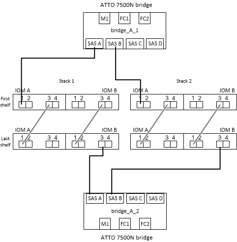

= Cableado de un puente FibreBridge 7600N o 7500N con bandejas de discos con módulos IOM12
:allow-uri-read: 
:icons: font
:imagesdir: ../media/

[role="lead"]
Después de configurar el puente, puede iniciar el cableado del sistema.

En el caso de las bandejas de discos, inserte un conector del cable SAS con la pestaña extraíble orientada hacia abajo (en la parte inferior del conector).

.Pasos
. Conecte en cadena las bandejas de discos en cada pila:
+
.. Comenzando por la primera bandeja lógica de la pila, conecte el puerto IOM a 3 al puerto IOM A de la siguiente bandeja. Repita el proceso hasta que se conecte cada IOM A de la pila.
.. Repita el subpaso anterior para el IOM B.
.. Repita los subpasos anteriores para cada pila.

+
La _Guía de instalación y mantenimiento_ del modelo de bandeja de discos proporciona información detallada sobre las bandejas de discos en cadena.

. Encienda las bandejas de discos y, a continuación, defina los ID de bandeja.
+
** Debe apagar y encender cada bandeja de discos.
** Los ID de bandeja deben ser únicos para cada bandeja de discos SAS dentro de cada grupo de recuperación ante desastres MetroCluster (incluidos ambos sitios).

. Cablee las estanterías de discos a los puentes FiberBridge.
+
.. Para la primera pila de bandejas de discos, conecte el cable IOM A de la primera bandeja al puerto SAS A en FibreBridge A. Conecte el cable IOM B de la última bandeja al puerto SAS A en FibreBridge B.
.. Para pilas de bandejas adicionales, repita el paso anterior con el siguiente puerto SAS disponible en los puentes FibreBridge, usando el puerto B para la segunda pila, el puerto C para la tercera pila y el puerto D para la cuarta pila.
.. Durante el cableado, conecte las pilas basadas en módulos IOM12 al mismo puente siempre que estén conectadas a puertos SAS separados.
+

NOTE: Cada pila puede utilizar distintos modelos de IOM, pero todas las bandejas de discos de una pila deben utilizar el mismo modelo.

+
En la siguiente ilustración se muestran las bandejas de discos conectadas a un par de puentes FibreBridge 7600N o 7500N:

