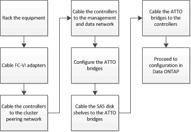

= Cableado de una configuración de MetroCluster elástico de dos nodos conectada a puente
:allow-uri-read: 
:icons: font
:imagesdir: ../media/

[role="lead"]
Los componentes de MetroCluster deben instalarse físicamente, cablearse y configurarse en ambos sitios geográficos. Los pasos son ligeramente diferentes para un sistema con bandejas de discos nativas, en lugar de un sistema con LUN de cabina.

