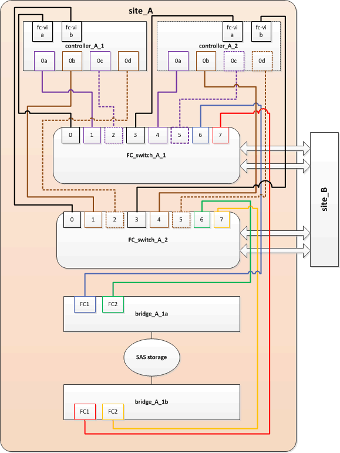

= Sustitución de un par de puentes FibreBridge 6500N con puentes 7600N o 7500N
:allow-uri-read: 
:icons: font
:imagesdir: ../media/

[role="lead"]
Para aprovechar el puerto FC2 adicional de los puentes FibreBridge 7600N o 7500N y reducir el uso de los bastidores, puede sustituir los puentes 6500N sin interrupciones y consolidar hasta cuatro pilas de almacenamiento detrás de un único par de puentes FibreBridge 7600N o 7500N.

.Antes de empezar
Necesita la contraseña de administrador y el acceso a un servidor FTP o SCP.

.Acerca de esta tarea
Debe utilizar este procedimiento si:

* Está reemplazando un par de puentes FibreBridge 6500N con puentes FibreBridge 7600N o 7500N.
+
Después de la sustitución, ambos puentes del par deben ser del mismo modelo.

* Previamente, ha sustituido un puente FibreBridge 6500N con un puente 7600N o 7500N y ahora va a sustituir el segundo puente del par.
* Tiene un par de puentes FibreBridge 7600N o 7500N con puertos SAS disponibles y está consolidando pilas de almacenamiento SAS que están conectadas actualmente con puentes FibreBridge 6500N.

Este procedimiento no es disruptivo y tarda aproximadamente dos horas en completarse.

.Información relacionada
link:task_replace_a_sle_fc_to_sas_bridge.html["Reemplazar un único puente FC-a-SAS"]

== Verificación de la conectividad de almacenamiento

Antes de sustituir puentes, debe verificar la conectividad de puente y almacenamiento. Familiarizarse con el resultado del comando le permite confirmar la conectividad posteriormente tras realizar cambios en la configuración.

Puede emitir estos comandos desde el símbolo del sistema de administrador de cualquiera de los módulos de la controladora en la configuración de MetroCluster en el sitio sometido a mantenimiento.

. Confirme la conectividad con los discos introduciendo el siguiente comando en uno de los nodos MetroCluster:
+
`run local sysconfig -v`

+
El resultado muestra los discos conectados a los puertos del iniciador en la controladora e identifica las bandejas conectadas a los puentes FC a SAS:

+
[listing]
----

node_A_1> run local sysconfig -v
NetApp Release 9.3.2X18: Sun Dec 13 01:23:24 PST 2017
System ID: 4068741258 (node_A_1); partner ID: 4068741260 (node_B_1)
System Serial Number: 940001025471 (node_A_1)
System Rev: 70
System Storage Configuration: Multi-Path HA**<=== Configuration should be multi-path HA**
.
.
.
slot 0: FC Host Adapter 0g (QLogic 8324 rev. 2, N-port, <UP>)**<=== Initiator port**
		Firmware rev:      7.5.0
		Flash rev:         0.0.0
		Host Port Id:      0x60130
		FC Node Name:      5:00a:098201:bae312
		FC Port Name:      5:00a:098201:bae312
		SFP Vendor:        UTILITIES CORP.
		SFP Part Number:   FTLF8529P3BCVAN1
		SFP Serial Number: URQ0Q9R
		SFP Capabilities:  4, 8 or 16 Gbit
		Link Data Rate:    16 Gbit
		Switch Port:       brcd6505-fcs40:1
  **<List of disks visible to port\>**
		 ID     Vendor   Model            FW    Size
		brcd6505-fcs29:12.126L1527     : NETAPP   X302_HJUPI01TSSM NA04 847.5GB (1953525168 512B/sect)
		brcd6505-fcs29:12.126L1528     : NETAPP   X302_HJUPI01TSSA NA02 847.5GB (1953525168 512B/sect)
		.
		.
		.
		**<List of FC-to-SAS bridges visible to port\>**
		FC-to-SAS Bridge:
		brcd6505-fcs40:12.126L0        : ATTO     FibreBridge6500N 1.61  FB6500N102980
		brcd6505-fcs42:13.126L0        : ATTO     FibreBridge6500N 1.61  FB6500N102980
		brcd6505-fcs42:6.126L0         : ATTO     FibreBridge6500N 1.61  FB6500N101167
		brcd6505-fcs42:7.126L0         : ATTO     FibreBridge6500N 1.61  FB6500N102974
		.
		.
		.
  **<List of storage shelves visible to port\>**
		brcd6505-fcs40:12.shelf6: DS4243  Firmware rev. IOM3 A: 0200  IOM3 B: 0200
		brcd6505-fcs40:12.shelf8: DS4243  Firmware rev. IOM3 A: 0200  IOM3 B: 0200
		.
		.
		.
----

== Puentes FibreBridge 6500N de intercambio en caliente para crear un par de puentes FibreBridge 7600N o 7500N

Para intercambiar en caliente uno o dos puentes FibreBridge 6500N para crear una configuración con un par de puentes FibreBridge 7600N o 7500N, debe reemplazar los puentes uno a uno y seguir el procedimiento de cableado correcto. El nuevo cableado es diferente del cableado original.

.Acerca de esta tarea
También puede utilizar este procedimiento si se cumplen las siguientes condiciones:

* Va a sustituir un par de puentes FibreBridge 6500N que están conectados a la misma pila de almacenamiento SAS.
* Ha sustituido previamente un puente FibreBridge 6500N en el par y su pila de almacenamiento está configurada con un puente FibreBridge 6500N y un puente FibreBridge 7600N o 7500N.
+
En este caso, debe comenzar con el siguiente paso para intercambiar en caliente el puente inferior FibreBridge 6500N con un puente FibreBridge 7600N o 7500N.

El siguiente diagrama muestra un ejemplo de la configuración inicial, en la que cuatro puentes FibreBridge 6500N conectan dos pilas de almacenamiento SAS:

image::../media/consolidating_stacks_before.gif[Consolidación de pilas antes del reemplazo de FibreBridge]

.Pasos
. Siguiendo las siguientes directrices, intercambie en caliente el puente superior FibreBridge 6500N con un puente FibreBridge 7600N o 7500N utilizando el procedimiento de link:task_replace_a_sle_fc_to_sas_bridge.html#hot_swap_6500n["Intercambio en caliente de un puente FibreBridge 6500N con un puente FibreBridge 7600N o 7500N"]:
+
** Conecte el puerto FC1 del puente FibreBridge 7600N o 7500N al conmutador o controlador.
+
Esta es la misma conexión que se hizo al puerto FC1 del puente FibreBridge 6500N.

** No conecte el puerto FC2 del puente FibreBridge 7600N o 7500N en este momento. El siguiente diagrama muestra que bridge_A_1a se ha reemplazado y ahora es un puente FibreBridge 7600N o 7500N:

+
image::../media/consolidating_stacks_1st_7500n_in_place.gif[Consolidación de pilas con el primer FibreBridge 7500N instalado]

. Confirme la conectividad con los discos conectados en puente y que el nuevo FibreBridge 7500N esté visible en la configuración:
+
`run local sysconfig -v`

+
[listing]
----

node_A_1> run local sysconfig -v
NetApp Release 9.3.2X18: Sun Dec 13 01:23:24 PST 2015
System ID: 0536872165 (node_A_1); partner ID: 0536872141 (node_B_1)
System Serial Number: 940001025465 (node_A_1)
System Rev: 70
System Storage Configuration: Multi-Path HA**<=== Configuration should be multi-path HA**
.
.
.
slot 0: FC Host Adapter 0g (QLogic 8324 rev. 2, N-port, <UP>)**<=== Initiator port**
		Firmware rev:      7.5.0
		Flash rev:         0.0.0
		Host Port Id:      0x60100
		FC Node Name:      5:00a:098201:bae312
		FC Port Name:      5:00a:098201:bae312
		SFP Vendor:        FINISAR CORP.
		SFP Part Number:   FTLF8529P3BCVAN1
		SFP Serial Number: URQ0R1R
		SFP Capabilities:  4, 8 or 16 Gbit
		Link Data Rate:    16 Gbit
		Switch Port:       brcd6505-fcs40:1
  **<List of disks visible to port\>**
		 ID     Vendor   Model            FW    Size
		brcd6505-fcs40:12.126L1527     : NETAPP   X302_HJUPI01TSSM NA04 847.5GB (1953525168 512B/sect)
		brcd6505-fcs40:12.126L1528     : NETAPP   X302_HJUPI01TSSA NA02 847.5GB (1953525168 512B/sect)
		.
		.
		.
		**<List of FC-to-SAS bridges visible to port\>**
		FC-to-SAS Bridge:
		brcd6505-fcs40:12.126L0        : ATTO     FibreBridge7500N A30H  FB7500N100104**<===**
		brcd6505-fcs42:13.126L0        : ATTO     FibreBridge6500N 1.61  FB6500N102980
		brcd6505-fcs42:6.126L0         : ATTO     FibreBridge6500N 1.61  FB6500N101167
		brcd6505-fcs42:7.126L0         : ATTO     FibreBridge6500N 1.61  FB6500N102974
		.
		.
		.
  **<List of storage shelves visible to port\>**
		brcd6505-fcs40:12.shelf6: DS4243  Firmware rev. IOM3 A: 0200  IOM3 B: 0200
		brcd6505-fcs40:12.shelf8: DS4243  Firmware rev. IOM3 A: 0200  IOM3 B: 0200
		.
		.
		.
----
. Siguiendo las siguientes directrices, intercambie en caliente el puente FibreBridge 6500N inferior con un puente FibreBridge 7600N o 7500N siguiendo el procedimiento descrito en link:task_replace_a_sle_fc_to_sas_bridge.html#hot_swap_6500n["Intercambio en caliente de un puente FibreBridge 6500N con un puente FibreBridge 7600N o 7500N"]:
+
** Conecte el puerto FC2 del puente FibreBridge 7600N o 7500N al conmutador o controlador.
+
Esta es la misma conexión que se hizo al puerto FC1 del puente FibreBridge 6500N.

** No conecte el puerto FC1 del puente FibreBridge 7600N o 7500N en este momento.image:../media/consolidating_stacks_2nd_7500n_in_place.gif["Consolidación de pilas con el segundo FibreBridge 7500N instalado"]

. Confirmar la conectividad con los discos conectados en puente:
+
`run local sysconfig -v`

+
El resultado muestra los discos conectados a los puertos del iniciador en la controladora e identifica las bandejas conectadas a los puentes FC a SAS:

+
[listing]
----

node_A_1> run local sysconfig -v
NetApp Release 9.3.2X18: Sun Dec 13 01:23:24 PST 2015
System ID: 0536872165 (node_A_1); partner ID: 0536872141 (node_B_1)
System Serial Number: 940001025465 (node_A_1)
System Rev: 70
System Storage Configuration: Multi-Path HA**<=== Configuration should be multi-path HA**
.
.
.
slot 0: FC Host Adapter 0g (QLogic 8324 rev. 2, N-port, <UP>)**<=== Initiator port**
		Firmware rev:      7.5.0
		Flash rev:         0.0.0
		Host Port Id:      0x60100
		FC Node Name:      5:00a:098201:bae312
		FC Port Name:      5:00a:098201:bae312
		SFP Vendor:        FINISAR CORP.
		SFP Part Number:   FTLF8529P3BCVAN1
		SFP Serial Number: URQ0R1R
		SFP Capabilities:  4, 8 or 16 Gbit
		Link Data Rate:    16 Gbit
		Switch Port:       brcd6505-fcs40:1
  **<List of disks visible to port\>**
		 ID     Vendor   Model            FW    Size
		brcd6505-fcs40:12.126L1527     : NETAPP   X302_HJUPI01TSSM NA04 847.5GB (1953525168 512B/sect)
		brcd6505-fcs40:12.126L1528     : NETAPP   X302_HJUPI01TSSA NA02 847.5GB (1953525168 512B/sect)
		.
		.
		.
		**<List of FC-to-SAS bridges visible to port\>**
		FC-to-SAS Bridge:
		brcd6505-fcs40:12.126L0        : ATTO     FibreBridge7500N A30H  FB7500N100104
		brcd6505-fcs42:13.126L0        : ATTO     FibreBridge7500N A30H  FB7500N100104
		.
		.
		.
  **<List of storage shelves visible to port\>**
		brcd6505-fcs40:12.shelf6: DS4243  Firmware rev. IOM3 A: 0200  IOM3 B: 0200
		brcd6505-fcs40:12.shelf8: DS4243  Firmware rev. IOM3 A: 0200  IOM3 B: 0200
		.
		.
		.
----

== Cableado de los puertos SAS puente cuando se consolida el almacenamiento detrás de los puentes FibreBridge 7600N o 7500N

Al consolidar varias pilas de almacenamiento SAS tras un único par de puentes FibreBridge 7600N o 7500N con puertos SAS disponibles, debe mover los cables SAS superior e inferior a los nuevos puentes.

.Acerca de esta tarea
Los puertos SAS del puente FibreBridge 6500N utilizan conectores QSFP. Los puertos SAS del puente FibreBridge 7600N o 7500N utilizan conectores mini-SAS.

IMPORTANT: Si inserta un cable SAS en el puerto incorrecto, al quitar el cable de un puerto SAS, debe esperar al menos 120 segundos antes de enchufar el cable a un puerto SAS diferente. Si no lo hace, el sistema no reconocerá que el cable se ha movido a otro puerto.

NOTE: Espere al menos 10 segundos antes de conectar el puerto. Los conectores de cable SAS están codificados; cuando están orientados correctamente a un puerto SAS, el conector hace clic en su lugar y el LED LNK del puerto SAS de la bandeja de discos se ilumina en verde. En el caso de las bandejas de discos, inserte un conector de cable SAS con la pestaña extraíble orientada hacia abajo (en la parte inferior del conector).

.Pasos
. Retire el cable que conecta el puerto SAS A del puente FibreBridge 6500N superior a la bandeja SAS superior, asegurándose de anotar el puerto SAS de la bandeja de almacenamiento a la que se conecta.
+
El cable se muestra en azul en el siguiente ejemplo:

+
image::../media/consolidating_stacks_sas_top_before.gif[Consolidación de pilas SAS antes del cableado a FibreBridge 7500N]

. Con un cable con un conector mini-SAS, conecte el mismo puerto SAS de la bandeja de almacenamiento al puerto SAS B del puente Top FibreBridge 7600N o 7500N.
+
El cable se muestra en azul en el siguiente ejemplo:

+
image::../media/consolidating_stacks_sas_top_after.gif[Cableado superior de SAS después de la consolidación]

. Retire el cable que conecta el puerto SAS A del puente FibreBridge 6500N inferior a la bandeja SAS superior, asegurándose de anotar el puerto SAS de la bandeja de almacenamiento a la que se conecta.
+
Este cable se muestra en verde en el siguiente ejemplo:

+
image::../media/consolidating_stacks_sas_bottom_before.gif[Cableado SAS verde antes de la consolidación en el estante inferior]

. Con un cable con un conector mini-SAS, conecte el mismo puerto SAS de la bandeja de almacenamiento al puerto SAS B del puente FibreBridge 7600N o 7500N inferior.
+
Este cable se muestra en verde en el siguiente ejemplo:

+
image::../media/consolidating_stacks_sas_bottom_after.gif[Cableado inferior de SAS después de la consolidación]

. Confirmar la conectividad con los discos conectados en puente:
+
`run local sysconfig -v`

+
El resultado muestra los discos conectados a los puertos del iniciador en la controladora e identifica las bandejas conectadas a los puentes FC a SAS:

+
[listing]
----

node_A_1> run local sysconfig -v
NetApp Release 9.3.2X18: Sun Dec 13 01:23:24 PST 2015
System ID: 0536872165 (node_A_1); partner ID: 0536872141 (node_B_1)
System Serial Number: 940001025465 (node_A_1)
System Rev: 70
System Storage Configuration: Multi-Path HA**<=== Configuration should be multi-path HA**
.
.
.
slot 0: FC Host Adapter 0g (QLogic 8324 rev. 2, N-port, <UP>)**<=== Initiator port**
		Firmware rev:      7.5.0
		Flash rev:         0.0.0
		Host Port Id:      0x60100
		FC Node Name:      5:00a:098201:bae312
		FC Port Name:      5:00a:098201:bae312
		SFP Vendor:        FINISAR CORP.
		SFP Part Number:   FTLF8529P3BCVAN1
		SFP Serial Number: URQ0R1R
		SFP Capabilities:  4, 8 or 16 Gbit
		Link Data Rate:    16 Gbit
		Switch Port:       brcd6505-fcs40:1
  **<List of disks visible to port\>**
		 ID     Vendor   Model            FW    Size
		brcd6505-fcs40:12.126L1527     : NETAPP   X302_HJUPI01TSSM NA04 847.5GB (1953525168 512B/sect)
		brcd6505-fcs40:12.126L1528     : NETAPP   X302_HJUPI01TSSA NA02 847.5GB (1953525168 512B/sect)
		.
		.
		.
		**<List of FC-to-SAS bridges visible to port\>**
		FC-to-SAS Bridge:
		brcd6505-fcs40:12.126L0        : ATTO     FibreBridge7500N A30H  FB7500N100104
		brcd6505-fcs42:13.126L0        : ATTO     FibreBridge7500N A30H  FB7500N100104
		.
		.
		.
  **<List of storage shelves visible to port\>**
		brcd6505-fcs40:12.shelf6: DS4243  Firmware rev. IOM3 A: 0200  IOM3 B: 0200
		brcd6505-fcs40:12.shelf8: DS4243  Firmware rev. IOM3 A: 0200  IOM3 B: 0200
		.
		.
		.
----
. Elimine los viejos puentes FibreBridge 6500N que ya no están conectados al almacenamiento SAS.
. Espere dos minutos para que el sistema reconozca los cambios.
. Si el sistema se cableó incorrectamente, quite el cable, corrija el cableado y vuelva a conectar el cable correcto.
. Si es necesario, repita los pasos anteriores para pasar hasta dos pilas SAS adicionales detrás de los nuevos puentes FibreBridge 7600N o 7500N, utilizando los puertos SAS C y luego D.
+
Cada pila SAS debe estar conectada al mismo puerto SAS del puente superior e inferior. Por ejemplo, si la conexión superior de la pila está conectada al puerto SAS B del puente superior, la conexión inferior debe estar conectada al puerto SAS B del puente inferior.

+
image::../media/consolidation_sas_bottom_connection_4_stacks.gif[Cableado inferior SAS para cuatro pilas]

== Actualización de la división en zonas al agregar puentes FibreBridge 7600N o 7500N a una configuración

La división en zonas debe cambiarse cuando reemplace los puentes FibreBridge 6500N con puentes FibreBridge 7600N o 7500N y utilice ambos puertos FC en los puentes FibreBridge 7600N o 7500N. Los cambios necesarios dependen de si ejecuta una versión de ONTAP anterior a la 9.1 o 9.1 y posterior.

=== Actualización de la división en zonas al agregar puentes FibreBridge 7500N a una configuración (anterior a ONTAP 9.1)

La división en zonas debe cambiarse cuando reemplace los puentes FibreBridge 6500N con puentes FibreBridge 7500N y utilice ambos puertos FC en los puentes FibreBridge 7500N. Cada zona no puede tener más de cuatro puertos iniciadores. La división en zonas que utilice depende de si está ejecutando ONTAP antes de la versión 9.1 o 9.1 y posterior

.Acerca de esta tarea
La división en zonas específica de esta tarea es para las versiones de ONTAP anteriores a la versión 9.1.

Los cambios en la división en zonas son necesarios para evitar problemas con ONTAP, que requiere que no más de cuatro puertos iniciadores FC puedan tener una ruta de acceso a un disco. Tras realizar la conexión en zonas para consolidar las bandejas, la división en zonas existente provocaría que ocho puertos FC puedan acceder a cada disco. Debe cambiar la división en zonas para reducir los puertos iniciadores de cada zona a cuatro.

El siguiente diagrama muestra la división en zonas en site_A antes de los cambios:

image::../media/zoning_consolidation_site_a_before.gif[Consolidación de la zonificación en el sitio A antes de los cambios de FibreBridge]

.Pasos
. Actualice las zonas de almacenamiento de los switches FC eliminando la mitad de los puertos iniciadores de cada zona existente y creando zonas nuevas para los puertos FC2 FibreBridge 7500N.
+
Las zonas para los nuevos puertos FC2 contendrán los puertos iniciadores que se han quitado de las zonas existentes. En los diagramas, estas zonas se muestran con líneas discontinuas.

+
Para obtener detalles acerca de los comandos de división en zonas, consulte las secciones del switch de FC de link:../install-fc/index.html["Instalación y configuración de MetroCluster estructural"] o. link:../install-stretch/concept_considerations_differences.html["Instalación y configuración de MetroCluster con ampliación"].

+
Los siguientes ejemplos muestran las zonas de almacenamiento y los puertos de cada zona antes y después de la consolidación. Los puertos se identifican por pares _domain, Port_.

+
** El dominio 5 está formado por el switch FC_switch_A_1.
** El dominio 6 consta del switch FC_switch_A_2.
** El dominio 7 está formado por el switch FC_switch_B_1.
** El dominio 8 está formado por el switch FC_switch_B_2.

|===

| Antes o después de la consolidación | Zona | Dominios y puertos | Colores en los diagramas (los diagramas sólo muestran el sitio A) 

 a| 
Zonas antes de la consolidación. Hay una zona para cada puerto FC en los cuatro puentes FibreBridge 6500N.
 a| 
STOR_A_1A-FC1-FC1
 a| 
5,1; 5,2; 5,4; 5,5; 7,1; 7,2; 7,4; 7,5; 5,6
 a| 
Morado + morado discontinuo + azul

 a| 
STOR_A_1B-FC1
 a| 
6,1; 6,2; 6,4; 6,5; 8,1; 8,2; 8,4; 8,5; 6,6
 a| 
Marrón + marrón discontinuo + verde

 a| 
STOR_A_2A-FC1
 a| 
5,1; 5,2; 5,4; 5,5; 7,1; 7,2; 7,4; 7,5; 5,7
 a| 
Morado + morado discontinuo + rojo

 a| 
STOR_A_2B-FC1
 a| 
6,1; 6,2; 6,4; 6,5; 8,1; 8,2; 8,4; 8,5; 6,7
 a| 
Marrón + marrón discontinuo + naranja

 a| 
Zonas después de la consolidación. Hay una zona para cada puerto FC en los dos puentes FibreBridge 7500N.
 a| 
STOR_A_1A-FC1-FC1
 a| 
7,1; 7,4; 5,1; 5,4; 5,6
 a| 
Morado + azul

 a| 
STOR_A_1B-FC1
 a| 
7,2; 7,5; 5,2; 5,5; 5,7
 a| 
Morado discontinuo + rojo

 a| 
STOR_A_1A-FC2
 a| 
8,1; 8,4; 6,1; 6,4; 6,6
 a| 
Marrón + verde

 a| 
STOR_A_1B-FC2
 a| 
8,2; 8,5; 6,2; 6,5; 6,7
 a| 
Marrón discontinuo + naranja

|===
El siguiente diagrama muestra la división en zonas en site_A después de la consolidación:

=== Actualización de la división en zonas al agregar puentes FibreBridge 7600N o 7500N a una configuración (ONTAP 9.1 y posterior)

La división en zonas debe cambiarse cuando reemplace los puentes FibreBridge 6500N con puentes FibreBridge 7600N o 7500N y utilice ambos puertos FC en los puentes FibreBridge 7600N o 7500N. Cada zona no puede tener más de cuatro puertos iniciadores.

.Acerca de esta tarea
* Esta tarea se aplica a ONTAP 9.1 y versiones posteriores.
* Los puentes FibreBridge 7600N son compatibles con ONTAP 9.6 y versiones posteriores.
* La división en zonas específica de esta tarea es para ONTAP 9.1 y posterior.
* Los cambios en la división en zonas son necesarios para evitar problemas con ONTAP, que requiere que no más de cuatro puertos iniciadores FC puedan tener una ruta de acceso a un disco.
+
Tras realizar la conexión en zonas para consolidar las bandejas, la división en zonas existente provocaría que ocho puertos FC puedan acceder a cada disco. Debe cambiar la división en zonas para reducir los puertos iniciadores de cada zona a cuatro.

.Paso
. Actualice las zonas de almacenamiento de los switches FC eliminando la mitad de los puertos iniciadores de cada zona existente y creando zonas nuevas para los puertos FC2 FibreBridge 7600N o 7500N.
+
Las zonas para los nuevos puertos FC2 contendrán los puertos iniciadores que se han quitado de las zonas existentes.

+
Consulte la sección del switch FC de link:../install-fc/index.html["Instalación y configuración de MetroCluster estructural"] para obtener detalles acerca de los comandos de división en zonas.

== Cableado del segundo puerto FC de puente cuando se agregan puentes FibreBridge 7600N o 7500N a una configuración

Para proporcionar varios caminos a las pilas de almacenamiento, puede cablear el segundo puerto FC de cada puente FibreBridge 7600N o 7500N al añadir el puente FibreBridge 7600N o 7500N a su configuración.

.Antes de empezar
La división en zonas debe haberse ajustado para proporcionar zonas para los segundos puertos FC.

.Pasos
. Conecte el puerto FC2 del puente superior al puerto correcto en FC_switch_A_2.
+
image::../media/consolidating_stacks_sas_ports_recabled.gif[Cableado del puerto FC2 después de la consolidación a FC_switch_A_2]

. Conecte el puerto FC1 del puente inferior al puerto correcto en FC_switch_A_1.
+
image::../media/consolidating_stacks_final.gif[Cableado de consolidación de pila final]

. Confirmar la conectividad con los discos conectados en puente:
+
`run local sysconfig -v`

+
El resultado muestra los discos conectados a los puertos del iniciador en la controladora e identifica las bandejas conectadas a los puentes FC a SAS:

+
[listing]
----

node_A_1> run local sysconfig -v
NetApp Release 9.3.2X18: Sun Dec 13 01:23:24 PST 2015
System ID: 0536872165 (node_A_1); partner ID: 0536872141 (node_B_1)
System Serial Number: 940001025465 (node_A_1)
System Rev: 70
System Storage Configuration: Multi-Path HA**<=== Configuration should be multi-path HA**
.
.
.
slot 0: FC Host Adapter 0g (QLogic 8324 rev. 2, N-port, <UP>)**<=== Initiator port**
		Firmware rev:      7.5.0
		Flash rev:         0.0.0
		Host Port Id:      0x60100
		FC Node Name:      5:00a:098201:bae312
		FC Port Name:      5:00a:098201:bae312
		SFP Vendor:        FINISAR CORP.
		SFP Part Number:   FTLF8529P3BCVAN1
		SFP Serial Number: URQ0R1R
		SFP Capabilities:  4, 8 or 16 Gbit
		Link Data Rate:    16 Gbit
		Switch Port:       brcd6505-fcs40:1
  **<List of disks visible to port\>**
		 ID     Vendor   Model            FW    Size
		brcd6505-fcs40:12.126L1527     : NETAPP   X302_HJUPI01TSSM NA04 847.5GB (1953525168 512B/sect)
		brcd6505-fcs40:12.126L1528     : NETAPP   X302_HJUPI01TSSA NA02 847.5GB (1953525168 512B/sect)
		.
		.
		.
		**<List of FC-to-SAS bridges visible to port\>**
		FC-to-SAS Bridge:
		brcd6505-fcs40:12.126L0        : ATTO     FibreBridge7500N A30H  FB7500N100104
		brcd6505-fcs42:13.126L0        : ATTO     FibreBridge7500N A30H  FB7500N100104
		.
		.
		.
  **<List of storage shelves visible to port\>**
		brcd6505-fcs40:12.shelf6: DS4243  Firmware rev. IOM3 A: 0200  IOM3 B: 0200
		brcd6505-fcs40:12.shelf8: DS4243  Firmware rev. IOM3 A: 0200  IOM3 B: 0200
		.
		.
		.
----

== Desactive los puertos SAS que no utilice en los puentes FC a SAS

Después de realizar cambios de cableado en el puente, debe deshabilitar todos los puertos SAS que no se utilizan en los puentes FC-a SAS para evitar las alertas de supervisión de estado relacionadas con los puertos que no se utilizan.

.Pasos
. Deshabilite los puertos SAS que no se utilizan en el puente FC a SAS superior:
+
.. Inicie sesión en la CLI del puente.
.. Deshabilite los puertos que no se utilicen.
+
[NOTE]
====
Si configuró un puente ATTO 7500N, todos los puertos SAS (A a a D) están habilitados de manera predeterminada y deben inhabilitar los puertos SAS que no se están usando:

`SASPortDisable _sas port_`

====
+
Si se utilizan los puertos SAS A y B, deben deshabilitarse los puertos SAS C y D. En el siguiente ejemplo, los puertos SAS C y D que no se utilizan están deshabilitados:

+
[listing]
----
Ready. *
SASPortDisable C

SAS Port C has been disabled.

Ready. *
SASPortDisable D

SAS Port D has been disabled.

Ready. *
----
.. Guarde la configuración del puente: +
`SaveConfiguration`
+
El siguiente ejemplo muestra que los puertos SAS C y D se han deshabilitado. Tenga en cuenta que el asterisco ya no aparece, lo que indica que la configuración se ha guardado.

+
[listing]
----
Ready. *
SaveConfiguration

Ready.
----

. Repita el paso anterior en el puente inferior FC-a-SAS.

