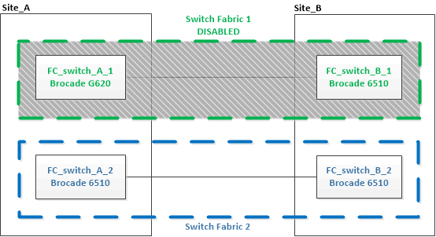

= Renovación a nuevos switches FC de Brocade
:allow-uri-read: 
:icons: font
:imagesdir: ../media/

[role="lead"]
Si va a actualizar a nuevos switches FC de Brocade, debe sustituir los switches de la primera estructura, comprobar que la configuración de MetroCluster esté totalmente operativa y, a continuación, sustituir los switches de la segunda estructura.

* La configuración de MetroCluster debe estar en buen estado y en buen estado funcionamiento normal.
* Las estructuras de switch MetroCluster constan de cuatro switches Brocade.
+
Las ilustraciones de los siguientes pasos muestran los interruptores actuales.

* Los switches deben ejecutar el firmware admitido más reciente.
+
https://mysupport.netapp.com/matrix["Herramienta de matriz de interoperabilidad de NetApp"^]

* Este procedimiento no es disruptivo y tarda aproximadamente dos horas en completarse.
* Necesita la contraseña de administrador y el acceso a un servidor FTP o SCP.
* link:enable-console-logging-before-maintenance.html["Active el registro de la consola"] antes de realizar esta tarea.

Las estructuras de switches se actualizan de uno en uno.

Al final de este procedimiento, los cuatro interruptores se actualizarán a interruptores nuevos.

image::../media/brocade_upgr_to_g620_replacement_completed.gif[se ha completado la actualización de brocade a sustitución de g620]

.Pasos
. Desactive la primera estructura del switch:
+
`*FC_switch_A_1:admin> switchCfgPersistentDisable*`

+
[listing]
----
FC_switch_A_1:admin> switchCfgPersistentDisable
----
+
image::../media/brocade_upgr_to_g620_fab_1_down.gif[brocade actualización a g620 fabuloso 1 menos]

. Sustituya los switches antiguos en un sitio de MetroCluster.
+
.. Descablear y retirar el interruptor desactivado.
.. Instale el nuevo interruptor en el rack.
+

.. Desactive los nuevos switches:
+
`switchCfgPersistentDisable`

+
El comando deshabilita ambos switches en la estructura del switch.

+
[listing]
----
FC_switch_A_1:admin> switchCfgPersistentDisable
----
.. Conecte los cables del nuevo switch mediante las asignaciones de puertos recomendadas.
+
link:concept_port_assignments_for_fc_switches_when_using_ontap_9_1_and_later.html["Asignaciones de puertos para los switches FC cuando se utiliza ONTAP 9.1 y versiones posteriores"]

.. Repita estos mismos pasos en el sitio MetroCluster del partner para sustituir el segundo switch de la primera estructura del switch.
+
Se han sustituido ambos switches de la estructura 1.

+
image::../media/brocade_upgr_to_g620_replaced_b_1.gif[brocade actualización a g620 reemplazado b 1]

. Encienda los nuevos interruptores y deje que se inicien.
. Descargue los archivos RCF del nuevo conmutador.
. Aplique los archivos RCF a ambos nuevos conmutadores de la estructura, siguiendo las instrucciones de la página de descarga.
. Guarde la configuración del switch:
+
`cfgSave`

. Espere 10 minutos para permitir que la configuración se estabilice.
. Confirme la conectividad con los discos introduciendo el siguiente comando en uno de los nodos MetroCluster:
+
`run local sysconfig -v`

+
El resultado muestra los discos conectados a los puertos del iniciador en la controladora e identifica las bandejas conectadas a los puentes FC a SAS:

+
[listing]
----

node_A_1> run local sysconfig -v
NetApp Release 9.3.2X18: Sun Dec 13 01:23:24 PST 2017
System ID: 4068741258 (node_A_1); partner ID: 4068741260 (node_B_1)
System Serial Number: 940001025471 (node_A_1)
System Rev: 70
System Storage Configuration: Multi-Path HA**<=== Configuration should be multi-path HA**
.
.
.
slot 0: FC Host Adapter 0g (QLogic 8324 rev. 2, N-port, <UP>)**<=== Initiator port**
		Firmware rev:      7.5.0
		Flash rev:         0.0.0
		Host Port Id:      0x60130
		FC Node Name:      5:00a:098201:bae312
		FC Port Name:      5:00a:098201:bae312
		SFP Vendor:        UTILITIES CORP.
		SFP Part Number:   FTLF8529P3BCVAN1
		SFP Serial Number: URQ0Q9R
		SFP Capabilities:  4, 8 or 16 Gbit
		Link Data Rate:    16 Gbit
		Switch Port:       brcd6505-fcs40:1
  **<List of disks visible to port\>**
		 ID     Vendor   Model            FW    Size
		brcd6505-fcs29:12.126L1527     : NETAPP   X302_HJUPI01TSSM NA04 847.5GB (1953525168 512B/sect)
		brcd6505-fcs29:12.126L1528     : NETAPP   X302_HJUPI01TSSA NA02 847.5GB (1953525168 512B/sect)
		.
		.
		.
		**<List of FC-to-SAS bridges visible to port\>**
		FC-to-SAS Bridge:
		brcd6505-fcs40:12.126L0        : ATTO     FibreBridge6500N 1.61  FB6500N102980
		brcd6505-fcs42:13.126L0        : ATTO     FibreBridge6500N 1.61  FB6500N102980
		brcd6505-fcs42:6.126L0         : ATTO     FibreBridge6500N 1.61  FB6500N101167
		brcd6505-fcs42:7.126L0         : ATTO     FibreBridge6500N 1.61  FB6500N102974
		.
		.
		.
  **<List of storage shelves visible to port\>**
		brcd6505-fcs40:12.shelf6: DS4243  Firmware rev. IOM3 A: 0200  IOM3 B: 0200
		brcd6505-fcs40:12.shelf8: DS4243  Firmware rev. IOM3 A: 0200  IOM3 B: 0200
		.
		.
		.
----
. Al volver al símbolo del sistema del switch, compruebe la versión del firmware del switch:
+
`firmwareShow`

+
Los switches deben ejecutar el firmware admitido más reciente.

+
https://mysupport.netapp.com/matrix["Herramienta de matriz de interoperabilidad de NetApp"]

. Simular una operación de switchover:
+
.. Desde el símbolo del sistema de cualquier nodo, cambie al nivel de privilegio avanzado: +
`set -privilege advanced`
+
Debe responder con "'y'" cuando se le solicite continuar en el modo avanzado y ver el símbolo del sistema del modo avanzado (*>).

.. Realice la operación de conmutación con el `-simulate` parámetro:
+
`metrocluster switchover -simulate`

.. Vuelva al nivel de privilegio de administrador:
+
`set -privilege admin`

. Repita los pasos anteriores en la segunda estructura del switch.

Después de repetir los pasos, se han actualizado los cuatro switches y la configuración de MetroCluster funciona correctamente.

image::../media/brocade_upgr_to_g620_replacement_completed.gif[se ha completado la actualización de brocade a sustitución de g620]
