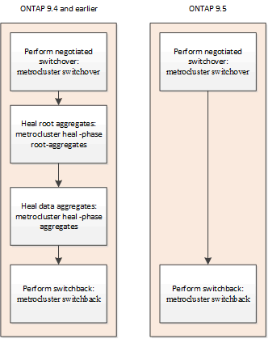

= Comprender la protección de datos y la recuperación ante desastres de MetroCluster
:allow-uri-read: 
:icons: font
:imagesdir: ../media/

[role="lead"]
Es útil comprender cómo MetroCluster protege los datos y proporciona una recuperación transparente tras los fallos, de modo que pueda gestionar sus actividades de conmutación de sitios y conmutación de estado con facilidad y eficiencia.

MetroCluster utiliza la duplicación para proteger los datos de un clúster. Proporciona recuperación ante desastres mediante un único comando de MetroCluster que activa un centro secundario en el centro superviviente para proporcionar los datos reflejados originalmente propiedad de un centro primario afectado por un desastre.

== Cómo las configuraciones de MetroCluster de ocho y cuatro nodos proporcionan conmutación por error y conmutación locales

Las configuraciones de MetroCluster de ocho y cuatro nodos protegen los datos a nivel local y de clúster. Si está configurando una configuración de MetroCluster, debe saber cómo las configuraciones de MetroCluster protegen sus datos.

Las configuraciones de MetroCluster protegen los datos mediante dos clústeres reflejados de separación física. Cada clúster refleja de forma síncrona la configuración de los datos y las máquinas virtuales de almacenamiento (SVM) del otro. Cuando se produce un desastre en un sitio, un administrador puede activar la SVM reflejada y comenzar a servir los datos reflejados del sitio superviviente. Además, los nodos de cada clúster se configuran como un par de alta disponibilidad, lo que proporciona un nivel de recuperación tras fallos local.

=== Cómo funciona la protección de datos de alta disponibilidad local en una configuración MetroCluster

Debe comprender cómo funcionan los pares de alta disponibilidad en la configuración de MetroCluster.

Los dos clústeres de la red con una relación entre iguales ofrecen recuperación ante desastres bidireccional, donde cada clúster puede ser el origen y el backup de otro clúster. Cada clúster incluye dos nodos, que se configuran como un par de alta disponibilidad. En caso de error o mantenimiento necesario dentro de la configuración de un único nodo, la conmutación por error de almacenamiento puede transferir las operaciones del nodo a su partner de alta disponibilidad local.

En la siguiente ilustración, se muestra una configuración de MetroCluster FC. La funcionalidad de alta disponibilidad es la misma en las configuraciones IP de MetroCluster, salvo que los switches de clúster proporcionan la interconexión de alta disponibilidad.

image::../media/mcc_hw_architecture_local_ha.gif[HA local en una configuración de MetroCluster]

.Información relacionada
link:https://docs.netapp.com/us-en/ontap/high-availability/index.html["Configuración de alta disponibilidad"^]

== Cómo proporcionan las configuraciones de MetroCluster la replicación de datos y de la configuración

Las configuraciones de MetroCluster utilizan una gran variedad de funciones de ONTAP para proporcionar replicación síncrona de datos y configuración entre los dos sitios de MetroCluster.

=== Protección de la configuración con el servicio de replicación de configuración

El Servicio de replicación de configuración de ONTAP (CRS) protege la configuración de MetroCluster mediante la replicación automática de la información al asociado de recuperación ante desastres.

El CRS replica de forma síncrona la configuración del nodo local al partner de recuperación ante desastres del clúster del partner. Esta replicación se realiza a través de la red de interconexión de clústeres entre iguales.

La información replicada incluye la configuración del clúster y la configuración de SVM.

=== Replicación de SVM durante las operaciones de MetroCluster

El servicio de replicación de configuración de ONTAP (CRS) proporciona la configuración del servidor de datos redundante y mirroring de los volúmenes de datos que pertenecen al SVM. Si se produce una conmutación, la SVM de origen se deja de funcionar y la SVM de destino, ubicada en el clúster superviviente, se activa.

NOTE: Los SVM de destino de la configuración de MetroCluster adjuntan automáticamente el sufijo "'-mc" a su nombre para ayudar a identificarlos. Una configuración MetroCluster adjunta el sufijo «»-mc» al nombre de los SVM de destino; si el nombre de la SVM contiene un punto, se aplicará el sufijo «»-mc» antes del primer período. Por ejemplo, si el nombre de la SVM es SVM.DNS.NAME, se añadirá el sufijo "'-mc" como SVM-MC.DNS.NAME.

En el siguiente ejemplo se muestran los SVM para una configuración de MetroCluster, donde «SVM_cluster_A» es una SVM del sitio de origen y «SVM_cluster_A-mc» es un agregado de sincronización-destino del sitio de recuperación ante desastres.

* SVM_cluster_A proporciona datos en el clúster A.
+
Es una SVM sincronizada en origen que representa la configuración de SVM (LIF, protocolos y servicios) y los datos de los volúmenes que pertenecen a la SVM. La configuración y los datos se replican en SVM_cluster_A-mc, una SVM sincronizada en destino ubicada en el clúster B.

* SVM_cluster_B proporciona datos en el clúster B.
+
Se trata de una SVM sincronizada en origen que representa la configuración y los datos para SVM_cluster_B-mc que se encuentra en el clúster A.

* SVM_cluster_B-mc es una SVM sincronizada en destino que se detiene durante el funcionamiento normal y en buen estado de la configuración de MetroCluster.
+
En una conmutación correcta del clúster B al clúster A, se detiene SVM_cluster_B y se activa SVM_cluster_B-mc y comienza a servir datos del clúster A.

* SVM_cluster_A-mc es una SVM sincronizada en destino que se detiene durante el funcionamiento normal y en buen estado de la configuración de MetroCluster.
+
En una conmutación correcta de clúster A al clúster B, SVM_cluster_A se detiene y SVM_cluster_A-mc está activado y comienza a servir datos del clúster B.

image::../media/mcc_mirroring_of_svms.gif[Duplicación de SVM de MetroCluster]

Si se produce una conmutación, el plex remoto del clúster superviviente se conecta y la SVM secundaria comienza a servir los datos.

image::../media/mcc_svms_after_switchover.gif[SVM de MetroCluster después del cambio]

La disponibilidad de complejos remotos tras la conmutación depende del tipo de configuración de MetroCluster:

* Para las configuraciones FC de MetroCluster, tras la conmutación, los complejos locales y remotos siguen en línea si se puede acceder al almacenamiento del sitio de recuperación ante desastres a través de ISL.
+
Si los ISL han fallado y el almacenamiento del sitio de recuperación ante desastres no está disponible, la SVM sincronizada en destino comienza a servir datos del sitio superviviente.

* Para las configuraciones IP de MetroCluster, la disponibilidad de los complejos remotos depende de la versión de ONTAP:
+
** A partir de ONTAP 9.5, tanto los plex locales como los remotos permanecen en línea si los nodos del sitio de recuperación tras desastres siguen arrancándose.
** Antes de ONTAP 9.5, el almacenamiento solo está disponible desde el plex local en el sitio superviviente.
+
La SVM sincronizada en destino comienza a servir datos del sitio superviviente.

.Información relacionada
https://docs.netapp.com/ontap-9/topic/com.netapp.doc.dot-cm-sag/home.html["Administración del sistema"^]

=== Cómo utilizan SyncMirror las configuraciones de MetroCluster para ofrecer redundancia de datos

Los agregados reflejados que utilizan la funcionalidad SyncMirror proporcionan redundancia de datos y contienen los volúmenes de la máquina virtual de almacenamiento (SVM) de origen y de destino. Los datos se replican en pools de discos del clúster de partners. También se admiten agregados no reflejados.

En la siguiente tabla se muestra el estado (en línea o sin conexión) de un agregado no reflejado después de un cambio:

|===

| Tipo de cambio | Estado de configuración de FC de MetroCluster | Estado de configuración IP de MetroCluster 

 a| 
Conmutación de sitios negociada (NSO)
 a| 
En línea
 a| 
Sin conexión (Nota 1)

 a| 
Conmutación de sitios no planificada automática (SIN AUSO)
 a| 
En línea
 a| 
Sin conexión (Nota 1)

 a| 
Conmutación de sitios no planificada (USO)
 a| 
* Si el almacenamiento no está disponible: Sin conexión
* Si el almacenamiento está disponible: En línea

 a| 
Sin conexión (Nota 1)

|===
*Nota 1*: En las configuraciones de IP de MetroCluster, una vez que se haya completado el cambio, puede poner en línea manualmente los agregados no reflejados.

Más información acerca de <<Diferencias de conmutación entre las configuraciones de IP y FC de MetroCluster>>.

NOTE: Tras una conmutación por cierre, si el agregado no reflejado se encuentra en el nodo del partner de recuperación ante desastres y hay un fallo de enlace entre switches (ISL), entonces puede producirse un error en el nodo local.

En la siguiente ilustración, se muestra cómo se reflejan los pools de discos entre los clústeres asociados. Los datos de complejos locales (en pool0) se replican en complejos remotos (en pool1).

IMPORTANT: Si se utilizan agregados híbridos, puede producirse una degradación del rendimiento después de que falle un SyncMirror plex debido al llenado de la capa del disco de estado sólido (SSD).

image::../media/mcc_mirroring_of_pools.gif[Duplicación de grupos de almacenamiento de MetroCluster]

=== Cómo funcionan el mirroring de caché NVRAM o NVMEM y el mirroring dinámico en las configuraciones de MetroCluster

La memoria no volátil (NVRAM o NVMEM, según el modelo de plataforma) de las controladoras de almacenamiento se refleja tanto en el entorno de alta disponibilidad local como de forma remota a un partner de recuperación ante desastres remoto del sitio del partner. En caso de conmutación al respaldo o conmutación local, esta configuración permite conservar los datos de la caché no volátil.

En un par de alta disponibilidad que no forma parte de una configuración MetroCluster, cada controladora de almacenamiento mantiene dos particiones de caché no volátiles: Una para sí misma y otra para su partner de alta disponibilidad.

En una configuración MetroCluster de cuatro nodos, la caché no volátil de cada controladora de almacenamiento se divide en cuatro particiones. En una configuración MetroCluster de dos nodos, no se utilizan la partición del compañero de alta disponibilidad ni la partición auxiliar de recuperación ante desastres, ya que las controladoras de almacenamiento no están configuradas como par de alta disponibilidad.

|===

2+| Caché no volátil para una controladora de almacenamiento 

| En una configuración MetroCluster | En una pareja de alta disponibilidad que no sea de MetroCluster 

 a| 
image:../media/mcc_nvram_quartering.gif["Almacenamiento en caché no volátil en la configuración de MetroCluster"]
 a| 
image:../media/mcc_nvram_split_in_non_mcc_ha_pair.gif["División de caché no volátil en par HA que no es MetroCluster"]

|===
Las cachés no volátiles almacenan el siguiente contenido:

* La partición local contiene datos que el controlador de almacenamiento aún no ha escrito en el disco.
* La partición de partner de alta disponibilidad contiene una copia de la caché local del partner de alta disponibilidad del controlador de almacenamiento.
+
En una configuración MetroCluster de dos nodos, no hay ninguna partición del partner de alta disponibilidad porque las controladoras de almacenamiento no están configuradas como par de alta disponibilidad.

* La partición del partner de recuperación ante desastres contiene una copia de la caché local del partner de recuperación ante desastres de la controladora de almacenamiento.
+
El partner de recuperación ante desastres es un nodo del clúster del partner que está emparejado con el nodo local.

* La partición auxiliar de recuperación ante desastres contiene una copia de la caché local del partner auxiliar de recuperación ante desastres de la controladora de almacenamiento.
+
El partner auxiliar de DR es el partner de alta disponibilidad del partner de recuperación ante desastres del nodo local. Esta caché es necesaria si se toma el control ha (ya sea cuando la configuración está en funcionamiento normal o tras un cambio de MetroCluster).

+
En una configuración MetroCluster de dos nodos, no hay ninguna partición auxiliar de recuperación ante desastres porque las controladoras de almacenamiento no están configuradas como par de alta disponibilidad.

Por ejemplo, la memoria caché local de un nodo (node_A_1) se refleja tanto de forma local como remota en los sitios MetroCluster. En la siguiente ilustración, se muestra que la caché local de node_A_1 se refleja en el partner de alta disponibilidad (node_A_2) y el partner de recuperación ante desastres (node_B_1):

image::../media/mcc_nvram_mirroring_example.gif[Ejemplo de duplicación de NVRAM de MetroCluster]

==== Mirroring dinámico en caso de toma de control local de ha

Si la toma de control de alta disponibilidad local se realiza en una configuración MetroCluster de cuatro nodos, el nodo tomado ya no puede actuar como reflejo de su partner de recuperación ante desastres. Para permitir que el mirroring de recuperación ante desastres continúe, el mirroring se cambia automáticamente al partner auxiliar de recuperación ante desastres. Tras una devolución correcta, el mirroring vuelve automáticamente al partner de recuperación ante desastres.

Por ejemplo, node_B_1 falla y es tomado por node_B_2. La caché local de node_A_1 ya no se puede reflejar en node_B_1. El mirroring cambia al partner auxiliar de recuperación ante desastres, node_B_2.

image::../media/mcc_nvram_mirroring_example_dynamic_dr_aux.gif[Duplicación de NVRAM de MetroCluster con auxiliar de DR]

== Tipos de desastres y métodos de recuperación

Debe estar familiarizado con distintos tipos de errores y desastres para que pueda utilizar la configuración de MetroCluster para responder de forma adecuada.

* Fallo de un solo nodo
+
Se produce un error en un solo componente del par de alta disponibilidad local.

+
En una configuración MetroCluster de cuatro nodos, este error podría provocar una toma de control automática o negociada del nodo dañado, según el componente que haya fallado. Se describe la recuperación de datos en link:https://docs.netapp.com/us-en/ontap/high-availability/index.html["Gestión de parejas de alta disponibilidad"^] .

+
En una configuración MetroCluster de dos nodos, este fallo provoca una conmutación automática sin planificar (AUSO).

* Fallo de la controladora en todo el sitio
+
Todos los módulos de controladoras fallan en las instalaciones debido a la pérdida de energía, la sustitución de equipos o ante desastres. Normalmente, las configuraciones de MetroCluster no pueden diferenciar entre fallos y desastres. Sin embargo, el software para testigos, como el software MetroCluster Tiebreaker, puede diferenciarlos entre ellos. Una condición de fallo de controladora en todo el sitio puede provocar una conmutación automática si los enlaces y switches de enlace entre switches (ISL) están en marcha y se puede acceder al almacenamiento.

+
link:https://docs.netapp.com/us-en/ontap/high-availability/index.html["Gestión de parejas de alta disponibilidad"^] dispone de más información sobre cómo recuperarse de los fallos de las controladoras en todo el sitio que no incluyen fallos de las controladoras, así como fallos que incluyen una o más controladoras.

* Fallo de ISL
+
Los vínculos entre los sitios fallan. La configuración de MetroCluster no realiza ninguna acción. Cada nodo continúa sirviendo datos con normalidad, pero los reflejos no se escriben en los sitios de recuperación ante desastres respectivos debido a que se pierde acceso a ellos.

* Múltiples fallos secuenciales
+
Varios componentes fallan en una secuencia. Por ejemplo, un módulo de controladora, una estructura de switches y una bandeja fallan en una secuencia, y provocan conmutación por error del almacenamiento, redundancia de estructura y SyncMirror protegiendo secuencialmente contra tiempos de inactividad y pérdida de datos.

En la siguiente tabla se muestran los tipos de fallos, así como el mecanismo de recuperación ante desastres y el método de recuperación correspondientes:

NOTE: AUSO (conmutación automática sin planificar) no es compatible con las configuraciones de IP de MetroCluster.

|===

.2+| Tipo de fallo 2+| Mecanismo de recuperación ante desastres 2+| Resumen del método de recuperación 

| Configuración con cuatro nodos | Configuración con dos nodos | Configuración con cuatro nodos | Configuración con dos nodos 

| Fallo de un solo nodo | Conmutación al respaldo de alta disponibilidad local | AUSO | No es necesario si la conmutación automática al nodo de respaldo y la devolución están habilitadas. | Una vez que se ha restaurado el nodo, el proceso de reparación manual y la conmutación de estado mediante el `metrocluster heal -phase aggregates`, `metrocluster heal -phase root-aggregates`, y. `metrocluster switchback` los comandos son obligatorios. NOTA: La `metrocluster heal` No son necesarios los comandos en las configuraciones IP de MetroCluster que ejecuten ONTAP 9.5 o una versión posterior. 

| Error en el centro 2+| Conmutación de MetroCluster 2.3+| Una vez que se ha restaurado el nodo, el proceso de reparación manual y la conmutación de estado mediante el `metrocluster healing` y.. `metrocluster switchback` los comandos son obligatorios. La `metrocluster heal` No es necesario ejecutar comandos en las configuraciones IP de MetroCluster que ejecutan ONTAP 9.5. 

| Fallo de la controladora en todo el sitio | ESTO NO SERÁ POSIBLE solo si se puede acceder al almacenamiento en el lugar en que se haya producido un desastre. | AUSO (lo mismo que fallo de un solo nodo) 

| Múltiples fallos secuenciales | Conmutación de alta disponibilidad local seguida de una conmutación forzada de MetroCluster mediante el comando switchover -forzado en caso de desastre de MetroCluster. NOTA: Dependiendo del componente que falló, es posible que no se requiera una conmutación forzada. | MetroCluster forzaba el cambio a través del `metrocluster switchover -forced-on-disaster` comando. 

| Fallo de ISL 2+| Sin conmutación de MetroCluster; los dos clústeres distribuyen sus datos de forma independiente 2+| No es necesario para este tipo de fallo. Después de restaurar la conectividad, el almacenamiento se vuelve a sincronizar automáticamente. 
|===

== Cómo una configuración MetroCluster de ocho o cuatro nodos proporciona operaciones no disruptivas

En caso de un problema limitado a un único nodo, una conmutación al nodo de respaldo y una devolución dentro del par de alta disponibilidad local proporcionan un funcionamiento continuo sin interrupciones. En este caso, la configuración de MetroCluster no requiere una conmutación de sitios al sitio remoto.

Como la configuración de MetroCluster de ocho o cuatro nodos está compuesta por uno o varios pares de alta disponibilidad en cada sitio, cada sitio puede resistir fallos locales y realizar operaciones no disruptivas sin necesidad de una conmutación al sitio de partners. La operación de la pareja de alta disponibilidad es la misma que las parejas de alta disponibilidad en configuraciones que no son de MetroCluster.

En el caso de configuraciones MetroCluster de cuatro y ocho nodos, los fallos de nodos debido a la caída de la alimentación o la alarma pueden provocar una conmutación automática al nodo de respaldo.

link:https://docs.netapp.com/us-en/ontap/high-availability/index.html["Gestión de parejas de alta disponibilidad"^]

Si se produce un segundo fallo después de una conmutación al respaldo local, el evento de conmutación de MetroCluster proporciona operaciones no disruptivas continuas. Del mismo modo, tras una operación de conmutación, en caso de un segundo fallo en uno de los nodos supervivientes, un evento de conmutación por error local proporciona operaciones no disruptivas continuas. En este caso, el único nodo superviviente sirve datos para los otros tres nodos del grupo DR.

=== Conmutación de sitios y conmutación de estado durante la transición a MetroCluster

La transición de FC a IP de MetroCluster implica agregar nodos IP y switches IP de MetroCluster a una configuración FC de MetroCluster existente y, a continuación, retirar los nodos FC de MetroCluster. Dependiendo de la etapa del proceso de transición, las operaciones de conmutación de sitios, reparación y conmutación de estado de MetroCluster utilizan diferentes flujos de trabajo.

Consulte http://docs.netapp.com/ontap-9/topic/com.netapp.doc.dot-mcc-upgrade/GUID-1870FDC4-1774-4604-86A7-5C979C297ADA.html["Operaciones de conmutación de sitios, reparación y conmutación de estado durante la transición"^].

=== Consecuencias de la conmutación por error local tras la conmutación

Si se produce un cambio de MetroCluster y luego surge un problema en el sitio superviviente, una conmutación por error local puede proporcionar un funcionamiento constante y no disruptivo. Sin embargo, el sistema está en riesgo porque ya no se encuentra en una configuración redundante.

Si se produce una conmutación por error local después de producirse una conmutación, una única controladora proporciona datos a todos los sistemas de almacenamiento de la configuración de MetroCluster, lo que provoca posibles problemas con los recursos y es vulnerable a fallos adicionales.

== Cómo una configuración MetroCluster de dos nodos proporciona operaciones no disruptivas

Si uno de los dos sitios tiene un problema debido al pánico, la conmutación de MetroCluster proporciona un funcionamiento continuo sin interrupciones. Si la pérdida de alimentación afecta tanto al nodo como al almacenamiento, la conmutación no es automática y se produce una interrupción hasta el `metrocluster switchover` se emite el comando.

Como todo el almacenamiento se duplica, se puede usar una operación de conmutación para proporcionar resiliencia no disruptiva en caso de un fallo del sitio similar al que se observa en una conmutación al nodo de respaldo del almacenamiento en un par de alta disponibilidad para un fallo de un nodo.

En el caso de configuraciones de dos nodos, los mismos eventos que activan una conmutación automática al respaldo de almacenamiento en un par de alta disponibilidad activan una conmutación automática sin planificar (AUSO). Esto significa que una configuración MetroCluster de dos nodos tiene el mismo nivel de protección que una pareja de alta disponibilidad.

.Información relacionada
link:concept_understanding_mcc_data_protection_and_disaster_recovery.html["Cambio automático de conmutación por cierre no planificado en configuraciones MetroCluster FC"]

== Descripción general del proceso de cambio

La operación de conmutación de sitios de MetroCluster permite la reanudación inmediata de los servicios tras un desastre gracias al traslado del acceso de cliente y almacenamiento del clúster de origen al sitio remoto. En caso de que se produzca una conmutación, debe estar al tanto de los cambios que se esperan y de las acciones que debe realizar.

Durante una operación de conmutación de sitios, el sistema realiza las siguientes acciones:

* La propiedad de los discos que pertenecen al sitio de recuperación ante desastres ha cambiado al partner de recuperación ante desastres.
+
Esto es similar al caso de una conmutación por error local en una pareja de alta disponibilidad, en la cual la propiedad de los discos que pertenecen al partner inactivo se cambia al partner en buen estado.

* Los plex sobrevivientes que se encuentran en el sitio superviviente pero pertenecen a los nodos del clúster de desastres se ponen en línea en el clúster en el sitio superviviente.
* La máquina virtual de almacenamiento (SVM) sincronizada en origen que pertenece al sitio de desastre solo se reduce durante un cambio negociado.
+

NOTE: Esto solo se aplica a una conmutación negociada.

* Se activa la SVM sincronizada en destino que pertenece al sitio de recuperación ante desastres.

Mientras se está conmutando, los agregados raíz del partner de recuperación ante desastres no se activan mediante conexión.

La `metrocluster switchover` El comando cambia a través de los nodos de todos los grupos de recuperación ante desastres de la configuración de MetroCluster. Por ejemplo, en una configuración MetroCluster de ocho nodos, conmuta a los nodos en ambos grupos de recuperación ante desastres.

Si va a cambiar sólo los servicios al sitio remoto, debe realizar una conmutación negociada sin cercar el sitio. Si el almacenamiento o el equipo no son fiables, debe proteger el sitio de recuperación ante desastres y, a continuación, llevar a cabo una conmutación de sitios no planificada. La delimitación evita las reconstrucciones RAID cuando los discos se conectan de forma escalonada.

NOTE: Este procedimiento sólo debe utilizarse si el otro sitio es estable y no está previsto que se desconecte.

=== Disponibilidad de comandos durante el cambio

En la siguiente tabla se muestra la disponibilidad de los comandos durante la conmutación:

|===

| Comando | Disponibilidad 

 a| 
`storage aggregate create`
 a| 
Se puede crear un agregado:

* Si es propiedad de un nodo que forma parte del clúster superviviente

No se puede crear un agregado:

* Para un nodo en el sitio de recuperación ante desastres
* Para un nodo que forma parte del clúster superviviente

 a| 
`storage aggregate delete`
 a| 
Puede eliminar un agregado de datos.

 a| 
`storage aggregate mirror`
 a| 
Puede crear un complejo para un agregado no reflejado.

 a| 
`storage aggregate plex delete`
 a| 
Puede eliminar un complejo para un agregado reflejado.

 a| 
`vserver create`
 a| 
Puede crear una SVM:

* Si su volumen raíz reside en un agregado de datos que pertenece al clúster superviviente

No se puede crear una SVM:

* Si su volumen raíz reside en un agregado de datos que pertenece al clúster de sitios de desastres

 a| 
`vserver delete`
 a| 
Puede eliminar tanto las SVM sincronizada en origen como las de destino.

 a| 
`network interface create -lif`
 a| 
Puede crear una LIF de SVM de datos para SVM sincronizada en origen y destino.

 a| 
`network interface delete -lif`
 a| 
Puede eliminar una LIF de SVM de datos para SVM sincronizada en origen y destino.

 a| 
`volume create`
 a| 
Puede crear un volumen para SVM sincronizada en origen y destino.

* En el caso de una SVM sincronizada en origen, el volumen debe residir en un agregado de datos que sea propiedad del clúster superviviente
* Para una SVM sincronizada en destino, el volumen debe residir en un agregado de datos que sea propiedad del clúster de sitio de desastres

 a| 
`volume delete`
 a| 
Puede eliminar un volumen para SVM sincronizada en origen y destino.

 a| 
`volume move`
 a| 
Puede mover un volumen para SVM sincronizada en origen y destino.

* Para una SVM sincronizada en origen, el clúster superviviente debe ser el propietario del agregado de destino
* Para una SVM sincronizada en destino, el clúster de sitio de desastres debe ser el propietario del agregado de destino

 a| 
`snapmirror break`
 a| 
Es posible romper una relación de SnapMirror entre un extremo de origen y de destino de un reflejo de protección de datos.

|===

=== Diferencias de conmutación entre las configuraciones de IP y FC de MetroCluster

En configuraciones de IP de MetroCluster, como se accede a los discos remotos a través de los nodos asociados de recuperación ante desastres remotos que actúan como destinos iSCSI, no se puede acceder a los discos remotos cuando los nodos remotos se ven inactivos en una operación de conmutación de sitios. El resultado es diferencias con las configuraciones de FC de MetroCluster:

* Los agregados reflejados que son propiedad del clúster local se degradan.
* Los agregados reflejados que se conmutaron al nodo de respaldo del clúster remoto se degradaron.

NOTE: Si se admiten agregados no reflejados en una configuración IP de MetroCluster, no se puede acceder a los agregados no reflejados que se conmutan desde el clúster remoto.

=== Cambios en la propiedad de disco durante la toma de control de alta disponibilidad y el cambio de MetroCluster en una configuración MetroCluster de cuatro nodos

La propiedad de discos cambia temporalmente automáticamente durante las operaciones de alta disponibilidad y de MetroCluster. Resulta útil saber cómo el sistema realiza el seguimiento de qué nodo posee qué discos.

En ONTAP, se utiliza el ID de sistema único del módulo de una controladora (obtenido de la tarjeta NVRAM de un nodo o de la placa de NVMEM) para identificar qué nodo posee un disco específico. Según el estado de alta disponibilidad o recuperación ante desastres del sistema, la propiedad del disco podría cambiar temporalmente. Si la propiedad cambia debido a la toma de control de alta disponibilidad o a una conmutación de recuperación ante desastres, el sistema registra qué nodo es el propietario original (llamado «home») del disco, de modo que puede devolver la propiedad tras la devolución de alta disponibilidad o la conmutación de recuperación ante desastres. El sistema utiliza los siguientes campos para realizar un seguimiento de la propiedad del disco:

* Propietario
* Propietario del hogar
* Propietario del hogar de recuperación ante desastres

En la configuración de MetroCluster, en el caso de una conmutación de sitios, un nodo puede tomar la propiedad de un agregado que originalmente era propiedad de los nodos del clúster de partners. Dichos agregados se denominan agregados externos de clúster. La característica distintiva de un agregado de clúster-extranjero es que se trata de un agregado que actualmente no es conocido por el clúster, por lo que el campo propietario de la casa de recuperación ante desastres se utiliza para mostrar que es propiedad de un nodo del clúster asociado. Un agregado externo tradicional dentro de un par de alta disponibilidad está identificado por los valores de propietario y propietario del hogar que son diferentes, pero los valores propietario y propietario del hogar son los mismos para un agregado de clúster-extranjero; por lo tanto, puede identificar un agregado de clúster-extranjero mediante el valor de propietario de la casa de recuperación ante desastres.

A medida que cambia el estado del sistema, los valores de los campos cambian, como se muestra en la siguiente tabla:

|===

.2+| Campo 4+| Valor durante... 

| Funcionamiento normal | Toma de control local de ha | Conmutación de MetroCluster | Toma de control durante la conmutación 

 a| 
Propietario
 a| 
El ID del nodo que tiene acceso al disco.
 a| 
ID del partner de alta disponibilidad, que tiene acceso temporalmente al disco.
 a| 
ID del partner de recuperación ante desastres, que tiene acceso temporalmente al disco.
 a| 
ID del partner auxiliar de recuperación ante desastres, que tiene acceso al disco temporalmente.

 a| 
Propietario del hogar
 a| 
ID del propietario original del disco dentro de la pareja de ha.
 a| 
ID del propietario original del disco dentro de la pareja de ha.
 a| 
ID del partner de recuperación ante desastres, que es el propietario inicial del par de alta disponibilidad durante la conmutación.
 a| 
ID del partner de recuperación ante desastres, que es el propietario inicial del par de alta disponibilidad durante la conmutación.

 a| 
Propietario del hogar de recuperación ante desastres
 a| 
Vacío
 a| 
Vacío
 a| 
El ID del propietario original del disco dentro de la configuración de MetroCluster.
 a| 
El ID del propietario original del disco dentro de la configuración de MetroCluster.

|===
La siguiente ilustración y tabla proporcionan un ejemplo de cómo cambia la propiedad de un disco en la agrupación de discos del nodo_A_1, ubicado físicamente en cluster_B.

image::../media/mcc_disk_ownership.gif[Propiedad del disco de MetroCluster]

|===

| Estado de MetroCluster | Propietario | Propietario del hogar | Propietario del hogar de recuperación ante desastres | Notas 

 a| 
Normal en todos los nodos completamente operativos.
 a| 
Node_a_1
 a| 
Node_a_1
 a| 
no aplicable
 a| 

 a| 
Toma de control de alta disponibilidad local, node_A_2 ha tomado el control de discos que pertenecen a su partner de alta disponibilidad node_A_1.
 a| 
Node_A_2
 a| 
Node_a_1
 a| 
no aplicable
 a| 

 a| 
Conmutación al nodo de recuperación ante desastres, node_B_1 ha tomado el control de los discos que pertenecen a su partner de recuperación ante desastres, node_A_1.
 a| 
Node_B_1
 a| 
Node_B_1
 a| 
Node_a_1
 a| 
El ID original del nodo de inicio se mueve al campo propietario principal de recuperación ante desastres. Después de la conmutación de estado o reparación del agregado, la propiedad vuelve a node_A_1.

 a| 
En la conmutación de recuperación ante desastres y la toma de control de alta disponibilidad local (doble fallo), node_B_2 ha tomado el control de los discos que pertenecen a su nodo de alta disponibilidad_B_1.
 a| 
Node_B_2
 a| 
Node_B_1
 a| 
Node_a_1
 a| 
Tras la devolución, la propiedad vuelve al nodo B_1. Después de esta conmutación de estado o reparación, la propiedad vuelve al nodo_A_1.

 a| 
Después del retorno de la alta disponibilidad y de la conmutación de estado de recuperación ante desastres, todos los nodos están totalmente operativos.
 a| 
Node_a_1
 a| 
Node_a_1
 a| 
no aplicable
 a| 

|===

=== Consideraciones que tener en cuenta al utilizar agregados no reflejados

Si la configuración incluye agregados no reflejados, debe tener en cuenta los posibles problemas de acceso tras las operaciones de conmutación.

==== Consideraciones sobre los agregados no reflejados al realizar tareas de mantenimiento que requieren apagado y encendido

Si está realizando una conmutación de sitios negociada por motivos de mantenimiento que requieran un apagado de alimentación de todo el sitio, primero debe desconectar manualmente todos los agregados no reflejados propiedad del sitio de desastre.

Si no lo hace, los nodos del sitio superviviente podrían desaparecer debido a una alarma por varios discos. Esto puede suceder si los agregados de conmutación sin mirroring no se desconectan o no existen debido a la pérdida de conectividad al almacenamiento en el sitio de recuperación ante desastres debido al apagado de alimentación o a la pérdida de ISL.

==== Consideraciones sobre los agregados no reflejados y los espacios de nombres jerárquicos

Si utiliza espacios de nombres jerárquicos, debe configurar la ruta de unión de modo que todos los volúmenes de esa ruta estén en agregados reflejados o solo en agregados no reflejados. La configuración de una combinación de agregados no reflejados y reflejados en la ruta de unión puede impedir el acceso a los agregados no reflejados después de la operación de conmutación.

==== Consideraciones sobre los agregados no reflejados, el volumen de metadatos de CRS y los volúmenes raíz de la SVM de datos

El volumen de metadatos del servicio de replicación de configuración (CRS) y los volúmenes raíz de la SVM de datos deben estar en un agregado reflejado. No se pueden mover estos volúmenes a un agregado no reflejado. Si se encuentran en agregados sin mirroring, las operaciones de conmutación de sitios y conmutación de estado negociadas son vetadas. La `metrocluster check` el comando proporciona una advertencia si este es el caso.

==== Consideraciones sobre agregados y SVM no reflejados

Las instancias de SVM solo deben configurarse en agregados reflejados o solo en agregados no reflejados. La configuración de una combinación de agregados no reflejados y sin mirroring puede provocar una operación de conmutación por cierre que supere los 120 segundos y provocar una interrupción de los datos si los agregados no reflejados no se encuentran en línea.

==== Consideraciones sobre agregados y SAN no reflejados

No se debe ubicar un LUN en un agregado no reflejado. Configurar un LUN en un agregado no reflejado puede provocar una operación de conmutación por encima de 120 segundos y una interrupción del servicio de los datos.

=== Cambio automático de conmutación por cierre no planificado en configuraciones MetroCluster FC

En las configuraciones de FC de MetroCluster, algunas situaciones pueden activar una conmutación por error no planificada automática (AUSO) en caso de que una controladora en todo el sitio no pueda proporcionar operaciones no disruptivas. SI lo desea, LA AUSO puede desactivarse.

NOTE: La configuración de IP de MetroCluster no admite conmutación automática de sitios sin planificar.

En una configuración MetroCluster FC, se puede activar UN MODO AUSO si no se han podido completar todos los nodos de un sitio debido a los siguientes motivos:

* Apagado
* Pérdida de potencia
* Pánico

NOTE: En una configuración FC de MetroCluster de ocho nodos, puede establecer una opción para activar UNA AUSO si fallan ambos nodos de un par de alta disponibilidad.

Como no hay ninguna conmutación por error de alta disponibilidad local disponible en una configuración MetroCluster de dos nodos, el sistema realiza UNA PAUSA PARA proporcionar una operación continuada después de un fallo de controladora. Esta funcionalidad es similar a la funcionalidad de toma de control de alta disponibilidad en un par de alta disponibilidad. En una configuración MetroCluster de dos nodos, se puede activar UNA AUSO en las siguientes situaciones:

* Apague el nodo
* Pérdida de alimentación de los nodos
* Alarma de nodos
* Reinicio del nodo

Si se produce UN RESULTADO, la propiedad de disco de los discos pool0 y pool1 del nodo dañado se cambia al partner de recuperación ante desastres (DR). Este cambio de propiedad impide que los agregados entren en estado degradado tras la conmutación.

Después del cambio automático, debe continuar manualmente con las operaciones de reparación y conmutación de estado para que la controladora vuelva a su funcionamiento normal.

==== AUSO asistida por hardware en configuraciones MetroCluster de dos nodos

En una configuración MetroCluster de dos nodos, Service Processor (SP) del módulo de la controladora supervisa la configuración. En algunos casos, el SP puede detectar un fallo más rápido que el software ONTAP. En este caso, el SP activa AUSO. Esta función se habilita automáticamente.

El SP envía y recibe tráfico SNMP a y desde su partner de recuperación ante desastres para supervisar su estado.

==== Cambio de la configuración DE AUSO en las configuraciones de MetroCluster FC

AUSO se establece en “auso-on-cluster-disaster” por defecto. Su estado se puede ver en la `metrocluster show` comando.

NOTE: La configuración DE AUSO no se aplica a las configuraciones IP de MetroCluster.

Puede desactivar AUSO con el `metrocluster modify -auto-switchover-failure-domain auto-disabled` comando. Este comando evita la activación DE UNA AUSO en un fallo de controladora para todo el sitio de DR. Se debe ejecutar en ambos sitios si desea desactivar AUSO en ambos sitios.

AUSO se puede volver a activar con el `metrocluster modify -auto-switchover-failure-domain auso-on-cluster-disaster` comando.

AUSO puede establecerse también en «"auso-on-dr-group-siniestro"». Este comando de nivel avanzado activa UNA OPERACIÓN DE FAILOVER DE alta disponibilidad EN un sitio. Debe ejecutarse en ambos sitios con el `metrocluster modify -auto-switchover-failure-domain auso-on-dr-group-disaster` comando.

==== El ajuste DE AUSO durante la conmutación

Cuando se produce la conmutación, la configuración DE AUSO se deshabilita internamente porque si un sitio está en la conmutación, no puede conmutar automáticamente.

==== Recuperación de AUSO

Para realizar la recuperación desde UNA AUSO, siga los mismos pasos que para una conmutación planificada.

link:task_perform_switchover_for_tests_or_maintenance.html["Realizar la conmutación de sitios para pruebas o mantenimiento"]

=== Conmutación de sitios automática no planificada asistida por mediador en configuraciones de IP de MetroCluster

link:../install-ip/concept-ontap-mediator-supports-automatic-unplanned-switchover.html["Obtenga más información sobre cómo Mediator de ONTAP admite la conmutación automática de sitios no planificados en las configuraciones de IP de MetroCluster"].

== Qué sucede durante la reparación (configuraciones de MetroCluster FC)

Durante el proceso de reparación en las configuraciones FC de MetroCluster, la resincronización de los agregados reflejados se da en un proceso por fases que prepara los nodos en el sitio de desastre reparado para regresar. Se trata de un evento planificado, por lo que le ofrece un control completo de cada paso para minimizar el tiempo de inactividad. La reparación es un proceso de dos pasos que se produce en los componentes de almacenamiento y controladora.

=== Reparación de agregados de datos

Una vez resuelto el problema en el sitio de desastre, inicia la fase de recuperación del almacenamiento:

. Comprueba que todos los nodos estén activos y en funcionamiento en el sitio superviviente.
. Cambia la propiedad de todos los discos del pool 0 en el sitio de recuperación ante desastres, incluidos los agregados raíz.

Durante esta fase de reparación, el subsistema RAID vuelve a sincronizar los agregados reflejados y el subsistema WAFL reproduce los archivos nvsave de agregados reflejados que tenían un pool 1 plex fallido en el momento de la conmutación.

Si algunos componentes de almacenamiento de origen han fallado, el comando informa de los errores en los niveles aplicables: Almacenamiento, Sanown o RAID.

Si no se informa de ningún error, los agregados se resincronizan correctamente. A veces, este proceso puede tardar horas en completarse.

link:../manage/task_verifiy_that_your_system_is_ready_for_a_switchover.html["Reparar la configuración"]

=== Reparación de agregados raíz

Una vez sincronizados los agregados, comienza la fase de reparación de la controladora, ya que devuelven los agregados CFO y los agregados raíz a sus respectivos socios de recuperación ante desastres.

link:../manage/task_verifiy_that_your_system_is_ready_for_a_switchover.html["Reparar la configuración"]

== Qué sucede durante la reparación (configuraciones de MetroCluster IP)

Durante el proceso de reparación en las configuraciones IP de MetroCluster, la resincronización de los agregados reflejados se realiza en fases que prepara los nodos en el sitio de desastre reparado para regresar. Se trata de un evento planificado, por lo que le ofrece un control completo de cada paso para minimizar el tiempo de inactividad. La reparación es un proceso de dos pasos que se produce en los componentes de almacenamiento y controladora.

=== Diferencias respecto de las configuraciones de FC de MetroCluster

En las configuraciones de IP de MetroCluster, debe arrancar los nodos en el clúster del sitio de desastres antes de que se realice la operación de reparación.

Los nodos del clúster de sitios de desastres deben estar en ejecución para que se pueda acceder a los discos iSCSI remotos cuando se resincronizan los agregados.

Si los nodos del sitio de desastres no están en ejecución, la operación de reparación genera errores porque el nodo de desastre no puede ejecutar los cambios de propiedad de disco necesarios.

=== Reparación de agregados de datos

Una vez resuelto el problema en el sitio de desastre, inicia la fase de recuperación del almacenamiento:

. Comprueba que todos los nodos estén activos y en funcionamiento en el sitio superviviente.
. Cambia la propiedad de todos los discos del pool 0 en el sitio de recuperación ante desastres, incluidos los agregados raíz.

Durante esta fase de reparación, el subsistema RAID vuelve a sincronizar los agregados reflejados y el subsistema WAFL reproduce los archivos nvsave de agregados reflejados que tenían un pool 1 plex fallido en el momento de la conmutación.

Si algunos componentes de almacenamiento de origen han fallado, el comando informa de los errores en los niveles aplicables: Almacenamiento, Sanown o RAID.

Si no se informa de ningún error, los agregados se resincronizan correctamente. A veces, este proceso puede tardar horas en completarse.

link:../manage/task_verifiy_that_your_system_is_ready_for_a_switchover.html["Reparar la configuración"]

=== Reparación de agregados raíz

Una vez que se han sincronizado los agregados, se ejecuta la fase de reparación del agregado raíz. En las configuraciones de IP de MetroCluster, esta fase confirma que los agregados se han recuperado.

link:../manage/task_verifiy_that_your_system_is_ready_for_a_switchover.html["Reparar la configuración"]

== Reparación automática de los agregados en las configuraciones de IP de MetroCluster tras la conmutación

A partir de ONTAP 9.5, el proceso de reparación se automatiza durante las operaciones de conmutación de sitios negociadas en configuraciones IP de MetroCluster. A partir de ONTAP 9.6, se admiten recuperaciones automatizadas tras efectuar una conmutación por cierre no programada. Esto elimina el requisito de emitir el `metrocluster heal` comandos.

=== Reparación automática tras la conmutación negociada (empezando por ONTAP 9.5)

Tras realizar una conmutación negociada (un comando de conmutación emitido sin la opción -forzado en caso de desastre verdadero), la funcionalidad de reparación automática simplifica los pasos necesarios para hacer que el sistema funcione correctamente. En los sistemas con reparación automática, ocurre lo siguiente después de la conmutación:

* Los nodos del sitio de recuperación tras desastres siguen en funcionamiento.
+
Como están en estado de conmutación, no proporcionan datos de sus complejos duplicados locales.

* Los nodos del sitio del desastre se mueven al estado «'esperando regreso'».
+
Puede confirmar el estado de los nodos del sitio de desastre mediante el comando MetroCluster operation show.

* Puede llevar a cabo la operación de conmutación de estado sin utilizar los comandos de reparación.

Esta función se aplica a las configuraciones IP de MetroCluster que ejecuten ONTAP 9.5 y posteriores. No se aplica a configuraciones MetroCluster FC.

Los comandos de reparación manual siguen siendo necesarios en las configuraciones IP de MetroCluster que ejecutan ONTAP 9.4 y versiones anteriores.

=== Reparación automática tras cambio no programado (empezando por ONTAP 9.6)

La reparación automática tras una conmutación sin programar es compatible con las configuraciones IP de MetroCluster, empezando por ONTAP 9.6. Un cambio no programado es uno en el que se emite el `switchover` con el `-forced-on-disaster true` opción.

La reparación automática tras una conmutación sin programar no es compatible con las configuraciones de FC de MetroCluster, mientras que los comandos de reparación manual siguen siendo necesarios tras una conmutación por cierre no programada en configuraciones de IP de MetroCluster que ejecuten ONTAP 9.5 y versiones anteriores.

En sistemas que ejecutan ONTAP 9.6 y posteriores, se produce lo siguiente después de la conmutación no programada:

* En función de la magnitud del desastre, los nodos del sitio en caso de desastre pueden estar inactivos.
+
Como están en estado de conmutación, no proporcionan datos de sus complejos reflejados locales, incluso si están encendidos.

* Si los sitios de desastre estuvieran inactivos, al arrancar, los nodos del sitio de desastre se mueven al estado «'esperando regreso'».
+
Si los sitios de desastre permanecieron en funcionamiento, se trasladarán inmediatamente al estado de "esperando regreso".

* Las operaciones de reparación se realizan automáticamente.
+
Puede confirmar el estado de los nodos del sitio de desastre y que las operaciones de reparación se han realizado correctamente mediante el `metrocluster operation show` comando.

image::../media/mcc_uso_with_autoheal.gif[Cambio no programado de MetroCluster con recuperación automática]

=== Si la reparación automática falla

Si la operación de reparación automática falla por cualquier motivo, debe emitir el `metrocluster heal` Comandos manualmente como se realiza en las versiones de ONTAP anteriores a ONTAP 9.6. Puede utilizar el `metrocluster operation show` y.. `metrocluster operation history show -instance` comandos para supervisar el estado de reparación y determinar la causa de un fallo.

== Crear SVM para una configuración de MetroCluster

Puede crear SVM para una configuración de MetroCluster a fin de proporcionar recuperación ante desastres síncrona y alta disponibilidad de datos en clústeres que se configuran para una configuración de MetroCluster.

* Los dos clústeres deben estar en una configuración de MetroCluster.
* Los agregados deben estar disponibles y en línea en ambos clústeres.
* Si es necesario, deben crearse espacios IP con los mismos nombres en ambos clústeres.
* Si uno de los clusters que forman la configuración MetroCluster se reinicia sin utilizar una conmutación, los SVM sincronizada en origen pueden entrar en línea como «deba encabezarse» en lugar de «tarted».

Cuando se crea un SVM en uno de los clústeres de una configuración MetroCluster, la SVM se crea como el SVM de origen y la SVM del partner se crea automáticamente con el mismo nombre, pero con el sufijo «»-mc» del clúster de partners. Si el nombre de SVM contiene un punto, se aplica el sufijo «»-mc» antes del primer período, por ejemplo, SVM-MC.DNS.NAME.

En una configuración MetroCluster, puede crear 64 SVM en un clúster. Una configuración MetroCluster admite 128 SVM.

. Utilice la `vserver create` comando.
+
El siguiente ejemplo muestra la SVM con el subtipo «sincronizar-source» del sitio local y la SVM con el subtipo «sincronizar-destino» del sitio del partner:

+
[listing]
----
cluster_A::>vserver create -vserver vs4 -rootvolume vs4_root -aggregate aggr1
-rootvolume-security-style mixed
[Job 196] Job succeeded:
Vserver creation completed
----
+
La SVM «'vs4» se crea en el sitio local y la SVM «'vs4-mc» se crea en el sitio del partner.

. Consulte las SVM recién creadas.
+
** En el clúster local, compruebe el estado de configuración de las SVM:
+
`metrocluster vserver show`

+
En el ejemplo siguiente se muestran las SVM del partner y su estado de configuración:

+
[listing]
----
cluster_A::> metrocluster vserver show

                      Partner    Configuration
Cluster     Vserver   Vserver    State
---------  --------  --------- -----------------
cluster_A   vs4       vs4-mc     healthy
cluster_B   vs1       vs1-mc     healthy
----
** Desde los clústeres local y de partners, compruebe el estado de las SVM recién configuradas:
+
`vserver show command`

+
En el ejemplo siguiente se muestran los estados administrativos y operativos de las SVM:

+
[listing]
----
cluster_A::> vserver show

                             Admin   Operational Root
Vserver Type  Subtype        State   State       Volume     Aggregate
------- ----- -------       ------- --------    ----------- ----------
vs4     data  sync-source   running   running    vs4_root   aggr1

cluster_B::> vserver show

                               Admin   Operational  Root
Vserver Type  Subtype          State   State        Volume      Aggregate
------- ----- -------          ------  ---------    ----------- ----------
vs4-mc  data  sync-destination running stopped      vs4_root    aggr1
----

+
Podría producirse un error en la creación de SVM si alguna operación intermedia, como la creación de volúmenes raíz, se produce un error y la SVM está en estado "'inicializando'". Debe eliminar la SVM y volver a crearla.

Las SVM para la configuración MetroCluster se crean con un tamaño de volumen raíz de 1 GB. La SVM sincronizada en origen se encuentra en el estado «en funcionamiento» y la SVM sincronizada en destino tiene un estado «de parada».

== Qué sucede durante una conmutación de regreso

Una vez que el sitio de recuperación ante desastres ha recuperado y los agregados se han curado, el proceso de conmutación de estado de MetroCluster devuelve el acceso al cliente y al almacenamiento desde el sitio de recuperación ante desastres al clúster principal.

La `metrocluster switchback` El comando devuelve el sitio primario al funcionamiento completo y normal de la MetroCluster. Todos los cambios de configuración se propagan a las SVM originales. A continuación, la operación del servidor de datos regresa a las SVM de origen síncrono en el sitio de desastres y se desactivan las SVM que habían estado en funcionamiento en el sitio superviviente.

Si los SVM se eliminaron en el sitio superviviente mientras la configuración de MetroCluster estaba en estado de conmutación, el proceso de conmutación de estado hace lo siguiente:

* Elimina las SVM correspondientes en el sitio del partner (el sitio anterior del desastre).
* Elimina las relaciones de paridad de las SVM eliminadas.

