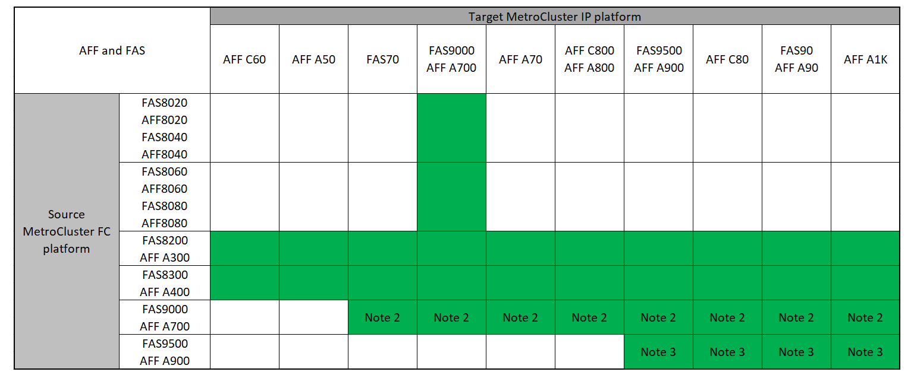

= Elija el procedimiento de transición
:allow-uri-read: 
:icons: font
:imagesdir: ../media/

[role="lead"]
Cuando se realiza la transición a una configuración IP de MetroCluster, debe contar con una combinación de modelos de plataforma compatibles.

También debe asegurarse de que la plataforma IP de MetroCluster tenga un tamaño adecuado para la carga que realice la transición de la configuración FC de MetroCluster a la configuración IP de MetroCluster.

== Combinaciones de plataformas compatibles

* Todos los procedimientos de transición requieren ONTAP 9.8 o posterior a menos que se indique lo contrario en las notas o según lo requiera una plataforma individual.
* Todos los nodos de la configuración de MetroCluster deben ejecutar la misma versión de ONTAP. Por ejemplo, si tiene una configuración de ocho nodos, los ocho nodos deben ejecutar la misma versión de ONTAP. Consulte link:https://hwu.netapp.com["Hardware Universe"^]la para obtener la versión mínima compatible de ONTAP para su combinación.

[NOTE]
====
* No exceda los límites de objeto de la "parte inferior" de las plataformas en la combinación. Aplique el límite inferior de objetos de las dos plataformas.
* Si los límites de la plataforma de destino son inferiores a los límites de MetroCluster, debe volver a configurar el MetroCluster para que sea igual o inferior a los límites de la plataforma de destino antes de agregar los nuevos nodos.
* Consulte la link:https://hwu.netapp.com["Hardware Universe"^] para límites de plataforma.

====

=== Combinaciones compatibles con la transición AFF y FAS

En las siguientes tablas se muestran las combinaciones de plataformas admitidas. Puede realizar la transición de plataformas en la primera columna a plataformas enumeradas como admitidas en las columnas a la derecha, como lo indican las celdas de la tabla coloreadas.

Por ejemplo, se admite la transición de una configuración FC de MetroCluster que consiste en módulos de controladoras AFF8060 a una configuración IP que consta de los módulos de controladoras AFF A400.

Las tablas se dividen en dos grupos:

* *El Grupo 1* muestra combinaciones para transiciones a sistemas AFF A150, AFF A20, FAS2750, FAS8300, FAS500f, AFF C250, AFF A250, FAS50, AFF C30, AFF A30, FAS8200, AFF C400, AFF A400, AFF A220, AFF A300, AFF A320 y FAS8700.
* *El Grupo 2* muestra combinaciones para transiciones a sistemas AFF C60, AFF A50, FAS70, FAS9000, AFF A700, AFF A70, AFF C800, AFF A800, FAS9500, AFF A900, AFF C80, FAS90, AFF A90 y AFF A1K.

Las siguientes notas se aplican a ambos grupos:

* Nota 1: Esta combinación de plataformas requiere ONTAP 9.11.1 o posterior.
* Nota 2: Debe tener una interfaz de 40 GbE para las interfaces del clúster local en los nodos FC.
* Nota 3: Debe tener una interfaz de 100 GbE para las interfaces de clúster local en los nodos FC.

[role="tabbed-block"]
====
.Grupo de combinaciones AFF y FAS 1
--
Revise las combinaciones admitidas para las transiciones a sistemas AFF A150, AFF A20, FAS2750, FAS8300, FAS500f, AFF C250, AFF A250, FAS50, AFF C30, AFF A30, FAS8200, AFF A300, AFF A400, AFF A220, AFF C400, AFF A320 y FAS8700.

image:../media/transition-combinations-group-1.png["Muestra las transiciones admitidas para las plataformas del grupo 1"]

--
.Grupo de combinaciones AFF y FAS 2
--
Revise las combinaciones admitidas para las transiciones a sistemas AFF C60, AFF A50, FAS70, FAS9000, AFF A700, AFF A70, AFF C800, AFF A800, FAS9500, AFF A900, AFF C80, FAS90, AFF A90 y AFF A1K.

--
====

=== Combinaciones de plataformas de transición ASA compatibles

La siguiente tabla muestra las combinaciones de plataformas compatibles para los sistemas ASA.

[cols="3*"]
|===
| Plataforma FC de MetroCluster de origen | Plataforma IP de MetroCluster de destino | Compatible? 

.2+| ASA A400 | ASA A400 | Sí 

| ASA A900 | No 

.2+| ASA A900 | ASA A400 | No 

| ASA A900 | Sí 
|===

== Elija el procedimiento de transición

Debe seleccionar un procedimiento de transición según la configuración existente de FC de MetroCluster.

Un procedimiento de transición reemplaza la estructura de switch FC back-end o la conexión FC-VI con una red de switch IP. El procedimiento exacto depende de la configuración inicial.

Las plataformas originales y los switches FC (si existen) se retiran al final del procedimiento de transición.

[cols="20,20,20,40"]
|===

| Iniciando configuración | Disruptivas y no disruptivo | Requisitos | Procedimiento 

 a| 
Cuatro u ocho nodos
 a| 
No disruptivas
 a| 
Las nuevas plataformas admiten las nuevas bandejas de almacenamiento.
 a| 
link:concept_nondisruptively_transitioning_from_a_four_node_mcc_fc_to_a_mcc_ip_configuration.html["Enlace al procedimiento"]

 a| 
Dos nodos
 a| 
Disruptivo
 a| 
Las nuevas bandejas de almacenamiento son compatibles tanto con las plataformas originales como con las nuevas.
 a| 
link:task_disruptively_transition_from_a_two_node_mcc_fc_to_a_four_node_mcc_ip_configuration.html["Enlace al procedimiento"]

 a| 
Dos nodos
 a| 
Disruptivo
 a| 
Las nuevas bandejas de almacenamiento son compatibles tanto con las plataformas originales como con las nuevas. Es necesario retirar las bandejas de almacenamiento antiguas.
 a| 
link:task_disruptively_transition_while_move_volumes_from_old_shelves_to_new_shelves.html["Enlace al procedimiento"]

 a| 
Dos nodos
 a| 
Disruptivo
 a| 
Las bandejas de almacenamiento anteriores no son compatibles con las nuevas plataformas. Es necesario retirar las bandejas de almacenamiento antiguas.
 a| 
link:task_disruptively_transition_when_exist_shelves_are_not_supported_on_new_controllers.html["Enlace al procedimiento"]

|===