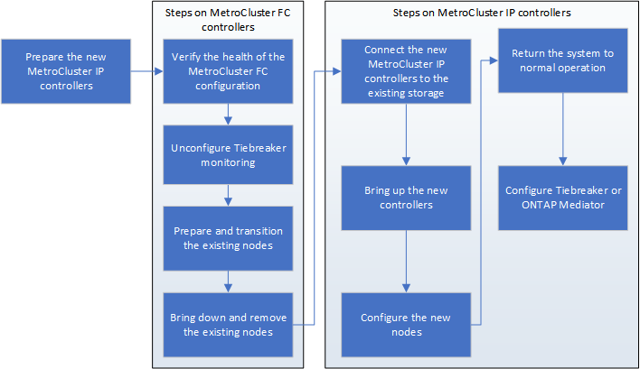

= Preparación para una transición disruptiva de FC a IP
:allow-uri-read: 
:icons: font
:imagesdir: ../media/

== Requisitos generales para una transición de FC a IP sin interrupciones

[role="lead"]
Antes de iniciar el proceso de transición, debe asegurarse de que la configuración cumpla los requisitos.

La configuración de FC de MetroCluster existente debe cumplir con los requisitos siguientes:

* Debe ser una configuración de dos nodos y todos los nodos deben ejecutar ONTAP 9.8 o una versión posterior.
+
Puede ser un MetroCluster conectado a la estructura de dos nodos o estirado.

* Debe cumplir con todos los requisitos y el cableado según se describe en los procedimientos _MetroCluster Installation and Configuration_.
+
link:../install-fc/index.html["Instalación y configuración de MetroCluster estructural"]

+
link:../install-stretch/concept_considerations_differences.html["Instalación y configuración de MetroCluster con ampliación"]

* No se puede configurar con el cifrado en almacenamiento de NetApp (NSE).
* Los volúmenes MDV no se pueden cifrar.

Debe tener acceso remoto a la consola para los seis nodos desde el sitio de MetroCluster o planificar el viaje entre los sitios según lo requiera el procedimiento.

== Reutilización de la bandeja de unidades y requisitos de unidad para una transición de FC a IP sin interrupciones

Debe asegurarse de que haya disponibles en las bandejas de almacenamiento unidades de repuesto y espacio de agregados raíz adecuados.

=== Volver a utilizar las bandejas de almacenamiento existentes

Cuando se utiliza este procedimiento, se conservan las bandejas de almacenamiento existentes para que las utilice la nueva configuración. Cuando se quitan el node_A_1-FC y node_B_1-FC, las bandejas de unidades existentes se conectan al node_A_1-IP y node_A_2-IP en cluster_A y al node_B_1-IP y node_B_2-IP en cluster_B.

* Los nuevos modelos de plataforma deben admitir las bandejas de almacenamiento existentes (las conectadas al nodo_A_1-FC y node_B_1-FC).
+
Si los nuevos modelos de plataforma no admiten las bandejas existentes, consulte link:task_disruptively_transition_when_exist_shelves_are_not_supported_on_new_controllers.html["Realizar la transición sin interrupciones cuando no se admiten bandejas existentes en nuevas controladoras (ONTAP 9.8 y versiones posteriores)"].

* Debe asegurarse de no superar los límites de la plataforma para unidades, etc.
+
https://["Hardware Universe de NetApp"^]

=== Requisitos de almacenamiento para las controladoras adicionales

Debe añadirse almacenamiento adicional, si es necesario, para acomodar las dos controladoras adicionales (node_A_2-IP y node_B_2-ip), ya que la configuración está cambiando de un acuerdo de dos nodos a uno de cuatro nodos.

* En función de las unidades de repuesto disponibles en las bandejas existentes, deben añadirse unidades adicionales para acomodar las controladoras adicionales de la configuración.
+
Esto puede requerir bandejas de almacenamiento adicionales, como se muestra en la siguiente ilustración.

+
image::../media/transition_2n_4_new_ip_nodes_on_the_shelves.png[realice la transición de 4 nodos ip nuevos en las bandejas]

+
Debe tener entre 14 y 18 unidades adicionales cada una para la tercera y cuarta controladora (node_A_2-IP y node_B_2-IP):

+
** Tres unidades pool0
** Tres unidades de pool1
** Dos unidades de repuesto
** De seis a diez unidades para el volumen del sistema

* Debe asegurarse de que la configuración, incluidos los nuevos nodos, no supere los límites de plataformas para la configuración, incluidos el número de unidades, la capacidad de tamaño del agregado raíz, etc.
+
Esta información está disponible para cada modelo de plataforma en _NetApp Hardware Universe_.

+
https://["Hardware Universe de NetApp"^]

== Flujo de trabajo para una transición disruptiva

Debe seguir el flujo de trabajo específico para garantizar que la transición se realice correctamente.

Mientras se prepara para la transición, planee el viaje entre los sitios. Tenga en cuenta que, una vez montados en rack y cableados, se necesita acceso mediante terminal en serie a los nodos. El acceso de Service Processor no está disponible hasta que se configuren los nodos.

== Asignar los puertos de los nodos FC de MetroCluster a los nodos IP de MetroCluster

Debe ajustar la configuración del puerto y la LIF del nodo FC de MetroCluster para que sea compatible con la del nodo IP de MetroCluster que lo sustituirá.

.Acerca de esta tarea
Cuando los nuevos nodos se inician por primera vez durante el proceso de actualización, cada nodo utiliza la configuración más reciente del nodo que está reemplazando. Cuando arranca node_A_1-IP, ONTAP intenta alojar LIF en los mismos puertos que se usaron en el node_A_1-FC.

Durante el procedimiento de transición, realizará los pasos en los nodos antiguos y nuevos para garantizar que la configuración correcta de LIF de datos, gestión y clúster.

.Pasos
. Identifique cualquier conflicto entre el uso del puerto FC de MetroCluster existente y el uso del puerto para las interfaces IP de MetroCluster en los nodos nuevos.
+
Debe identificar los puertos IP de MetroCluster en las nuevas controladoras IP de MetroCluster con la siguiente tabla. A continuación, compruebe y registre si existen alguna LIF de datos o LIF de clúster en esos puertos en los nodos FC de MetroCluster.

+
Estos LIF de datos o LIF de clúster en conflicto en los nodos FC de MetroCluster se moverán en el paso adecuado del procedimiento de transición.

+
En la siguiente tabla se muestran los puertos IP de MetroCluster por modelo de plataforma. Puede ignorar la columna VLAN ID.

+
|===

| Modelo de plataforma | Puerto IP MetroCluster | ID DE VLAN |  

.2+| A800 de AFF  a| 
e0b
.8+| No se utiliza  a| 

 a| 
e1b
 a| 

.2+| AFF A700 y FAS9000  a| 
e5a
 a| 

 a| 
e5b
 a| 

.2+| AFF A320  a| 
e0g
 a| 

 a| 
e0h
 a| 

.2+| AFF A300 y FAS8200  a| 
e1a
 a| 

 a| 
e1b
 a| 

.2+| FAS8300/A400/FAS8700  a| 
e1a
 a| 
10
 a| 

 a| 
e1b
 a| 
20
 a| 

.2+| AFF A250 y FAS500f  a| 
e0c
 a| 
10
 a| 

 a| 
e0b
 a| 
20
 a| 

|===
+
Puede rellenar la siguiente tabla y consultarlo posteriormente en el procedimiento de transición.

+
|===

| Puertos | Puertos de interfaz IP de MetroCluster correspondientes (de la tabla anterior) | LIF en conflicto en estos puertos en los nodos FC de MetroCluster 

 a| 
Primer puerto IP MetroCluster en node_A_1-FC
 a| 
 a| 

 a| 
Segundo puerto IP MetroCluster en node_A_1-FC
 a| 
 a| 

 a| 
Primer puerto IP MetroCluster en node_B_1-FC
 a| 
 a| 

 a| 
Segundo puerto IP MetroCluster en node_B_1-FC
 a| 
 a| 

|===
. Determine qué puertos físicos están disponibles en las nuevas controladoras y qué LIF se pueden alojar en los puertos.
+
El uso del puerto de la controladora depende del modelo de plataforma y del modelo de switch de IP que se usarán en la configuración de IP de MetroCluster. Puede recopilar el uso del puerto de las nuevas plataformas en _Hardware Universe_ de NetApp.

+
https://["Hardware Universe de NetApp"^]

. Si lo desea, registre la información del puerto para node_A_1-FC y node_A_1-IP.
+
Consulte la tabla a medida que lleve a cabo el procedimiento de transición.

+
En las columnas para node_A_1-IP, añada los puertos físicos para el módulo de la controladora nueva y planifique los espacios IP y los dominios de retransmisión para el nodo nuevo.

+
|===

|  3+| Node_a_1-FC 3+| Node_a_1-IP 

| LUN | Puertos | Espacios IP | Dominios de retransmisión | Puertos | Espacios IP | Dominios de retransmisión 

 a| 
Clúster 1
 a| 
 a| 
 a| 
 a| 
 a| 
 a| 

 a| 
Clúster 2
 a| 
 a| 
 a| 
 a| 
 a| 
 a| 

 a| 
Clúster 3
 a| 
 a| 
 a| 
 a| 
 a| 
 a| 

 a| 
Clúster 4
 a| 
 a| 
 a| 
 a| 
 a| 
 a| 

 a| 
Gestión de nodos
 a| 
 a| 
 a| 
 a| 
 a| 
 a| 

 a| 
Gestión de clústeres
 a| 
 a| 
 a| 
 a| 
 a| 
 a| 

 a| 
Datos 1
 a| 
 a| 
 a| 
 a| 
 a| 
 a| 

 a| 
Datos 2
 a| 
 a| 
 a| 
 a| 
 a| 
 a| 

 a| 
Datos 3
 a| 
 a| 
 a| 
 a| 
 a| 
 a| 

 a| 
Datos 4
 a| 
 a| 
 a| 
 a| 
 a| 
 a| 

 a| 
SAN
 a| 
 a| 
 a| 
 a| 
 a| 
 a| 

 a| 
Puerto de interconexión de clústeres
 a| 
 a| 
 a| 
 a| 
 a| 
 a| 

|===
. Si lo desea, registre toda la información del puerto para node_B_1-FC.
+
Consulte la tabla a medida que lleve a cabo el procedimiento de actualización.

+
En las columnas para node_B_1-IP, añada los puertos físicos para el módulo de la controladora nuevo y planifique el uso de puertos LIF, los espacios IP y los dominios de retransmisión para el nodo nuevo.

+
|===

|  3+| Node_B_1-FC 3+| Node_B_1-IP 

| LUN | Puertos físicos | Espacios IP | Dominios de retransmisión | Puertos físicos | Espacios IP | Dominios de retransmisión 

 a| 
Clúster 1
 a| 
 a| 
 a| 
 a| 
 a| 
 a| 

 a| 
Clúster 2
 a| 
 a| 
 a| 
 a| 
 a| 
 a| 

 a| 
Clúster 3
 a| 
 a| 
 a| 
 a| 
 a| 
 a| 

 a| 
Clúster 4
 a| 
 a| 
 a| 
 a| 
 a| 
 a| 

 a| 
Gestión de nodos
 a| 
 a| 
 a| 
 a| 
 a| 
 a| 

 a| 
Gestión de clústeres
 a| 
 a| 
 a| 
 a| 
 a| 
 a| 

 a| 
Datos 1
 a| 
 a| 
 a| 
 a| 
 a| 
 a| 

 a| 
Datos 2
 a| 
 a| 
 a| 
 a| 
 a| 
 a| 

 a| 
Datos 3
 a| 
 a| 
 a| 
 a| 
 a| 
 a| 

 a| 
Datos 4
 a| 
 a| 
 a| 
 a| 
 a| 
 a| 

 a| 
SAN
 a| 
 a| 
 a| 
 a| 
 a| 
 a| 

 a| 
Puerto de interconexión de clústeres
 a| 
 a| 
 a| 
 a| 
 a| 
 a| 

|===

== Preparar las controladoras IP de MetroCluster

Debe preparar los cuatro nodos IP de MetroCluster nuevos e instalar la versión de ONTAP correcta.

.Acerca de esta tarea
Esta tarea se debe realizar en cada uno de los nuevos nodos:

* Node_a_1-IP
* Node_A_2-IP
* Node_B_1-IP
* Node_B_2-IP

Los nodos deben estar conectados a cualquier bandeja de almacenamiento *nueva*. *No* deben conectarse a las bandejas de almacenamiento existentes que contengan datos.

Estos pasos pueden realizarse ahora o más adelante en el procedimiento cuando las controladoras y bandejas están en rack. En cualquier caso, debe asegurarse de borrar la configuración y preparar los nodos * antes de* conectarlos a las bandejas de almacenamiento existentes y *antes* realizar cualquier cambio de configuración en los nodos FC de MetroCluster.

NOTE: No realice estos pasos con las controladoras IP de MetroCluster conectadas a las bandejas de almacenamiento existentes conectadas a las controladoras FC de MetroCluster.

En estos pasos, se borra la configuración en los nodos y se borra la región del buzón en las unidades nuevas.

.Pasos
. Conecte los módulos de la controladora a las nuevas bandejas de almacenamiento.
. En el modo de mantenimiento, muestre el estado de alta disponibilidad del módulo de controladora y el chasis:
+
`ha-config show`

+
El estado ha de todos los componentes debería ser «mccip».

. Si el estado del sistema mostrado de la controladora o el chasis no es correcto, establezca el estado de alta disponibilidad:
+
`ha-config modify controller mccip``ha-config modify chassis mccip`

. Salir del modo de mantenimiento:
+
`halt`

+
Después de ejecutar el comando, espere hasta que el nodo se detenga en el símbolo del sistema DEL CARGADOR.

. Repita los siguientes subpasos en los cuatro nodos para borrar la configuración:
+
.. Establezca las variables de entorno en valores predeterminados:
+
`set-defaults`

.. Guarde el entorno:
+
`saveenv`

+
`bye`

. Repita los siguientes subpasos para arrancar los cuatro nodos con la opción 9a del menú de arranque.
+
.. En el símbolo del sistema del CARGADOR, inicie el menú de arranque:
+
`boot_ontap menu`

.. En el menú de inicio, seleccione la opción "'9a'" para reiniciar el controlador.

. Arranque cada uno de los cuatro nodos en el modo de mantenimiento mediante la opción "'5'" del menú de arranque.
. Registre el ID del sistema y de cada uno de los cuatro nodos:
+
`sysconfig`

. Repita los pasos siguientes en node_A_1-IP y node_B_1-IP.
+
.. Asigne la propiedad de todos los discos locales a cada sitio:
+
`disk assign adapter.xx.*`

.. Repita el paso anterior para cada HBA con bandejas de unidades conectadas en node_A_1-IP y node_B_1-IP.

. Repita los pasos siguientes en node_A_1-IP y node_B_1-IP para borrar la región del buzón en cada disco local.
+
.. Destruir la región del buzón en cada disco:
+
`mailbox destroy local``mailbox destroy partner`

. Detenga las cuatro controladoras:
+
`halt`

. En cada controladora, muestre el menú de arranque:
+
`boot_ontap menu`

. Borre la configuración de cada una de las cuatro controladoras:
+
`wipeconfig`

+
Cuando finalice la operación wipeconfig, el nodo volverá automáticamente al menú de inicio.

. Repita los siguientes subpasos para volver a arrancar los cuatro nodos con la opción 9a del menú de arranque.
+
.. En el símbolo del sistema del CARGADOR, inicie el menú de arranque:
+
`boot_ontap menu`

.. En el menú de inicio, seleccione la opción "'9a'" para reiniciar el controlador.
.. Deje que el módulo del controlador finalice el arranque antes de pasar al siguiente módulo del controlador.

+
Una vez completada «'9a'», los nodos vuelven automáticamente al menú de inicio.

. Apague las controladoras.

== Comprobación del estado de la configuración de MetroCluster FC

Debe verificar el estado y la conectividad de la configuración de FC de MetroCluster antes de realizar la transición

Esta tarea se realiza en la configuración de MetroCluster FC.

. Compruebe el funcionamiento de la configuración de MetroCluster en ONTAP:
+
.. Compruebe si el sistema es multivía:
+
`node run -node node-name sysconfig -a`

.. Compruebe si hay alertas de estado en ambos clústeres:
+
`system health alert show`

.. Confirme la configuración del MetroCluster y que el modo operativo es normal:
+
`metrocluster show`

.. Realizar una comprobación de MetroCluster:
+
`metrocluster check run`

.. Mostrar los resultados de la comprobación de MetroCluster:
+
`metrocluster check show`

.. Compruebe si hay alertas de estado en los switches (si existen):
+
`storage switch show`

.. Ejecute Config Advisor.
+
https://["Descargas de NetApp: Config Advisor"^]

.. Después de ejecutar Config Advisor, revise el resultado de la herramienta y siga las recomendaciones del resultado para solucionar los problemas detectados.

. Compruebe que los nodos no estén en modo ha:
+
`storage failover show`

== Eliminar la configuración existente del tiebreaker o de otro software de supervisión

Si la configuración existente se supervisa con la configuración de tiebreaker para MetroCluster u otras aplicaciones de terceros (por ejemplo, ClusterLion) que pueden iniciar una conmutación de sitios, debe eliminar la configuración de MetroCluster del tiebreaker o de otro software antes de la transición.

.Pasos
. Elimine la configuración de MetroCluster existente del software Tiebreaker.
+
link:../tiebreaker/concept_configuring_the_tiebreaker_software.html#removing-metrocluster-configurations["Eliminación de las configuraciones de MetroCluster"]

. Elimine la configuración de MetroCluster existente de cualquier aplicación de terceros que pueda iniciar la conmutación.
+
Consulte la documentación de la aplicación.

