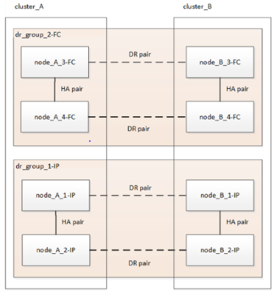

= Flujo de trabajo para una transición de MetroCluster sin interrupciones
:allow-uri-read: 
:icons: font
:imagesdir: ../media/

[role="lead"]
Debe seguir el flujo de trabajo específico para garantizar una transición no disruptiva correcta. Elija el flujo de trabajo para su configuración:

* <<Flujo de trabajo de transición de configuración de FC de cuatro nodos>>
* <<Flujo de trabajo de transición de configuración de FC de ocho nodos>>

== Flujo de trabajo de transición de configuración de FC de cuatro nodos

El proceso de transición comienza con una configuración FC de MetroCluster de cuatro nodos en buen estado.

image::../media/transition_dr_group_1_fc_nodes.png[Nódulos FC de transición en el grupo DR 1]

Los nuevos nodos IP de MetroCluster se añaden como un segundo grupo de recuperación ante desastres.

image::../media/transition_dr_groups_fc_and_ip.png[Grupo de transición DR con nodos FC e IP presentes]

Los datos se transfieren del grupo de recuperación ante desastres antiguo al nuevo grupo de recuperación ante desastres y, a continuación, los nodos antiguos y su almacenamiento se eliminan de la configuración y se decomisionan. El proceso finaliza con una configuración IP de MetroCluster de cuatro nodos.

image::../media/transition_dr_group_2_ip.png[Nodos IP del grupo 2 de DR de transición]

== Flujo de trabajo de transición de configuración de FC de ocho nodos

El proceso de transición comienza con una configuración de FC de MetroCluster de ocho nodos en buen estado.

image::../media/mcc_dr_group_c1.png[Configuración de FC de MetroCluster de ocho nodos antes de la transición]

Los nuevos nodos IP de MetroCluster se añaden como tercer grupo de recuperación ante desastres.

image::../media/mcc_dr_group_c2.png[Configuración de ocho nodos con nodos IP agregados como tercer grupo de DR]

Los datos se transfieren de dr_group_1-FC a dr_group_1-IP y, a continuación, los nodos antiguos y su almacenamiento se quitan de la configuración y se retiran de la misma.

NOTE: Si desea realizar la transición de una configuración FC de ocho nodos a una configuración IP de cuatro nodos, debe realizar la transición de todos los datos de DR_GROUP_1-FC y DR_GROUP_2-FC al nuevo grupo IP DR (DR_GROUP_1-IP). A continuación, puede retirar ambos grupos de recuperación ante desastres FC. Una vez que se hayan eliminado los grupos de DR FC, el proceso termina con una configuración IP de MetroCluster de cuatro nodos.

Añada los nodos IP de MetroCluster restantes a la configuración de MetroCluster existente. Repita el proceso para transferir datos de los nodos DR_GROUP_2-FC a los nodos DR_GROUP_2-IP.

image::../media/mcc_dr_group_c7.png[Configuración de ocho nodos con nodos IP restantes agregados]

Después de quitar dr_group_2-FC, el proceso termina con una configuración IP de MetroCluster de ocho nodos.

image::../media/mcc_dr_group_c6.png[Configuración de IP de MetroCluster de ocho nodos después de la transición]

== Flujo de trabajo del proceso de transición

Se usará el siguiente flujo de trabajo para realizar la transición de la configuración de MetroCluster.

image::../media/workflow_4n_transition_nondisruptive.png[Flujo de trabajo para una transición sin interrupciones de cuatro nodos]
