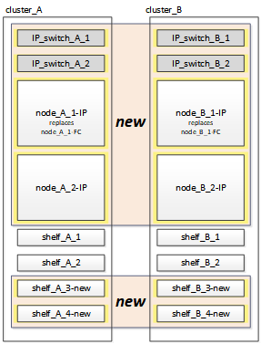

= Conexión de los módulos de la controladora IP de MetroCluster
:allow-uri-read: 
:icons: font
:imagesdir: ../media/

[role="lead"]
Debe añadir los cuatro nuevos módulos de controladora y cualquier bandeja de almacenamiento adicional a la configuración. Adición de dos módulos de controladora a la vez.

== Configurar las nuevas controladoras

Debe montar en rack y cablear las nuevas controladoras IP de MetroCluster a las bandejas de almacenamiento conectadas previamente a las controladoras FC de MetroCluster.

.Acerca de esta tarea
Estos pasos se deben realizar en cada uno de los nodos IP de MetroCluster.

* Node_a_1-IP
* Node_A_2-IP
* Node_B_1-IP
* Node_B_2-IP

En el ejemplo siguiente, se añaden dos bandejas de almacenamiento adicionales en cada sitio para proporcionar almacenamiento para acomodar los nuevos módulos de controladora.

.Pasos
. Planifique la colocación de los nuevos módulos de controladora y bandejas de almacenamiento según sea necesario.
+
El espacio en rack depende del modelo de plataforma de los módulos de la controladora, los tipos de switch y el número de bandejas de almacenamiento de la configuración.

. Puesta a tierra apropiadamente usted mismo.
. Monte en rack el nuevo equipo: Controladoras, bandejas de almacenamiento y switches IP.
+
No conecte los cables de las bandejas de almacenamiento ni de los switches IP en este momento.

. Conecte los cables de alimentación y la conexión de la consola de gestión a las controladoras.
. Compruebe que todas las bandejas de almacenamiento se encuentren apagadas.
. Compruebe que no haya unidades conectadas mediante los siguientes pasos en los cuatro nodos:
+
.. En el símbolo del sistema del CARGADOR, inicie el menú de arranque:
+
`boot_ontap maint`

.. Verifique que no haya unidades conectadas:
+
`disk show -v`

+
La salida no debe mostrar unidades.

.. Detenga el nodo:
+
`halt`

. Arranque los cuatro nodos usando la opción 9a del menú de arranque.
+
.. En el símbolo del sistema del CARGADOR, inicie el menú de arranque:
+
`boot_ontap menu`

.. En el menú de inicio, seleccione la opción "'9a'" para reiniciar el controlador.
.. Deje que el módulo del controlador finalice el arranque antes de pasar al siguiente módulo del controlador.

+
Una vez completada «'9a'», los nodos vuelven automáticamente al menú de inicio.

. Conecte los cables de las bandejas de almacenamiento.
+
Consulte los procedimientos de instalación y configuración de la controladora para obtener información sobre el cableado.

+
https://["Centro de documentación de AFF y FAS"^]

. Conecte los cables de las controladoras a los switches IP como se describe en link:../install-ip/using_rcf_generator.html["Cableado de los switches IP"].
. Prepare los switches IP para la aplicación de los nuevos archivos RCF.
+
Siga los pasos para su proveedor de switches:

+
** link:../install-ip/task_switch_config_broadcom.html["Restablecer los valores predeterminados de fábrica del conmutador IP de Broadcom"]
** link:../install-ip/task_switch_config_cisco.html["Restablecer los valores predeterminados de fábrica del conmutador IP de Cisco"]

. Descargue e instale los archivos RCF.
+
Siga los pasos para su proveedor de switches:

+
** link:../install-ip/task_switch_config_broadcom.html["Descarga e instalación de los archivos Broadcom RCF"]
** link:../install-ip/task_switch_config_cisco.html["Descarga e instalación de los archivos Cisco IP RCF"]

. Encienda la primera controladora nueva (node_A_1-IP) y pulse Ctrl-C para interrumpir el proceso de arranque y mostrar el aviso del CARGADOR.
. Arranque la controladora en modo de mantenimiento:
+
`boot_ontap_maint`

. Mostrar el ID del sistema de la controladora:
+
`sysconfig -v`

. Confirme que las bandejas de la configuración existente están visibles en el nuevo nodo IP de MetroCluster:
+
`storage show shelf``disk show -v`

. Detenga el nodo:
+
`halt`

. Repita los pasos anteriores en el otro nodo del sitio del partner (site_B).

== Conectar e arrancar node_A_1-IP y node_B_1-IP

Tras conectar las controladoras IP de MetroCluster y los switches IP, realiza la transición y arranca node_A_1-IP y node_B_1-IP.

=== Poniendo en marcha node_A_1-IP

Debe arrancar el nodo con la opción de transición correcta.

.Pasos
. Nodo de arranque_a_1-IP en el menú de arranque:
+
`boot_ontap menu`

. Ejecute el siguiente comando en el símbolo del sistema del menú de arranque para iniciar la transición:
+
`boot_after_mcc_transition`

+
** Este comando reasigna todos los discos propiedad de node_A_1-FC a node_A_1-IP.
+
*** Los discos Node_A_1-FC se asignan a node_A_1-IP
*** Los discos Node_B_1-FC se asignan a node_B_1-IP

** El comando también realiza automáticamente otras reasignaciones de ID del sistema necesarias para que los nodos IP de MetroCluster puedan arrancar en la solicitud de ONTAP.
** Si el comando boot_after_mcc_Transition falla por cualquier motivo, debe volver a ejecutarse desde el menú de inicio.
+
[NOTE]
====
*** Si aparece el siguiente solicitud de, introduzca Ctrl-C para continuar. Comprobando estado DR de MCC... [Enter Ctrl-C(resume), S(status), L(link)]_
*** Si el volumen raíz estaba cifrado, el nodo se detiene con el siguiente mensaje. Detener el sistema, ya que el volumen raíz está cifrado (cifrado de volúmenes de NetApp) y se produjo un error en la importación de claves. Si este clúster está configurado con un administrador de claves externo (KMIP), compruebe el estado de los servidores de claves.

====
+
[listing]
----

Please choose one of the following:
(1) Normal Boot.
(2) Boot without /etc/rc.
(3) Change password.
(4) Clean configuration and initialize all disks.
(5) Maintenance mode boot.
(6) Update flash from backup config.
(7) Install new software first.
(8) Reboot node.
(9) Configure Advanced Drive Partitioning. Selection (1-9)? `boot_after_mcc_transition`
This will replace all flash-based configuration with the last backup to disks. Are you sure you want to continue?: yes

MetroCluster Transition: Name of the MetroCluster FC node: `node_A_1-FC`
MetroCluster Transition: Please confirm if this is the correct value [yes|no]:? y
MetroCluster Transition: Disaster Recovery partner sysid of MetroCluster FC node node_A_1-FC: `systemID-of-node_B_1-FC`
MetroCluster Transition: Please confirm if this is the correct value [yes|no]:? y
MetroCluster Transition: Disaster Recovery partner sysid of local MetroCluster IP node: `systemID-of-node_B_1-IP`
MetroCluster Transition: Please confirm if this is the correct value [yes|no]:? y
----

. Si se cifran los volúmenes de datos, restaure las claves con el comando correcto para la configuración de gestión de claves.
+
[cols="1,2"]
|===

| Si está usando... | Se usa este comando... 

 a| 
*Gestión de claves a bordo*
 a| 
`security key-manager onboard sync`

Para obtener más información, consulte https://["Restauración de las claves de cifrado de gestión de claves incorporadas"^].

 a| 
*Gestión de claves externas*
 a| 
`security key-manager key query -node node-name`

Para obtener más información, consulte https://["Restauración de claves de cifrado de gestión de claves externas"^].

|===
. Si el volumen raíz está cifrado, utilice el procedimiento en link:../transition/task_connect_the_mcc_ip_controller_modules_2n_mcc_transition_supertask.html#recovering-key-management-if-the-root-volume-is-encrypted["Se recupera la gestión de claves si el volumen raíz se cifra"].

=== Se recupera la gestión de claves si el volumen raíz se cifra

Si el volumen raíz está cifrado, se deben utilizar comandos de arranque especiales para restaurar la gestión de claves.

.Antes de empezar
Usted debe tener las passphrases juntado antes.

.Pasos
. Si se utiliza la gestión de claves incorporada, realice los siguientes subpasos para restaurar la configuración.
+
.. Desde el símbolo del sistema del CARGADOR, muestre el menú de arranque:
+
`boot_ontap menu`

.. Seleccione la opción «»(10) establecer secretos de recuperación de gestión de claves a bordo» en el menú de arranque.
+
Responda según corresponda a las preguntas:

+
[listing]
----
This option must be used only in disaster recovery procedures. Are you sure? (y or n): y
Enter the passphrase for onboard key management: passphrase
Enter the passphrase again to confirm: passphrase

Enter the backup data: backup-key
----
+
El sistema se inicia en el menú de inicio.

.. Introduzca la opción «'6'» en el menú de inicio.
+
Responda según corresponda a las preguntas:

+
[listing]
----
This will replace all flash-based configuration with the last backup to
disks. Are you sure you want to continue?: y

Following this, the system will reboot a few times and the following prompt will be available continue by saying y

WARNING: System ID mismatch. This usually occurs when replacing a boot device or NVRAM cards!
Override system ID? {y|n} y
----
+
Tras los reinicios, el sistema estará en el aviso del CARGADOR.

.. Desde el símbolo del sistema del CARGADOR, muestre el menú de arranque:
+
`boot_ontap menu`

.. Seleccione de nuevo la opción «»(10) establecer secretos de recuperación de gestión de claves a bordo» desde el menú de inicio.
+
Responda según corresponda a las preguntas:

+
[listing]
----
This option must be used only in disaster recovery procedures. Are you sure? (y or n): `y`
Enter the passphrase for onboard key management: `passphrase`
Enter the passphrase again to confirm:`passphrase`

Enter the backup data:`backup-key`
----
+
El sistema se inicia en el menú de inicio.

.. Introduzca la opción «'1'» en el menú de inicio.
+
Si aparece el siguiente aviso, puede pulsar Ctrl+C para reanudar el proceso.

+
....
 Checking MCC DR state... [enter Ctrl-C(resume), S(status), L(link)]
....
+
El sistema arranca en el aviso de la ONTAP.

.. Restaure la gestión de claves incorporada:
+
`security key-manager onboard sync`

+
Responda según corresponda a las indicaciones, utilizando la frase de contraseña que ha recopilado anteriormente:

+
[listing]
----
cluster_A::> security key-manager onboard sync
Enter the cluster-wide passphrase for onboard key management in Vserver "cluster_A":: passphrase
----

. Si se utiliza la gestión de claves externas, realice los siguientes pasos para restaurar la configuración.
+
.. Establezca los bootargs necesarios:
+
`setenv bootarg.kmip.init.ipaddr ip-address`

+
`setenv bootarg.kmip.init.netmask netmask`

+
`setenv bootarg.kmip.init.gateway gateway-address`

+
`setenv bootarg.kmip.init.interface interface-id`

.. Desde el símbolo del sistema del CARGADOR, muestre el menú de arranque:
+
`boot_ontap menu`

.. Seleccione la opción «»(11) Configurar nodo para la gestión de claves externas» en el menú de arranque.
+
El sistema se inicia en el menú de inicio.

.. Introduzca la opción «'6'» en el menú de inicio.
+
El sistema arranca varias veces. Puede responder afirmativamente cuando se le pida que continúe con el proceso de arranque.

+
Tras los reinicios, el sistema estará en el aviso del CARGADOR.

.. Establezca los bootargs necesarios:
+
`setenv bootarg.kmip.init.ipaddr ip-address`

+
`setenv bootarg.kmip.init.netmask netmask`

+
`setenv bootarg.kmip.init.gateway gateway-address`

+
`setenv bootarg.kmip.init.interface interface-id`

.. Desde el símbolo del sistema del CARGADOR, muestre el menú de arranque:
+
`boot_ontap menu`

.. De nuevo, seleccione la opción "'(11) Configurar nodo para la gestión de claves externas" en el menú de inicio y responda a las indicaciones según sea necesario.
+
El sistema se inicia en el menú de inicio.

.. Restaure la gestión de claves externas:
+
`security key-manager external restore`

=== Creación de la configuración de red

Debe crear una configuración de red que coincida con la configuración de los nodos FC. Esto es así porque el nodo IP de MetroCluster reproduce la misma configuración cuando arranca, lo que significa que cuando arranque node_A_1-IP y node_B_1-IP, ONTAP intentará host LIF en los mismos puertos que se utilizaron en node_A_1-FC y node_B_1-FC respectivamente.

.Acerca de esta tarea
A medida que se crea la configuración de red, utilice el plan realizado en link:concept_requirements_for_fc_to_ip_transition_2n_mcc_transition.html["Asignar los puertos de los nodos FC de MetroCluster a los nodos IP de MetroCluster"] para ayudarle.

NOTE: Puede que se necesite más configuración para poner en marcha LIF de datos después de configurar los nodos IP de MetroCluster.

.Pasos
. Compruebe que todos los puertos del clúster estén en el dominio de retransmisión adecuado:
+
El espacio IP del clúster y el dominio de retransmisión del clúster son necesarios para crear las LIF del clúster

+
.. Vea los espacios IP:
+
`network ipspace show`

.. Cree espacios IP y asigne puertos de clúster según sea necesario.
+
http://["Configurar espacios IP (solo administradores de clúster)"^]

.. Vea los dominios de retransmisión:
+
`network port broadcast-domain show`

.. Añada cualquier puerto de clúster a un dominio de retransmisión según sea necesario.
+
https://["Agregar o quitar puertos de un dominio de retransmisión"^]

.. Vuelva a crear las VLAN y los grupos de interfaces según sea necesario.
+
La pertenencia a la VLAN y al grupo de interfaces puede ser diferente de la del nodo antiguo.

+
https://["Creación de una VLAN"^]

+
https://["Combinación de puertos físicos para crear grupos de interfaces"^]

. Compruebe que la configuración de MTU esté establecida correctamente para los puertos y el dominio de retransmisión y realice cambios mediante los siguientes comandos:
+
`network port broadcast-domain show`

+
`network port broadcast-domain modify -broadcast-domain _bcastdomainname_ -mtu _mtu-value_`

=== Configurar los puertos del clúster y las LIF del clúster

Debe configurar los puertos y las LIF del clúster. En el sitio a se tienen que realizar los siguientes pasos que se han iniciado con agregados raíz.

.Pasos
. Identifique la lista de LIF mediante el puerto de clúster que desee:
+
`network interface show -curr-port portname`

+
`network interface show -home-port portname`

. Para cada puerto de clúster, cambie el puerto de inicio de cualquiera de las LIF de ese puerto a otro puerto,
+
.. Entre en el modo de privilegio avanzado y escriba "'y'" cuando se le solicite continuar:
+
`set priv advanced`

.. Si la LIF que se está modificando es una LIF de datos:
+
`vserver config override -command "network interface modify -lif _lifname_ -vserver _vservername_ -home-port _new-datahomeport_"`

.. Si la LIF no es una LIF de datos:
+
`network interface modify -lif _lifname_ -vserver _vservername_ -home-port _new-datahomeport_`

.. Revierte los LIF modificados a su puerto raíz:
+
`network interface revert * -vserver _vserver_name_`

.. Compruebe que no hay ninguna LIF en el puerto del clúster:
+
`network interface show -curr-port _portname_`

+
`network interface show -home-port _portname_`

.. Elimine el puerto del dominio de difusión actual:
+
`network port broadcast-domain remove-ports -ipspace _ipspacename_ -broadcast-domain _bcastdomainname_ -ports _node_name:port_name_`

.. Añada el puerto al espacio IP del clúster y al dominio de retransmisión:
+
`network port broadcast-domain add-ports -ipspace Cluster -broadcast-domain Cluster -ports _node_name:port_name_`

.. Compruebe que el rol del puerto ha cambiado: `network port show`
.. Repita estos mismos pasos para cada puerto del clúster.
.. Volver al modo admin:
+
`set priv admin`

. Cree LIF de clúster en los nuevos puertos de clúster:
+
.. Para obtener la configuración automática mediante la dirección de enlace local para la LIF de clúster, utilice el siguiente comando:
+
`network interface create -vserver Cluster -lif _cluster_lifname_ -service-policy _default-cluster_ -home-node _a1name_ -home-port clusterport -auto true`

.. Para asignar una dirección IP estática a la LIF del clúster, utilice el siguiente comando:
+
`network interface create -vserver Cluster -lif _cluster_lifname_ -service-policy default-cluster -home-node _a1name_ -home-port _clusterport_ -address _ip-address_ -netmask _netmask_ -status-admin up`

=== Verificación de la configuración de LIF

Tras mover el almacenamiento de la controladora anterior, siguen presentes las LIF de gestión de nodos, las LIF de gestión de clústeres y las LIF de interconexión de clústeres. Si es necesario, debe mover las LIF a los puertos adecuados.

.Pasos
. Verifique si los LIF de gestión y los LIF de administración de clúster ya están en el puerto que desee:
+
`network interface show -service-policy default-management`

+
`network interface show -service-policy default-intercluster`

+
Si las LIF están en los puertos deseados, puede omitir el resto de los pasos de esta tarea y continuar a la siguiente tarea.

. Para cada LIF de nodo, gestión de clústeres o interconexión de clústeres que no estén en el puerto deseado, cambie el puerto de inicio de cualquiera de las LIF de ese puerto a otro puerto.
+
.. Reorganice el puerto deseado moviendo los LIF alojados en el puerto deseado a otro puerto:
+
`vserver config override -command "network interface modify -lif _lifname_ -vserver _vservername_ -home-port _new-datahomeport_"`

.. Revierte los LIF modificados a su nuevo puerto de inicio:
+
`vserver config override -command "network interface revert -lif _lifname_ -vserver _vservername"`

.. Si el puerto deseado no está en el espacio IP y el dominio de retransmisión correctos, quite el puerto del espacio IP actual y del dominio de retransmisión:
+
`network port broadcast-domain remove-ports -ipspace _current-ipspace_ -broadcast-domain _current-broadcast-domain_ -ports _controller-name:current-port_`

.. Mueva el puerto deseado al espacio IP y el dominio de retransmisión correctos:
+
`network port broadcast-domain add-ports -ipspace _new-ipspace_ -broadcast-domain _new-broadcast-domain_ -ports _controller-name:new-port_`

.. Compruebe que el rol del puerto ha cambiado:
+
`network port show`

.. Repita estos mismos pasos para cada puerto.

. Mueva los nodos, las LIF de gestión de clústeres y la LIF de interconexión de clústeres al puerto deseado:
+
.. Cambiar el puerto de inicio de la LIF:
+
`network interface modify -vserver _vserver_ -lif _node_mgmt_ -home-port _port_ -home-node _homenode_`

.. Revierte la LIF a su nuevo puerto de inicio:
+
`network interface revert -lif _node_mgmt_ -vserver _vservername_`

.. Cambie el puerto de inicio de la LIF de gestión del clúster:
+
`network interface modify -vserver _vserver_ -lif _cluster-mgmt-LIF-name_ -home-port _port_ -home-node _homenode_`

.. Revierte la LIF de gestión del clúster a su nuevo puerto de inicio:
+
`network interface revert -lif _cluster-mgmt-LIF-name_ -vserver _vservername_`

.. Cambie el puerto principal de la LIF de interconexión de clústeres:
+
`network interface modify -vserver _vserver_ -lif _intercluster-lif-name_ -home-node _nodename_ -home-port _port_`

.. Revierte la LIF de interconexión de clústeres a su nuevo puerto raíz:
+
`network interface revert -lif _intercluster-lif-name_ -vserver _vservername_`

== Nodos_A_2-IP y node_B_2-IP

Debe utilizar y configurar el nuevo nodo IP de MetroCluster en cada sitio, creando así un par de alta disponibilidad en cada sitio.

=== Nodos_A_2-IP y node_B_2-IP

Debe arrancar los nuevos módulos del controlador de uno en uno utilizando la opción correcta en el menú de inicio.

.Acerca de esta tarea
En estos pasos, arrancará los dos nodos nuevos, ampliando lo que había sido una configuración de dos nodos en una configuración de cuatro nodos.

Estos pasos se realizan en los siguientes nodos:

* Node_A_2-IP
* Node_B_2-IP

image::../media/transition_2n_booting_a_2_and_b_2.png[transición 2n arranque a 2 y b 2]

.Pasos
. Arranque los nuevos nodos mediante la opción de arranque «'9c'».
+
[listing]
----
Please choose one of the following:
(1) Normal Boot.
(2) Boot without /etc/rc.
(3) Change password.
(4) Clean configuration and initialize all disks.
(5) Maintenance mode boot.
(6) Update flash from backup config.
(7) Install new software first.
(8) Reboot node.
(9) Configure Advanced Drive Partitioning. Selection (1-9)? 9c
----
+
El nodo inicializa y arranca en el asistente de configuración del nodo, de forma similar a lo siguiente.

+
[listing]
----
Welcome to node setup
You can enter the following commands at any time:
"help" or "?" - if you want to have a question clarified,
"back" - if you want to change previously answered questions, and
"exit" or "quit" - if you want to quit the setup wizard.
Any changes you made before quitting will be saved.
To accept a default or omit a question, do not enter a value. .
.
.
----
+
Si la opción «'9c» no tiene éxito, siga los pasos siguientes para evitar posibles pérdidas de datos:

+
** No intente ejecutar la opción 9a.
** Desconecte físicamente las bandejas existentes que contienen datos de la configuración original de FC de MetroCluster (shelf_A_1, shelf_A_2, shelf_B_1, shelf_B_2).
** Póngase en contacto con el soporte técnico, haciendo referencia al artículo de la base de conocimientos https://["Transición de FC a IP de MetroCluster: Fallo en la opción 9c"^].
+
https://["Soporte de NetApp"^]

. Habilite la herramienta AutoSupport siguiendo las instrucciones del asistente.
. Responda a las solicitudes para configurar la interfaz de gestión de nodos.
+
[listing]
----
Enter the node management interface port: [e0M]:
Enter the node management interface IP address: 10.228.160.229
Enter the node management interface netmask: 225.225.252.0
Enter the node management interface default gateway: 10.228.160.1
----
. Compruebe que el modo de conmutación por error del almacenamiento está establecido en ha:
+
`storage failover show -fields mode`

+
Si el modo no es ha, configúrelo:

+
`storage failover modify -mode ha -node _localhost_`

+
A continuación, debe reiniciar el nodo para que el cambio surta efecto.

. Enumere los puertos del clúster:
+
`network port show`

+
Para obtener una sintaxis de comando completa, consulte la página man.

+
En el siguiente ejemplo, se muestran los puertos de red en cluster01:

+
[listing]
----

cluster01::> network port show
                                                             Speed (Mbps)
Node   Port      IPspace      Broadcast Domain Link   MTU    Admin/Oper
------ --------- ------------ ---------------- ----- ------- ------------
cluster01-01
       e0a       Cluster      Cluster          up     1500   auto/1000
       e0b       Cluster      Cluster          up     1500   auto/1000
       e0c       Default      Default          up     1500   auto/1000
       e0d       Default      Default          up     1500   auto/1000
       e0e       Default      Default          up     1500   auto/1000
       e0f       Default      Default          up     1500   auto/1000
cluster01-02
       e0a       Cluster      Cluster          up     1500   auto/1000
       e0b       Cluster      Cluster          up     1500   auto/1000
       e0c       Default      Default          up     1500   auto/1000
       e0d       Default      Default          up     1500   auto/1000
       e0e       Default      Default          up     1500   auto/1000
       e0f       Default      Default          up     1500   auto/1000
----
. Salga del asistente de configuración de nodos:
+
`exit`

. Inicie sesión en la cuenta de administrador con el nombre de usuario administrador.
. Una el clúster existente mediante el asistente Cluster Setup.
+
[listing]
----
:> cluster setup
Welcome to the cluster setup wizard.
You can enter the following commands at any time:
"help" or "?" - if you want to have a question clarified,
"back" - if you want to change previously answered questions, and "exit" or "quit" - if you want to quit the cluster setup wizard.
Any changes you made before quitting will be saved.
You can return to cluster setup at any time by typing "cluster setup". To accept a default or omit a question, do not enter a value.
Do you want to create a new cluster or join an existing cluster?
{create, join}:
join
----
. Una vez que haya completado el asistente de configuración del clúster y salga, compruebe que el clúster esté activo y que el nodo esté en buen estado:
+
`cluster show`

. Desactivar la asignación automática de discos:
+
`storage disk option modify -autoassign off -node node_A_2-IP`

. Si se utiliza el cifrado, restaure las claves con el comando correcto para la configuración de gestión de claves.
+
[cols="1,2"]
|===

| Si está usando... | Se usa este comando... 

 a| 
*Gestión de claves a bordo*
 a| 
`security key-manager onboard sync`

Para obtener más información, consulte https://["Restauración de las claves de cifrado de gestión de claves incorporadas"].

 a| 
*Gestión de claves externas*
 a| 
`security key-manager key query -node _node-name_`

Para obtener más información, consulte https://["Restauración de claves de cifrado de gestión de claves externas"^].

|===
. Repita los pasos anteriores en el segundo módulo de controladora nuevo (node_B_2-IP).

=== Verificación de la configuración de MTU

Compruebe que la configuración de MTU esté establecida correctamente para los puertos y el dominio de retransmisión, y realice cambios.

.Pasos
. Compruebe el tamaño de MTU utilizado en el dominio de retransmisión del clúster:
+
`network port broadcast-domain show`

. Si es necesario, actualice el tamaño de MTU según sea necesario:
+
`network port broadcast-domain modify -broadcast-domain _bcast-domain-name_ -mtu _mtu-size_`

=== Configurar las LIF de interconexión de clústeres

Configure las LIF de interconexión de clústeres necesarias para la agrupación de clústeres.

Esta tarea se debe realizar en ambos nodos nuevos, Node_A_2-IP y node_B_2-IP.

.Paso
. Configure las LIF de interconexión de clústeres. Consulte link:../install-ip/task_sw_config_configure_clusters.html#configuring-intercluster-lifs-for-cluster-peering["Configurar las LIF de interconexión de clústeres"]

=== Verificación de la relación de paridad de clústeres

Compruebe que cluster_A y cluster_B tienen una relación entre iguales y que los nodos de cada clúster se pueden comunicar entre sí.

.Pasos
. Compruebe la relación de paridad de clústeres:
+
`cluster peer health show`

+
[listing]
----
cluster01::> cluster peer health show
Node       cluster-Name                Node-Name
             Ping-Status               RDB-Health Cluster-Health  Avail…
---------- --------------------------- ---------  --------------- --------
node_A_1-IP
           cluster_B                   node_B_1-IP
             Data: interface_reachable
             ICMP: interface_reachable true       true            true
                                       node_B_2-IP
             Data: interface_reachable
             ICMP: interface_reachable true       true            true
node_A_2-IP
           cluster_B                   node_B_1-IP
             Data: interface_reachable
             ICMP: interface_reachable true       true            true
                                       node_B_2-IP
             Data: interface_reachable
             ICMP: interface_reachable true       true            true
----
. Ping para comprobar que se puede acceder a las direcciones del mismo nivel:
+
`cluster peer ping -originating-node _local-node_ -destination-cluster _remote-cluster-name_`

