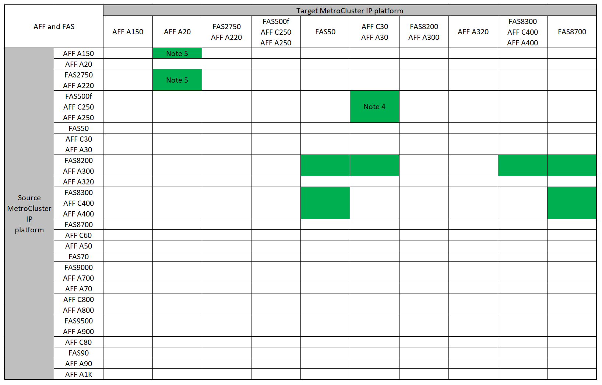
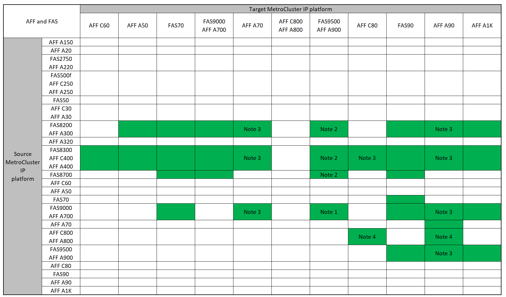

= Elija un procedimiento de actualización de la controladora
:allow-uri-read: 
:icons: font
:imagesdir: ../media/

[role="lead"]
El procedimiento de actualización de la controladora que utilice dependerá del modelo de plataforma y el tipo de configuración de MetroCluster.

En un procedimiento de actualización, se reemplazan las controladoras por un nuevo modelo de controladora. Los modelos de bandejas de almacenamiento no se actualizan.

* En procedimientos de conmutación de sitios y conmutación de estado, la operación de conmutación de sitios de MetroCluster se usa para proporcionar servicios no disruptivos a los clientes, mientras que los módulos de la controladora del clúster de partners se actualizan.
* En un procedimiento de actualización de controladoras basado en ARL, las operaciones de reubicación de agregados se utilizan para mover datos de la configuración anterior de forma no disruptiva a la nueva configuración actualizada.

== Actualizaciones de controladoras admitidas

Obtenga información sobre las combinaciones compatibles de actualización de controladoras MetroCluster IP y FC.

=== Actualizaciones de la controladora IP de MetroCluster admitidas mediante comandos de sustitución de la controladora del sistema

Consulte la tabla de link:task_upgrade_controllers_system_control_commands_in_a_four_node_mcc_ip.html["Actualizar controladoras en una configuración IP de MetroCluster de cuatro nodos mediante conmutación de sitios y conmutación de estado con comandos de sustitución de controladoras del sistema (ONTAP 9.13.1 y versiones posteriores)"] para ver las plataformas compatibles.

=== Todas las demás actualizaciones de controladoras IP de MetroCluster admitidas

Encuentre su plataforma *Source* en las tablas de actualización del controlador MetroCluster en esta sección. Si la intersección de la fila de la plataforma *Source* y la columna de la plataforma *Target* está en blanco, la actualización no es compatible.

* Si la plataforma no aparece en la lista, no existe una combinación de actualización de controladoras compatible.
* Cuando se realiza una actualización del controlador, el tipo de plataforma anterior y el nuevo *debe* coincidir:
+
** Puede actualizar un sistema FAS a un sistema FAS o un AFF A-Series a un AFF A-Series.
** No puede actualizar un sistema FAS a un AFF A-Series ni un AFF A-Series a un AFF C-Series.
+
Por ejemplo, si la plataforma que desea actualizar es FAS8200, puede actualizar a la versión FAS9000. No puede actualizar un sistema FAS8200 a un sistema AFF A700.

* Todos los nodos (antiguos y nuevos) de la configuración de MetroCluster deben ejecutar la misma versión de ONTAP. Consulte link:https://hwu.netapp.com["Hardware Universe"^]la para obtener la versión mínima compatible de ONTAP para su combinación.

==== Actualizaciones de controladoras IP de AFF y FAS MetroCluster admitidas

En las siguientes tablas se muestran las combinaciones de plataformas admitidas para actualizar un sistema AFF o FAS manualmente en una configuración IP de MetroCluster, dividida en dos grupos.

* *El Grupo 1* muestra combinaciones para actualizaciones a sistemas AFF A150, AFF A20, FAS2750, FAS8300, FAS500f, AFF C250, AFF A250, FAS50, AFF C30, AFF A30, FAS8200, AFF C400, AFF A400, AFF A220, AFF A300, AFF A320 y FAS8700.
* *El Grupo 2* muestra combinaciones para actualizaciones a sistemas AFF C60, AFF A50, FAS70, FAS9000, AFF A700, AFF A70, AFF C800, AFF A800, FAS9500, AFF A900, AFF C80, FAS90, AFF A90 y AFF A1K.

Las siguientes notas se aplican a ambos grupos:

* Nota 1: Para esta actualización, utilice el procedimiento link:task_upgrade_A700_to_A900_in_a_four_node_mcc_ip_us_switchover_and_switchback.html["Actualice controladoras de AFF A700/FAS9000 a AFF A900/FAS9500 en una configuración IP de MetroCluster mediante conmutación de sitios y conmutación de estado (ONTAP 9.10.1 o posterior)."]
* Nota 2: Las actualizaciones de controladoras se admiten en sistemas que ejecutan ONTAP 9.13.1 o posterior.
* Nota 3: La plataforma de destino no puede tener unidades internas hasta que finalice la actualización de la controladora. Es posible añadir las unidades internas después de la actualización.
* Nota 4: Requiere la sustitución de los módulos del controlador.
* Nota 5: Requiere módulos IOM para convertir las controladoras anteriores en una bandeja SAS externa. Consulte la link:https://hwu.netapp.com/["Hardware Universe"^] para ver los módulos IOM compatibles.

[role="tabbed-block"]
====
.Grupo de combinaciones AFF y FAS 1
--
Revise las combinaciones admitidas para actualizar sistemas AFF A150, AFF A20, FAS2750, FAS8300, FAS500f, AFF C250, AFF A250, FAS50, AFF C30, AFF A30, FAS8200, AFF C400, AFF A400, AFF A220, AFF A300, AFF A320 y FAS8700.

--
.Grupo de combinaciones AFF y FAS 2
--
Revise las combinaciones admitidas para actualizar sistemas AFF C60, AFF A50, FAS70, FAS9000, AFF A700, AFF A70, AFF C800, AFF, FAS9500, AFF A900, AFF A800 C80, FAS90, AFF A90 y AFF A1K.

--
====

==== Actualizaciones de la controladora IP de ASA MetroCluster admitidas

En la siguiente tabla, se muestran las combinaciones de plataformas admitidas para actualizar un sistema ASA manualmente en una configuración IP de MetroCluster:

image:../media/mcc-ip-upgrade-asa-comb-9161.png["La muestra las combinaciones de plataformas de actualización de controladoras IP MetroCluster admitidas por ASA"]

* Nota 1: Las actualizaciones de controladoras se admiten en sistemas que ejecutan ONTAP 9.13.1 o posterior.

=== Actualizaciones de controladora FC de MetroCluster admitidas

Encuentre su plataforma *Source* en las tablas de actualización del controlador MetroCluster en esta sección. Si la intersección de la fila de la plataforma *Source* y la columna de la plataforma *Target* está en blanco, la actualización no es compatible.

* Si la plataforma no aparece en la lista, no existe una combinación de actualización de controladoras compatible.
* Cuando se realiza una actualización del controlador, el tipo de plataforma anterior y el nuevo *debe* coincidir:
+
** Puede actualizar un sistema FAS a un sistema FAS o un AFF A-Series a un AFF A-Series.
** No puede actualizar un sistema FAS a un AFF A-Series ni un AFF A-Series a un AFF C-Series.
+
Por ejemplo, si la plataforma que desea actualizar es FAS8200, puede actualizar a la versión FAS9000. No puede actualizar un sistema FAS8200 a un sistema AFF A700.

* Todos los nodos (antiguos y nuevos) de la configuración de MetroCluster deben ejecutar la misma versión de ONTAP. Consulte link:https://hwu.netapp.com["Hardware Universe"^]la para obtener la versión mínima compatible de ONTAP para su combinación.

==== Actualizaciones de controladoras AFF y FAS MetroCluster FC admitidas

En la siguiente tabla se muestran las combinaciones de plataformas admitidas para actualizar un sistema AFF o FAS en una configuración de MetroCluster FC:

image::../media/metrocluster_fc_upgrade_table_aff_fas.png[tabla de actualización de MetroCluster fc AFF FAS]

* Nota 1: Para actualizar controladores cuando las conexiones FCVI de los nodos FAS8020 o AFF8020 existentes utilicen los puertos 1c y 1d, consulte lo siguientehttps://kb.netapp.com/Advice_and_Troubleshooting/Data_Protection_and_Security/MetroCluster/Upgrading_controllers_when_FCVI_connections_on_existing_FAS8020_or_AFF8020_nodes_use_ports_1c_and_1d["Artículo de base de conocimientos"^].
* Nota 2: Las actualizaciones de la controladora desde las plataformas AFF A300 o FAS8200 que utilizan los puertos 0E y 0f internos como conexiones FC-VI solo son compatibles en los sistemas siguientes:
+
** ONTAP 9.9.1 y anteriores
** ONTAP 9.10.1P9
** ONTAP 9.11.1P5
** ONTAP 9.12.1GA
** ONTAP 9.13.1 y versiones posteriores
+
Si quiere más información, consulte link:https://mysupport.netapp.com/site/bugs-online/product/ONTAP/BURT/1507088["Informe público"^].

* Nota 3: Para esta actualización, consulte link:task_upgrade_A700_to_A900_in_a_four_node_mcc_fc_us_switchover_and_switchback.html["Actualice controladoras de AFF A700/FAS9000 a AFF A900/FAS9500 en una configuración FC de MetroCluster mediante conmutación de sitios y conmutación de estado (ONTAP 9.10.1 o posterior)."]
* Nota 4: Las actualizaciones de controladoras se admiten en sistemas que ejecutan ONTAP 9.13.1 o posterior.

==== Actualizaciones de controladora FC de ASA MetroCluster admitidas

En la siguiente tabla se muestran las combinaciones de plataformas admitidas para actualizar un sistema ASA en una configuración de MetroCluster FC:

[cols="3*"]
|===
| Plataforma FC de MetroCluster de origen | Plataforma FC MetroCluster de destino | Compatible? 

.2+| ASA A400 | ASA A400 | Sí 

| ASA A900 | No 

.2+| ASA A900 | ASA A400 | No 

| ASA A900 | Sí (consulte la nota 1) 
|===
* Nota 1: Las actualizaciones de controladoras se admiten en sistemas que ejecutan ONTAP 9.14.1 o posterior.

== Elija un procedimiento que utilice el proceso de switchover y switchback

Después de revisar las combinaciones de actualización admitidas, elija el procedimiento de actualización de controladora correcto para su configuración.

[cols="2,1,1,2"]
|===

| Tipo de MetroCluster | Método de actualización | Versión de ONTAP | Procedimiento 

 a| 
IP
 a| 
Actualice con comandos de reemplazo del controlador del sistema
 a| 
9.13.1 y posterior
 a| 
link:task_upgrade_controllers_system_control_commands_in_a_four_node_mcc_ip.html["Enlace al procedimiento"]

 a| 
FC
 a| 
Actualice con comandos de reemplazo del controlador del sistema
 a| 
9.10.1 y posterior
 a| 
link:task_upgrade_controllers_system_control_commands_in_a_four_node_mcc_fc.html["Enlace al procedimiento"]

 a| 
FC
 a| 
Actualización manual con comandos de la CLI (solo A700/FAS9000 de AFF a AFF A900/FAS9500)
 a| 
9.10.1 y posterior
 a| 
link:task_upgrade_A700_to_A900_in_a_four_node_mcc_fc_us_switchover_and_switchback.html["Enlace al procedimiento"]

 a| 
IP
 a| 
Actualización manual con comandos de la CLI (solo A700/FAS9000 de AFF a AFF A900/FAS9500)
 a| 
9.10.1 y posterior
 a| 
link:task_upgrade_A700_to_A900_in_a_four_node_mcc_ip_us_switchover_and_switchback.html["Enlace al procedimiento"]

 a| 
FC
 a| 
Actualización manual con comandos de la CLI
 a| 
9.8 y posterior
 a| 
link:task_upgrade_controllers_in_a_four_node_fc_mcc_us_switchover_and_switchback_mcc_fc_4n_cu.html["Enlace al procedimiento"]

 a| 
IP
 a| 
Actualización manual con comandos de la CLI
 a| 
9.8 y posterior
 a| 
link:task_upgrade_controllers_in_a_four_node_ip_mcc_us_switchover_and_switchback_mcc_ip.html["Enlace al procedimiento"]

|===

== Elegir un procedimiento mediante la reubicación de agregados

En un procedimiento de actualización de controladoras basado en ARL, las operaciones de reubicación de agregados se utilizan para mover datos de la configuración anterior de forma no disruptiva a la nueva configuración actualizada.

|===
| Tipo de MetroCluster | Reubicación de agregados | Versión de ONTAP | Procedimiento 

 a| 
FC
 a| 
Se utilizan comandos para sustituir la controladora del sistema para actualizar los modelos de controladora en el mismo chasis
 a| 
9.10.1 y posterior
 a| 
https://docs.netapp.com/us-en/ontap-systems-upgrade/upgrade-arl-auto-affa900/index.html["Enlace al procedimiento"^]

 a| 
FC
 a| 
Uso `system controller replace` comandos
 a| 
9.8 y posterior
 a| 
https://docs.netapp.com/us-en/ontap-systems-upgrade/upgrade-arl-auto-app/index.html["Enlace al procedimiento"^]

 a| 
FC
 a| 
Uso `system controller replace` comandos
 a| 
9.5 hasta 9.7
 a| 
https://docs.netapp.com/us-en/ontap-systems-upgrade/upgrade-arl-auto/index.html["Enlace al procedimiento"^]

 a| 
FC
 a| 
Mediante comandos ARL manuales
 a| 
9.8
 a| 
https://docs.netapp.com/us-en/ontap-systems-upgrade/upgrade-arl-manual-app/index.html["Enlace al procedimiento"^]

 a| 
FC
 a| 
Mediante comandos ARL manuales
 a| 
9.7 y anteriores
 a| 
https://docs.netapp.com/us-en/ontap-systems-upgrade/upgrade-arl-manual/index.html["Enlace al procedimiento"^]

|===