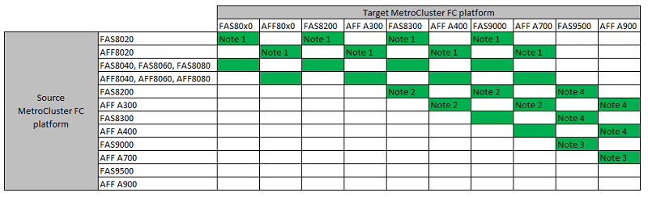

= Elija un procedimiento de actualización de la controladora
:allow-uri-read: 
:icons: font
:imagesdir: ../media/

[role="lead"]
El procedimiento de actualización de la controladora que utilice dependerá del modelo de plataforma y el tipo de configuración de MetroCluster.

En un procedimiento de actualización, se reemplazan las controladoras por un nuevo modelo de controladora. Los modelos de bandejas de almacenamiento no se actualizan.

* En procedimientos de conmutación de sitios y conmutación de estado, la operación de conmutación de sitios de MetroCluster se usa para proporcionar servicios no disruptivos a los clientes, mientras que los módulos de la controladora del clúster de partners se actualizan.
* En un procedimiento de actualización de controladoras basado en ARL, las operaciones de reubicación de agregados se utilizan para mover datos de la configuración anterior de forma no disruptiva a la nueva configuración actualizada.

== Elección de un procedimiento que utilice el proceso de conmutación de sitios y conmutación de estado

Seleccione su plataforma actual en la tabla FC o IP que aparece a continuación. Si la intersección de la fila de plataforma actual y la columna de plataforma de destino están en blanco, la actualización no es compatible.

=== Actualizaciones de controladora IP de MetroCluster admitidas

Si la plataforma no aparece en la lista, no existe una combinación de actualización de controladoras compatible.

image::../media/metrocluster_ip_upgrade_table_9_13_1.PNG[tabla de actualización de ip de MetroCluster 9 13 1]

* Nota 1: Para esta actualización, utilice el procedimiento link:task_upgrade_A700_to_A900_in_a_four_node_mcc_ip_us_switchover_and_switchback.html["Actualice controladoras de AFF A700/FAS9000 a AFF A900/FAS9500 en una configuración IP de MetroCluster mediante conmutación de sitios y conmutación de estado (ONTAP 9.10.1 o posterior)."]
* Nota 2: Las actualizaciones de controladoras se admiten en sistemas que ejecutan ONTAP 9.13.1 o posterior.

=== Actualizaciones de controladora FC de MetroCluster admitidas

* Nota 1: Para actualizar controladores cuando las conexiones FCVI de los nodos FAS8020 o AFF8020 existentes utilicen los puertos 1c y 1d, consulte lo siguientehttps://kb.netapp.com/Advice_and_Troubleshooting/Data_Protection_and_Security/MetroCluster/Upgrading_controllers_when_FCVI_connections_on_existing_FAS8020_or_AFF8020_nodes_use_ports_1c_and_1d["Artículo de base de conocimientos"^].
* Nota 2: Las actualizaciones de controladora desde las plataformas AFF A300 o FAS8200 mediante los puertos internos 0e y 0f como conexiones FC-VI solo son compatibles en sistemas que ejecutan ONTAP 9.9.1. o anterior. Si quiere más información, consulte link:https://mysupport.netapp.com/site/bugs-online/product/ONTAP/BURT/1507088["Informe público"^].
* Nota 3: Para esta actualización, consulte link:task_upgrade_A700_to_A900_in_a_four_node_mcc_fc_us_switchover_and_switchback.html["Actualice controladoras de AFF A700/FAS9000 a AFF A900/FAS9500 en una configuración FC de MetroCluster mediante conmutación de sitios y conmutación de estado (ONTAP 9.10.1 o posterior)."]
* Note4: Las actualizaciones de la controladora se admiten en sistemas que ejecutan ONTAP 9.13.1 o posterior.

[cols="2,1,1,2"]
|===

| Tipo de MetroCluster | Método de actualización | Versión de ONTAP | Procedimiento 

 a| 
IP
 a| 
Actualice con comandos de reemplazo del controlador del sistema
 a| 
9.13.1 y posterior
 a| 
link:task_upgrade_controllers_system_control_commands_in_a_four_node_mcc_ip.html["Enlace al procedimiento"]

 a| 
FC
 a| 
Actualice con comandos de reemplazo del controlador del sistema
 a| 
9.10.1 y posterior
 a| 
link:task_upgrade_controllers_system_control_commands_in_a_four_node_mcc_fc.html["Enlace al procedimiento"]

 a| 
FC
 a| 
Actualización manual con comandos de la CLI (solo A700/FAS9000 de AFF a AFF A900/FAS9500)
 a| 
9.10.1 y posterior
 a| 
link:task_upgrade_A700_to_A900_in_a_four_node_mcc_fc_us_switchover_and_switchback.html["Enlace al procedimiento"]

 a| 
IP
 a| 
Actualización manual con comandos de la CLI (solo A700/FAS9000 de AFF a AFF A900/FAS9500)
 a| 
9.10.1 y posterior
 a| 
link:task_upgrade_A700_to_A900_in_a_four_node_mcc_ip_us_switchover_and_switchback.html["Enlace al procedimiento"]

 a| 
FC
 a| 
Actualización manual con comandos de la CLI
 a| 
9.8 y posterior
 a| 
link:task_upgrade_controllers_in_a_four_node_fc_mcc_us_switchover_and_switchback_mcc_fc_4n_cu.html["Enlace al procedimiento"]

 a| 
IP
 a| 
Actualización manual con comandos de la CLI
 a| 
9.8 y posterior
 a| 
link:task_upgrade_controllers_in_a_four_node_ip_mcc_us_switchover_and_switchback_mcc_ip.html["Enlace al procedimiento"]

|===

== Elegir un procedimiento mediante la reubicación de agregados

En un procedimiento de actualización de controladoras basado en ARL, las operaciones de reubicación de agregados se utilizan para mover datos de la configuración anterior de forma no disruptiva a la nueva configuración actualizada.

|===
| Tipo de MetroCluster | Reubicación de agregados | Versión de ONTAP | Procedimiento 

 a| 
FC
 a| 
Se utilizan comandos para sustituir la controladora del sistema para actualizar los modelos de controladora en el mismo chasis
 a| 
9.10.1 y posterior
 a| 
https://docs.netapp.com/us-en/ontap-systems-upgrade/upgrade-arl-auto-affa900/index.html["Enlace al procedimiento"^]

 a| 
FC
 a| 
Uso `system controller replace` comandos
 a| 
9.8 y posterior
 a| 
https://docs.netapp.com/us-en/ontap-systems-upgrade/upgrade-arl-auto-app/index.html["Enlace al procedimiento"^]

 a| 
FC
 a| 
Uso `system controller replace` comandos
 a| 
9.5 hasta 9.7
 a| 
https://docs.netapp.com/us-en/ontap-systems-upgrade/upgrade-arl-auto/index.html["Enlace al procedimiento"^]

 a| 
FC
 a| 
Mediante comandos ARL manuales
 a| 
9.8
 a| 
https://docs.netapp.com/us-en/ontap-systems-upgrade/upgrade-arl-manual-app/index.html["Enlace al procedimiento"^]

 a| 
FC
 a| 
Mediante comandos ARL manuales
 a| 
9.7 y anteriores
 a| 
https://docs.netapp.com/us-en/ontap-systems-upgrade/upgrade-arl-manual/index.html["Enlace al procedimiento"^]

|===