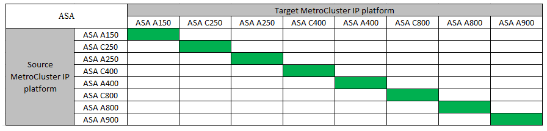

= Seleccione un método de actualización del sistema
:allow-uri-read: 
:icons: font
:imagesdir: ../media/

[role="lead"]
El procedimiento de actualización del sistema que utilice dependerá del modelo de la plataforma y el tipo de configuración de MetroCluster. Los procedimientos de actualización se aplican a las controladoras y las bandejas de almacenamiento. En los procedimientos de actualización, se añaden nuevas controladoras y bandejas a la configuración de la MetroCluster y se crea un segundo grupo de recuperación ante desastres. A continuación, los datos se migran sin interrupciones a los nuevos nodos. A continuación, se retiran las controladoras originales.

== Compatible con combinaciones de actualización tecnológica de MetroCluster IP

* Debe completar el procedimiento de actualización tecnológica antes de añadir una nueva carga.
* Todos los nodos de la configuración de MetroCluster deben ejecutar la misma versión de ONTAP. Por ejemplo, si tiene una configuración de ocho nodos, los ocho nodos deben ejecutar la misma versión de ONTAP. Consulte link:https://hwu.netapp.com["Hardware Universe"^]la para obtener la versión mínima compatible de ONTAP para su combinación.
* No exceda los límites de objeto de la "parte inferior" de las plataformas en la combinación. Aplique el límite inferior de objetos de las dos plataformas.
* Si los límites de la plataforma de destino son inferiores a los límites de MetroCluster, debe volver a configurar el MetroCluster para que sea igual o inferior a los límites de la plataforma de destino antes de agregar los nuevos nodos.
* Consulte la link:https://hwu.netapp.com["Hardware Universe"^] para límites de plataforma.

=== Combinaciones de actualizaciones tecnológicas AFF y FAS MetroCluster IP admitidas

La siguiente tabla muestra las combinaciones de plataformas admitidas para actualizar un sistema AFF o FAS en una configuración de IP de MetroCluster. Las tablas se dividen en dos grupos:

* *El Grupo 1* muestra combinaciones para los sistemas AFF A150, AFF A20, FAS2750, FAS8300, FAS500f, AFF C250, AFF A250, FAS50, AFF C30, AFF A30, FAS8200, AFF A300, AFF A400, AFF A220, AFF C400, AFF A320 y FAS8700.
* *El Grupo 2* muestra combinaciones para los sistemas AFF C60, AFF A50, FAS70, FAS9000, AFF A700, AFF A70, AFF C800, AFF A800, FAS9500, AFF A900, AFF C80, FAS90, AFF A90 y AFF A1K.

Las siguientes notas se aplican a ambos grupos:

* Nota 1: Esta combinación requiere ONTAP 9.13.1 o posterior.

[role="tabbed-block"]
====
.Grupo de combinaciones AFF y FAS 1
--
Revise las combinaciones de actualización del sistema para sistemas AFF A150, AFF A20, FAS2750, FAS8300, FAS500f, AFF C250, AFF A250, FAS50, AFF C30, AFF A30, FAS8200, AFF A300, AFF A400, AFF A220, AFF C400, AFF A320 y FAS8700.

image:../media/tech-refresh-ip-group-1.png[""]

--
.Grupo de combinaciones AFF y FAS 2
--
Revise las combinaciones de actualización del sistema de los sistemas AFF C60, AFF A50, FAS70, FAS9000, AFF A700, AFF A70, AFF C800, AFF A800, FAS9500, AFF A900, AFF C80, FAS90, AFF A90 y AFF A1K.

image:../media/tech-refresh-ip-group-2.png[""]

--
====

=== Combinaciones de actualizaciones tecnológicas IP de ASA MetroCluster admitidas

En la siguiente tabla se muestran las combinaciones de plataformas admitidas para actualizar un sistema ASA en una configuración IP de MetroCluster:

== Compatible con combinaciones de actualización tecnológica de FC de MetroCluster

* Debe completar el procedimiento de actualización tecnológica antes de añadir una nueva carga.
* Todos los nodos de la configuración de MetroCluster deben ejecutar la misma versión de ONTAP. Por ejemplo, si tiene una configuración de ocho nodos, los ocho nodos deben ejecutar la misma versión de ONTAP. Consulte link:https://hwu.netapp.com["Hardware Universe"^]la para obtener la versión mínima compatible de ONTAP para su combinación.
* No exceda los límites de objeto de la "parte inferior" de las plataformas en la combinación. Aplique el límite inferior de objetos de las dos plataformas.
* Si los límites de la plataforma de destino son inferiores a los límites de MetroCluster, debe volver a configurar el MetroCluster para que sea igual o inferior a los límites de la plataforma de destino antes de agregar los nuevos nodos.
* Consulte la link:https://hwu.netapp.com["Hardware Universe"^] para límites de plataforma.

=== Combinaciones de actualizaciones técnicas FC de AFF y FAS MetroCluster admitidas

En la siguiente tabla se muestran las combinaciones de plataformas admitidas para actualizar un sistema AFF o FAS en una configuración de MetroCluster FC:

image::../media/metrocluster_fc_tech_refresh.png[actualización tecnológica de MetroCluster fc]

=== Combinaciones de actualizaciones tecnológicas FC de ASA MetroCluster admitidas

En la siguiente tabla se muestran las combinaciones de plataformas admitidas para actualizar un sistema ASA en una configuración de MetroCluster FC:

[cols="3*"]
|===
| Plataforma FC de MetroCluster de origen | Plataforma FC MetroCluster de destino | Compatible? 

.2+| ASA A400 | ASA A400 | Sí 

| ASA A900 | No 

.2+| ASA A900 | ASA A400 | No 

| ASA A900 | Sí 
|===

== Seleccione un procedimiento de refrescamiento

Seleccione el procedimiento de actualización para la configuración en la siguiente tabla:

[cols="2,1,1,2"]
|===
| Método de actualización | Tipo de configuración | Versión de ONTAP | Procedimiento 

 a| 
* Método: Expanda la configuración de MetroCluster y quite los nodos antiguos

 a| 
FC de cuatro nodos
 a| 
9.6 y posterior
 a| 
link:task_refresh_4n_mcc_fc.html["Enlace al procedimiento"]

 a| 
* Método: Expanda la configuración de MetroCluster y quite los nodos antiguos

 a| 
IP de cuatro nodos
 a| 
9.8 y posterior
 a| 
link:task_refresh_4n_mcc_ip.html["Enlace al procedimiento"]

|===