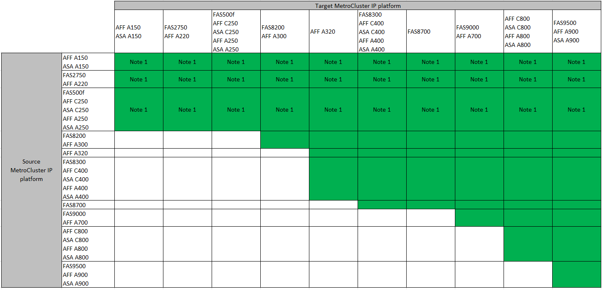

= Seleccione un método de actualización del sistema
:allow-uri-read: 
:icons: font
:imagesdir: ../media/

[role="lead"]
El procedimiento de actualización del sistema que utilice dependerá del modelo de la plataforma y el tipo de configuración de MetroCluster. Los procedimientos de actualización se aplican a las controladoras y las bandejas de almacenamiento. En los procedimientos de actualización, se añaden nuevas controladoras y bandejas a la configuración de la MetroCluster y se crea un segundo grupo de recuperación ante desastres. A continuación, los datos se migran sin interrupciones a los nuevos nodos. A continuación, se retiran las controladoras originales.

=== Compatible con combinaciones de actualización tecnológica de FC de MetroCluster

image::../media/metrocluster_fc_tech_refresh_914.png[actualización tecnológica de MetroCluster fc 914]

* Debe completar el procedimiento de actualización tecnológica antes de añadir una nueva carga.
* Todos los nodos de la configuración de MetroCluster deben ejecutar la misma versión de ONTAP. Por ejemplo, si tiene una configuración de ocho nodos, los ocho nodos deben ejecutar la misma versión de ONTAP.
* No exceda los límites de objeto de la "parte inferior" de las plataformas en la combinación. Aplique el límite inferior de objetos de las dos plataformas.
* Si los límites de la plataforma de destino son inferiores a los límites de MetroCluster, debe volver a configurar el MetroCluster para que sea igual o inferior a los límites de la plataforma de destino antes de agregar los nuevos nodos.
* Consulte la link:https://hwu.netapp.com["Hardware Universe"^] para límites de plataforma.

=== Compatible con combinaciones de actualización tecnológica de MetroCluster IP

*Nota 1:* Esta combinación requiere ONTAP 9.13.1 o posterior.

* Debe completar el procedimiento de actualización tecnológica antes de añadir una nueva carga.
* Todos los nodos de la configuración de MetroCluster deben ejecutar la misma versión de ONTAP. Por ejemplo, si tiene una configuración de ocho nodos, los ocho nodos deben ejecutar la misma versión de ONTAP.
* No exceda los límites de objeto de la "parte inferior" de las plataformas en la combinación. Aplique el límite inferior de objetos de las dos plataformas.
* Si los límites de la plataforma de destino son inferiores a los límites de MetroCluster, debe volver a configurar el MetroCluster para que sea igual o inferior a los límites de la plataforma de destino antes de agregar los nuevos nodos.
* Consulte la link:https://hwu.netapp.com["Hardware Universe"^] para límites de plataforma.

[cols="2,1,1,2"]
|===
| Método de actualización | Tipo de configuración | Versión de ONTAP | Procedimiento 

 a| 
* Método: Expanda la configuración de MetroCluster y quite los nodos antiguos

 a| 
FC de cuatro nodos
 a| 
9.6 y posterior
 a| 
link:task_refresh_4n_mcc_fc.html["Enlace al procedimiento"]

 a| 
* Método: Expanda la configuración de MetroCluster y quite los nodos antiguos

 a| 
IP de cuatro nodos
 a| 
9.8 y posterior
 a| 
link:task_refresh_4n_mcc_ip.html["Enlace al procedimiento"]

|===