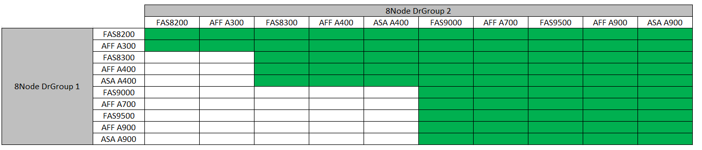

= Expandir una configuración FC MetroCluster de cuatro nodos a una configuración de ocho nodos
:allow-uri-read: 
:icons: font
:imagesdir: ../media/

[role="lead"]
Para ampliar una configuración FC MetroCluster de cuatro nodos a una configuración FC MetroCluster de ocho nodos, se deben añadir dos controladoras a cada clúster para formar un segundo par de alta disponibilidad en cada sitio MetroCluster y, a continuación, ejecutar la operación de configuración de FC MetroCluster.

.Acerca de esta tarea
* Los nodos deben ejecutar ONTAP 9 en una configuración de FC de MetroCluster.
+
Este procedimiento no es compatible con versiones anteriores de ONTAP ni con configuraciones IP de MetroCluster.

* La configuración de FC de MetroCluster existente debe ser correcta.
* El equipo que va a agregar debe estar soportado y cumplir todos los requisitos descritos en link:../install-fc/index.html["Instalación y configuración de MetroCluster estructural"]
* Para acomodar las nuevas controladoras y los nuevos puentes, debe haber disponibles puertos de switch FC.
* Necesita la contraseña de administrador y el acceso a un servidor FTP o SCP.
* Este procedimiento sólo se aplica a las configuraciones de MetroCluster FC.
* Este procedimiento no genera interrupciones y tarda aproximadamente un día en completarse (excepto en el rack y la pila) cuando los discos se ponen a cero.

Antes de realizar este procedimiento, la configuración de FC de MetroCluster consta de cuatro nodos, con un par de alta disponibilidad en cada sitio:

image::../media/mcc_dr_groups_4_node.gif[mcc grupos dr de 4 nodos]

Una vez finalizado este procedimiento, la configuración de MetroCluster FC está compuesta por dos pares de alta disponibilidad en cada sitio:

image::../media/mcc_dr_groups_8_node.gif[mcc grupos dr de 8 nodos]

Ambos sitios deben ser ampliados igualmente. Una configuración FC de MetroCluster no puede consistir en un número desigual de nodos.

== Combinaciones de plataformas compatibles al agregar un segundo grupo de DR

En la siguiente tabla se muestran las combinaciones de plataformas admitidas para las configuraciones de FC MetroCluster de ocho nodos.

[IMPORTANT]
====
* Todos los nodos de la configuración de MetroCluster deben ejecutar la misma versión de ONTAP. Por ejemplo, si tiene una configuración de ocho nodos, los ocho nodos deben ejecutar la misma versión de ONTAP.
* Las combinaciones de esta tabla sólo se aplican a configuraciones normales o permanentes de ocho nodos.
* Las combinaciones de plataformas en esta tabla *NO* se aplican si está utilizando los procedimientos de transición o actualización.
* Todos los nodos de un grupo de recuperación ante desastres deben tener el mismo tipo y configuración.

====

