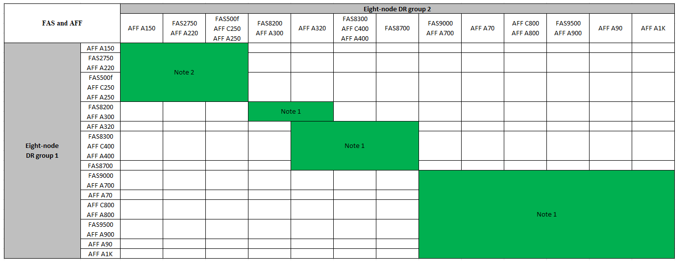

= Expanda una configuración IP de MetroCluster
:allow-uri-read: 
:icons: font
:imagesdir: ../media/

[role="lead"]
Según la versión de ONTAP, puede ampliar la configuración de IP de MetroCluster añadiendo cuatro nodos nuevos como nuevo grupo de recuperación ante desastres.

A partir de ONTAP 9.13.1, es posible expandir temporalmente una configuración de MetroCluster de ocho nodos para actualizar las controladoras y el almacenamiento. Consulte link:task_refresh_4n_mcc_ip.html["Actualizar una configuración IP de MetroCluster de cuatro u ocho nodos (ONTAP 9,8 y versiones posteriores)"] si quiere más información.

A partir de ONTAP 9.9.1, se pueden añadir cuatro nodos nuevos a la configuración IP de MetroCluster como un segundo grupo de recuperación ante desastres. Con esto se crea una configuración MetroCluster de ocho nodos.

.Antes de empezar
* Los nodos antiguos y nuevos deben ejecutar la misma versión de ONTAP.
* Este procedimiento describe los pasos necesarios para agregar un grupo de recuperación ante desastres de cuatro nodos a una configuración de IP de MetroCluster existente. Si va a actualizar una configuración de ocho nodos, debe repetir el procedimiento completo para cada grupo de DR, agregando de uno en uno.
* Confirmar que los modelos de plataforma nuevos y antiguos son compatibles con la combinación de plataformas.
+
https://hwu.netapp.com["Hardware Universe de NetApp"^]

* Compruebe que los modelos de plataforma antiguo y nuevo son compatibles con los conmutadores IP.
+
https://hwu.netapp.com["Hardware Universe de NetApp"^]

* Si lo es link:task_refresh_4n_mcc_ip.html["Actualizar una configuración IP de MetroCluster de cuatro u ocho nodos"], los nuevos nodos deben disponer de espacio suficiente para acomodar los datos de los nodos antiguos, junto con los discos adecuados para los agregados raíz y los discos de reserva.
* Compruebe que tiene un dominio de retransmisión predeterminado creado en los nodos antiguos.
+
Cuando se añaden nodos nuevos a un clúster existente sin un dominio de retransmisión predeterminado, las LIF de gestión de nodos se crean para los nodos nuevos mediante identificadores únicos universales (UUID) en lugar de los nombres esperados. Para obtener más información, vea el artículo de la base de conocimientos https://kb.netapp.com/onprem/ontap/os/Node_management_LIFs_on_newly-added_nodes_generated_with_UUID_names["LIF de gestión de nodos en los nodos recién añadidos generados con nombres UUID"^].

== Ejemplo de nomenclatura de este procedimiento

Este procedimiento usa nombres de ejemplo de todos los para identificar los grupos de recuperación ante desastres, los nodos y los switches implicados.

|===

| Grupos de recuperación ante desastres | Cluster_A en el sitio_A | Cluster_B en el sitio_B 

 a| 
dr_group_1-old
 a| 
* Node_a_1-old
* Node_A_2-old

 a| 
* Node_B_1-old
* Node_B_2-old

 a| 
dr_group_2-new
 a| 
* Node_a_3-New
* Node_a_4-New

 a| 
* Node_B_3-New
* Node_B_4-New

|===

== Combinaciones de plataformas compatibles al agregar un segundo grupo de DR

En las siguientes tablas se muestran las combinaciones de plataformas admitidas para las configuraciones IP de MetroCluster de ocho nodos.

[IMPORTANT]
====
* Todos los nodos de la configuración de MetroCluster deben ejecutar la misma versión de ONTAP. Por ejemplo, si tiene una configuración de ocho nodos, los ocho nodos deben ejecutar la misma versión de ONTAP.
* Las combinaciones de esta tabla sólo se aplican a configuraciones de nodos 8 normales o permanentes.
* Las combinaciones de plataformas mostradas en esta tabla *NO* se aplican si está utilizando los procedimientos de transición o actualización.
* Todos los nodos de un grupo de recuperación ante desastres deben tener el mismo tipo y configuración.

====
.Combinaciones de ampliación AFF y FAS MetroCluster IP compatibles
En la siguiente tabla se muestran las combinaciones de plataformas admitidas para ampliar un sistema AFF o FAS en una configuración IP de MetroCluster:

* *Nota 1*: Se requiere ONTAP 9.9.1 o posterior (o la versión mínima de ONTAP admitida en la plataforma) para estas combinaciones.
* *Nota 2*: Se requiere ONTAP 9.13.1 o posterior (o la versión mínima de ONTAP admitida en la plataforma) para estas combinaciones.

.Combinaciones de ampliación IP de ASA MetroCluster compatibles
La siguiente tabla muestra las combinaciones de plataformas admitidas para expandir un sistema ASA en una configuración IP de MetroCluster:

image::../media/8node_comb_ip_asa.png[Combinaciones de plataforma para configuraciones de 8 nodos]

== Envío de un mensaje de AutoSupport personalizado antes del mantenimiento

Antes de realizar el mantenimiento, debe emitir un mensaje de AutoSupport para notificar al soporte técnico de NetApp que se está realizando el mantenimiento. Al informar al soporte técnico de que el mantenimiento está en marcha, se evita que abran un caso basándose en que se ha producido una interrupción.

.Acerca de esta tarea
Esta tarea debe realizarse en cada sitio MetroCluster.

.Pasos
. Para evitar la generación automática de casos de soporte, envíe un mensaje de AutoSupport para indicar que la actualización está en curso.
+
.. Emita el siguiente comando:
+
`system node autosupport invoke -node * -type all -message "MAINT=10h Upgrading <old-model> to <new-model>`

+
En este ejemplo se especifica una ventana de mantenimiento de 10 horas. Es posible que desee permitir tiempo adicional, dependiendo de su plan.

+
Si el mantenimiento se completa antes de que haya transcurrido el tiempo, puede invocar un mensaje de AutoSupport que indique el final del período de mantenimiento:

+
`system node autosupport invoke -node * -type all -message MAINT=end`

.. Repita el comando en el clúster de partners.

== Consideraciones sobre las VLAN al añadir un nuevo grupo de DR

* Se aplican las siguientes consideraciones de VLAN al ampliar una configuración de IP de MetroCluster:
+
Algunas plataformas utilizan una VLAN para la interfaz de IP de MetroCluster. De manera predeterminada, cada uno de los dos puertos utiliza una VLAN diferente: 10 y 20.

+
Si es compatible, también puede especificar una VLAN diferente (no predeterminada) superior a 100 (entre 101 y 4095) con el `-vlan-id` parámetro del `metrocluster configuration-settings interface create` comando.

+
Las siguientes plataformas *no* soportan el `-vlan-id` parámetro:

+
** FAS8200 y AFF A300
** AFF A320
** FAS9000 y AFF A700
** AFF C800, ASA C800, AFF A800 y ASA A800
+
Todas las demás plataformas admiten `-vlan-id` el parámetro.

+
Las asignaciones de VLAN predeterminadas y válidas dependen de si la plataforma admite el `-vlan-id` parámetro:

+
[role="tabbed-block"]
====
.Plataformas compatibles con <code>-vlan-id</code>
--
VLAN predeterminada:

*** Cuando no se especifica el `-vlan-id` parámetro, las interfaces se crean con VLAN 10 para los puertos “A” y VLAN 20 para los puertos “B”.
*** La VLAN especificada debe coincidir con la VLAN seleccionada en el RCF.

Rangos de VLAN válidos:

*** VLAN predeterminada 10 y 20
*** VLAN 101 y superior (entre 101 y 4095)

--
.Plataformas que no admiten <code>-vlan-id</code>
--
VLAN predeterminada:

*** No aplicable La interfaz no requiere que se especifique una VLAN en la interfaz de MetroCluster. El puerto del switch define la VLAN que se usa.

Rangos de VLAN válidos:

*** Todas las VLAN no se excluyen explícitamente al generar el RCF. La RCF le avisa si la VLAN no es válida.

--
====

* Ambos grupos de DR utilizan las mismas VLAN al ampliar de una configuración MetroCluster de cuatro nodos a otra de ocho nodos.
* Si no se pueden configurar ambos grupos de DR con la misma VLAN, debe actualizar el grupo de DR que no admite `vlan-id` el parámetro para utilizar una VLAN que sea compatible con el otro grupo de DR.
* Dependiendo de la versión de ONTAP, puede cambiar algunas propiedades de la interfaz IP de MetroCluster después de la configuración inicial. Consulte link:../maintain/task-modify-ip-netmask-properties.html["Modificar las propiedades de una interfaz IP de MetroCluster"] para obtener más información sobre qué es compatible.

== Comprobación del estado de la configuración de MetroCluster

Debe comprobar el estado y la conectividad de la configuración de MetroCluster antes de ejecutar la ampliación.

.Pasos
. Compruebe el funcionamiento de la configuración de MetroCluster en ONTAP:
+
.. Compruebe si el sistema es multivía:
+
`node run -node <node-name> sysconfig -a`

.. Compruebe si hay alertas de estado en ambos clústeres:
+
`system health alert show`

.. Confirme la configuración del MetroCluster y que el modo operativo es normal:
+
`metrocluster show`

.. Realizar una comprobación de MetroCluster:
+
`metrocluster check run`

.. Mostrar los resultados de la comprobación de MetroCluster:
+
`metrocluster check show`

.. Ejecute Config Advisor.
+
https://mysupport.netapp.com/site/tools/tool-eula/activeiq-configadvisor["Descargas de NetApp: Config Advisor"]

.. Después de ejecutar Config Advisor, revise el resultado de la herramienta y siga las recomendaciones del resultado para solucionar los problemas detectados.

. Compruebe que el clúster esté en buen estado:
+
`cluster show`

+
[listing]
----
cluster_A::> cluster show
Node           Health  Eligibility
-------------- ------  -----------
node_A_1       true    true
node_A_2       true    true

cluster_A::>
----
. Compruebe que todos los puertos del clúster estén activos:
+
`network port show -ipspace Cluster`

+
[listing]
----
cluster_A::> network port show -ipspace Cluster

Node: node_A_1-old

                                                  Speed(Mbps) Health
Port      IPspace      Broadcast Domain Link MTU  Admin/Oper  Status
--------- ------------ ---------------- ---- ---- ----------- --------
e0a       Cluster      Cluster          up   9000  auto/10000 healthy
e0b       Cluster      Cluster          up   9000  auto/10000 healthy

Node: node_A_2-old

                                                  Speed(Mbps) Health
Port      IPspace      Broadcast Domain Link MTU  Admin/Oper  Status
--------- ------------ ---------------- ---- ---- ----------- --------
e0a       Cluster      Cluster          up   9000  auto/10000 healthy
e0b       Cluster      Cluster          up   9000  auto/10000 healthy

4 entries were displayed.

cluster_A::>
----
. Compruebe que todas las LIF del clúster estén en funcionamiento:
+
`network interface show -vserver Cluster`

+
Cada LIF de clúster debería mostrar el valor true para es Home y tener un administrador de estado/Oper de up/up

+
[listing]
----
cluster_A::> network interface show -vserver cluster

            Logical      Status     Network          Current       Current Is
Vserver     Interface  Admin/Oper Address/Mask       Node          Port    Home
----------- ---------- ---------- ------------------ ------------- ------- -----
Cluster
            node_A_1-old_clus1
                       up/up      169.254.209.69/16  node_A_1   e0a     true
            node_A_1-old_clus2
                       up/up      169.254.49.125/16  node_A_1   e0b     true
            node_A_2-old_clus1
                       up/up      169.254.47.194/16  node_A_2   e0a     true
            node_A_2-old_clus2
                       up/up      169.254.19.183/16  node_A_2   e0b     true

4 entries were displayed.

cluster_A::>
----
. Compruebe que la reversión automática está habilitada en todas las LIF del clúster:
+
`network interface show -vserver Cluster -fields auto-revert`

+
[listing]
----
cluster_A::> network interface show -vserver Cluster -fields auto-revert

          Logical
Vserver   Interface     Auto-revert
--------- ------------- ------------
Cluster
           node_A_1-old_clus1
                        true
           node_A_1-old_clus2
                        true
           node_A_2-old_clus1
                        true
           node_A_2-old_clus2
                        true

    4 entries were displayed.

cluster_A::>
----

== Eliminación de la configuración de las aplicaciones de supervisión

Si la configuración existente se supervisa con el software MetroCluster Tiebreaker, el Mediador de ONTAP u otras aplicaciones de terceros (por ejemplo, ClusterLion) que puedan iniciar una conmutación de sitios, debe eliminar la configuración de MetroCluster del software de supervisión antes de la actualización.

.Pasos
. Elimine la configuración de MetroCluster existente de tiebreaker, Mediator u otro software que pueda iniciar la conmutación.
+
[cols="2*"]
|===

| Si está usando... | Utilice este procedimiento... 

 a| 
Tiebreaker
 a| 
link:../tiebreaker/concept_configuring_the_tiebreaker_software.html#commands-for-modifying-metrocluster-tiebreaker-configurations["Eliminar las configuraciones de MetroCluster"].

 a| 
Mediador
 a| 
Ejecute el siguiente comando desde el símbolo del sistema de ONTAP:

`metrocluster configuration-settings mediator remove`

 a| 
Aplicaciones de terceros
 a| 
Consulte la documentación del producto.

|===
. Elimine la configuración de MetroCluster existente de cualquier aplicación de terceros que pueda iniciar la conmutación.
+
Consulte la documentación de la aplicación.

== Preparación de los nuevos módulos de la controladora

Debe preparar los cuatro nodos MetroCluster nuevos e instalar la versión de ONTAP correcta.

.Acerca de esta tarea
Esta tarea se debe realizar en cada uno de los nuevos nodos:

* Node_a_3-New
* Node_a_4-New
* Node_B_3-New
* Node_B_4-New

En estos pasos, se borra la configuración en los nodos y se borra la región del buzón en las unidades nuevas.

.Pasos
. Monte en rack las nuevas controladoras.
. Conecte los nuevos nodos IP de MetroCluster a los switches IP como se muestra en link:../install-ip/using_rcf_generator.html["Conecte los cables de los conmutadores IP"].
. Configure los nodos IP de MetroCluster mediante los siguientes procedimientos:
+
.. link:../install-ip/task_sw_config_gather_info.html["Recopile la información necesaria"]
.. link:../install-ip/task_sw_config_restore_defaults.html["Restaurar los valores predeterminados del sistema en un módulo de controlador"]
.. link:../install-ip/task_sw_config_verify_haconfig.html["Compruebe el estado de los componentes de ha-config"]
.. link:../install-ip/task_sw_config_assign_pool0.html#manually-assigning-drives-for-pool-0-ontap-9-4-and-later["Asignar unidades manualmente para el pool 0 (ONTAP 9,4 y posteriores)"]

. En el modo de mantenimiento, emita el comando halt para salir del modo de mantenimiento y, a continuación, emita el comando boot_ontap para arrancar el sistema y acceder a la configuración del clúster.
+
No complete el asistente de clúster ni el asistente para nodos en este momento.

== Actualice los archivos RCF

Si va a instalar un nuevo firmware de conmutador, debe instalar el firmware del conmutador antes de actualizar el archivo RCF.

.Acerca de esta tarea
Este procedimiento interrumpe el tráfico del conmutador donde se actualiza el archivo RCF. El tráfico se reanudará una vez que se aplique el nuevo archivo RCF.

.Pasos
. Compruebe el estado de la configuración.
+
.. Compruebe que los componentes de MetroCluster están en buen estado:
+
`metrocluster check run`

+
[listing]
----
cluster_A::*> metrocluster check run

----

+
La operación se ejecuta en segundo plano.

+
.. Después del `metrocluster check run` la operación finaliza, se ejecuta `metrocluster check show` para ver los resultados.
+
Después de unos cinco minutos, se muestran los siguientes resultados:

+
[listing]
----
-----------
::*> metrocluster check show

Component           Result
------------------- ---------
nodes               ok
lifs                ok
config-replication  ok
aggregates          ok
clusters            ok
connections         not-applicable
volumes             ok
7 entries were displayed.
----
.. Comprobar el estado de la operación de comprobación de MetroCluster en ejecución:
+
`metrocluster operation history show -job-id 38`

.. Compruebe que no hay alertas de estado:
+
`system health alert show`

. Prepare los switches IP para la aplicación de los nuevos archivos RCF.
+
Siga los pasos para su proveedor de switches:

+
** link:../install-ip/task_switch_config_broadcom.html["Restablezca el conmutador IP Broadcom a los valores predeterminados de fábrica"]
** link:../install-ip/task_switch_config_cisco.html["Restablezca el conmutador IP de Cisco a los valores predeterminados de fábrica"]
** link:../install-ip/task_switch_config_nvidia.html["Restablece el switch NVIDIA IP SN2100 a los valores predeterminados de fábrica"]

. Descargue e instale el archivo IP RCF, según el proveedor del switch.
+

NOTE: Actualice los interruptores en el siguiente orden: Switch_A_1, Switch_B_1, Switch_A_2, Switch_B_2

+
** link:../install-ip/task_switch_config_broadcom.html["Descargue e instale los archivos Broadcom IP RCF"]
** link:../install-ip/task_switch_config_cisco.html["Descargue e instale los archivos Cisco IP RCF"]
** link:../install-ip/task_switch_config_nvidia.html["Descargue e instale los archivos NVIDIA IP RCF"]
+

NOTE: Si tiene una configuración de red L2 compartida o L3, es posible que deba ajustar los puertos ISL en los switches intermedio/cliente. El modo de puerto de conmutador puede cambiar de modo de acceso a modo de tronco. Sólo continúe con la actualización del segundo par de conmutadores (A_2, B_2) si la conectividad de red entre los conmutadores A_1 y B_1 está totalmente operativa y la red está en buen estado.

== Una los nuevos nodos a los clústeres

Debe añadir los cuatro nodos IP de MetroCluster nuevos a la configuración de MetroCluster existente.

.Acerca de esta tarea
Debe ejecutar esta tarea en ambos clústeres.

.Pasos
. Añada los nodos IP de MetroCluster nuevos a la configuración de MetroCluster existente.
+
.. Una el primer nodo IP de MetroCluster nuevo (node_A_1-new) a la configuración IP de MetroCluster existente.
+
[listing]
----

Welcome to the cluster setup wizard.

You can enter the following commands at any time:
  "help" or "?" - if you want to have a question clarified,
  "back" - if you want to change previously answered questions, and
  "exit" or "quit" - if you want to quit the cluster setup wizard.
     Any changes you made before quitting will be saved.

You can return to cluster setup at any time by typing "cluster setup".
To accept a default or omit a question, do not enter a value.

This system will send event messages and periodic reports to NetApp Technical
Support. To disable this feature, enter
autosupport modify -support disable
within 24 hours.

Enabling AutoSupport can significantly speed problem determination and
resolution, should a problem occur on your system.
For further information on AutoSupport, see:
http://support.netapp.com/autosupport/

Type yes to confirm and continue {yes}: yes

Enter the node management interface port [e0M]: 172.17.8.93

172.17.8.93 is not a valid port.

The physical port that is connected to the node management network. Examples of
node management ports are "e4a" or "e0M".

You can type "back", "exit", or "help" at any question.

Enter the node management interface port [e0M]:
Enter the node management interface IP address: 172.17.8.93
Enter the node management interface netmask: 255.255.254.0
Enter the node management interface default gateway: 172.17.8.1
A node management interface on port e0M with IP address 172.17.8.93 has been created.

Use your web browser to complete cluster setup by accessing https://172.17.8.93

Otherwise, press Enter to complete cluster setup using the command line
interface:

Do you want to create a new cluster or join an existing cluster? {create, join}:
join

Existing cluster interface configuration found:

Port    MTU     IP              Netmask
e0c     9000    169.254.148.217 255.255.0.0
e0d     9000    169.254.144.238 255.255.0.0

Do you want to use this configuration? {yes, no} [yes]: yes
.
.
.
----
.. Una el segundo nodo IP de MetroCluster nuevo (node_A_2-new) a la configuración IP de MetroCluster existente.

. Repita estos pasos para unir node_B_1-new y node_B_2-new a cluster_B.

== Configurar las LIF de interconexión de clústeres, crear las interfaces MetroCluster y hacer mirroring de los agregados raíz

Debe crear LIF de paridad entre clústeres, crear las interfaces MetroCluster en los nuevos nodos IP de MetroCluster.

.Acerca de esta tarea
* El puerto de inicio utilizado en los ejemplos es específico de la plataforma. Debe utilizar el puerto de inicio específico de la plataforma de nodo IP de MetroCluster.
* Revise la información de <<Consideraciones sobre las VLAN al añadir un nuevo grupo de DR>> antes de realizar esta tarea.

.Pasos
. En los nuevos nodos IP de MetroCluster, configure las LIF entre clústeres mediante los siguientes procedimientos:
+
link:../install-ip/task_sw_config_configure_clusters.html#peering-the-clusters["Configurar las LIF de interconexión de clústeres en puertos dedicados"]

+
link:../install-ip/task_sw_config_configure_clusters.html#peering-the-clusters["Configurar las LIF de interconexión de clústeres en puertos de datos compartidos"]

. En cada sitio, compruebe que cluster peering está configurado:
+
`cluster peer show`

+
En el ejemplo siguiente se muestra la configuración de paridad de clústeres en cluster_A:

+
[listing]
----
cluster_A:> cluster peer show
Peer Cluster Name         Cluster Serial Number Availability   Authentication
------------------------- --------------------- -------------- --------------
cluster_B                 1-80-000011           Available      ok
----
+
En el ejemplo siguiente se muestra la configuración de paridad de clústeres en cluster_B:

+
[listing]
----
cluster_B:> cluster peer show
Peer Cluster Name         Cluster Serial Number Availability   Authentication
------------------------- --------------------- -------------- --------------
cluster_A                 1-80-000011           Available      ok
cluster_B::>
----
. Cree el grupo DR para los nodos IP de MetroCluster:
+
`metrocluster configuration-settings dr-group create -partner-cluster`

+
Para obtener más información acerca de las opciones de configuración y conexiones de MetroCluster, consulte lo siguiente:

+
link:../install-ip/concept_considerations_mcip.html["Consideraciones sobre la configuración de IP de MetroCluster"]

+
link:../install-ip/task_sw_config_configure_clusters.html#creating-the-dr-group["Creando el grupo DR"]

+
[listing]
----
cluster_A::> metrocluster configuration-settings dr-group create -partner-cluster
cluster_B -local-node node_A_1-new -remote-node node_B_1-new
[Job 259] Job succeeded: DR Group Create is successful.
cluster_A::>
----
. Comprobar que el grupo de recuperación ante desastres se ha creado.
+
`metrocluster configuration-settings dr-group show`

+
[listing]
----
cluster_A::> metrocluster configuration-settings dr-group show

DR Group ID Cluster                    Node               DR Partner Node
----------- -------------------------- ------------------ ------------------
1           cluster_A
                                       node_A_1-old        node_B_1-old
                                       node_A_2-old        node_B_2-old
            cluster_B
                                       node_B_1-old        node_A_1-old
                                       node_B_2-old        node_A_2-old
2           cluster_A
                                       node_A_1-new        node_B_1-new
                                       node_A_2-new        node_B_2-new
            cluster_B
                                       node_B_1-new        node_A_1-new
                                       node_B_2-new        node_A_2-new
8 entries were displayed.

cluster_A::>
----
. Configure las interfaces IP de MetroCluster para los nodos IP de MetroCluster recién Unidos:
+
[NOTE]
====
** Si es compatible, puede especificar una VLAN diferente (no predeterminada) superior a 100 (entre 101 y 4095) con el `-vlan-id` parámetro del `metrocluster configuration-settings interface create` comando. Consulte <<Consideraciones sobre las VLAN al añadir un nuevo grupo de DR>> para obtener información sobre la plataforma compatible.
** Puede configurar las interfaces IP de MetroCluster desde cualquier clúster.

====
+
`metrocluster configuration-settings interface create -cluster-name`

+
[listing]
----
cluster_A::> metrocluster configuration-settings interface create -cluster-name cluster_A -home-node node_A_1-new -home-port e1a -address 172.17.26.10 -netmask 255.255.255.0
[Job 260] Job succeeded: Interface Create is successful.

cluster_A::> metrocluster configuration-settings interface create -cluster-name cluster_A -home-node node_A_1-new -home-port e1b -address 172.17.27.10 -netmask 255.255.255.0
[Job 261] Job succeeded: Interface Create is successful.

cluster_A::> metrocluster configuration-settings interface create -cluster-name cluster_A -home-node node_A_2-new -home-port e1a -address 172.17.26.11 -netmask 255.255.255.0
[Job 262] Job succeeded: Interface Create is successful.

cluster_A::> :metrocluster configuration-settings interface create -cluster-name cluster_A -home-node node_A_2-new -home-port e1b -address 172.17.27.11 -netmask 255.255.255.0
[Job 263] Job succeeded: Interface Create is successful.

cluster_A::> metrocluster configuration-settings interface create -cluster-name cluster_B -home-node node_B_1-new -home-port e1a -address 172.17.26.12 -netmask 255.255.255.0
[Job 264] Job succeeded: Interface Create is successful.

cluster_A::> metrocluster configuration-settings interface create -cluster-name cluster_B -home-node node_B_1-new -home-port e1b -address 172.17.27.12 -netmask 255.255.255.0
[Job 265] Job succeeded: Interface Create is successful.

cluster_A::> metrocluster configuration-settings interface create -cluster-name cluster_B -home-node node_B_2-new -home-port e1a -address 172.17.26.13 -netmask 255.255.255.0
[Job 266] Job succeeded: Interface Create is successful.

cluster_A::> metrocluster configuration-settings interface create -cluster-name cluster_B -home-node node_B_2-new -home-port e1b -address 172.17.27.13 -netmask 255.255.255.0
[Job 267] Job succeeded: Interface Create is successful.
----

. Compruebe que se han creado las interfaces IP de MetroCluster:
+
`metrocluster configuration-settings interface show`

+
[listing]
----
cluster_A::>metrocluster configuration-settings interface show

DR                                                                    Config
Group Cluster Node    Network Address Netmask         Gateway         State
----- ------- ------- --------------- --------------- --------------- ---------
1     cluster_A
             node_A_1-old
                 Home Port: e1a
                      172.17.26.10    255.255.255.0   -               completed
                 Home Port: e1b
                      172.17.27.10    255.255.255.0   -               completed
              node_A_2-old
                 Home Port: e1a
                      172.17.26.11    255.255.255.0   -               completed
                 Home Port: e1b
                      172.17.27.11    255.255.255.0   -               completed
      cluster_B
             node_B_1-old
                 Home Port: e1a
                      172.17.26.13    255.255.255.0   -               completed
                 Home Port: e1b
                      172.17.27.13    255.255.255.0   -               completed
              node_B_1-old
                 Home Port: e1a
                      172.17.26.12    255.255.255.0   -               completed
                 Home Port: e1b
                      172.17.27.12    255.255.255.0   -               completed
2     cluster_A
             node_A_3-new
                 Home Port: e1a
                      172.17.28.10    255.255.255.0   -               completed
                 Home Port: e1b
                      172.17.29.10    255.255.255.0   -               completed
              node_A_3-new
                 Home Port: e1a
                      172.17.28.11    255.255.255.0   -               completed
                 Home Port: e1b
                      172.17.29.11    255.255.255.0   -               completed
      cluster_B
             node_B_3-new
                 Home Port: e1a
                      172.17.28.13    255.255.255.0   -               completed
                 Home Port: e1b
                      172.17.29.13    255.255.255.0   -               completed
              node_B_3-new
                 Home Port: e1a
                      172.17.28.12    255.255.255.0   -               completed
                 Home Port: e1b
                      172.17.29.12    255.255.255.0   -               completed
8 entries were displayed.

cluster_A>
----
. Conecte las interfaces IP de MetroCluster:
+
`metrocluster configuration-settings connection connect`

+

NOTE: Este comando puede tardar varios minutos en completarse.

+
[listing]
----
cluster_A::> metrocluster configuration-settings connection connect

cluster_A::>
----
. Compruebe que las conexiones están correctamente establecidas: `metrocluster configuration-settings connection show`
+
[listing]
----
cluster_A::> metrocluster configuration-settings connection show

DR                    Source          Destination
Group Cluster Node    Network Address Network Address Partner Type Config State
----- ------- ------- --------------- --------------- ------------ ------------
1     cluster_A
              node_A_1-old
                 Home Port: e1a
                      172.17.28.10    172.17.28.11    HA Partner   completed
                 Home Port: e1a
                      172.17.28.10    172.17.28.12    DR Partner   completed
                 Home Port: e1a
                      172.17.28.10    172.17.28.13    DR Auxiliary completed
                 Home Port: e1b
                      172.17.29.10    172.17.29.11    HA Partner   completed
                 Home Port: e1b
                      172.17.29.10    172.17.29.12    DR Partner   completed
                 Home Port: e1b
                      172.17.29.10    172.17.29.13    DR Auxiliary completed
              node_A_2-old
                 Home Port: e1a
                      172.17.28.11    172.17.28.10    HA Partner   completed
                 Home Port: e1a
                      172.17.28.11    172.17.28.13    DR Partner   completed
                 Home Port: e1a
                      172.17.28.11    172.17.28.12    DR Auxiliary completed
                 Home Port: e1b
                      172.17.29.11    172.17.29.10    HA Partner   completed
                 Home Port: e1b
                      172.17.29.11    172.17.29.13    DR Partner   completed
                 Home Port: e1b
                      172.17.29.11    172.17.29.12    DR Auxiliary completed

DR                    Source          Destination
Group Cluster Node    Network Address Network Address Partner Type Config State
----- ------- ------- --------------- --------------- ------------ ------------
1     cluster_B
              node_B_2-old
                 Home Port: e1a
                      172.17.28.13    172.17.28.12    HA Partner   completed
                 Home Port: e1a
                      172.17.28.13    172.17.28.11    DR Partner   completed
                 Home Port: e1a
                      172.17.28.13    172.17.28.10    DR Auxiliary completed
                 Home Port: e1b
                      172.17.29.13    172.17.29.12    HA Partner   completed
                 Home Port: e1b
                      172.17.29.13    172.17.29.11    DR Partner   completed
                 Home Port: e1b
                      172.17.29.13    172.17.29.10    DR Auxiliary completed
              node_B_1-old
                 Home Port: e1a
                      172.17.28.12    172.17.28.13    HA Partner   completed
                 Home Port: e1a
                      172.17.28.12    172.17.28.10    DR Partner   completed
                 Home Port: e1a
                      172.17.28.12    172.17.28.11    DR Auxiliary completed
                 Home Port: e1b
                      172.17.29.12    172.17.29.13    HA Partner   completed
                 Home Port: e1b
                      172.17.29.12    172.17.29.10    DR Partner   completed
                 Home Port: e1b
                      172.17.29.12    172.17.29.11    DR Auxiliary completed

DR                    Source          Destination
Group Cluster Node    Network Address Network Address Partner Type Config State
----- ------- ------- --------------- --------------- ------------ ------------
2     cluster_A
              node_A_1-new**
                 Home Port: e1a
                      172.17.26.10    172.17.26.11    HA Partner   completed
                 Home Port: e1a
                      172.17.26.10    172.17.26.12    DR Partner   completed
                 Home Port: e1a
                      172.17.26.10    172.17.26.13    DR Auxiliary completed
                 Home Port: e1b
                      172.17.27.10    172.17.27.11    HA Partner   completed
                 Home Port: e1b
                      172.17.27.10    172.17.27.12    DR Partner   completed
                 Home Port: e1b
                      172.17.27.10    172.17.27.13    DR Auxiliary completed
              node_A_2-new
                 Home Port: e1a
                      172.17.26.11    172.17.26.10    HA Partner   completed
                 Home Port: e1a
                      172.17.26.11    172.17.26.13    DR Partner   completed
                 Home Port: e1a
                      172.17.26.11    172.17.26.12    DR Auxiliary completed
                 Home Port: e1b
                      172.17.27.11    172.17.27.10    HA Partner   completed
                 Home Port: e1b
                      172.17.27.11    172.17.27.13    DR Partner   completed
                 Home Port: e1b
                      172.17.27.11    172.17.27.12    DR Auxiliary completed

DR                    Source          Destination
Group Cluster Node    Network Address Network Address Partner Type Config State
----- ------- ------- --------------- --------------- ------------ ------------
2     cluster_B
              node_B_2-new
                 Home Port: e1a
                      172.17.26.13    172.17.26.12    HA Partner   completed
                 Home Port: e1a
                      172.17.26.13    172.17.26.11    DR Partner   completed
                 Home Port: e1a
                      172.17.26.13    172.17.26.10    DR Auxiliary completed
                 Home Port: e1b
                      172.17.27.13    172.17.27.12    HA Partner   completed
                 Home Port: e1b
                      172.17.27.13    172.17.27.11    DR Partner   completed
                 Home Port: e1b
                      172.17.27.13    172.17.27.10    DR Auxiliary completed
              node_B_1-new
                 Home Port: e1a
                      172.17.26.12    172.17.26.13    HA Partner   completed
                 Home Port: e1a
                      172.17.26.12    172.17.26.10    DR Partner   completed
                 Home Port: e1a
                      172.17.26.12    172.17.26.11    DR Auxiliary completed
                 Home Port: e1b
                      172.17.27.12    172.17.27.13    HA Partner   completed
                 Home Port: e1b
                      172.17.27.12    172.17.27.10    DR Partner   completed
                 Home Port: e1b
                      172.17.27.12    172.17.27.11    DR Auxiliary completed
48 entries were displayed.

cluster_A::>
----
. Verifique la asignación automática de discos y la partición:
+
`disk show -pool Pool1`

+
[listing]
----
cluster_A::> disk show -pool Pool1
                     Usable           Disk    Container   Container
Disk                   Size Shelf Bay Type    Type        Name      Owner
---------------- ---------- ----- --- ------- ----------- --------- --------
1.10.4                    -    10   4 SAS     remote      -         node_B_2
1.10.13                   -    10  13 SAS     remote      -         node_B_2
1.10.14                   -    10  14 SAS     remote      -         node_B_1
1.10.15                   -    10  15 SAS     remote      -         node_B_1
1.10.16                   -    10  16 SAS     remote      -         node_B_1
1.10.18                   -    10  18 SAS     remote      -         node_B_2
...
2.20.0              546.9GB    20   0 SAS     aggregate   aggr0_rha1_a1 node_a_1
2.20.3              546.9GB    20   3 SAS     aggregate   aggr0_rha1_a2 node_a_2
2.20.5              546.9GB    20   5 SAS     aggregate   rha1_a1_aggr1 node_a_1
2.20.6              546.9GB    20   6 SAS     aggregate   rha1_a1_aggr1 node_a_1
2.20.7              546.9GB    20   7 SAS     aggregate   rha1_a2_aggr1 node_a_2
2.20.10             546.9GB    20  10 SAS     aggregate   rha1_a1_aggr1 node_a_1
...
43 entries were displayed.

cluster_A::>
----
. Reflejar los agregados raíz:
+
`storage aggregate mirror -aggregate aggr0_node_A_1-new`

+

NOTE: Debe completar este paso en cada nodo IP de MetroCluster.

+
[listing]
----
cluster_A::> aggr mirror -aggregate aggr0_node_A_1-new

Info: Disks would be added to aggregate "aggr0_node_A_1-new"on node "node_A_1-new"
      in the following manner:

      Second Plex

        RAID Group rg0, 3 disks (block checksum, raid_dp)
                                                            Usable Physical
          Position   Disk                      Type           Size     Size
          ---------- ------------------------- ---------- -------- --------
          dparity    4.20.0                    SAS               -        -
          parity     4.20.3                    SAS               -        -
          data       4.20.1                    SAS         546.9GB  558.9GB

      Aggregate capacity available forvolume use would be 467.6GB.

Do you want to continue? {y|n}: y

cluster_A::>
----
. Compruebe que se han duplicado los agregados raíz:
+
`storage aggregate show`

+
[listing]
----
cluster_A::> aggr show

Aggregate     Size Available Used% State   #Vols  Nodes            RAID Status
--------- -------- --------- ----- ------- ------ ---------------- ------------
aggr0_node_A_1-old
           349.0GB   16.84GB   95% online       1 node_A_1-old      raid_dp,
                                                                   mirrored,
                                                                   normal
aggr0_node_A_2-old
           349.0GB   16.84GB   95% online       1 node_A_2-old      raid_dp,
                                                                   mirrored,
                                                                   normal
aggr0_node_A_1-new
           467.6GB   22.63GB   95% online       1 node_A_1-new      raid_dp,
                                                                   mirrored,
                                                                   normal
aggr0_node_A_2-new
           467.6GB   22.62GB   95% online       1 node_A_2-new      raid_dp,
                                                                   mirrored,
                                                                   normal
aggr_data_a1
            1.02TB    1.01TB    1% online       1 node_A_1-old      raid_dp,
                                                                   mirrored,
                                                                   normal
aggr_data_a2
            1.02TB    1.01TB    1% online       1 node_A_2-old      raid_dp,
                                                                   mirrored,
----

== Finalización de la adición de nuevos nodos

Debe incorporar el nuevo grupo de recuperación ante desastres a la configuración de MetroCluster y crear agregados de datos reflejados en los nuevos nodos.

.Pasos
. Actualice la configuración de MetroCluster:
+
.. Entre en el modo de privilegio avanzado:
+
`set -privilege advanced`

.. Actualice la configuración de MetroCluster en uno de los nodos nuevos:
+
`metrocluster configure`

+
En el ejemplo siguiente se muestra la configuración de MetroCluster actualizada en ambos grupos de recuperación ante desastres:

+
[listing]
----
cluster_A::*> metrocluster configure -refresh true

[Job 726] Job succeeded: Configure is successful.
----
.. Reinicie cada uno de los nodos nuevos:
+
`node reboot -node <node_name> -inhibit-takeover true`

.. Volver al modo de privilegios de administrador:
+
`set -privilege admin`

. Crear agregados de datos reflejados en cada uno de los nuevos nodos de MetroCluster:
+
`storage aggregate create -aggregate <aggregate-name> -node <node-name> -diskcount <no-of-disks> -mirror true`

+

NOTE: Debe crear al menos un agregado de datos reflejados por sitio. Se recomienda tener dos agregados de datos reflejados por sitio en nodos IP de MetroCluster para alojar los volúmenes de MDV, sin embargo se admite un solo agregado por sitio (pero no se recomienda). Es compatible con un único agregado de datos reflejados de un centro de MetroCluster, mientras que el otro sitio tiene más de un agregado de datos con mirroring.

+
En el ejemplo siguiente se muestra la creación de un agregado en node_A_1-new.

+
[listing]
----
cluster_A::> storage aggregate create -aggregate data_a3 -node node_A_1-new -diskcount 10 -mirror t

Info: The layout for aggregate "data_a3" on node "node_A_1-new" would be:

      First Plex

        RAID Group rg0, 5 disks (block checksum, raid_dp)
                                                            Usable Physical
          Position   Disk                      Type           Size     Size
          ---------- ------------------------- ---------- -------- --------
          dparity    5.10.15                   SAS               -        -
          parity     5.10.16                   SAS               -        -
          data       5.10.17                   SAS         546.9GB  547.1GB
          data       5.10.18                   SAS         546.9GB  558.9GB
          data       5.10.19                   SAS         546.9GB  558.9GB

      Second Plex

        RAID Group rg0, 5 disks (block checksum, raid_dp)
                                                            Usable Physical
          Position   Disk                      Type           Size     Size
          ---------- ------------------------- ---------- -------- --------
          dparity    4.20.17                   SAS               -        -
          parity     4.20.14                   SAS               -        -
          data       4.20.18                   SAS         546.9GB  547.1GB
          data       4.20.19                   SAS         546.9GB  547.1GB
          data       4.20.16                   SAS         546.9GB  547.1GB

      Aggregate capacity available for volume use would be 1.37TB.

Do you want to continue? {y|n}: y
[Job 440] Job succeeded: DONE

cluster_A::>
----
. Compruebe que los nodos se han añadido a su grupo de recuperación ante desastres.
+
[listing]
----
cluster_A::*> metrocluster node show

DR                               Configuration  DR
Group Cluster Node               State          Mirroring Mode
----- ------- ------------------ -------------- --------- --------------------
1     cluster_A
              node_A_1-old        configured     enabled   normal
              node_A_2-old        configured     enabled   normal
      cluster_B
              node_B_1-old        configured     enabled   normal
              node_B_2-old        configured     enabled   normal
2     cluster_A
              node_A_3-new        configured     enabled   normal
              node_A_4-new        configured     enabled   normal
      cluster_B
              node_B_3-new        configured     enabled   normal
              node_B_4-new        configured     enabled   normal
8 entries were displayed.

cluster_A::*>
----
. Mueva los volúmenes MDV_CRS de los nodos antiguos a los nuevos con privilegios avanzados.
+
.. Mostrar los volúmenes para identificar los volúmenes de MDV:
+

NOTE: Si tiene un único agregado de datos con mirroring por sitio, mueva ambos volúmenes de MDV a este único agregado. Si tiene dos o más agregados de datos reflejados, mueva cada volumen de MDV a un agregado diferente.

+
En el siguiente ejemplo se muestran los volúmenes MDV en `volume show` salida:

+
[listing]
----
cluster_A::> volume show
Vserver   Volume       Aggregate    State      Type       Size  Available Used%
--------- ------------ ------------ ---------- ---- ---------- ---------- -----
...

cluster_A   MDV_CRS_2c78e009ff5611e9b0f300a0985ef8c4_A
                       aggr_b1      -          RW            -          -     -
cluster_A   MDV_CRS_2c78e009ff5611e9b0f300a0985ef8c4_B
                       aggr_b2      -          RW            -          -     -
cluster_A   MDV_CRS_d6b0b313ff5611e9837100a098544e51_A
                       aggr_a1      online     RW         10GB     9.50GB    0%
cluster_A   MDV_CRS_d6b0b313ff5611e9837100a098544e51_B
                       aggr_a2      online     RW         10GB     9.50GB    0%
...
11 entries were displayed.mple
----
.. Configure el nivel de privilegio avanzado:
+
`set -privilege advanced`

.. Mueva los volúmenes de MDV de uno en uno:
+
`volume move start -volume <mdv-volume> -destination-aggregate <aggr-on-new-node> -vserver <svm-name>`

+
En el siguiente ejemplo se muestra el comando y la salida para mover "MDV_CRS_d6b0b313f5611e9837100a098544e51_A" al agregado "data_a3" en "node_A_3".

+
[listing]
----
cluster_A::*> vol move start -volume MDV_CRS_d6b0b313ff5611e9837100a098544e51_A -destination-aggregate data_a3 -vserver cluster_A

Warning: You are about to modify the system volume
         "MDV_CRS_d6b0b313ff5611e9837100a098544e51_A". This might cause severe
         performance or stability problems. Do not proceed unless directed to
         do so by support. Do you want to proceed? {y|n}: y
[Job 494] Job is queued: Move "MDV_CRS_d6b0b313ff5611e9837100a098544e51_A" in Vserver "cluster_A" to aggregate "data_a3". Use the "volume move show -vserver cluster_A -volume MDV_CRS_d6b0b313ff5611e9837100a098544e51_A" command to view the status of this operation.
----
.. Utilice el comando volume show para comprobar que el volumen de MDV se ha movido correctamente:
+
`volume show <mdv-name>`

+
La siguiente salida muestra que el volumen de MDV se ha movido correctamente.

+
[listing]
----
cluster_A::*> vol show MDV_CRS_d6b0b313ff5611e9837100a098544e51_B
Vserver     Volume       Aggregate    State      Type       Size  Available Used%
---------   ------------ ------------ ---------- ---- ---------- ---------- -----
cluster_A   MDV_CRS_d6b0b313ff5611e9837100a098544e51_B
                       aggr_a2      online     RW         10GB     9.50GB    0%
----

. Mueva épsilon de un nodo antiguo a un nuevo nodo:
+
.. Identifique qué nodo tiene actualmente épsilon:
+
`cluster show -fields epsilon`

+
[listing]
----
cluster_B::*> cluster show -fields epsilon
node             epsilon
---------------- -------
node_A_1-old      true
node_A_2-old      false
node_A_3-new      false
node_A_4-new      false
4 entries were displayed.
----
.. Establezca épsilon en FALSE en el nodo antiguo (node_A_1-old):
+
`cluster modify -node <old-node> -epsilon false*`

.. Establezca épsilon en true en el nuevo nodo (node_A_3-new):
+
`cluster modify -node <new-node> -epsilon true`

.. Compruebe que épsilon se ha movido al nodo correcto:
+
`cluster show -fields epsilon`

+
[listing]
----
cluster_A::*> cluster show -fields epsilon
node             epsilon
---------------- -------
node_A_1-old      false
node_A_2-old      false
node_A_3-new      true
node_A_4-new      false
4 entries were displayed.
----

. Si su sistema admite cifrado de principio a fin, puede hacerlo link:../maintain/task-configure-encryption.html#enable-end-to-end-encryption["Habilite el cifrado integral"] En el nuevo grupo de recuperación ante desastres.

