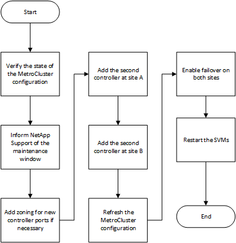

= Expandir una configuración FC MetroCluster de dos nodos a una configuración de cuatro nodos
:allow-uri-read: 
:icons: font
:imagesdir: ../media/

[role="lead"]
Para ampliar una configuración de FC de MetroCluster de dos nodos a una configuración de FC de MetroCluster de cuatro nodos, es necesario añadir una controladora a cada clúster para formar un par de alta disponibilidad en cada sitio de MetroCluster y, a continuación, actualizar la configuración de FC de MetroCluster.

.Antes de empezar
* Los nodos deben ejecutar ONTAP 9 o una versión posterior en una configuración de FC de MetroCluster.
+
Este procedimiento no es compatible con versiones anteriores de ONTAP ni con configuraciones IP de MetroCluster.

* Si las plataformas de su configuración de dos nodos no son compatibles con ONTAP 9.2 y planea actualizar a plataformas compatibles con ONTAP 9.2 _y_ expandir a un clúster de cuatro nodos, debe actualizar las plataformas de la configuración de dos nodos _antes de_ expandir la configuración de MetroCluster FC.
* La configuración de FC de MetroCluster existente debe ser correcta.
* El equipo que va a agregar debe estar soportado y cumplir todos los requisitos descritos en los procedimientos siguientes:
+
link:../install-fc/index.html["Instalación y configuración de MetroCluster estructural"]

+
link:../install-stretch/concept_considerations_differences.html["Instalación y configuración de MetroCluster con ampliación"]

* Para acomodar las nuevas controladoras y los nuevos puentes, debe haber disponibles puertos de switch FC.
* Compruebe que tiene un dominio de retransmisión predeterminado creado en los nodos antiguos.
+
Cuando se añaden nodos nuevos a un clúster existente sin un dominio de retransmisión predeterminado, las LIF de gestión de nodos se crean para los nodos nuevos mediante identificadores únicos universales (UUID) en lugar de los nombres esperados. Para obtener más información, vea el artículo de la base de conocimientos https://kb.netapp.com/onprem/ontap/os/Node_management_LIFs_on_newly-added_nodes_generated_with_UUID_names["LIF de gestión de nodos en los nodos recién añadidos generados con nombres UUID"^].

* Necesita la contraseña de administrador y el acceso a un servidor FTP o SCP.

.Acerca de esta tarea
* Este procedimiento sólo se aplica a las configuraciones de MetroCluster FC.
* Este procedimiento provoca interrupciones y tarda aproximadamente cuatro horas en completarse.
* Antes de realizar este procedimiento, la configuración FC de MetroCluster consta de dos clústeres de un solo nodo:
+
image::../media/mcc_dr_groups_2_node.gif[mcc grupos dr 2 nodos]

+
Una vez completado este procedimiento, la configuración de MetroCluster FC consta de dos pares de alta disponibilidad, uno en cada sitio:

+
image::../media/mcc_dr_groups_4_node.gif[mcc grupos dr de 4 nodos]

* Ambos sitios deben ser ampliados igualmente.
+
Una configuración MetroCluster no puede consistir en un número desigual de nodos.

* Este procedimiento puede tardar más de una hora por sitio, con tiempo adicional para tareas como inicializar los discos y arrancar por red los nuevos nodos.
+
El tiempo para inicializar los discos depende del tamaño de los discos.

* Este procedimiento utiliza el siguiente flujo de trabajo:

== Active el registro de la consola

NetApp recomienda encarecidamente que habilite el inicio de sesión de la consola en los dispositivos que esté utilizando y realice las siguientes acciones al realizar este procedimiento:

* Deje la función AutoSupport habilitada durante el mantenimiento.
* Active un mensaje de AutoSupport de mantenimiento antes y después de las tareas de mantenimiento para deshabilitar la creación de casos durante la actividad de mantenimiento.
+
Consulte el artículo de la base de conocimientos link:https://kb.netapp.com/Support_Bulletins/Customer_Bulletins/SU92["Cómo impedir la creación automática de casos durante las ventanas de mantenimiento programado"^].

* Habilite el registro de sesiones para cualquier sesión de CLI. Para obtener instrucciones sobre cómo activar el registro de sesiones, consulte la sección Salida de sesión de registro en el artículo de la Base de conocimientos link:https://kb.netapp.com/on-prem/ontap/Ontap_OS/OS-KBs/How_to_configure_PuTTY_for_optimal_connectivity_to_ONTAP_systems["Cómo configurar PuTTY para una conectividad óptima con sistemas ONTAP"^].

