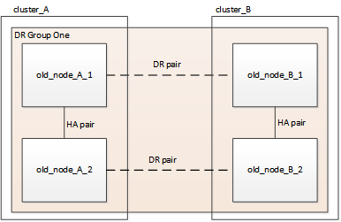

= Actualizar una configuración FC de MetroCluster de cuatro nodos
:allow-uri-read: 
:icons: font
:imagesdir: ../media/

[role="lead"]
Es posible actualizar las controladoras y el almacenamiento en una configuración MetroCluster de cuatro nodos ampliando la configuración para convertirse en una configuración de ocho nodos y eliminar el grupo antiguo de recuperación ante desastres (DR).

.Acerca de esta tarea
Las referencias a "nodos antiguos" significan los nodos que desea reemplazar.

* Solo puede actualizar modelos de plataforma específicos mediante este procedimiento en una configuración MetroCluster FC.
+
** Para obtener información sobre las combinaciones de actualización de la plataforma compatibles, consulte la tabla de actualización de FC de MetroCluster en link:../upgrade/concept_choosing_tech_refresh_mcc.html#supported-metrocluster-fc-tech-refresh-combinations["Seleccione un método de actualización del sistema"].

.Pasos
. Recopile información de los nodos antiguos.
+
En este momento, la configuración de cuatro nodos aparece como se muestra en la siguiente imagen:

+

. Realice todos los pasos del procedimiento de ampliación de cuatro nodos para su tipo MetroCluster.
+
link:task_expand_a_four_node_mcc_fc_configuration_to_an_eight_node_configuration.html["Expandir una configuración FC MetroCluster de cuatro nodos a una configuración de ocho nodos"]

+
Una vez completado el procedimiento de expansión, la configuración aparece como se muestra en la siguiente imagen:

+
image::../media/mcc_dr_group_b.png[mcc dr grupo b]

. Mueva los volúmenes CRS.
+
Siga los pasos de https://docs.netapp.com/ontap-9/topic/com.netapp.doc.hw-metrocluster-service/task_move_a_metadata_volume_in_mcc_configurations.html["Mover un volumen de metadatos en configuraciones de MetroCluster"].

. Mueva los datos de los nodos antiguos a los nuevos nodos con los siguientes procedimientos a. https://docs.netapp.com/platstor/topic/com.netapp.doc.hw-upgrade-controller/home.html["Otros procedimientos de la plataforma: Actualización Express del hardware de la controladora"^].
+
.. Realice todos los pasos de http://docs.netapp.com/platstor/topic/com.netapp.doc.hw-upgrade-controller/GUID-AFE432F6-60AD-4A79-86C0-C7D12957FA63.html["Crear un agregado y mover volúmenes a los nuevos nodos"].
+

NOTE: Puede optar por reflejar el agregado cuando o después de crearlo.

.. Realice todos los pasos de http://docs.netapp.com/platstor/topic/com.netapp.doc.hw-upgrade-controller/GUID-95CA9262-327D-431D-81AA-C73DEFF3DEE2.html["Traslado de LIF de datos no SAN y LIF de administración del clúster a los nuevos nodos"].
.. Realice todos los pasos de http://docs.netapp.com/platstor/topic/com.netapp.doc.hw-upgrade-controller/GUID-91EC7830-0C28-4C78-952F-6F956CC5A62F.html["Eliminación de LIF SAN de los nodos originales"].

. Siga los pasos del procedimiento para quitar el grupo de recuperación ante desastres antiguo.
+
link:concept_removing_a_disaster_recovery_group.html["Eliminación de un grupo de recuperación ante desastres"]

+
Después de eliminar el antiguo grupo de recuperación ante desastres (grupo de recuperación ante desastres uno), la configuración se muestra como se muestra en la siguiente imagen:

+
image::../media/mcc_dr_group_d.png[mcc dr grupo d]

